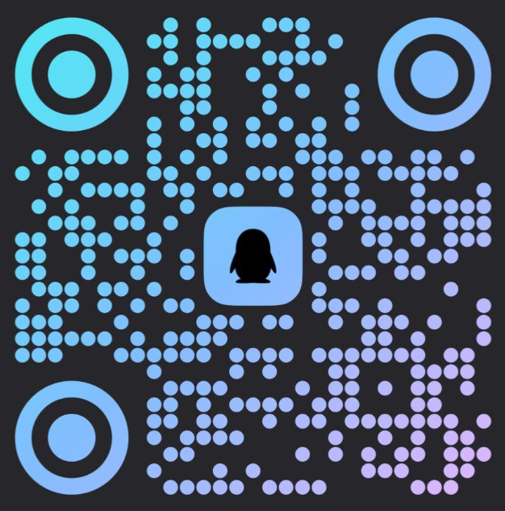

# 📚 AI Paper Notes
<!-- [](https://github.com/zhaoyang97/Paper-Notes/stargazers)
[](https://zhaoyang97.github.io/Paper-Notes/)
[](#-会议覆盖)
[](https://zhaoyang97.github.io/Paper-Notes/)
[](https://github.com/zhaoyang97/Paper-Notes/commits) -->

**5 分钟读懂一篇顶会论文，一个仓库读懂最新 AI 进展。**
- 📖 **15000+** 篇 AI · LLM · NLP · CV 顶会论文解读
- 🏛️ 覆盖 ACL · CVPR · ICLR · AAAI · NeurIPS · ICCV · ICML · ECCV 等会议
- 🔬 横跨 LLM Reasoning · VLM · Agent · RLHF · RAG · AIGC · Robotics · Autonomous Driving 等46个研究方向
- 🔄 持续更新中

## 🌐 在线阅读


**[https://papernotes.org/](https://papernotes.org/)**

备用链接: **[https://zhaoyang97.github.io/Paper-Notes/](https://zhaoyang97.github.io/Paper-Notes/)**

> 💡 **提示**：如果数学公式渲染异常，刷新页面通常可以解决。

> ⚠️ **关于 ACL 2026**：本仓库收录的 ACL 2026 论文均来自 arXiv 上 Comments 标注为 "Accepted to ACL 2026" 的论文，并非官方 AC 结果，仅供参考。官方接收列表待公布 [ACL 2026 Accepted Papers](https://2026.aclweb.org/program/accepted_papers/)。

## 💬 问题反馈

🎉 **GitHub 200 ⭐ 成就达成 — 反馈系统解锁**

Paper Notes 交流群: `1094559400`  


## 🎉 版本发布

- **v1.1.0**（2026-04-25）：新增 ACL 2026 论文解读
- **v1.0.0**（2026-04-18）：首个正式版本，累计 13,000+ 篇论文解读，覆盖 CVPR 2026、ICLR 2026、AAAI 2026、NeurIPS 2025、ICCV 2025、ACL 2025、ICML 2025、CVPR 2025、ECCV 2024共9个会议

## 📊 会议覆盖

| 会议 | 笔记数 |
|------|-------:|
| ACL 2026 | 681 |
| CVPR 2026 | 1,937 |
| ICLR 2026 | 1,583 |
| AAAI 2026 | 1,387 |
| NeurIPS 2025 | 2,572 |
| ICCV 2025 | 1,376 |
| ACL 2025 | 1,906 |
| ICML 2025 | 1,085 |
| CVPR 2025 | 1,846 |
| ECCV 2024 | 973 |

## 🗓️ 更新路线图

| 公布时间 | 会议 |
|----------|--------------|
| 2026-05 | ICML 2026 |
| 2026-07 | ECCV 2026 |
| 2026-09 | NeurIPS 2026 |
| 2026-10 | EMNLP 2026 |
| 2026-12 | AAAI 2027 |
| 2027-01 | ICLR 2027 |
| 2027-02 | CVPR 2027 |

## 🔍 研究领域

| 文件夹 | 领域 | 笔记数 |
|--------|------|-------:|
| `3d_vision/` | 🧊 3D 视觉 | 1,318 |
| `ai_safety/` | 🛡️ AI 安全/隐私 | 278 |
| `aigc_detection/` | 🔎 AIGC 检测 | 47 |
| `audio_speech/` | 🎵 音频/语音 | 249 |
| `autonomous_driving/` | 🚗 自动驾驶 | 496 |
| `causal_inference/` | 🔗 因果推理 | 98 |
| `code_intelligence/` | 💻 代码智能 | 122 |
| `dialogue/` | 🗣️ 对话系统 | 55 |
| `earth_science/` | 🌍 地球科学 | 7 |
| `graph_learning/` | 🕸️ 图学习 | 195 |
| `human_understanding/` | 🧑 人体理解 | 283 |
| `image_generation/` | 🎨 图像生成 | 1,507 |
| `image_restoration/` | 🖼️ 图像恢复 | 222 |
| `information_retrieval/` | 🔍 信息检索/RAG | 265 |
| `interpretability/` | 🔬 可解释性 | 341 |
| `knowledge_editing/` | ✏️ 知识编辑 | 50 |
| `llm_agent/` | 🦾 LLM Agent | 290 |
| `llm_alignment/` | ⚖️ 对齐/RLHF | 263 |
| `llm_efficiency/` | ⚡ LLM 效率 | 132 |
| `llm_evaluation/` | 📊 LLM 评测 | 471 |
| `llm_nlp/` | 💬 LLM/NLP (其他) | 715 |
| `llm_pretraining/` | 📚 预训练 | 203 |
| `llm_reasoning/` | 💡 LLM 推理 | 316 |
| `llm_safety/` | 🔒 LLM 安全 | 281 |
| `medical_imaging/` | 🏥 医学图像 | 763 |
| `model_compression/` | 📦 模型压缩 | 657 |
| `moe/` | 🧠 混合专家 (MoE) | 6 |
| `multi_agent/` | 🤝 多智能体 | 34 |
| `multilingual_mt/` | 🌐 多语言/翻译 | 150 |
| `multimodal_vlm/` | 🧩 多模态 VLM | 1,265 |
| `object_detection/` | 🎯 目标检测 | 204 |
| `optimization/` | 📐 优化/理论 | 275 |
| `physics/` | ⚛️ 物理学 | 34 |
| `recommender/` | 🎁 推荐系统 | 99 |
| `reinforcement_learning/` | 🎮 强化学习 | 552 |
| `remote_sensing/` | 🛰️ 遥感 | 80 |
| `robotics/` | 🤖 具身智能 | 305 |
| `scientific_computing/` | 🧮 科学计算 | 58 |
| `segmentation/` | ✂️ 语义分割 | 456 |
| `self_supervised/` | 🔄 自监督 | 183 |
| `signal_comm/` | 📡 信号/通信 | 56 |
| `social_computing/` | 👥 社会计算 | 102 |
| `time_series/` | 📈 时间序列 | 193 |
| `video_generation/` | 🎬 视频生成 | 277 |
| `video_understanding/` | 📹 视频理解 | 424 |
| `others/` | 📂 其他 | 966 |

## 📂 目录结构

```
docs/
├── index.md                          # 总索引（首页，含全站搜索）
├── CVPR2026/
│   ├── index.md                      # 会议索引（按领域聚合）
│   ├── 3d_vision/
│   │   ├── index.md                  # 领域索引
│   │   ├── paper_slug_1.md           # 单篇论文笔记
│   │   ├── paper_slug_2.md
│   │   └── ...
│   ├── llm_reasoning/
│   ├── multimodal_vlm/
│   └── ...
├── ACL2026/
├── ICLR2026/
├── AAAI2026/
├── NeurIPS2025/
├── ICCV2025/
├── ACL2025/
├── ICML2025/
├── CVPR2025/
└── ECCV2024/
```

## 📄 License

本项目内容采用 [CC BY-NC-SA 4.0](https://creativecommons.org/licenses/by-nc-sa/4.0/) 授权。

- **署名** — 使用时请注明出处
- **非商业性使用** — 不得用于商业目的
- **相同方式共享** — 修改后须以相同协议分享
