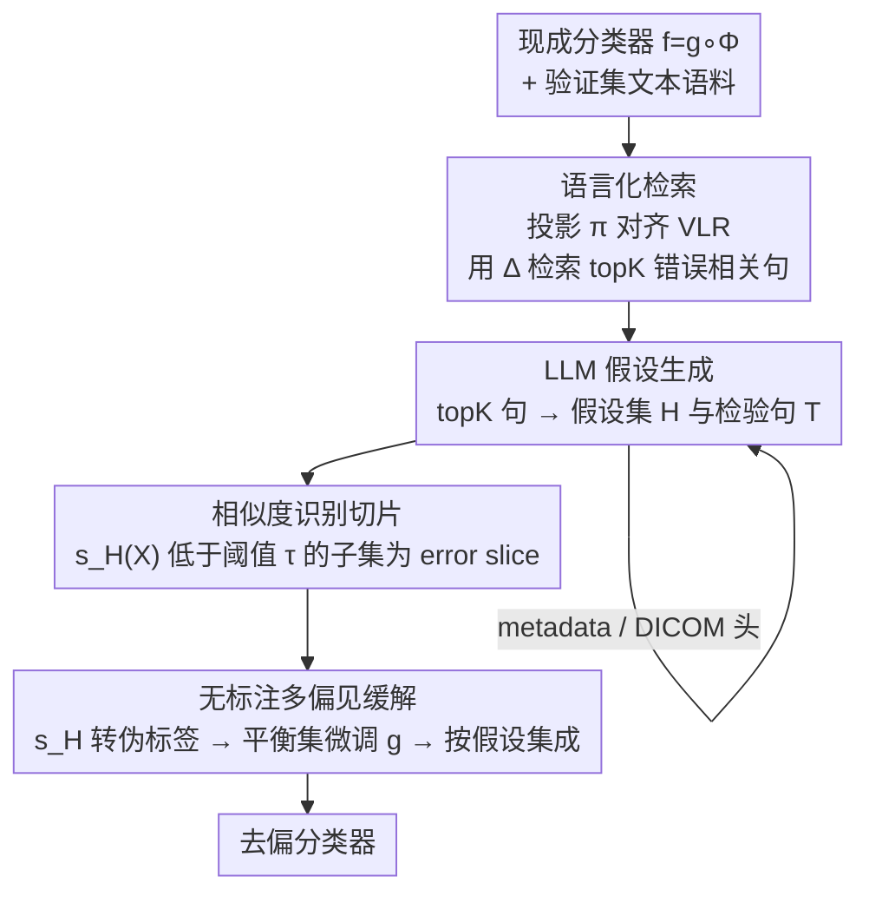

# LADDER: Language Driven Slice Discovery and Error Rectification in Vision Classifiers

**会议**: ACL 2025  
**arXiv**: [2408.07832](https://arxiv.org/abs/2408.07832)  
**代码**: https://github.com/batmanlab/Ladder  
**领域**: 可解释性 / 模型偏见与去偏  
**关键词**: 错误切片发现, 偏见缓解, LLM 推理, 视觉分类器, 伪标签

## 一句话总结
LADDER 把预训练视觉分类器的内部激活"翻译"成自然语言、检索出与错误相关的句子，再让 LLM 据此推理出"模型在缺少哪个属性时会犯错"的可检验假设，从而无需任何属性标注就能发现并缓解任意现成分类器的多重偏见；在 6 个自然/医学数据集、200+ 分类器上一致超过 Domino/Facts/DFR 等基线。

## 研究背景与动机

**领域现状**：错误切片发现（slice discovery）的目标是找出预训练视觉模型系统性犯错的数据子集（error slice），从而定位模型依赖的"捷径"偏见。当前主流做法（Domino、Facts、DrML、PRIME 等）先把图像转成一组预定义属性，或把图像直接投影到视觉-语言表示空间（VLR）做无监督聚类，再检验哪些属性配置与高错误率相关。

**现有痛点**：这套范式有三个硬伤。其一，受限于**预定义属性库**，库里没有的偏见根本发现不了；其二，缺乏**常识推理与领域知识**，在放射学这类专业领域几乎无能为力——一个只会做关键词标注的 tagging 模型说不清"气胸患者有没有胸管"这种细粒度临床偏见；其三，它们最多只能发现图像属性里的偏见，**完全忽略预处理/数据准备阶段引入的偏见**（如 DICOM 头里的 photometric interpretation）。此外，DrML 只能探测 CLIP 类多模态模型，Facts 要靠加大 weight decay 放大 spurious 相关性、偏离标准训练，二者都对被探测模型的训练方式有特殊要求。

**核心矛盾**：偏见无处不在且常常藏在**非结构化文本**里（caption、metadata、放射报告、DICOM 头），但固定属性集 / 聚类既没有推理能力、也没有领域知识去捕捉这些细微而专业的偏见；而现有缓解方法（GroupDRO、JTT、DFR）又都需要昂贵的群组标注，且只优化最差群组、反而放大其他群组的错误。

**本文目标**：做一个自动化方法，能从**任意现成预训练分类器**出发，无需属性标注、无需预知偏见的种类和数量，就能（1）发现连贯的错误切片，（2）同时缓解多重偏见。

**切入角度**：作者假设——**诱发偏见的变量会以语言形式留下痕迹**（如日志、报告、metadata），这些非结构化文本可被捕获。而 LLM 恰好擅长在这类自由文本上做复杂关系推理、并自带潜在领域知识。

**核心 idea**：把分类器的内部激活投影到 VLR 空间、检索出区分"分类正确 vs 错误"的句子，交给 LLM 推理生成可检验的偏见假设，再用相似度打分把假设落到具体图像子集上——**用语言 + LLM 推理代替固定属性库 + 无监督聚类**来发现并修正错误切片。

## 方法详解

### 整体框架
LADDER 的输入是一个**已经用 ERM 训练好的视觉分类器** $f = g \circ \Phi$（$\Phi$ 是表示层、$g$ 是分类头）和一份验证集文本语料 $t_{val}$（图像 caption 或放射报告），输出是一组偏见假设以及去偏后的分类器。整条流水线分三大段：先把模型激活"语言化"并检索出与错误相关的句子；再让 LLM 把这些句子总结成可检验的假设、并用相似度把假设落地成 error slice；最后给每个假设生成伪标签、用集成式微调修掉对应偏见。整个过程**不需要样本级配对标注、不需要人工 prompt、不需要预知偏见类型和数量**。

### 关键设计

**1. 把模型激活语言化：用表示差异检索"错误相关句"**

要让 LLM 帮忙推理偏见，第一步得把分类器的内部状态变成 LLM 看得懂的文本，而不是凭空让它瞎猜（HiBug 就是无上下文地让 LLM 猜，结果只能给出浮于表面的关键词）。LADDER 先学一个投影函数 $\pi: \Phi \to \Psi^I$，把分类器表示对齐到 VLR 空间的图像表示。然后对某个类别 $Y$，计算**分类正确样本与错误样本的投影表示均值之差**：

$$\Delta^I = \mathbb{E}_{X,Y|f(X)=Y}[\pi(\Phi(X))] - \mathbb{E}_{X,Y|f(X)\neq Y}[\pi(\Phi(X))]$$

这个差向量近似捕捉了"正确分类依赖、但在错误样本里缺失或被错误表示"的关键视觉属性。再用文本编码器把语料 $t_{val}$ 编码成 $\Psi^T(t_{val})$，按与 $\Delta^I$ 的相似度检索 topK 句：$\texttt{topK} = \mathscr{R}(\langle \Delta^I, \Psi^T(t_{val})\rangle, t_{val})$。这一步的妙处在于：它先把**分类器自己的特征**投影进 VLR（保留分类器视角的语义），而不是像 Domino/Facts 那样直接把原图投进去聚类——后者会丢失分类器特有的语义、导致切片内属性不连贯。

**2. LLM 生成可检验假设，再用相似度打分把假设落成 error slice**

拿到 topK 句后，LADDER 调用 LLM 产出 $\{\mathcal{H}, \mathcal{T}\} = \texttt{LLM}(\texttt{topK})$：$\mathcal{H}$ 是一组"$f$ 可能依赖的属性"假设，$\mathcal{T}$ 是用来检验每条假设的句子集合。每条假设 $H$ 配一组检验句 $\mathcal{T}_H$，它们从多角度描述该属性在不同图像里的样子。这一步把"句子"升华成"可证伪的偏见命题"，正是固定属性库和聚类做不到的——LLM 的推理 + 潜在领域知识能想到"loculated pneumothorax""钙化亚型"这种专业偏见。

落地时，对每条假设算检验句的均值文本嵌入 $\Psi^T(\mathcal{T}_H) = \frac{1}{|\mathcal{T}_H|}\sum_{t\in\mathcal{T}_H}\Psi^T(t)$，再对类别 $Y$ 里每张图算相似度分数 $s_H(X) = \langle \pi(\Phi(X)), \Psi^T(\mathcal{T}_H)\rangle$。**分数低于阈值 $\tau$** 的图像组成子集 $\mathcal{S}_{Y,\neg H} = \{X \in \mathcal{X}_Y \mid s_H(X) < \tau\}$（即"缺少该属性"的图像）。若这个子集的错误率显著高于整类错误率，它就被判为 error slice：

$$\hat{\mathbb{S}}_Y = \{\mathcal{S}_{Y,\neg H} \subseteq \mathcal{X}_Y \mid e(\mathcal{S}_{Y,\neg H}) \gg e(\mathcal{X}_Y),\ \exists H \in \mathcal{H}\}$$

实验里 error slice 的判据是子集错误率比整类至少高 10%。

**3. 无标注的多偏见缓解：伪标签 + 集成式去偏**

发现偏见只是一半，关键是不用任何属性标注就把它们修掉。LADDER 把相似度 $s_H$ 当作 logit 转成概率，概率超过 0.5 就给该属性伪标签 1、否则 0——于是**每个假设自动获得一套伪标签**，省掉了昂贵的人工标注。接着借鉴 DFR：用一个 held-out 验证集，针对每条假设的伪标注属性构造一个**属性平衡数据集**，只微调分类头 $g$（表示层冻结），得到"每条假设一个去偏模型"。推理时对所有假设重算 $s_H(X)$，选相似度最大的那条假设对应的分类头：$H^* = \arg\max_{H\in\mathcal{H}} s_H(X)$。这种**集成式**策略让它能同时修多个偏见，而不像 GroupDRO/JTT/DFR 那样只盯最差群组、修一个崩另一个。

**4. 突破 caption 的两条路：metadata/DICOM 推理 + instruction-tuned 模型**

很多偏见根本不在图像内容里，而在预处理/数据准备阶段。LADDER 把每个样本的 metadata（年龄、拍摄视角、是否植入物等）和 DICOM 头（photometric interpretation、VOI LUT 等）整理成 Python 字典喂给同一套 LLM 流水线，照样生成假设并用 metadata 真值检验——从而发现了 caption 里根本没有的偏见（如 RSNA 上 70 岁以上患者 vs 其余有 19.5% 的准确率差、不同 photometric interpretation 间有 10% 差）。另一方面，为减轻对人工 caption/报告的依赖，LADDER 还可用 instruction-tuned 模型（自然图像用 LLaVA-1.5 7B，CXR 用 RaDialog / CheXagent）给正确分类的样本自动生成描述，再走同一条 LLM 流水线。

### 一个例子：NIH 气胸检测里的"胸管"偏见
以 NIH Chest-X-ray 的气胸（pneumothorax）类为例：分类器其实学到了"看到胸管（chest tube）就判气胸"的捷径，因为训练集里气胸患者往往已经插了胸管。LADDER 先用 $\Delta^I$ 检索出报告里反复出现"chest tube"的句子，LLM 据此提出假设"模型依赖胸管这一属性"；用 $s_H$ 给每张图打分后发现：有胸管的气胸患者准确率约 98%，而**没有胸管的气胸患者准确率只有 31%**——后者正是被自动识别出的 error slice。随后给"有/无胸管"打伪标签、构造平衡集微调分类头，把这个捷径修掉。

## 实验关键数据

数据集：3 个自然图像（Waterbirds、CelebA、MetaShift）+ 3 个医学影像（NIH Chest-X-ray、RSNA-Mammo、VinDr-Mammo）。被探测模型 $f$：自然图像/CXR 用 ImageNet1k 初始化的 ResNet50，乳腺钼靶用 EfficientNet-B5。VLR：CLIP / CXR-CLIP / Mammo-CLIP。LLM：主实验用 GPT-4o。共覆盖 200+ 分类器、4 个 LLM。

### 主实验：偏见缓解 WGA（Worst Group Accuracy）
EN-B5 用于乳腺钼靶，其余用 RN Sup IN1k；数值为 3 个随机种子结果。

| 方法 | Waterbirds | CelebA | NIH | RSNA | VinDr |
|------|-----------|--------|-----|------|-------|
| ERM | 69.1 | 62.2 | 60.3 | 69.8 | 45.6 |
| JTT | 84.5 | 87.2 | 70.4 | 68.5 | 66.1 |
| GroupDRO | 87.1 | 88.1 | 71.1 | 72.3 | 67.1 |
| CVaRDRO | 85.4 | 83.1 | 71.3 | 71.7 | 67.1 |
| LfF | 75.2 | 63.0 | 61.6 | 66.4 | 64.5 |
| DFR | 88.2 | 87.1 | 70.5 | 71.2 | 68.1 |
| **LADDER** | **91.4** | **88.9** | **76.2** | **76.4** | **82.5** |

LADDER 在所有数据集上都拿到最高 WGA：相比 DFR，在 Waterbirds / RSNA / VinDr 上分别提升 3.6% / 7.3% / 21.1%；在 NIH 上比 JTT / DFR 高 8.2% / 7.4%。关键是它**完全不用昂贵的 ground-truth 捷径属性标注**。在切片发现指标 Precision@10 上，医学影像数据集上 LADDER 比基线高出约 50%。

### 消融实验：caption 生成器对性能的影响（RN Sup IN1k）
验证不同 caption 来源喂给流水线后的最终缓解效果。

| Caption 来源 | Waterbirds Mean Acc | Waterbirds WGA | CelebA Mean Acc | CelebA WGA |
|-------------|--------------------|----------------|-----------------|------------|
| BLIP | 93.1 | 91.4 | 89.8 | 88.9 |
| BLIP2 | 93.3 | 91.6 | 89.8 | 89.2 |
| ClipCap | 93.7 | 91.8 | 88.3 | 87.4 |
| **GPT-4o** | **94.2** | **93.1** | **91.4** | **90.3** |

GPT-4o 虽然贵，但 caption 质量最好、对应最高 WGA；不过即便换成开源的 BLIP/BLIP2/ClipCap，性能下降也很有限，说明流水线对 caption 来源不算敏感。

### 关键发现
- **切片连贯性是性能来源**：Domino/Facts 直接把原图投进 VLR 聚类，切片内属性不连贯、伪标签不准；LADDER 先投影分类器表示再用 LLM 从报告里提炼连贯属性，伪标签更准，于是缓解效果更好。
- **领域知识在医学影像上尤其关键**：LADDER 能发现 loculated pneumothorax、钙化亚型这类需要临床知识才能想到的细粒度偏见；CXR 上用真实放射报告的检索式流水线优于用 CheXagent/RaDialog 生成描述，说明专业报告不可替代。
- **跨架构/预训练一致性**：在 ResNet50 与 ViT、SimCLR/Barlow Twins/DINO/CLIP 等多种预训练下，LADDER 都能稳定识别出同类偏见（如 Waterbirds 反复检出 ocean/lake/beach 等"水体"概念），印证了"ERM 分类器无论架构都学到相似偏见"。
- **超越 caption**：从 metadata/DICOM 头发现了 caption 完全没有的年龄偏见（70+ vs 其余差 19.5%）和 photometric interpretation 偏见（差 10%）。
- **flying vs not-flying**：Waterbirds 中会飞 vs 不会飞的鸟准确率 97.3% vs 68.6%，直观显示了 LLM 假设确实定位到了真实偏见维度。

## 亮点与洞察
- **"激活 → 文本 → 假设"的桥接**：用正确/错误样本的表示均值差 $\Delta^I$ 去检索句子，把不可读的内部激活变成 LLM 能推理的自然语言——这个把视觉模型"翻译给 LLM 听"的接口很可复用，可迁移到任何需要让 LLM 解释黑盒模型的场景。
- **假设即伪标签**：把相似度 $s_H$ 直接当 logit 转伪标签，优雅地打通了"发现偏见"和"缓解偏见"两步，省掉了标注瓶颈；这个 trick 可用到任何"先发现子群、再做平衡微调"的去偏管线。
- **对被探测模型零侵入**：不要求特定训练方式（不像 Facts 要加大 weight decay、DrML 只能 CLIP），任何现成 ERM 分类器都能审计——作者把它定位成"可持续运行的偏见审计器"，只要偏见能在语言里留痕就能被抓到。
- **成本意外地低**：整套 LLM 流水线只处理文本、不处理图像，自然图像实验总花费约 28 美元。

## 局限与展望
- **依赖 caption/文本**：在文本描述稀疏或缺失的领域（如 2D 钼靶、皮肤影像）难以适用；instruction-tuned 模型是个 workaround，但在缺乏稳健 VLM 的领域仍受限。
- **继承基础模型的偏见**：CLIP、LLM 自身带训练数据偏见，可能影响发现过程、甚至损害公平性目标——用有偏的工具去查偏见，本身存在风险。
- **发现阶段无人监督**：为避免引入额外偏见，发现阶段全自动；但验证阶段交给领域专家（如临床医生），又引入了主观性，验证流程的标准化尚未解决。
- **个人观察**：error slice 的判据（错误率高出 10%）、伪标签阈值 0.5、相似度阈值 $\tau$ 等超参对结果的鲁棒性论文未充分展开；不同数据集的最优 topK（自然 200 / 医学 100）也提示该流水线需要按域调参。

## 相关工作与启发
- **vs Domino / Facts**：它们在 VLR 空间对**原图**聚类发现切片，切片内属性不连贯、且 Facts 还要靠加大 weight decay 偏离标准训练；LADDER 投影的是**分类器表示**并用 LLM 推理连贯属性，切片更可靠、对训练方式零要求。
- **vs DrML**：DrML 用模态 gap 几何 + 用户自定义 prompt，只能探测 CLIP 类模型且引入人为偏见；LADDER 适用任意架构、无需人工 prompt。
- **vs PRIME / B2T / HiBug**：PRIME 靠昂贵 tagging 模型、只能查固定属性的有无；B2T 仅从 caption 抽关键词；HiBug 无数据上下文地让 LLM 猜，只能给浮浅关键词；LADDER 有真实文本上下文 + LLM 领域推理，能挖到专业细粒度偏见。
- **vs GroupDRO / JTT / DFR**：这些缓解方法都要群组标注、且只优化最差群组会放大其他群组错误；LADDER 用伪标签 + 集成式去偏，无标注地同时修多重偏见。

## 评分
- 新颖性: ⭐⭐⭐⭐⭐ "用 LLM 推理 + 语言痕迹"重构错误切片发现，并打通到无标注多偏见缓解，思路新且自洽。
- 实验充分度: ⭐⭐⭐⭐⭐ 6 数据集、200+ 分类器、4 LLM、多架构/预训练，自然与医学影像双覆盖，消融完整。
- 写作质量: ⭐⭐⭐⭐ 方法与动机清晰，公式规范；部分细节（阈值/超参敏感性）下放附录略影响自洽阅读。
- 价值: ⭐⭐⭐⭐⭐ 给任意现成模型提供低成本、可持续的偏见审计 + 去偏工具，医学影像场景实用价值高。

<!-- RELATED:START -->

## 相关论文

- [\[ACL 2025\] Retrieve to Explain: Evidence-driven Predictions for Explainable Drug Target Identification](retrieve_to_explain_drug_target_identification.md)
- [\[ICML 2026\] Influence-Guided Symbolic Regression: Scientific Discovery via LLM-Driven Equation Search with Granular Feedback](../../ICML2026/computational_biology/influence-guided_symbolic_regression_scientific_discovery_via_llm-driven_equatio.md)
- [\[NeurIPS 2025\] scPilot: Large Language Model Reasoning Toward Automated Single-Cell Analysis and Discovery](../../NeurIPS2025/computational_biology/scpilot_large_language_model_reasoning_toward_automated_single-cell_analysis_and.md)
- [\[ACL 2025\] Concept Bottleneck Language Models For Protein Design](concept_bottleneck_language_models_for_protein_design.md)
- [\[CVPR 2025\] DiffVsgg: Diffusion-Driven Online Video Scene Graph Generation](../../CVPR2025/computational_biology/diffvsgg_diffusion-driven_online_video_scene_graph_generation.md)

<!-- RELATED:END -->
