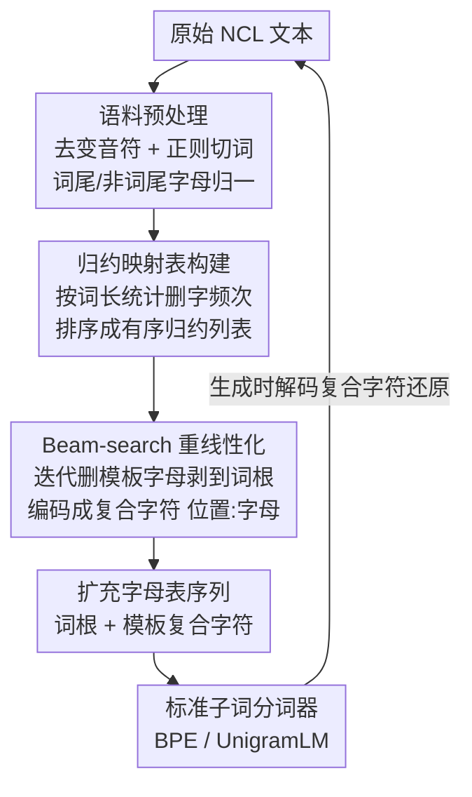

# Splintering Nonconcatenative Languages for Better Tokenization

**会议**: ACL 2025  
**arXiv**: [2503.14433](https://arxiv.org/abs/2503.14433)  
**代码**: https://github.com/MeLeLBGU/Splintering  
**领域**: 预训练 / NLP  
**关键词**: 子词分词, 非拼接形态, 希伯来语, 词根-模板, 预分词

## 一句话总结
本文提出 **Splinter**——一个加在 BPE/UnigramLM 之前的「预分词」步骤，通过迭代删字把希伯来语、阿拉伯语、马来语这类"词根藏在模板里"的词重排成线性可切的序列，让普通分词器也能把词根切成连续的 token，从而在内在指标与希伯来语下游任务上都拿到提升。

## 研究背景与动机

**领域现状**：现代 LLM 的输入仍依赖子词分词（BPE、WordPiece、UnigramLM），这些算法有一个共同假设——一个词可以靠**线性连续切分**就分出有意义的单元（前缀、词根、后缀依次排列）。这对英语这类"拼接形态"语言基本成立。

**现有痛点**：但希伯来语、阿拉伯语是典型的**非拼接语言（NCL）**，意义单元交织在一起。希伯来语动词 $\langle l\text{'}bwd\rangle$（la'avod，"去工作"）的词根是 $\langle\text{'}bd\rangle$ 三个辅音，可它们在词里**并不相邻**——模板字母 $\langle l\rangle$、$\langle w\rangle$ 插在中间，把词根拆散了。线性分词器面对这种词只能硬切，结果是同一个词根（lemma）在不同词形下被切成完全不同、形态学上不连贯的 token，模型再也学不会"这些词其实同源"，下游生成、翻译、问答全都受损。马来语、格鲁吉亚语则是另一种破坏方式：**分裂词缀（circumfix / infix）**会把词干或词缀本身劈开。

**核心矛盾**：分词器要求"意义单元在字符串里连续"，而 NCL 的形态学天生就是"不连续"的。问题不在分词算法本身的合并策略，而在**喂给它的字符序列布局**就不对。

**本文目标**：在不改动任何现有分词器实现的前提下，把 NCL 文本"重新线性化"，让词根落到连续位置。同时要满足几个硬约束——变换必须**可逆**（能还原回原文）、只作用于目标语言、对大词表（单语模型 DictaBERT 128K）和小词表（多语模型给希伯来语只分 ~2.3K token，如 GPT-4o）都得有效。

**切入角度**：作者观察到一个关键统计规律——**模板远少于词根**，所以模板字母倾向于在固定位置高频出现。经验上，希伯来语/阿拉伯语里只要词长 > 3，总存在某个删字操作，能把当前词变成另一个**已存在**、且保留同一词根的词。

**核心 idea**：把"删掉模板字母"做成一串可逆的单字删除操作，迭代地把词剥到只剩词根，再把每次删除编码成一个**复合字符**（字母 + 被删位置索引）扩进字母表——这样词被重写成"词根 + 一组模板复合字符"的线性序列，普通 BPE 拿到手就能把词根切成一个完整 token。

## 方法详解

### 整体框架
Splinter 是一个**预分词（pre-tokenization）**模块，夹在"原始文本"和"标准子词分词器"之间，整条流水线分两个阶段：**离线建图**和**在线重线性化**。

离线阶段在目标语言语料上统计出一张「**归约映射表（reduction map）**」：按词长分组，记录每种"删第几位上的某字母"操作能产出多少个真实存在的词，按频次从高到低排序。在线阶段对每个新词查这张表，用一个 beam-search 风格的打分树，反复挑当前最优的删字操作，直到词被剥到只剩 3 个字符（≈词根）。每次删除被编码成复合字符 `位置:字母`，词最终变成"词根字符 + 若干复合字符"的新序列。这个序列用**扩充后的字母表**表示，原样喂给 SentencePiece 的 BPE/UnigramLM——分词器训练、推理全在这个重线性化序列上进行。生成时再把复合字符解码回删除操作、逐步还原成原词，因此整个过程**完全可逆**。

### 关键设计

**1. 单字删除 + 复合字符编码：把"不连续词根"重排成"连续词根"**

这是全文的地基，直接针对"词根被模板字母拆散、线性分词器切不连续"这个痛点。作者把变换限制为**单字符删除（single-letter reduction）**：每次只从词里删掉一个字符。关键洞察是模板字母比词根更高频、位置更固定，所以优先删掉的就是模板字母，迭代下去词就只剩词根。例如 $\langle l\text{'}bwd\rangle$ 删掉第 3 位的 $\langle w\rangle$ 变成已存在的词 $\langle l\text{'}bd\rangle$，再删 $\langle l\rangle$ 就逼近词根 $\langle\text{'}bd\rangle$。

为了**可逆**，每次删除不是简单丢弃，而是编码成一个复合字符——字母配上它被删除的索引，如 $\langle l\rangle$ 在第 0 位删除记作 `0:l`。这些复合字符被加进语言原有的字母表，于是词被重写成"剩余词根字符 + 一组复合字符"。比如 $\langle l\text{'}bwd\rangle$ 最终被 Splinter+BPE 切成两个 token：模板 token `3:w,0:l` 和词根 token $\langle\text{'}bd\rangle$——词根第一次成了一个完整、连续的 token。一个工程细节是对词后半段的字符用**负索引**，既贴合后缀类形态、又把扩充字母表的规模减小约 15%。

**2. 归约映射表构建：用语料频次决定"先删哪个字母"**

光知道"要删字"还不够，得回答"每一步删哪一位"。本设计离线扫语料生成排序好的归约表。先做预处理：希伯来语去掉变音符号；用正则 `\.|\s|\n|-|,|:|"|\(|\)` 切词；丢掉出现少于 10 次的词和含外语字母的词；并把希伯来语的词尾/非词尾字母互相归一（如把"行走"单数 $\langle hwlK\rangle$ 和复数 $\langle hwlkyM\rangle$ 都归一到清晰保留词根 $\langle hlk\rangle$ 的形式），这一步既加强词根连接、又保证可还原。得到「词 → 频次」的 unigram 字典后，对每个长度 $k\ge 4$ 的词 $w_i$（取 4 是因为闪含语系词根多为 3 个辅音），枚举所有单字删除 $\{r_0,\dots,r_{k-1}\}$，给每个删除打分 = 删完得到的词 $w_i^{r_j}$ 在语料里的频次，产出词不存在则记 0 分。分数按词长 $k$、按删除 $r$ 累加，最后排序成"每种词长下、各删除操作按频次从高到低"的有序列表。

之后还要再扫一遍语料做**校准**：对每个词按频次降序尝试归约表里的操作，只把**第一个能产出真实词**的删除记进新的频次计数器，其余忽略。这一步保证"最高频删除优先"，与"先删模板字母"的目标对齐——因为模板字母才是那个在固定位置反复出现的高频删除。

**3. Beam-search 重线性化：推理时给每个词挑一条最优删除路径**

有了排序好的归约表，在线处理每个词时用一个受 beam search 启发的简单启发式。构一棵打分选择树：根是完整词、得分 1.0；每个节点按归约表选出当前**得分最高的 $b$ 个可用删除**，子节点得分 = 一路删除得分的乘积。当词长降到最小值 3、或树深达到 $d$ 时，选出**得分最高那条路径的首个删除**真正应用，然后以新（更短的）词为根重启整个过程，直到剥到词根。论文取 $b=d=3$。这样既不是贪心一条道走到黑，又能在很小的搜索预算里产出高质量的重线性化。整个 token 序列对分词器和语言模型完全透明——它们只看到扩充字母表上的序列，训练与推理一视同仁。

### 一个例子：$\langle l\text{'}bwd\rangle$ "去工作"
取词 $\langle l\text{'}bwd\rangle$（词根 $\langle\text{'}bd\rangle$，模板 $\langle l\_\_w\_\rangle$），词长 5 > 3 进入流程。查归约表，beam 树发现删第 3 位 $\langle w\rangle$ 能得到高频真实词 $\langle l\text{'}bd\rangle$，得分最高 → 编码成 `3:w` 并应用；新词 $\langle l\text{'}bd\rangle$ 长度 4，继续删第 0 位 $\langle l\rangle$ → 编码 `0:l`，得到 $\langle\text{'}bd\rangle$ 长度 3，停止。最终序列 = `3:w` `0:l` + 词根 $\langle\text{'}bd\rangle$。送进词表 2K 的 BPE：

| 分词器 | 切分结果 | 词根是否完整 |
|--------|----------|--------------|
| Vanilla BPE | $\langle l\text{'}\rangle$ + $\langle bwd\rangle$ | 否，词根 $\langle\text{'}bd\rangle$ 被劈成两半 |
| Splinter + BPE | 模板 `3:w,0:l` + 词根 $\langle\text{'}bd\rangle$ | 是，词根独立成一个 token |

同理名词 $\langle\text{.hy/swb}\rangle$（"计算"）Vanilla 切成 $\langle\text{.h}\rangle$ + $\langle y/swb\rangle$，Splinter 切成模板 `1:y,3:w` + 词根 $\langle\text{.h/sb}\rangle$。词根一旦连续，模型就能跨词形泛化同一 lemma。

## 实验关键数据

### 主实验

**下游任务（希伯来语 BERT）**：以当前 SOTA 的 DictaBERT 为基线，用**完全相同的语料和训练参数**重训一个仅替换 Splinter 预分词的 BERT-base，再在三个任务上微调对比。注意作者强调这是**下界估计**（只调了预分词、没调 LM 超参）。

| 任务 | 指标 | DictaBERT | Splinter | 变化 |
|------|------|-----------|----------|------|
| 问答 QA | F1 | 72.9 | **74.4** | +1.5 |
| 问答 QA | EM | 63.6 | **65.4** | +1.8 |
| 句法分析 | LAS | 89.0 | 89.0 | 持平 |
| 前缀切分 | Acc | 99.1 | **99.3** | +0.2（错误率↓ >20%） |

QA 提升最明显——Splinter 让模型看懂了带后缀变形的"挖掘 (xafirato)"和问句里的"挖掘们 (xafirot)"其实同根，从而答对 DictaBERT 答错的题。前缀切分虽已近饱和（99%+），但错误率下降超过 20%，说明数据驱动的找模式算法在字符级很有效；句法分析持平，说明句子级任务对字符级重排不敏感。

**内在指标（希伯来语，词表 128K，HeDC4 语料）**：认知合理性（Cognitive plausibility，越高越贴合人类）和上下文连贯性（Distinct Neighbors，越低越好）是核心，Splinter 在两种分词算法上都更优。

| 分词器 | 类型 | 认知合理性↑ | Rényi 效率 | tokens/词 | Distinct Neighbors↓ |
|--------|------|-------------|-----------|-----------|---------------------|
| BPE | Vanilla | 0.157 | 0.524 | 1.146 | 2674 |
| BPE | **Splinter** | **0.179** | 0.527 | 1.165 | **2640** |
| UnigramLM | Vanilla | 0.151 | 0.505 | 1.162 | 2440 |
| UnigramLM | **Splinter** | **0.171** | 0.485 | 1.176 | **2308** |

### 消融实验

**词表大小敏感性（希伯来语 BPE，HeDC4）**：认知合理性的优势在**小词表**下尤其巨大（这正是多语 LLM 给 NCL 分到的 token 预算场景），但压缩效率（tokens/词、4+ token 词占比、单字符 token 占比）始终被 Splinter 拉低。

| 词表 | 类型 | 认知合理性↑ | tokens/词↓ | 4+ token 词↓ | 单字符 token↓ |
|------|------|-------------|-----------|--------------|----------------|
| 128K | Vanilla | 0.157 | 1.146 | 0.53% | 6.00% |
| 128K | Splinter | **0.179** | 1.165 | 0.98% | 6.81% |
| 2K | Vanilla | 0.149 | 2.137 | 7.44% | 25.90% |
| 2K | Splinter | **0.207** | 2.270 | 11.57% | 33.32% |
| 800 | Vanilla | 0.102 | 2.543 | 16.03% | 37.70% |
| 800 | Splinter | **0.182** | 2.890 | 28.70% | 54.37% |

**跨语言泛化（BPE，各语言 Wikipedia 语料）**：希伯来、阿拉伯、马来三种语言、词表 2K 时 Splinter 的认知/连贯优势都成立，但同样以压缩效率为代价。

| 语言 | 词表 | 类型 | tokens/词↓ | 4+ token 词↓ | Distinct Neighbors↓ |
|------|------|------|-----------|--------------|---------------------|
| Hebrew | 2K | Vanilla | 2.149 | 9.22% | 1853 |
| Hebrew | 2K | Splinter | 2.306 | 13.65% | **1805** |
| Arabic | 2K | Vanilla | 2.117 | 11.25% | 1824 |
| Arabic | 2K | Splinter | 2.276 | 16.70% | **1784** |
| Malay | 2K | Vanilla | 2.150 | 14.65% | 1215 |
| Malay | 2K | Splinter | 2.724 | 28.79% | 1055 |

### 关键发现
- **词表越小，Splinter 优势越大**：认知合理性在 800/1K/2K 词表下相对 Vanilla 拉开最大差距（如 800 词表 0.182 vs 0.102），恰好对应多语 LLM 给 NCL 仅留 ~1K-2K token 的现实场景；而在 128K 大词表下，上下文连贯性优势在 Wikipedia 上几乎消失甚至被基线反超。
- **压缩效率是代价**：所有语料/算法/词表/语言下，Splinter 一致地**降低**压缩效率（tokens/词、4+ token 词比例、单字符 token 比例都升高）。这意味着生成式 LM 要多迭代几步才能产出同样文本、算力成本更高，是落地时必须权衡的 trade-off。
- **词表差异显著**：在 128K 这个最大词表下，Splinter 与 Vanilla 词表的交集率仍低于 75%，且按线性外推要到约 780K 词表才会超过 85%——证明 Splinter 不是只处理边缘 case，而是从头产出了实质不同的词表。
- **Rényi 效率几乎无差**：作者特意指出 Rényi 效率可被"刷分"且与下游表现未必正相关，因此强调多指标综合判断，而非只看单一压缩指标。

## 亮点与洞察
- **把形态学问题转成"字母表工程"**：不改分词器、不改模型架构，只在输入端加一层可逆的字符重排，就把"非拼接"难题塞回标准 BPE 流水线——这种"前处理即插即用"的思路极易迁移到任何已有 tokenizer 生态。
- **复合字符 `位置:字母` 的编码很巧**：它同时解决了三件事——可逆还原、把模板信息显式化、让词根落到连续位置；负索引技巧再顺手砍掉 15% 字母表，工程感扎实。
- **小词表场景的精准打击**：作者敏锐指出多语 LLM 给低资源 NCL 只分 ~1-2K token，而 Splinter 恰恰在小词表下增益最大，定位非常对症。
- **诚实地承认 trade-off**：明确说压缩效率变差、句法任务无增益、大词表连贯性优势消失，不夸大，这种克制反而让结论更可信。

## 局限与展望
- **压缩效率下降**是硬伤，对生成式 LLM 的推理成本不友好，论文只在 BERT（编码器）上验了下游任务，没在生成式模型上测端到端代价。
- 下游任务**只测了希伯来语**，阿拉伯语/马来语仅有内在指标、缺乏下游验证；任务集中在 QA/句法/切分，没覆盖翻译、长文本生成。
- 优势依赖词表大小，大词表（128K）下内在收益微弱甚至反转，说明该方法更适合"小词表 + 单一 NCL"的设定。
- 归约映射表依赖语料频次，对低资源、口语化或历史文本（变体多、频次稀疏）的鲁棒性未充分检验；预处理里大量希伯来语专属规则（词尾字母归一等）也限制了开箱即用的通用性。
- 改进方向：在生成式 LLM 上联合调 LM 超参 + Splinter（论文称当前是下界）、把 beam 参数 $b,d$ 自适应化、扩展到更多非拼接语言并补齐下游评测。

## 相关工作与启发
- **vs Vanilla BPE / UnigramLM**：标准子词分词假设线性可切，NCL 上词根被模板劈开；Splinter 不替换它们，而是在前面加一层重线性化，让它们照常工作但拿到"对的"输入。
- **vs 形态学分词器（基于词根-模板的语言学切分）**：传统做法往往要语言学规则或形态分析器、且不一定可逆、难接现成 tokenizer；Splinter 是**数据驱动 + 完全可逆 + 即插即用**，不依赖人工形态标注。
- **vs 直接扩大词表**：作者用词表交集实验论证，靠堆词表（要 ~780K 才达 85% 重合）远不如重排输入划算，从根本上质疑了"大词表能自动解决 NCL"的假设。

## 评分
- 新颖性: ⭐⭐⭐⭐⭐ 用可逆的单字删除 + 复合字符把非拼接形态重排进标准分词流水线，角度新颖且优雅。
- 实验充分度: ⭐⭐⭐⭐ 三语言 × 两算法 × 七词表的内在指标很全，但下游任务只在希伯来语 BERT 上、缺生成式验证。
- 写作质量: ⭐⭐⭐⭐⭐ 例子贯穿全文、trade-off 坦诚、指标解释到位，读完能完整复述方法。
- 价值: ⭐⭐⭐⭐ 对低资源非拼接语言（尤其多语 LLM 的小词表预算）有实打实的即插即用价值。

<!-- RELATED:START -->

## 相关论文

- [\[ACL 2025\] Adversarial Tokenization](adversarial_tokenization.md)
- [\[ACL 2025\] Between Circuits and Chomsky: Pre-pretraining on Formal Languages Imparts Linguistic Biases](between_circuits_chomsky.md)
- [\[ACL 2025\] Byte Latent Transformer: Patches Scale Better Than Tokens](byte_latent_transformer.md)
- [\[ACL 2025\] Incorporating Domain Knowledge into Materials Tokenization](incorporating_domain_knowledge_into_materials_tokenization.md)
- [\[ACL 2025\] Retrofitting Large Language Models with Dynamic Tokenization](retrofitting_large_language_models_with_dynamic_tokenization.md)

<!-- RELATED:END -->
