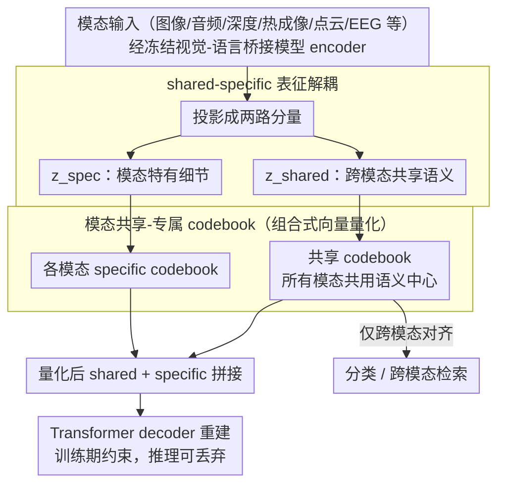

# CodeBind: Decoupled Representation Learning for Multimodal Alignment with Unified Compositional Codebook

**会议**: ACL2026  
**arXiv**: [2605.18257](https://arxiv.org/abs/2605.18257)  
**代码**: https://visual-ai.github.io/codebind  
**领域**: 多模态对齐 / 3D视觉  
**关键词**: 多模态表征, 组合式向量量化, shared-specific解耦, 代码本, 跨模态检索

## 一句话总结
CodeBind 用 shared-specific 表征解耦和组合式 VQ codebook 改造 ImageBind/ViT-Lens 式多模态对齐，在九种模态上同时提升跨模态分类/检索，并保留更强的模态特有细粒度信息。

## 研究背景与动机
**领域现状**：多模态表征对齐是让 LLM、机器人和感知系统接入图像、视频、音频、深度、热成像、触觉、点云、EEG 等多传感器输入的关键。主流做法通常把专用模态对齐到成熟的视觉-语言空间，例如以 OpenCLIP、ImageBind 或 ViT-Lens 为桥接模型。

**现有痛点**：第一，硬对齐会把所有模态压进同一个共享空间，容易产生“最小公分母”效应：跨模态语义一致了，但颜色、纹理、触觉压力、热信号等模态独有信息被抹平。第二，专业模态数据远少于图文数据，训练时强势模态会主导空间，导致低资源或稀有模态被压制。第三，现有方法常依赖大规模配对数据、合成数据或统一 encoder，扩展到新模态成本高。

**核心矛盾**：跨模态任务需要共享语义空间，但细粒度任务和机器人感知又需要保留模态私有细节。若完全共享，信息被过度压缩；若完全分开，不同模态无法互相检索和交互。

**本文目标**：作者希望通过“部分对齐”实现两件事：把跨模态一致的语义放进 shared space，用于分类和检索；把模态独有细节放进 specific space，用于细粒度识别、重建和融合。

**切入角度**：论文把 VQ codebook 看作分布无关的离散语义基底。不同模态的 shared embedding 共享同一个 codebook，保证语义中心一致；每个模态还有自己的 specific codebook，避免私有信息被共享空间吞掉。

**核心 idea**：用 shared-specific 表征解耦 + 组合式 VQ codebook，在紧凑参数量下同时扩大表达容量、降低模态偏置并保护细粒度特征。

## 方法详解

### 整体框架
CodeBind 以冻结的视觉-语言基础模型作为桥接空间，把目标模态逐步对齐到 text/image 语义空间。每个模态 encoder 的输出先被投影成两个分量：$z^{\mathcal{M}}_{shared}$ 负责跨模态共享语义，$z^{\mathcal{M}}_{spec}$ 负责模态特有信息。shared 分量进入所有模态共用的 codebook，specific 分量进入各自模态的 specific codebook。量化后的 shared 与 specific embedding 拼接后交给 Transformer decoder 做重建，以约束信息不丢失；推理时如果只做跨模态对齐，可以只保留 shared embedding，并丢弃重建模块以降低成本。

### 关键设计

**1. shared-specific 表征解耦：让跨模态语义和模态私有细节各走各路**

传统对齐直接最大化两个模态完整 embedding 的互信息，会把颜色、纹理、热模式这些私有特征连同噪声一起硬塞进同一个空间，于是“猫”的共享概念有了，毛色和触觉压力却被抹平。CodeBind 把每个模态 encoder 的输出拆成两路：$z^{\mathcal{M}}_{shared}$ 只参与跨模态对齐，$z^{\mathcal{M}}_{spec}$ 专门兜住模态特有信息。两路之间用正交约束 $\mathcal{L}_{orth}$ 和 uniform 约束 $\mathcal{L}_{uni}$ 拉开、再用重建损失 $\mathcal{L}_{recon}$ 逼 specific 分量保留非冗余细节。这样分类、跨模态检索拿 shared 分量去找“猫”这种共享概念，fine-grained retrieval 又能回头取毛色、热模式或压力细节，两类需求不再互相伤害。

**2. modality-shared-specific codebook：用离散 codevector 当统一语义基底，又给每个模态留专属表达空间**

如果所有模态都挤进一个连续空间，强势的图文模态会主导坐标系，低资源模态（深度、热成像、EEG）只能被拖着走。CodeBind 把 VQ codebook 当成分布无关的离散语义中心：shared embedding 全部量化到通用 codebook $\mathcal{C}_{shared}$，保证不同模态的语义锚点对齐；每个模态另配一套 specific codebook $\mathcal{C}^{\mathcal{M}}_{spec}$。举例来说，“striking” 在 shared space 里是一般的“击打”语义，到了 audio/video/tactile 的 specific space 就分别落成声音、运动和压力模式。共享 codebook 让低资源模态不被主导模态带偏，specific codebook 又挡住“所有细节被压成同一套抽象语义”的塌缩。

**3. 组合式向量量化：用小 codebook 拼出大容量**

提表达力最直接的办法是把 codebook 做大，但大 codebook 带来计算开销、codebook collapse 和低利用率。CodeBind 改成组合式量化：把 $d$ 维 embedding 切成 $m$ 个子向量，每个子向量独立到自己的低维子 codebook 里选一个 codevector；若每个子 codebook 有 $K$ 个 codevector，整个组合空间就能达到 $K^m$。于是参数量几乎没涨，可表达的离散组合却指数级放大，更适合不断往上加新模态的多模态场景。

### 损失函数或训练策略
训练目标由多类损失组成。跨模态语义对齐使用 InfoNCE $\mathcal{L}_{align}$；表征解耦使用正交损失 $\mathcal{L}_{orth}$、uniform 损失 $\mathcal{L}_{uni}$ 和重建损失 $\mathcal{L}_{recon}$；codebook 稳定性通过 EMA 更新、commitment loss、动态重初始化，以及 codevector regularization $\mathcal{L}_{cctr}$、$\mathcal{L}_{cuni}$ 维护；shared codebook 的跨模态匹配由 Cross-Modal Code Matching loss $\mathcal{L}_{cm}$ 约束。为了减少手动调参，作者还设计了自适应 loss balancing，用 EMA 估计各损失量级，并相对 $\mathcal{L}_{align}$ 动态缩放权重。

实现上，CodeBind 集成到 ImageBind 和 ViT-Lens 得到 CodeBind-IB 与 CodeBind-VL。实验使用 1024 个 shared codevectors、256 个 specific codevectors，codevector 维度为 8；从 ImageBind/ViT-Lens 初始化，在 8 张 NVIDIA RTX 3090 上以学习率 $5\times10^{-4}$ 训练。目标模态 encoder 可通过 LoRA 微调，新增模态时只需训练新 codebook 与相应路径。

## 实验关键数据

### 主实验
论文在 9 种模态、多个分类和检索数据集上评估。下表摘取 CodeBind-IB 相对 ImageBind 的代表性提升；分类为 Acc@1，AudioSet 为 mAP，Clotho/AudioCaps 为 Recall@1/Recall@10。

| 模态/数据集 | ImageBind | CodeBind-IB | 提升 |
|-------------|----------:|------------:|-----:|
| NYU-D 深度分类 | 54.0 | 59.3 | +5.3 |
| SUN-D 深度分类 | 35.1 | 45.7 | +10.6 |
| AudioSet 音频分类 | 17.6 | 21.1 | +3.5 |
| VGGSound 音频分类 | 27.8 | 30.5 | +2.7 |
| ESC 音频分类 | 66.9 | 71.0 | +4.1 |
| LLVIP 热成像分类 | 63.4 | 95.5 | +32.1 |
| FLIR_v2 热成像分类 | 46.6 | 97.2 | +50.6 |
| MSR-VTT 视频检索 | 36.1 | 37.8 | +1.7 |
| AudioCaps 音频检索 | 9.3/42.3 | 13.3/53.8 | +4.0/+11.5 |

CodeBind-VL 也稳定优于 ViT-Lens，例如 ModelNet40 点云分类从 70.6/94.4 提升到 78.3/96.5，IN-EEG 从 41.8/42.7 提升到 54.5/54.1。

### 消融实验
| 配置 | NYU-D | SUN-D | FLIR_v2 | 说明 |
|------|------:|------:|--------:|------|
| 无 codebook / 无 decoupling / 无 reconstruction | 54.0 | 35.1 | 46.6 | ImageBind 基线 |
| 仅 decoupling + reconstruction | 54.1 | 39.7 | 94.5 | 解耦对低资源模态有明显帮助 |
| 仅 codebook | 57.6 | 46.9 | 80.5 | 离散基底改善共享空间 |
| codebook + decoupling | 56.7 | 45.3 | 97.7 | 已接近最优 |
| codebook + decoupling + reconstruction | 59.3 | 45.7 | 97.2 | 完整方法 |

### 细粒度与融合分析
| 实验 | 结果 | 解释 |
|------|------|------|
| Stanford Dogs retrieval | ImageBind 50.4，shared 63.5，concat 60.2 | shared/concat embedding 对犬种细粒度检索更好 |
| Oxford Pet Cats retrieval | ImageBind 87.0，shared 88.3，concat 88.4 | specific 与 shared 融合能保留更多外观细节 |
| AVE 融合 | ImageBind concat 94.4，CodeBind dense concat 97.3 | specific cues 对音视频事件分类有增益 |
| codebook 设置 | shared+compositional 在 NYU-D/SUN-D/FLIR_v2 为 59.3/45.7/97.2 | 共享 codebook 与组合式 VQ 缺一不可 |

### 关键发现
- 热成像和深度这类低资源/强模态差异数据集提升最大，说明 codebook 对抗模态偏置的效果较明显。
- specific embedding 不只是重建辅助项，在 fine-grained retrieval 与 multimodal fusion 中能贡献可用细节。
- 组合式 VQ 相比标准 VQ 在三项消融数据上分别提升 +10.8、+5.7、+16.1，主要来自更大的组合表达容量。
- 重建模块训练时有额外开销，但推理时可丢弃；它的作用更像是训练期约束，确保 specific 分量确实保留信息。

## 亮点与洞察
- **部分对齐比硬对齐更符合多传感器现实**：机器人或医学场景并不希望所有模态完全同质化，CodeBind 的 shared/specific 划分给了一个清楚的建模语言。
- **codebook 既是对齐工具也是信息调节器**：shared codebook 抽取跨模态不变量，specific codebook 接住模态特有信号，这比单纯加 projector 更有结构约束。
- **组合式 VQ 解决容量问题很漂亮**：用低维子向量组合扩展表达空间，避免无限扩大 codebook。
- **实验覆盖广**：从图像、视频、音频、深度、热成像到触觉、EEG、点云，展示了框架的扩展性，而不是只在图文上验证。

## 局限与展望
- 论文对视觉 embedding 的 modality-specific 信息能借助 VLM 做文本化解释，但对触觉、EEG 等缺少强基础空间的模态，specific 信息如何解释仍有挑战。
- 主实验为了公平主要使用 category names 对齐；作者指出 LLM/VLM 生成的 dense descriptions 可能进一步释放解耦空间潜力，但这也会引入描述质量依赖。
- 方法仍依赖桥接模态和已有 foundation model，若新模态与 text/image 语义联系弱，迁移效果可能下降。
- 未来可把 CodeBind 接入 MLLM 做按需融合，用 gating 动态决定何时使用 shared 概念、何时调用 specific cues；在医疗诊断中也可用解耦结果提升可解释性。

## 相关工作与启发
- **vs ImageBind / ViT-Lens**: 这些方法追求把多模态映射到统一空间；CodeBind 在其基础上加入 shared-specific codebook，减少硬对齐带来的细节损失。
- **vs LanguageBind / FreeBind / OmniBind**: 这些方法常依赖大规模或伪配对数据扩展；CodeBind 更强调自然配对数据和参数高效 codebook 设计。
- **vs MoE 类统一编码器**: MoE 通过路由融合模态，但可能在数据不平衡时 collapse；CodeBind 通过 discrete codebook 和 decoupling 直接约束表征结构。
- **启发**：对 3D、热成像、触觉和医学多模态任务，可以把 shared embedding 用于跨模态语义检索，把 specific embedding 用于诊断细节、传感器异常或细粒度定位。

## 评分
- 新颖性: ⭐⭐⭐⭐⭐ shared-specific 解耦和组合式 codebook 的结合很有结构性，解决了多模态硬对齐的核心问题。
- 实验充分度: ⭐⭐⭐⭐⭐ 覆盖 9 种模态、多个基线、主实验和多层消融，证据较扎实。
- 写作质量: ⭐⭐⭐⭐☆ 方法密度高但逻辑清楚，部分表格排版较复杂，需要读者对多模态基线有背景。
- 价值: ⭐⭐⭐⭐⭐ 对机器人、多传感器感知和 MLLM 接入新模态都有直接启发。

<!-- RELATED:START -->

## 相关论文

- [\[AAAI 2026\] Point-SRA: Self-Representation Alignment for 3D Representation Learning](../../AAAI2026/3d_vision/point-sra_self-representation_alignment_for_3d_representation_learning.md)
- [\[ICLR 2026\] Learning Unified Representation of 3D Gaussian Splatting](../../ICLR2026/3d_vision/learning_unified_representation_of_3d_gaussian_splatting.md)
- [\[ICCV 2025\] REPARO: Compositional 3D Assets Generation with Differentiable 3D Layout Alignment](../../ICCV2025/3d_vision/reparo_compositional_3d_assets_generation_with_differentiable_3d_layout_alignmen.md)
- [\[CVPR 2026\] Adapting Point Cloud Analysis via Multimodal Bayesian Distribution Learning](../../CVPR2026/3d_vision/adapting_point_cloud_analysis_via_multimodal_bayesian_distribution_learning.md)
- [\[ICLR 2026\] Weight Space Representation Learning on Diverse NeRF Architectures](../../ICLR2026/3d_vision/weight_space_representation_learning_on_diverse_nerf_architectures.md)

<!-- RELATED:END -->
