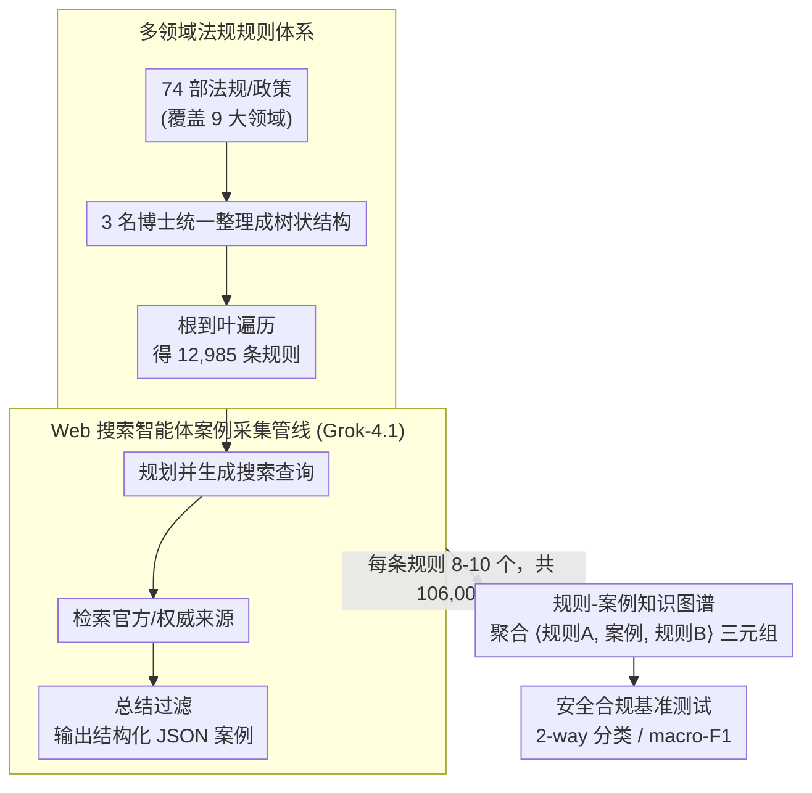

# OmniCompliance-100K: A Multi-Domain Rule-Grounded Real-World Safety Compliance Dataset

**会议**: ACL 2026  
**arXiv**: [2603.13933](https://arxiv.org/abs/2603.13933)  
**代码**: [GitHub](https://github.com/HKUST-KnowComp/OmniCompliance-100K)  
**领域**: 医学图像  
**关键词**: 安全合规, 真实案例数据集, 多领域法规, Web搜索智能体, LLM基准测试

## 一句话总结

本文构建了首个大规模、多领域、基于真实案例的 LLM 安全合规数据集 OmniCompliance-100K，包含 12,985 条人工整理的法规/政策规则和 106,009 条通过 Web 搜索智能体采集的真实合规案例，覆盖 AI 安全、数据隐私、金融、医疗等 9 个领域，并通过广泛的基准实验揭示了当前 LLM 在安全合规能力上的系统性短板。

## 研究背景与动机

**领域现状**：随着 LLM 在各行业的广泛部署，其安全风险日益突出——从生成有害内容、泄露隐私信息，到违反金融合规要求。现有 LLM 安全数据集（如 ToxicChat、WildGuard、HarmBench）主要基于研究者自定义的分类体系，由 LLM 合成生成。

**现有痛点**：(1) 现有安全数据集缺乏系统性法规依据，使用临时分类体系（ad-hoc taxonomy），无法提供严格的合规保护；(2) 即使有工作（Air-Bench、GuardSet-X）引入了法规/政策框架，案例仍由 LLM 合成，缺乏真实世界多样性；(3) 真实世界合规案例分散在各种网站上，格式各异（PDF、HTML、JSON），难以大规模收集和对齐。

**核心矛盾**：法律法规提供了全面的安全准则，且有大量真实执法案例可供参考，但现有数据集未能利用这些资源——导致 LLM 安全对齐局限于合成场景，在真实世界应用中泛化能力差。

**本文目标**：(1) 构建首个大规模、基于法规规则、包含真实案例的安全合规数据集；(2) 开发自动化的 Web 搜索智能体管线来大规模采集规则对齐的真实案例；(3) 全面基准测试当前 LLM 的安全合规能力。

**切入角度**：利用现代 Web 搜索智能体（基于 Grok-4.1）自动规划查询、检索结果、过滤噪声并总结案例，解决真实案例收集的三大挑战（来源分散、格式多样、信息噪声）。

**核心 idea**：安全问题应从合规（compliance）视角出发——以权威法规为依据、以真实案例为训练和评估素材，而非依赖研究者自定义的分类和 LLM 合成的场景。

## 方法详解

### 整体框架

数据集构建分两阶段：(1) 规则收集——3 名计算语言学博士花一个月时间从 74 部法规/政策中人工整理出树状结构的规则体系，遍历树得到 12,985 条规则；(2) 案例采集——开发基于 Grok-4.1 的 Web 搜索智能体管线，对每条规则自动搜索、过滤和总结 8-10 个真实案例。最后把案例反向连回它触发的规则，构建规则-案例知识图谱，分析规则间的关联性。

### 关键设计

**1. 多领域法规规则体系：把分散在 74 部法规里的条款统一成可遍历的树状规则库，给安全评估提供权威依据**

现有安全数据集大多用研究者临时拍脑袋的分类体系，缺乏法律效力；本文转而直接以真实法规为根基，覆盖 AI 安全法（EU AI Act、SB 53）、数据隐私法（GDPR、CCPA、HIPAA）、中国相关法规（个人信息保护法、数据安全法）、平台政策（X、Reddit、GitHub、Google、OpenAI、WeChat）、教育诚信、金融法规（反洗钱、跨境支付、加密货币）、医疗设备法规、网络安全（MITRE ATT&CK）与基本权利共 9 大领域。难点在于不同法规的层级格式各异，3 名计算语言学博士花一个月把它们统一整理成树状结构，再从根到叶遍历每条路径生成一个规则样本，最终得到 12,985 条可操作规则。多领域覆盖确保了评估不会偏向单一场景，树状结构则让每条规则都能独立成题。

**2. Web 搜索智能体案例采集管线：用 Grok-4.1 智能体自动搜集与规则对齐的真实案例，绕开传统爬虫无法适配多样网站的瓶颈**

手动采集 10 万条案例不现实，而真实合规案例分散在 PDF、HTML、JSON 等各种格式的网站上，固定规则的爬虫难以覆盖。本文让基于 Grok-4.1 的智能体对每条规则执行三步：先分析规则内容、规划并生成多个搜索查询；再调用搜索引擎工具检索结果并聚焦官方/权威来源；最后总结采集到的信息、过滤掉不相关案例，输出包含案例背景、合规结果、涉及方、适用法规和参考链接的结构化 JSON。每条规则采集 8-10 个案例，累计 106,009 条。智能体「规划-检索-总结」的灵活性天然化解了来源分散、格式多样、信息噪声三大难题。

**3. 规则-案例知识图谱：让案例反向连接它所触发的多条规则，揭示法规条款间的关联以支撑多跳合规推理**

法规条款往往不是孤立的——一次真实合规判断常需综合多个条款。本文利用每个搜索案例都会引用源规则这一点，构造 <规则A, 搜索案例, 规则B> 三元组，聚合后得到知识图谱。以 GDPR 为例，分析显示第 5-11 条（原则）、第 32 条（处理安全）、第 33 条（违规通知）和第 44 条（跨境传输原则）与几乎所有其他条款高度相关。这种结构把隐含在案例里的条款关联显式化，为后续需要多跳推理的合规任务打下了基础。

### 损失函数 / 训练策略

本文为数据集与基准测试工作，不训练模型。评估任务设为 2-way 分类（permitted/prohibited），指标为 macro-F1；数据集共含 40,385 个 permitted 样本与 65,624 个 prohibited 样本。

## 实验关键数据

### 主实验

**闭源模型基准测试（平均 Macro-F1 %）**

| 模型 | 平均分 | 平台政策 | 主要法规 | 教育偏见 |
|------|--------|---------|---------|---------|
| GLM-4.5 | 最高 | 89.61 | 93.65 | 83.91 |
| DeepSeek-V3.2 | 次高 | — | — | 85.75 |
| Grok-4.1 | 85.60 | — | — | — |

**开源模型对比**

| 模型 | 平均 Macro-F1 |
|------|-------------|
| Qwen2.5-14B-Instruct | 高 |
| Qwen2.5-7B-Instruct | 84.94 |
| Qwen2.5-3B-Instruct | **88.62** |
| Llama3.1-8B-Instruct | 76.02 |
| Llama3.2-3B-Instruct | 67.86 |
| Qwen2.5-1.5B-Instruct | 57.06 |
| WildGuard-7B | 38.41 |
| Llama-Guard-3-8B | 28.16 |

### 消融实验

**规则-案例对齐验证**

| 评估者 | 平均对齐分（归一化 %） |
|--------|---------------------|
| DeepSeek-V3.2 | 91.32 |
| GPT-4o-Mini | 92.51 |
| Gemini-2.5-Flash | 95.90 |
| 人类评估 | 91.77 |

### 关键发现

- **平台政策 vs 法规**：所有模型在平台政策上表现系统性低于正式法规（约 4% 差距），因为政策更动态、更依赖上下文
- **偏见与歧视**：教育领域的"偏见与歧视"类别是所有模型最差的类别，即使最强模型也仅约 84%——识别微妙的社会偏见仍是 LLM 的核心挑战
- **金融法规**：模型在金融法规上一致表现优异（95-97%），展现了 LLM 在金融合规自动化中的潜力
- **小模型也能竞争**：Qwen2.5-3B-Instruct (88.62%) 超过了 Grok-4.1 (85.60%)，但 1.5B 以下性能急剧下降——3B 是"合规能力"的经验下界
- **安全护栏模型严重失败**：WildGuard-7B (38.41%) 和 Llama-Guard-3-8B (28.16%) 在真实合规场景中表现极差，说明现有安全对齐过于狭窄
- **Qwen 系列 >> Llama 系列**：在相同参数量下，Qwen 在合规任务上一致优于 Llama（如 7B: 84.94% vs 76.02%）
- **EU AI Act 第二章（禁止 AI 实践）**：所有模型表现最差（<80%），涉及生物识别、欺骗性 AI 等高风险领域

## 亮点与洞察

- "安全问题应从合规视角出发"的定位非常有价值——以权威法规为标准比研究者自定义的分类更可靠、更有实践意义
- Web 搜索智能体作为数据收集工具的范式值得关注——它天然解决了传统爬虫面临的来源分散、格式多样、信息噪声问题
- 安全护栏模型（WildGuard, Llama-Guard）在真实合规场景中几乎失效的发现非常重要——说明现有安全对齐方法过拟合到狭窄的安全分类，迫切需要基于合规数据集的安全训练

## 局限与展望

- 人工评估仅覆盖 2,220 个样本（每个法规/政策 30 个），未覆盖全部数据
- 案例可能包含敏感信息（PII），需要在发布前过滤和匿名化
- Web 搜索可能引入时效性偏差——法规更新后旧案例可能不再适用
- 仅评估了分类任务，未测试模型在合规推理（需要多跳推理）上的能力

## 相关工作与启发

- **vs Air-Bench (Zeng et al., 2024)**: 后者基于法规创建分类体系然后 LLM 合成案例（5,694 条），本文直接从 Web 采集真实案例（106,009 条），规模和真实性上有质的飞跃
- **vs GuardSet-X (Kang et al., 2025)**: 后者规模更大（129,241 条合成案例），但全部 LLM 生成，缺乏真实世界多样性。本文用真实案例弥补了这一缺陷
- **vs PrivaCI-Bench (Li et al., 2025)**: 后者包含约 3,000 真实法庭案例但仅限隐私领域，本文跨 9 个领域且规则对齐更严格

## 评分

- 新颖性: ⭐⭐⭐⭐ 首个大规模真实案例安全合规数据集，Web 搜索智能体采集管线有创新性
- 实验充分度: ⭐⭐⭐⭐⭐ 18 个模型的全面基准、多维度分析、规则-案例对齐的 LLM+人工双重验证
- 写作质量: ⭐⭐⭐⭐ 数据集构建过程清晰，实验发现组织有条理
- 价值: ⭐⭐⭐⭐⭐ 填补了真实世界安全合规数据的空白，对安全对齐研究和实践有直接指导意义

<!-- RELATED:START -->

## 相关论文

- [\[AAAI 2026\] Privacy Auditing of Multi-Domain Graph Pre-Trained Model under Membership Inference Attack](../../AAAI2026/ai_safety/privacy_auditing_of_multi-domain_graph_pre-trained_model_under_membership_infere.md)
- [\[ICML 2026\] Scaling Unsupervised Multi-Source Federated Domain Adaptation through Group-Wise Discrepancy Minimization](../../ICML2026/ai_safety/scaling_unsupervised_multi-source_federated_domain_adaptation_through_group-wise.md)
- [\[ICML 2026\] VPD-100K: Towards Generalizable and Fine-grained Visual Privacy Protection](../../ICML2026/ai_safety/vpd-100k_towards_generalizable_and_fine-grained_visual_privacy_protection.md)
- [\[CVPR 2026\] FedDAP: Domain-Aware Prototype Learning for Federated Learning under Domain Shift](../../CVPR2026/ai_safety/feddap_domain-aware_prototype_learning_for_federated_learning_under_domain_shift.md)
- [\[ICML 2026\] Fair Dataset Distillation via Cross-Group Barycenter Alignment](../../ICML2026/ai_safety/fair_dataset_distillation_via_cross-group_barycenter_alignment.md)

<!-- RELATED:END -->
