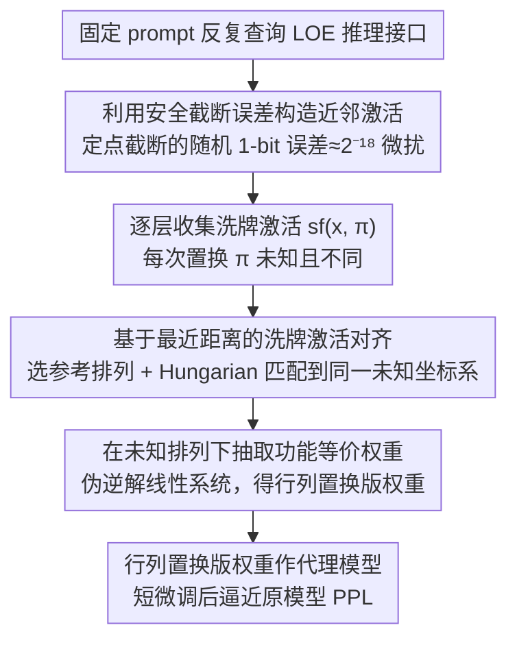

# On the (In-)Security of the Shuffling Defense in the Transformer Secure Inference

**会议**: ACL2026  
**arXiv**: [2605.04901](https://arxiv.org/abs/2605.04901)  
**代码**: 无公开代码  
**领域**: 模型安全 / 隐私计算  
**关键词**: 安全推理、线性层加密、洗牌防御、模型抽取、激活对齐

## 一句话总结
这篇论文指出 Transformer 安全推理中常用的“洗牌后公开中间激活”防御并不安全，并提出一种先把不同随机置换下的激活对齐、再解线性方程抽取权重的攻击，在 Pythia-70m 和 GPT-2 上能以约 1 美元查询成本恢复近似可用的模型权重。

## 研究背景与动机
**领域现状**：Transformer 安全推理的目标是让客户端只得到最终输出、服务端不看到用户输入，同时服务端的模型权重也不暴露给客户端。传统全模型加密推理会把线性层和非线性层都放在 MPC 或同态加密协议中计算，隐私目标最干净，但在 Transformer 里代价很高，尤其是 softmax、GELU、LayerNorm 这类非线性层。

**现有痛点**：大量已有系统发现，非线性层的安全计算往往需要多轮通信、截断、比较或多项式近似，通信时延可占总延迟的 75% 到 90%。为了把安全推理做得实用，一类线性层加密方案只加密线性层，把中间激活交给客户端明文计算非线性层，再重新秘密分享结果。这类 LOE 推理能带来数量级加速，却把线性层输入和输出的一部分信息交到了客户端手里。

**核心矛盾**：如果客户端能看到线性层前后的激活，那么权重满足近似线性关系 $X^{(l+1)} = X^{(l)}W^{(l)}$，收集足够多输入输出对后就可以解线性系统抽取权重。已有工作用随机洗牌来打乱激活位置，理由是长度为 $h$ 的向量有 $h!$ 种排列，攻击者几乎不可能猜中真实排列；但这个论证只排除了“直接猜排列”，没有排除“跨查询对齐不同洗牌结果”。

**本文目标**：作者要回答一个非常具体的问题：当客户端只能看到每次随机置换后的激活，且不知道任何真实排列时，是否仍能把这些激活恢复到一个共同的坐标系，并进一步恢复线性层权重。

**切入角度**：论文的关键观察是，攻击者不需要知道原始排列，只需要让多次查询得到的激活数值足够接近。洗牌会改变位置，但不会改变值；如果两条激活向量本身很近，那么同一维度上的元素仍会互相接近，跨向量的元素匹配就能被转化为一个最小距离匹配问题。

**核心 idea**：用安全截断协议中的随机 1-bit 误差制造“同一 prompt 下的微小激活扰动”，再用 Hungarian matching 对齐洗牌激活，最后在未知共同排列下解出与原权重等价的行列置换版权重。

## 方法详解
本文不是设计一个新的安全推理系统，而是从攻击者视角分析 LOE 推理接口能泄露什么。攻击者是半诚实客户端：它遵守协议、不篡改中间秘密分享，但可以自由选择输入 prompt，并观察协议本来会返回给客户端的洗牌激活和最终输出概率。

### 整体框架
攻击流程可以分成四步。

第一步，攻击者固定一个输入序列，重复向 LOE 推理接口查询。由于安全推理把浮点数编码为定点数，并在乘法后执行截断，常见协议会自然引入随机 1-bit 截断误差；即使 prompt 完全相同，多次执行也会在中间激活上产生很小扰动。

第二步，对每一层收集多次查询返回的洗牌激活。对于第 $l$ 个线性层，攻击者得到的不是 $x_i^{(l)}$，而是 $sf(x_i^{(l)}, \pi_i^{(l)})$，其中每次查询的排列 $\pi_i^{(l)}$ 都可能不同。

第三步，在每一层内部任选一个洗牌向量作为参考排列，把其它洗牌向量对齐到同一个未知排列上。这里不需要恢复真实排列，只需要保证所有样本内部坐标一致。

第四步，把对齐后的输入激活矩阵和输出激活矩阵带入线性系统，通过伪逆恢复权重。得到的权重与原权重相差行置换和列置换，但只要连续层之间的置换一致，前向传播功能仍然等价。

### 关键设计

**1. 基于最近距离的洗牌激活对齐：不去猜真实排列，而是用数值接近性把不同随机置换下的激活对齐到同一坐标系**

洗牌防御的安全论证建立在「攻击者必须从 $h!$ 种排列里猜中真实排列」之上，但本文的攻击根本不猜全局排列。关键观察是洗牌只改变元素位置、不改变数值：若原始向量 $x_a$ 和 $x_b$ 足够接近，那么洗牌后的 $x_a'$ 和 $x_b'$ 虽然坐标顺序被打乱，对应同一隐藏维度的元素数值距离仍然最小。作者把对齐写成 $\min_M \|x_a' - x_b'M\|_2$（$M$ 为置换矩阵），再转成标准指派问题，构造代价矩阵 $D[i,j]=(x_a'[i]-x_b'[j])^2$，用 Hungarian 算法求最小总代价匹配。只要扰动小到不打乱邻近关系，指数级的排列搜索空间就退化成一个多项式时间可解的二分匹配问题。

**2. 利用安全截断误差构造近邻激活：在 token 输入离散、无法直接加扰动的限制下，借协议自身的定点截断误差制造一批彼此很近的激活**

上一步要求拿到一批「几乎相同但有微小差异」的激活，但 Transformer 输入是离散 token，攻击者不能像连续输入那样直接加 $\epsilon$ 扰动。本文转而利用安全推理的实现细节：模型浮点值通常编码为 $x=\lfloor x_f\cdot 2^p\rceil$，乘法后为保精度要截断，而 ABY3、CrypTFlow2、SecretFlow-SPU 等协议会产生随机 1-bit 截断误差。以默认 18-bit 精度为例，这相当于约 $2^{-18}$ 量级的微扰；攻击者反复提交同一 prompt，就能收集到一批可对齐的近邻激活。这一步是攻击落地的关键——光说神经网络 Lipschitz 连续还不够，因为 GPT 输入离散；截断误差把协议实现细节变成了攻击所需的随机微扰源，且全程仍符合半诚实威胁模型。

**3. 在未知排列下抽取功能等价权重：解出的虽是行列置换版权重，但凭神经网络的排列对称性仍能保持前向功能一致**

对第 $l$ 层，原始关系为 $X^{(l+1)}=X^{(l)}W^{(l)}$，攻击者实际解到的是 $W'^{(l)} = \pi^{(l)^{-1}}W^{(l)}\pi^{(l+1)}$，即原权重经过输入维行置换和输出维列置换。由于 GELU、softmax、LayerNorm 等非线性在对应维度的置换下保持等价，只要连续层之间使用相互兼容的置换，整个前向传播仍能输出被同样坐标变换过的中间表示，最终功能一致。这直接回应了「抽到的不是原矩阵还有没有用」的质疑：神经网络权重本就存在排列对称性，行列置换版权重照样可作为代理模型、用于分析模型信息，或作为后续黑盒攻击的初始化。

### 损失函数 / 训练策略
本文没有训练新模型，也没有优化一个神经网络损失；核心计算是两个数值问题。

对齐阶段求解最小代价匹配，目标是最小化 $\sum_{i,j}M[i,j]D[i,j]$，约束是 $M$ 每行每列恰好一个 1。这个问题由 Hungarian algorithm 精确求解。

权重抽取阶段求解线性系统。理论上需要至少达到权重输入维度 rank 的样本数；实验中为了缓解病态矩阵，作者使用最大维度的 16 倍查询数。由于近邻激活矩阵的奇异值分布很差，计算伪逆时设置条件数阈值 $C$，丢弃小于 $\sigma_{max}/C$ 的奇异值；实验中多数场景用 $C=10^7$ 最稳定。

## 实验关键数据

### 主实验
实验在 Pythia-70m 和 GPT-2 上验证，覆盖 Transformer 中主要线性层类型，包括 attention 的 $W_{qkv}$、$W_o$ 以及 FFN 的 $W_{h1}$、$W_{h2}$。固定点精度测试 14、16、18 bit，其中 18 bit 对应 SecretFlow-SPU 等框架常用默认精度。

| 模型 | 最大维度 | 查询数 | 权重恢复误差 | 代理模型效果 |
|------|----------|--------|--------------|--------------|
| Pythia-70m | 2048 | 32768 | 多数层 L1 差异约 $10^{-4}$ 到 $10^{-2}$，小模型整体更低 | Wikitext PPL 从原模型 31.81、被盗模型 44.46，微调后到 32.43 |
| GPT-2 | 3072 | 49512 | 多数层 L1 差异约 $10^{-4}$ 到 $10^{-2}$，大维度层更难恢复 | Wikitext PPL 从原模型 21.11、被盗模型 47.92，微调后到 21.15 |

| 层维度 | FXP 精度 | 输入匹配数 / 维度 | 输入 MSE | 输出匹配数 / 维度 | 输出 MSE |
|--------|----------|-------------------|----------|-------------------|----------|
| 512 -> 2048 | 14 | 508 / 512 | 9.4E-07 | 1996 / 2048 | 1.2E-06 |
| 512 -> 2048 | 18 | 512 / 512 | 0.0E+00 | 2046 / 2048 | 4.0E-08 |
| 2048 -> 512 | 14 | 2004 / 2048 | 3.0E-06 | 504 / 512 | 5.9E-06 |
| 2048 -> 512 | 18 | 2046 / 2048 | 5.5E-08 | 511 / 512 | 1.5E-08 |
| 768 -> 3072 | 14 | 756 / 768 | 6.0E-07 | 3052 / 3072 | 1.2E-07 |
| 768 -> 3072 | 18 | 766 / 768 | 2.5E-08 | 3070 / 3072 | 3.7E-09 |
| 3072 -> 768 | 14 | 3056 / 3072 | 2.5E-07 | 762 / 768 | 5.8E-08 |
| 3072 -> 768 | 18 | 3070 / 3072 | 1.2E-08 | 764 / 768 | 5.0E-09 |

### 消融实验
论文的分析实验主要围绕固定点精度、条件数阈值和模型规模展开。

| 配置 | 关键指标 | 说明 |
|------|----------|------|
| FXP 18 bit | 对齐 MSE 可到 $10^{-9}$ 到 $10^{-8}$ 量级 | 精度更高时截断扰动更小，对应元素更容易被正确匹配 |
| FXP 14 bit | 对齐误差通常更大，但个别权重恢复反而更好 | 低精度带来更大扰动，损害匹配；但也增加输入矩阵多样性，缓解伪逆病态问题 |
| 条件数阈值 $C=10^7$ | 多数实验中权重 L1 差异最低 | 阈值太小会丢掉有用奇异值，阈值太大又放大数值噪声 |
| Pythia-70m vs GPT-2 | Pythia-70m 权重恢复更准 | 攻击难度随输入维度和模型规模增大；$W_{h2}$ 这类输入维度为 $4d_{model}$ 的层通常更难 |

### 关键发现
- 洗牌对“单次激活结构”确实有破坏作用，但挡不住跨查询对齐；只要攻击者能拿到一批近邻激活，元素对应关系就能由数值距离恢复。
- 对齐质量非常高。表 1 中多数配置的错配比例低于 2%，MSE 在 $10^{-9}$ 到 $10^{-6}$ 之间，说明后续线性系统不是建立在粗糙猜测上。
- 查询成本并不夸张。作者用最大维度 16 倍查询缓解病态问题，Pythia-70m 约 3.3 万次、GPT-2 约 5 万次；若按短回答 API token 计费，估算成本约 1 美元。
- 抽取权重不只是“数值接近”。被盗模型在 Wikitext 上未微调时 PPL 变差明显，但经过最多 6 分钟短微调后，Pythia-70m 和 GPT-2 都接近原模型困惑度，说明它可作为实用代理模型。
- 固定点精度存在双重作用：高精度利于对齐，低精度有时利于矩阵求逆稳定性。这提示防御不能简单靠调精度解决，协议层随机误差和数值条件都需要一起分析。

## 亮点与洞察
- 这篇论文最有价值的地方是把“排列空间很大”这个安全直觉拆开了。真实攻击并不需要恢复服务端使用的原排列，只需要把样本放到同一个未知坐标系中，防御论证的难点就从阶乘级搜索变成了多项式时间匹配。
- 利用安全截断误差非常巧妙。它不是协议外的恶意扰动，而是许多安全推理实现为了定点数计算自然引入的随机性，因此攻击在半诚实模型中仍然成立，威胁模型没有被偷偷放宽。
- 权重的“行列置换等价性”让攻击结果更严重。即使恢复的矩阵不是按原始神经元顺序排列，只要相邻层置换一致，模型功能就可以保持，这解释了为什么未知排列仍能导致有效模型抽取。
- 论文对隐私计算系统有一个很强的启发：只分析单次输出的熵或相关性是不够的。安全接口一旦支持重复查询，跨查询相关性、数值误差和协议随机性都会成为攻击面。
- 这套思路可迁移到其它“打乱后公开中间表示”的方案。例如视觉 Transformer、边缘推理或分布式隐私推理中，只要非线性层明文计算依赖置换不变性，就应检查近邻样本是否能重新对齐。

## 局限与展望
- 作者实验只验证了 Pythia-70m 和 GPT-2 这类相对小规模模型。论文承认随着模型尺寸增大，抽取权重的 fidelity 会下降；超大 LLM 上是否仍能以相似成本恢复足够强的代理模型，还需要更大规模实证。
- 攻击依赖客户端能观察到足够多层的洗牌激活，并能重复查询同一 prompt。若实际系统限制返回的中间信息、聚合非线性计算接口，或对重复查询做审计，攻击成本和可行性可能变化。
- 对齐依赖近邻激活的元素间隔足够可分。若防御引入额外噪声、批间混合、维度分组随机化或不可逆扰动，Hungarian matching 的错配率可能上升，但这些改动也会影响明文非线性计算精度和协议效率。
- 权重恢复阶段有明显数值病态问题。作者通过条件数阈值截断奇异值缓解，但这仍是经验性选择；未来可以研究高精度线性代数、迭代求解或正则化方法对恢复质量的影响。
- 防御方向上，单纯洗牌不应再被视为充分安全。更稳妥的路线可能是减少中间激活暴露、为非线性层设计更快的加密协议，或给 LOE 系统建立针对多查询攻击的形式化安全定义。

## 相关工作与启发
- **vs Full-model encryption secure inference**: FME 把全模型计算都留在加密域内，隐私目标更强，但非线性层代价极高。本文攻击的是为了效率而公开洗牌激活的 LOE 路线，说明性能优化牺牲的不是抽象风险，而是可被实际利用的权重泄露面。
- **vs GELU-net / Bayhenn 等早期明文非线性方案**: 早期方案通过限制查询或贝叶斯网络降低泄露风险，但后续工作已证明仍可抽取模型。本文的区别是攻击更现代的“洗牌防御”版本，表明只隐藏坐标顺序也不够。
- **vs PermLLM、PP-Stream、Centaur 等洗牌式 LOE 推理**: 这些工作利用非线性层对元素位置不敏感的性质，把激活随机置换后交给客户端。本文证明攻击者可以跨查询恢复一致坐标系，因此这些系统需要重新评估安全声明。
- **vs Carlini/Jagielski 系列模型抽取攻击**: 传统模型抽取多从黑盒 logits 或输出概率学习代理模型，本文额外利用 LOE 接口泄露的中间激活，把问题降为更直接的线性代数恢复。启发是安全推理接口本身可能比普通 API 暴露更强的攻击信号。
- **vs 隐私洗牌相关工作**: 一些隐私机制把 shuffling 当作降低关联性的手段。本文提醒我们，洗牌是否安全取决于攻击者能否获得近邻样本和重复观测；当数值本身保留时，匿名化坐标并不等于删除信息。

## 评分
- 新颖性: ⭐⭐⭐⭐⭐ 不是简单复现已有模型抽取，而是抓住洗牌防御的核心假设漏洞，把排列恢复转成近邻匹配与线性求解。
- 实验充分度: ⭐⭐⭐⭐ 覆盖两种 Transformer、三档固定点精度、对齐误差、权重误差和 PPL 代理效果，但缺少更大模型和真实部署系统验证。
- 写作质量: ⭐⭐⭐⭐ 论文结构清楚，威胁模型、算法和等价性证明衔接较好；不足是部分图中权重误差数字没有完整表格化，复现实验细节还可以更透明。
- 价值: ⭐⭐⭐⭐⭐ 对隐私保护 Transformer 推理很有警示意义，直接挑战了 LOE 系统中常见的 shuffling security claim，并给后续防御设计提出明确压力测试。

<!-- RELATED:START -->

## 相关论文

- [\[AAAI 2026\] SecMoE: Communication-Efficient Secure MoE Inference via Select-Then-Compute](../../AAAI2026/ai_safety/secmoe_communication-efficient_secure_moe_inference_via_select-then-compute.md)
- [\[ACL 2025\] CENTAUR: Bridging the Impossible Trinity of Privacy, Efficiency, and Performance in Privacy-Preserving Transformer Inference](../../ACL2025/ai_safety/centaur_bridging_the_impossible_trinity_of.md)
- [\[ICCV 2025\] Find a Scapegoat: Poisoning Membership Inference Attack and Defense to Federated Learning](../../ICCV2025/ai_safety/find_a_scapegoat_poisoning_membership_inference_attack_and_defense_to_federated_.md)
- [\[ACL 2025\] Crafting Privacy-Preserving Adversarial Examples: A Defense Against Membership Inference](../../ACL2025/ai_safety/crafting_privacy-preserving_adversarial_examples_a_defense_against_membership_inf.md)
- [\[CVPR 2026\] Enhancing the Security of Visual Speaker Authentication Based on Dynamic Lip-Print Analysis](../../CVPR2026/ai_safety/enhancing_the_security_of_visual_speaker_authentication_based_on_dynamic_lip-pri.md)

<!-- RELATED:END -->
