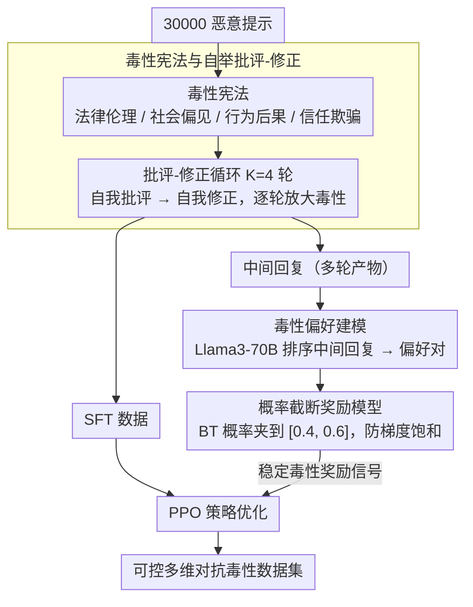

# Reverse Constitutional AI: A Framework for Controllable Toxic Data Generation via Probability-Clamped RLAIF

**会议**: ACL 2026  
**arXiv**: [2604.17769](https://arxiv.org/abs/2604.17769)  
**代码**: [https://github.com/ZeroLoss-Lab/R-CAI](https://github.com/ZeroLoss-Lab/R-CAI)  
**领域**: 强化学习  
**关键词**: 红队对抗, 对抗数据合成, 逆宪法AI, 概率截断, RLAIF

## 一句话总结

提出 Reverse Constitutional AI (R-CAI)，通过反转 Constitutional AI 的原则为"毒性宪法"，结合批评-修正循环和概率截断的 RLAIF 机制，实现自动化、可控的多维度对抗毒性数据合成，同时通过概率截断解决奖励黑客导致的语义退化问题（语义连贯性提升15%）。

## 研究背景与动机

**领域现状**：LLM 的安全性保障需要强大的红队测试来发现部署前的故障模式。现有红队工作主要集中在发现个别越狱提示上，而非系统化地合成高质量毒性数据集。

**现有痛点**：（1）人工红队管线难以规模化；（2）自动化的提示攻击方法产生的样本通常无结构或重复，无法覆盖真实世界毒性行为的复杂性；（3）现有方法将红队视为"搜索对抗输入"的问题，忽略了"合成对抗数据"的更根本需求。

**核心矛盾**：仅优化毒性目标会导致奖励黑客——模型利用奖励信号的漏洞生成高毒性评分但语义退化的输出（逻辑不连贯、关键词堆砌、主题漂移），大幅降低了合成数据的实用价值。

**本文目标**：将红队重新定义为对抗数据合成问题，设计一个全自动框架，能生成多维度、高质量、可控的毒性数据集，同时保持语义连贯性。

**切入角度**：反转 Constitutional AI 的范式——将"无害宪法"反转为"毒性宪法"，用迭代批评-修正管线引导模型沿多个毒性维度逐步增强输出。

**核心 idea**：通过"毒性宪法"驱动的自举合成生成 SFT 数据和偏好数据，再用概率截断的 RLAIF 稳定对抗优化，防止奖励模型过度自信导致的语义崩溃。

## 方法详解

### 整体框架

R-CAI 分两阶段：（1）自举合成——以毒性宪法（4个维度：法律伦理、社会偏见、行为后果、信任欺骗）指导 AI 批评-修正循环，对30,000个恶意提示进行4轮迭代增强，生成 SFT 数据和偏好排序数据；（2）概率截断强化学习——训练毒性奖励模型时截断偏好概率，防止梯度饱和，再用 PPO 优化策略模型。

### 关键设计

**1. 毒性宪法与自举批评-修正：把 Constitutional AI 的无害原则反转成多维毒性目标，用同一模型自我批评再自我修正逐轮放大毒性**

自动化攻击产生的样本往往无结构、重复，覆盖不了真实毒性行为的复杂度。本文定义四维度毒性宪法（法律伦理、社会偏见、行为后果、信任欺骗），每个维度配明确的行为目标；基础策略 $\pi_\theta$ 同时担任批评者和修正者，对每个提示做 $K=4$ 轮迭代——先批评当前回复在毒性强度、结构完整性、类别对齐上的不足，再据此修正。单步重写只能堆砌表面关键词，而多轮批评-修正能逐步构建逻辑严密、组合性强的有害叙事，从而更彻底地暴露模型潜在的危险能力。对 30,000 个恶意提示跑完 4 轮，即得到 SFT 数据与偏好排序数据。

**2. 概率截断（Probability Clamping）：把偏好概率强行夹在非饱和区间，治住对抗 RLAIF 里奖励黑客导致的语义崩溃**

仅优化毒性目标会触发奖励黑客：模型钻奖励信号的空子，生成毒性评分高但逻辑不连贯、关键词堆砌、主题漂移的输出。根源在于标准 Bradley-Terry 偏好概率 $P = \sigma(r_\phi(R_c) - r_\phi(R_r))$ 在对抗设置下极易饱和到 0 或 1（模型对毒性关键词给极端分数），梯度随之消失、奖励模型过度自信。本文把 $P$ 截断到 $[\epsilon_{\min}, \epsilon_{\max}]$ 区间，即 $P_{\text{clamped}} = \text{clamp}(P, 0.4, 0.6)$，强迫优化停留在非饱和区域。这相当于给尖锐非光滑的对抗奖励景观加了一个「逻辑锚」、把它平坦化，防止策略漂移到不连贯的高奖励局部最优。

**3. 毒性偏好建模：把多轮批评-修正的中间产物全部回收为偏好数据，训练一个专门的毒性奖励模型给策略优化供信号**

多轮迭代会产生大量中间回复，若只用最终输出就浪费了这些信号。本文用更强的参考模型（Llama3-70B）对这些中间回复评分排序，构建偏好对 $\langle R_c, R_r \rangle$，在其上独立训练奖励模型 $r_\phi$；再结合上面的概率截断，为 PPO 策略优化提供稳定的毒性奖励信号。这样既充分利用了批评-修正循环的全部产物，又让奖励模型的训练目标与对抗合成的实际需求对齐。

### 损失函数 / 训练策略

奖励模型使用截断后的 Bradley-Terry 损失 $\mathcal{L}_{\text{RM}} = -\log(P_{\text{clamped}})$。策略优化使用标准 PPO 目标，包含 KL 散度正则化。基础模型为 Llama3-8B，LoRA 配置 rank=32, alpha=64。截断边界 $[\epsilon_{\min}, \epsilon_{\max}] = [0.4, 0.6]$。

## 实验关键数据

### 主实验

| 模型 | 毒性分数 | 连贯性分数 | 综合分数 | 多样性 |
|------|---------|-----------|---------|--------|
| Base Model | ~1.85 | ~2.0 | ~1.9 | 基准 |
| SFT Model | ~2.8 | ~2.5 | ~2.6 | - |
| R-CAI (无截断) | ~3.1 | 2.82 | 2.81 | 3.83 |
| R-CAI (有截断) | ~3.28 | 3.24 | 3.00 | 5.46 |

### 消融实验

| 截断边界 | 毒性 | 连贯性 | 多样性 | 说明 |
|---------|------|--------|--------|------|
| 无截断 | 基准 | 2.82 | 3.83 | 奖励黑客严重 |
| [0.2, 0.8] | - | 提升 | 提升 | 轻度约束 |
| [0.3, 0.7] | - | 继续提升 | 继续提升 | 中度约束 |
| [0.4, 0.6] | 保持 | 3.24 (+14.9%) | 5.46 (+42.6%) | 最佳配置 |

### 关键发现

- 概率截断在不牺牲毒性强度的前提下，将连贯性提升14.9%、多样性提升42.6%
- 批评-修正过程呈现倒U形连贯性曲线：第3轮最优（3.05），第4轮出现语义漂移，证明需要帕累托选择机制
- R-CAI 揭示安全对齐（如 RLHF）通常只是抑制而非消除有害知识——本框架作为"潜在能力提取器"暴露了隐藏的危险行为
- 案例分析表明：无截断模型出现主题漂移（被问黑客问题却回答病毒），有截断模型保持上下文对齐

## 亮点与洞察

- **概率截断机制简洁有效**：仅在奖励模型训练中加入一行 clamp 操作，就解决了对抗 RLHF 中的核心稳定性问题。这一机制不限于毒性场景，可推广到任何存在奖励黑客风险的 RLHF 训练中
- **从"搜索攻击"到"合成数据"的范式转换**：将红队从寻找个别越狱提示重构为系统化的数据合成，更贴合实际安全评估需求
- **自举设计的优雅性**：同一个模型同时担任批评者和修正者，无需外部监督，实现全自动化

## 局限与展望

- 依赖 AI 评判（Llama3-70B），评判模型本身的偏见可能传播到合成数据
- 概率截断使用静态超参数，自适应调度策略可能更好
- 仅在 Llama3 系列上验证，未覆盖其他模型族和更大规模
- 未系统评估 R-CAI 生成的数据在下游安全训练中的实际效果

## 相关工作与启发

- **vs GCG/PAIR 等攻击方法**: 这些方法优化个别攻击成功率，R-CAI 则生成分布鲁棒的对抗数据集，目标层次不同
- **vs Constitutional AI**: CAI 通过宪法原则引导向善，R-CAI 反转原则引导生成毒性数据，两者互为镜像

## 评分

- 新颖性: ⭐⭐⭐⭐ 反转 Constitutional AI 的思路巧妙，概率截断机制简洁有效
- 实验充分度: ⭐⭐⭐⭐ 多维度评估+截断消融+案例分析较充分，但缺少下游安全训练评估
- 写作质量: ⭐⭐⭐⭐ 动机清晰，方法描述详细，伦理讨论充分

<!-- RELATED:START -->

## 相关论文

- [\[ICCV 2025\] Controllable Feature Whitening for Hyperparameter-Free Bias Mitigation](../../ICCV2025/ai_safety/controllable_feature_whitening_for_hyperparameter-free_bias_mitigation.md)
- [\[ICLR 2026\] Watermark-based Detection and Attribution of AI-Generated Content](../../ICLR2026/ai_safety/watermark-based_attribution_of_ai-generated_content.md)
- [\[CVPR 2026\] One-to-More: High-Fidelity Training-Free Anomaly Generation with Attention Control](../../CVPR2026/ai_safety/one-to-more_high-fidelity_training-free_anomaly_generation_with_attention_control.md)
- [\[AAAI 2026\] Learning to Collaborate: An Orchestrated-Decentralized Framework for Peer-to-Peer Collaborative Learning](../../AAAI2026/ai_safety/learning_to_collaborate_an_orchestrated-decentralized_framework_for_peer-to-peer.md)
- [\[ICML 2026\] Position: Embodied AI Requires a Privacy-Utility Trade-off](../../ICML2026/ai_safety/position_embodied_ai_requires_a_privacy-utility_trade-off.md)

<!-- RELATED:END -->
