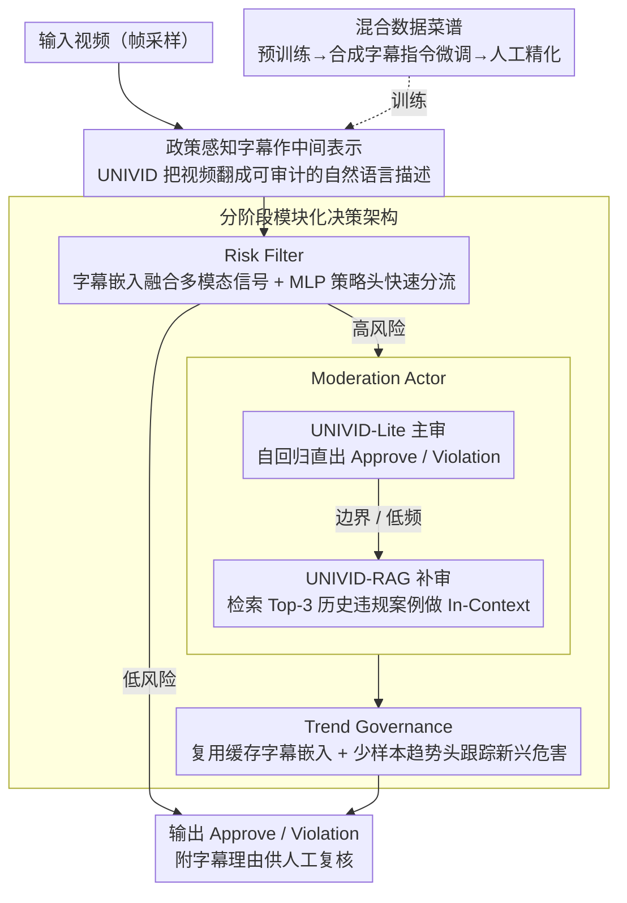

# UniVid: 统一视频审核的视觉语言模型

**会议**: ACL 2026  
**arXiv**: [2606.05748](https://arxiv.org/abs/2606.05748)  
**代码**: 暂无（作者出于安全考虑不开源）  
**领域**: AI 安全 / 内容审核  
**关键词**: 视频审核、视觉语言模型、政策对齐、内容理解、模型压缩

## 一句话总结

UniVid 通过用统一的策略感知字幕 VLM 替代 1000+ 个黑盒分类器，将视频审核系统从不可维护的"碎片化"架构演进为可解释、可复用的"端到端"审核系统，在 ByteDance 平台生产部署中相比传统方案违规泄漏率下降 42.7%。

## 研究背景与动机

**领域现状**：全球短视频平台的内容审核系统通常采用大规模的专用分类器族群，每个分类器针对一项具体政策（如暴力、色情、骚扰等）独立训练和维护。

**现有痛点**：这种"分散式"方案面临三大困境。首先，数千个黑盒分类器生成的决策得分难以向人类审计员解释，缺乏透明度；其次，每当平台政策更新或优化，都要重新训练和部署这些分类器，维护成本极高；最后，这些模型各自为政，无法共享语义理解能力，与广告、推荐等其他业务线协同困难。

**核心矛盾**：传统分类器方案追求"高准确率"和"易维护性"之间存在根本张力——增加分类器个数会提升某些细粒度政策的检测精度，但同时让系统变得更复杂难维。

**本文目标**：设计一个统一的视觉语言模型（VLM），不仅能准确理解视频内容，还要生成**可验证的自然语言理由**，使人类能直观看懂审核决策的依据。

**切入角度**：作者观察到现代 VLM（如 LLaVA）虽然具备强大的多模态理解能力，但开源模型通常因为安全对齐而"过度拒绝"描述违规内容，而商业 VLM（GPT-4o、Gemini）虽然能力强但部署成本极高（单百万视频成本 $3,000+）。如果能用精心设计的"数据菜谱"对 VLM 进行微调，在内部安全政策约束下让它安全地描述违规内容，就可能一举多得。

**核心 idea**：用一个专用微调的 VLM 生成策略对齐的视频字幕，作为所有下游决策的统一中间表示。字幕既是人类可读的证据，也是可复用的语义特征。

## 方法详解

### 整体框架

UniVid 想解决的是"1000+ 个黑盒分类器各自为政、无法解释、维护成本爆炸"的工业级审核困境，办法是把所有政策的判断统一收敛到一个微调过的视觉语言模型上：模型先把视频翻译成一段策略感知的自然语言字幕，这段字幕既是人能读懂的证据，又是可复用的语义特征。视频进入系统后会流过三级级联管道——上游 Risk Filter 用 UNIVID 的字幕嵌入融合多模态信号、靠 MLP 策略头快速分流，中游 Moderation Actor 对高风险视频用 UNIVID-Lite 主审、UNIVID-RAG 补审做精细决策，下游 Trend Governance 复用缓存字幕嵌入、用少样本快速跟住新兴危害趋势，最终输出 Approve/Violation 决策和可审计的字幕理由。

### 关键设计

**1. 混合数据菜谱：真实违规视频既稀缺又法律敏感，难以直接收集足量、覆盖全政策的训练样本**

论文用三阶段训练把数据成本压下来：第一阶段拿 LLaVA 公开数据预训练、对齐视觉-文本模态；第二阶段在 GPT-4o 生成的字幕和合成 VQA 对（3.2M 样本）上做指令微调；第三阶段再用人工精化的高质量字幕（0.1M 样本）继续微调以强化策略对齐。关键不在量而在那 0.1M 的人工环节，它只做两件事——事实纠正（删幻觉、补全主体动作细节和 OCR）和策略接地（把违规内容映射到内部政策库的具体条款）。之所以要混合而不是单选，是因为纯 GPT-4o 字幕幻觉多、政策覆盖窄，纯人工又贵且泛化差；混合方案让人工只"修"不"标"，既省成本又保住政策一致性。消融也印证了这一点：去掉合成数据违规召回率掉 16.8%，仅用人工数据更是跌到 26.1%。

**2. 政策感知字幕作中间表示：传统分类分数是黑盒，审计员无法验证"暴力=0.87"凭什么成立**

UNIVID 不输出数值预测，而是生成"三名男子骑一辆红色摩托车"这类描述性文本作为所有下游决策的统一中间层。这段字幕既是客观事实陈述，又隐含了到政策的映射——人看一眼就能判断是否违规，于是整个系统从"黑盒神经网络"变成了"人在回路"的可审计流程，而同一段字幕还能被广告安全、推荐系统等其他业务线直接复用。相比黑盒分类器，这种自然语言中间表示既保留了原始证据、又把最终决策权交还给人，正好满足当代内容治理对透明度和可问责性的要求。

**3. 分阶段模块化决策架构：单一模型不可能同时做到高召回、高精度、低延迟，多目标天然打架**

论文干脆按阶段拆开各自优化。UNIVID-Lite 是主审演员，在 1M 标注视频上微调，以自回归生成形式直接吐出 Approve/Violation；UNIVID-RAG 是补审演员，从 100K 历史违规案例知识库里检索 Top-3 最相似案例当 In-Context 示例，专门兜住低频和边界违规、把召回率拉起来；Trend Governance 则做得极轻——只训练一个 MLP 趋势头、复用 UNIVID 的缓存字幕嵌入，靠少样本就能快速适应涌现威胁。这样 Risk Filter 可以放宽阈值冲召回、Moderation Actor 严格决策保精度、Trend Governance 主攻适应速度，每个模块只对自己那一项指标负责，避免了一个模型被三个互斥目标撕扯。

### 一个完整示例

以一条"擦边"短视频为例：它先进 Risk Filter，UNIVID 生成字幕"两人在房间内争执并推搡"，字幕嵌入喂给暴力策略头得到偏高风险分，于是被放行到 Moderation Actor。UNIVID-Lite 读完整段字幕判为边界情况、信心不足；UNIVID-RAG 随即从违规知识库检索出 3 个相似的"肢体冲突"历史案例作 In-Context 提示，最终给出 Violation 决策并附上字幕作为人工复核证据。若近期平台涌现某种新型擦边玩法，Trend Governance 只需用少量新样本微调趋势头、复用已缓存的字幕嵌入，就能在不重训主模型的情况下把这类视频纳入风控。

### 损失函数 / 训练策略

UNIVID 采用标准的自回归因果语言建模目标。给定视频帧 $V$ 和目标字幕 $C$ 长度为 $L$，最大化联合概率 $P(C | T_{\text{in}}, V_{\text{in}}) = \prod_{i=1}^{L} P(C_i | H_t, H_v, C_{<i})$。预训练阶段仅训练投影层 MLP，冻结视觉编码器和 LLM；微调阶段同时训练投影层和 LLM 解码器。整个训练耗时 120 小时，使用 32 块 H100 GPU。模型选择 Mistral-v0.3-7B 作 LLM 骨干。

## 实验关键数据

### 主实验对比

| 模型 | 暴力 | 性虐 | 心理健康 | 受管活动 | 违规召回率 | 召回率 | 精度率 | F1 |
|------|------|------|---------|----------|-----------|--------|--------|-----|
| GPT-4o | 45.9 | 17.4 | 32.3 | 42.5 | 36.1 | 32.8 | 65.5 | 37.4 |
| Gemini-2.5-Pro | 63.8 | 44.3 | 55.6 | 57.6 | 55.1 | 42.5 | 95.2 | 57.9 |
| LLaVA-OV 8B | 17.8 | 6.9 | 12.9 | 15.7 | 13.0 | 12.0 | 86.3 | 19.3 |
| **UNIVID-7B** | **56.3** | **51.3** | **50.2** | **57.7** | **54.3** | **28.9** | **82.3** | **39.1** |
| UNIVID-1B | 53.6 | 49.1 | 49.9 | 55.3 | 52.1 | 27.4 | 82.8 | 37.5 |

UNIVID-7B 在违规召回率上全面超过开源基线 LLaVA-OV（54.3% vs 13.0%），在性虐和心理健康等敏感领域的表现尤其突出。

### 消融实验

| 配置 | 暴力 | 性虐 | 心理健康 | 受管活动 | 违规召回率 |
|------|------|------|---------|----------|-----------|
| UNIVID-7B（完整模型） | 56.3 | 51.3 | 50.2 | 57.7 | 54.3 |
| 去掉混合数据 | 37.9 | 35.5 | 33.5 | 41.1 | 37.5 |
| 仅用人工数据 | 29.1 | 22.9 | 18.9 | 29.4 | 26.1 |

混合数据菜谱至关重要——去掉合成数据会导致违规召回率下降 16.8%，而仅用人工数据的泛化能力最差（召回率跌至 26.1%）。

### 生产环境实验

| 指标 | 改进前 | 改进后 | 相对改进 |
|------|--------|--------|----------|
| 违规泄漏率 | 0.255% | 0.146% | -42.7% ↓ |
| 过度删除率 | 35.4% | 22.3% | -37.0% ↓ |
| 部署成本（单百万视频） | - | $180 | 商业 VLM 的 1/15 |
| 替代的专用分类器 | 1000+ | 1 | 维护复杂度大幅下降 |
| 回收的 GPU 资源 | - | 1900 张 A30 | 计算效率提升 |

## 亮点与洞察

- **用字幕当中间表示的妙处**：这个设计是论文最聪明的地方。不是让 VLM 直接输出"违规/不违规"，而是生成自然语言描述。这使得整个系统从"黑盒神经网络"变成了"可审计的人机协作流程"——人类可以读到字幕后根据政策判断，或反馈标注员发现模型的盲点。
- **混合数据菜谱的克制设计**：作者没有贪心地收集海量真实违规视频，而是聪明地混合 GPT-4o 合成数据+人工精化。人工标注不是从零标注，而是修正 GPT 的幻觉、对齐内部政策。
- **分阶段决策消除了"多指标冲突"**：Risk Filter 放宽阈值以最大化召回率，Moderation Actor 严格决策以最大化精度，Trend Governance 快速适应以应对涌现威胁。

## 局限与展望

**作者承认的局限**：

- 系统目前没有集成强化学习方法（如 GRPO）。生成的策略感知字幕虽然可充当推理轨迹，但内部政策指南并未直接编码为奖励信号与生成过程显式绑定。
- 系统采用帧采样而非完整时间建模，意味着仅出现在单一帧的违规内容如果未被采样选中，就有可能漏检。

**自有观察的局限**：

- 评估集虽然相比之前的基准（如 KuaiMod）更全球化，但仍主要源于短视频平台生态。
- 模型在多语言违规描述上的一致性尚需验证。

**改进思路**：将策略指南显式编码为 LLM 的系统提示或微调目标；探索更高效的时间采样策略；在多个地区、多个平台的真实流量上做分布外测试。

## 相关工作与启发

- **vs 传统视频审核系统**（如 Shi et al. 2024 的端到端分类器族群）：他们用数千个独立分类器，每个对应一个政策；本文用单一 VLM 生成字幕后再做决策。区别在于，传统方案是"每个政策一个模型"，维护成本随政策增多而线性增长。
- **vs 开源 VLM（LLaVA-OV、LLaVA-Next）**：他们追求通用性，本文针对违规内容进行微调。LLaVA 的优势是社区支持和通用能力，本文的优势是在违规检测上的专向优化——违规召回率从 13% 提升到 54%。
- **vs 商业 VLM（GPT-4o、Gemini-2.5-Pro）**：他们拥有最强的多模态理解，但部署成本极高且存在安全护栏导致的"拒绝生成"问题；本文成本更低（1/15）且不会因为安全对齐而拒绝描述违规内容。
- **启发**：本文的混合数据策略与人工标注框架，对其他受限数据场景（如医学影像中的罕见病、自动驾驶中的边界场景）有借鉴价值。

## 评分

- 新颖性: ⭐⭐⭐⭐ 用 VLM 替代专用分类器这个想法并非全新，但将其系统化落地到工业规模的审核系统中，还涵盖数据菜谱、多阶段决策、模型变体等完整工程设计，具有明显的工程创新。
- 实验充分度: ⭐⭐⭐⭐⭐ 不仅有离线对标，还有沙盒模拟和消融实验，数据集 CapBench 相对之前基准也更完善。
- 写作质量: ⭐⭐⭐⭐ 结构清晰，伦理与合规部分也比较完善。
- 价值: ⭐⭐⭐⭐⭐ 这是第一个报道在工业规模短视频平台上成功部署的专用 VLM 审核系统，相比基准系统有显著的泄漏率、过度删除率和成本改进。

<!-- RELATED:START -->

## 相关论文

- [\[ACL 2026\] On the (In-)Security of the Shuffling Defense in the Transformer Secure Inference](on_the_in-security_of_the_shuffling_defense_in_the_transformer_secure_inference.md)
- [\[ACL 2026\] Reverse Constitutional AI: A Framework for Controllable Toxic Data Generation via Probability-Clamped RLAIF](reverse_constitutional_ai_a_framework_for_controllable_toxic_data_generation_via.md)
- [\[ACL 2026\] OmniCompliance-100K: A Multi-Domain Rule-Grounded Real-World Safety Compliance Dataset](omnicompliance-100k_a_multi-domain_rule-grounded_real-world_safety_compliance_da.md)
- [\[CVPR 2026\] COPYLENS: Towards Copyrighted Characters Infringement Detection via Copyright-Aware Prompt Learning](../../CVPR2026/ai_safety/copylens_towards_copyrighted_characters_infringement_detection_via_copyright-awa.md)
- [\[CVPR 2026\] TTP: Test-Time Padding for Adversarial Detection and Robust Adaptation on Vision-Language Models](../../CVPR2026/ai_safety/ttp_test-time_padding_for_adversarial_detection_and_robust_adaptation_on_vision-.md)

<!-- RELATED:END -->
