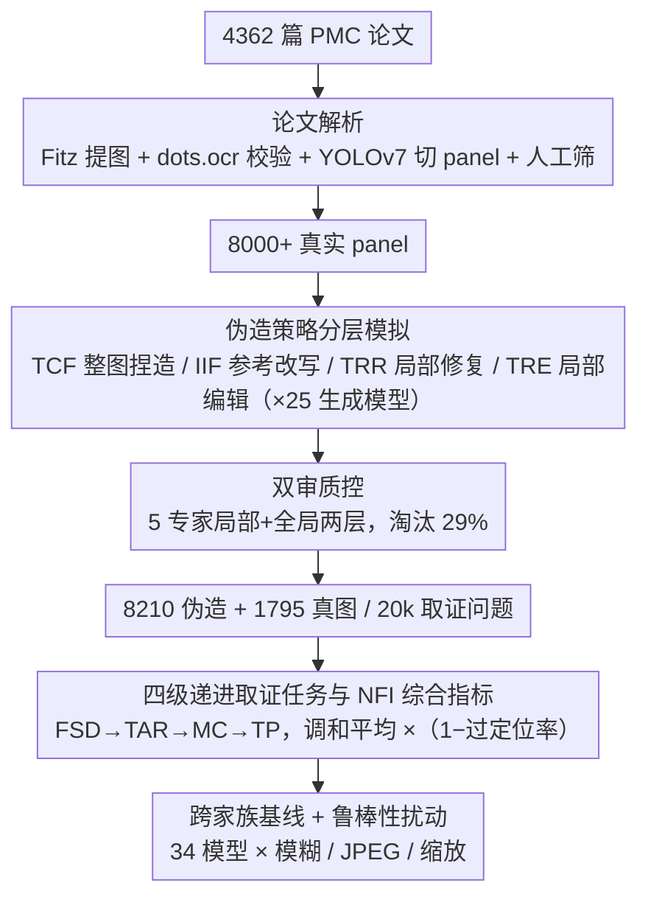

# AEGIS: A Holistic Benchmark for Evaluating Forensic Analysis of AI-Generated Academic Images

**会议**: ACL 2026  
**arXiv**: [2604.28177](https://arxiv.org/abs/2604.28177)  
**代码**: https://github.com/BUPT-Reasoning-Lab/AEGIS (有)  
**领域**: 图像生成 / AIGC 检测 / 学术诚信  
**关键词**: AI-generated image forensics, academic image, benchmark, MLLM, manipulation localization

## 一句话总结
AEGIS 是首个面向学术图像伪造取证的综合基准，覆盖 7 大学术图类与 39 子类、4 种伪造策略（整图捏造、参考图改写、局部修复、局部编辑）和 25 个生成模型，提出取证范围判别、文字伪影识别、操作类型分类、篡改像素定位四项任务，对 25 个 MLLM 与 9 个专家模型联评后发现：即使 GPT-5.1 综合分仅 48.80%，专家模型像素 IoU 仅 30.09%，凸显「生成进化快于取证」与「MLLM 推理 vs 专家模型敏感度」的结构性互补。

## 研究背景与动机

**领域现状**：AI 生成图像在学术论文中的滥用已经成为出版伦理的新风险（Retraction Watch、PubPeer 上已有撤稿与公开质询案例）。现有取证手段分三类：基于频域/扩散过程/patch 级别的视觉专家模型（DRCT、DIRE、AIDE 等），把 MLLM 当通用判别器使用，以及二者混合的方案（FakeShield、SIDA、FakeVLM）。

**现有痛点**：现有基准（GenImage、Semi-Truths、AIGIBench、DFBench、AIGuard 等）几乎都是面向 face/scene/electronic-commerce 等通用场景，对学术图像的「细粒度结构、密集纹理、知识密集语义」适配差，且大多只评判「真/假」二分类，忽略**伪造范围、文字异常、篡改类型、像素定位**这些真实学术 review 需要的能力。

**核心矛盾**：学术图像的取证不是单一二分类，而是「全局→局部→像素」的链式判断，且**专家模型擅长低层视觉指纹但缺语义推理，MLLM 擅长语义推理但低层敏感度差**——没有一个基准能同时暴露两类模型的真实短板。

**本文目标**：构建一个学术专属的全方位取证 benchmark，能（1）系统覆盖 7 大学术图类/39 子类的多样性；（2）模拟 25 个 SOTA 生成器下的 4 类典型伪造策略；（3）用 4 个递进任务从整体真伪到像素级定位拉开模型能力差距。

**切入角度**：从 4000+ 篇 PubMed Central 开源论文里抽 8000 条已校验的「panel」（图最小不可分单元），按学术造假场景定义 4 种伪造策略，让 25 个生成模型生成对应伪造图，再叠加专家双审、自动质量评估、量化取证指标。

**核心 idea**：把学术图像取证视为「分级评估 + 跨模态正交评估」，并发明 Normalized Forensic Index 把多任务一致性纳入打分。

## 方法详解

### 整体框架
AEGIS 的构建分 3 阶段、评估分 4 维度：（1）**论文解析**：用 Fitz 提取 4362 篇 PMC 论文图片与 caption，用 dots.ocr 校验 caption-图对应，YOLOv7 把 figure 切成最小 panel，专家人工筛除非学术/低分辨率内容，得 8000+ 标注 panel；（2）**伪造模拟**：按文本约束捏造 (TCF)、参考图推断 (IIF)、局部修复 (TRR)、局部编辑 (TRE) 四种策略，覆盖 Flux/Midjourney/DALL·E/GPT-Image-1/Janus-Pro 等 25 个生成模型；（3）**双审质控**：5 位专家局部 + 全局两层审查，淘汰 29% 伪造图，最终保留 8210 张高质量伪造样本+1795 张真图，共 20k 取证问题。评估侧设计 4 个递进任务：FSD（伪造范围判别，Real/Entire/Partial 三分类，可选 Not Sure）、TAR（文字伪影二分类）、MC（红框区域插入/删除/编辑分类）、TP（区域级 bbox 或像素级 mask 的定位）。

### 关键设计

**1. 学术专属的伪造策略分层模拟：真实 retraction 案例只有 2-3 例可用、缺乏结构化标注与编辑溯源，根本撑不起系统评估**

AEGIS 用合成替代真实，但关键是让伪造类型贴近真实造假行为、并能精确控制粒度，于是设计了 4 种沿「全局→局部」「文本驱动→参考图驱动」铺开的策略：TCF 让 GPT-4o mini 把真实 caption 重写为语义等价 prompt 再喂文生图模型从零捏图（3121 张整图伪造），IIF 用真图当 reference 让生成模型重画一张视觉一致的（2274 张），TRR 用 SAM 自动产生 mask 后让 inpainting 模型重画局部（1650 张），TRE 则通过 mask 或文本指令对原图做插入/删除/改写（1165 张）。这套组合的好处在于 SAM 自动 mask 直接给出像素级 ground truth，再叠上 25 个生成模型联合覆盖，既保住了真实造假的多样性，又拿到了真实撤稿案例做不到的样本规模与可控标注。

**2. 四级递进取证任务与 NFI 综合指标：单一精度无法暴露模型的结构性偏差——某模型可能 TAR 极强却 TP 极弱**

论文把取证能力从粗到细拆成 4 个互补任务：FSD 用 Real/Entire/Partial 三分类外加 Not Sure 选项抗强行猜测，TAR 专攻文本区域的语义/字形一致性，MC 给模型一个红框、逼它结合 caption 推断该区域是「插入/删除/修改」从而联合结构与上下文推理，TP 则用自适应粒度协议（MLLM 给 bbox 配 CLA/OLR、专家给 mask 配 IoU/F1）。为了度量"平衡能力"而非单点峰值，综合指标定义为 $\mathrm{NFI}_i=100\cdot \mathrm{HM}_i\cdot(1-\mathrm{OLR}_i)^\gamma$，其中 $\mathrm{HM}$ 是四任务分数的调和平均、$\gamma=0.5$ 惩罚过度定位。调和平均迫使模型四项都高才能拿到高 NFI，$(1-\mathrm{OLR})^\gamma$ 这一项则断了 MLLM「框 100 个」刷高 CLA recall 的捷径。

**3. 跨家族大规模基线 + 鲁棒性扰动：要同时暴露生成-取证差距、并测量主流取证范式在常见后处理下到底有多脆**

评测覆盖 14 个闭源 MLLM（GPT-4.1/5.1/o4-mini、Gemini 2.5/3、Claude Sonnet 4.5、Doubao、Qwen-VL）、11 个开源 MLLM（LLaVA-NeXT、Gemma 3 27B、Qwen2.5-VL-72B、Llama 4 Maverick）、1 个统一多模态模型（Janus-Pro-7B）和 9 个专家模型，再对输入叠加高斯模糊（r=5）、JPEG 压缩（q=50）、双线性 0.5× 缩放三类后处理扰动。正是这种跨家族、跨规模的对照外加扰动测试，才把「专家模型像素敏锐但鲁棒性差、MLLM 推理强但低层敏感度弱」的互补结构清晰地暴露出来，进而支撑了"未来 Expert AGI 应让专家做 sensor、MLLM 做 cognitive agent"的论断。

### 损失函数 / 训练策略
AEGIS 是评测基准而非训练框架，无损失函数；评测全部 PNG 高分辨率以避免 JPEG 压缩干扰，prompt 仅含任务定义。OpenRouter API 调闭源模型，LLaVA/Doubao 本地或火山引擎调用，单 8×A40 (48GB) 节点。

## 实验关键数据

### 主实验
34 个模型在 AEGIS 上的核心结果（节选）：

| 模型 | FSD ACC | TAR ACC | MC ACC | TP CLA | NFI |
|------|---------|---------|--------|--------|-----|
| Human | 44.20 | 76.14 | 68.01 | – | – |
| GPT-5.1 | 50.99 | 76.43 | 60.07 | 46.87 | **48.80** |
| Gemini 3 Pro | 64.37 | 84.74 | 48.54 | 39.14 | 45.79 |
| GPT-4.1 | 66.34 | 83.57 | 44.55 | 25.93 | 43.31 |
| Claude Sonnet 4.5 | 25.36 | 58.76 | 44.80 | 27.41 | 26.83 |
| Qwen3-VL-Plus | 38.77 | 79.25 | 59.28 | 5.76 | 16.53 |
| AIDE (专家) | 79.54 | – | – | – | – |
| DRCT (专家) | 55.05 | – | – | – | – |
| FakeShield (专家+MLLM) | 59.72 | – | – | IoU 30.09 | – |

关键观察：MLLM 在 TAR 上能到 84.74%（Gemini 3），但 TP 像素 IoU 上最强专家也只有 30.09%；专家模型 FSD 二分类 ACC 高达 79.54%（AIDE）却几乎没有任何语义推理能力。

### 消融实验
Few-Shot / CoT prompt 在不同任务上的影响（vs Default）：

| Prompt 策略 | FSD | TAR | MC | TP |
|-------------|-----|-----|----|----|
| Few-Shot | +5 pp（向 pattern matching） | +3 pp | −10 pp（伤推理） | −2 pp |
| CoT (GPT-5.1, 7 类均值) | +4.38 pp | +3.33 pp | 显著下降 | +4.25 pp (CLA) |
| Default | baseline | baseline | baseline | baseline |

后处理鲁棒性：高斯模糊 / JPEG 压缩 / 0.5× 缩放下，专家模型分数 drop 10-20 pp，MLLM 仅 drop 2-5 pp。

### 关键发现
- 「生成-取证不对称」：25 个生成模型里有 11 个把平均取证准确率拖到 50% 以下，4 个甚至到 30% 以下（如 Nano Banana Pro），只有 Gemini 3 Pro 与 GPT-4.1 等少量模型对所有生成器都有抗性。
- 「视觉密度偏置」：模型在 Chart/Diagram 这类结构化图上表现稳定，在 Stained Micrograph/Medical Imaging 这类纹理密集图上骤降，说明现有模型严重依赖几何规整性。
- 「专家 vs MLLM 的功能正交性」：专家模型 Real-F1 通常低于 Forgery-F1（强烈过判倾向），MLLM 反之；后处理扰动下专家分数大跌而 MLLM 几乎不动——这构成「sensor + cognitive agent」混合系统的硬证据。

## 亮点与洞察
- 让评测变成「分级 + 多维」而非单分类，是 benchmark 设计上的方法论升级，可以迁移到其他需要「整体真伪→精细定位→因果归因」的任务（如 deepfake 视频、文档伪造、代码篡改检测）。
- NFI 的调和平均 + OLR 惩罚很巧妙：调和平均迫使模型必须**多任务平衡**，OLR 惩罚断绝了「乱框刷指标」的 shortcut。
- 「合成数据 + 专家审核 + IS/FID/CLIP 自动质评」三步质控对学术伪造模拟很有借鉴价值——直接用真实撤稿案例无法做到样本规模与可控性。

## 局限与展望
- 真实 retraction 案例只有 2-3 例可用，benchmark 还是合成主导，与真实造假分布是否完全一致仍待时间验证。
- 部分 SOTA 取证方法（如 AIGI-Holmes）无公开权重，基线覆盖受限；学术领域之外（法务证据、金融文档）的迁移性需更多实验。
- TP 任务 MLLM 与专家用不同粒度评估（bbox vs mask），跨范式直接比较仍需更统一的协议。

## 相关工作与启发
- **vs DFBench (ACM MM 2025)**: DFBench 也覆盖 4 类伪造但停留在 detection ACC，AEGIS 增加 TAR/MC/TP 三个推理与定位维度，并面向学术域。
- **vs FakeShield/SIDA (像素级 hybrid 模型)**: FakeShield 在 AEGIS 上 IoU 仅 30.09%（曾在通用域>70%），说明学术域的像素级定位远未解决。
- **vs AIGuard (ACL Findings 2025)**: AIGuard 面向电商场景的全局检测；AEGIS 在学术域里专门评估混合伪造策略与多维取证。

## 评分
- 新颖性: ⭐⭐⭐⭐ 首个学术域取证基准，伪造策略覆盖广，但单点贡献是「benchmark 类」而非新模型。
- 实验充分度: ⭐⭐⭐⭐⭐ 34 个模型 × 4 任务 + 后处理鲁棒性 + Few-Shot/CoT 对比 + 错误案例分析，密度极高。
- 写作质量: ⭐⭐⭐⭐ 结构清晰、表格信息密度大；少数图表缺少独立 caption，需要查 appendix。
- 价值: ⭐⭐⭐⭐⭐ 学术诚信是高 stake 真实需求，已用真实撤稿案例做对照验证，有直接落地潜力。

<!-- RELATED:START -->

## 相关论文

- [\[ACL 2026\] Can AI-Generated Persuasion Be Detected? Persuaficial Benchmark and AI vs. Human Linguistic Differences](can_ai-generated_persuasion_be_detected_persuaficial_benchmark_and_ai_vs_human_l.md)
- [\[CVPR 2026\] Locate-Then-Examine: Grounded Region Reasoning Improves Detection of AI-Generated Images](../../CVPR2026/aigc_detection/locate-then-examine_grounded_region_reasoning_improves_detection_of_ai-generated.md)
- [\[ACL 2026\] C-ReD: A Comprehensive Chinese Benchmark for AI-Generated Text Detection Derived from Real-World Prompts](c-red_a_comprehensive_chinese_benchmark_for_ai-generated_text_detection_derived_.md)
- [\[AAAI 2026\] BAID: A Benchmark for Bias Assessment of AI Detectors](../../AAAI2026/aigc_detection/baid_a_benchmark_for_bias_assessment_of_ai_detectors.md)
- [\[ACL 2026\] Who Wrote This Line? Evaluating the Detection of LLM-Generated Classical Chinese Poetry](who_wrote_this_line_evaluating_the_detection_of_llm-generated_classical_chinese_.md)

<!-- RELATED:END -->
