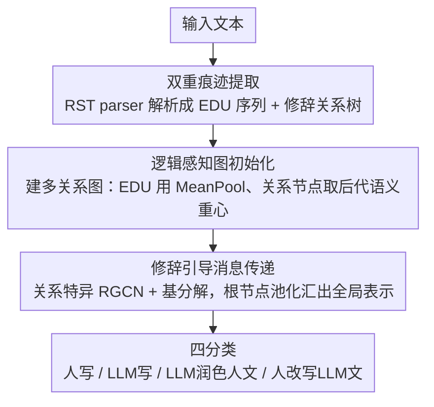

# Beyond the Final Actor: Modeling the Dual Roles of Creator and Editor for Fine-Grained LLM-Generated Text Detection

**会议**: ACL 2026  
**arXiv**: [2604.04932](https://arxiv.org/abs/2604.04932)  
**代码**: [https://race.yang-li.cn](https://race.yang-li.cn)  
**领域**: AIGC检测  
**关键词**: LLM生成文本检测, 修辞结构理论, 创作者-编辑者建模, 细粒度分类, 篇章分析

## 一句话总结
提出 RACE（Rhetorical Analysis for Creator-Editor Modeling），利用修辞结构理论(RST)构建逻辑图来建模文本"创作者"的思维架构，同时提取篇章单元级特征捕获"编辑者"的语言风格，实现四类细粒度 LLM 生成文本检测（人写/LLM写/LLM润色人文/人改写LLM文）。

## 研究背景与动机

**领域现状**：LLM 生成文本检测主要是二分类（人写 vs LLM 写），近期有些工作引入第三类"混合文本"做三分类设置。

**现有痛点**：即使是三分类也不够精细——"LLM 润色的人文"和"人改写的 LLM 文"在实际监管中有完全不同的政策后果。前者通常被视为合法的写作辅助，后者则是绕过检测的作弊行为。但二者都属于"混合文本"，传统方法用统一特征无法区分。

**核心矛盾**：两种混合类型的创作者-编辑者协作模式截然不同：LLM 润色人文 = 人的逻辑框架 + LLM 的表达风格；人改写 LLM 文 = LLM 的逻辑框架 + 人的表达扰动。统一特征难以捕获这种分离的双重痕迹。

**本文目标**：设计一个能分别建模"创作者"和"编辑者"贡献的检测框架，实现可靠的四分类细粒度检测。

**切入角度**：创作者的身份深植于文本的逻辑组织和论证推进中（人用层级化推理，LLM 倾向平铺直叙），编辑者的影响主要体现在表面语言表达上。RST 正好能分离这两个层面。

**核心 idea**：用 RST 解析文本得到修辞关系树，将其转化为逻辑图来刻画创作者的思维指纹；同时用 EDU 级语义表示捕获编辑者的语言风格。

## 方法详解

### 整体框架

RACE 想解决的是"四分类细粒度检测"——不仅要分人写还是 LLM 写，还要把"LLM 润色人文"和"人改写 LLM 文"这两种政策后果完全不同的混合文本区分开。它的核心思路是把文本的"创作者"（逻辑框架）和"编辑者"（表面语言）拆开建模：先用 RST parser 把文本解析成 EDU 序列和修辞关系树，再据此搭一张以 EDU 为叶节点、修辞关系为内部节点的多关系逻辑图，节点特征初始化后经过修辞引导的消息传递学习深层表示，最后由根节点池化汇出全局表示送入分类器，从而把藏在逻辑组织里的创作者指纹和藏在语言风格里的编辑者痕迹同时读出来。

### 关键设计

**1. 双重痕迹提取：混合文本里创作者的逻辑框架和编辑者的表面风格交织在一起，统一特征无法把两层分开**

RACE 用端到端 RST parser 把文本解析成二叉成分树，叶节点是 EDU 序列、代表编辑者的语言单元，内部节点带 Elaboration、Contrast 等修辞关系标签、代表创作者的逻辑组织，一棵树就把"谁搭了逻辑骨架"和"谁做了表面修饰"分到了两个层面。这么做的底气来自统计观察：人类创作者在 Attribution 和 Background 关系上显著过表达（爱引用来源、铺设上下文），LLM 创作者则在 Elaboration 和 Evaluation 上过表达（平铺信息），而且这套结构指纹即使经过编辑也几乎不变——同一创作者的文本在修辞关系频率上的余弦相似度始终 >0.89，正好说明编辑者改不动创作者的逻辑底层。

**2. 逻辑感知图初始化：直接用关系标签的 one-hot 编码太稀疏，修辞节点几乎不带语义**

论文构建多关系图 $\mathcal{G} = (\mathcal{V}_{edu} \cup \mathcal{V}_{rel}, \mathcal{E}, \mathcal{R})$，EDU 节点用 PLM 的 MeanPool 嵌入初始化，关系节点则用 Descendant Span Pooling 递归地取所有子孙 EDU 的语义重心来初始化，再通过信息瓶颈投影降维到 $d_{feat}$ 以过滤表面噪声。相比 one-hot，用后代 EDU 的语义重心给关系节点"灌"上下文，能让每个修辞节点携带它实际统辖的那段文字的语义，图上的消息传递才有内容可传。

**3. 修辞引导消息传递：因果、对比、阐述这些修辞关系承载的逻辑功能各不相同，需要关系特异的传播规则**

RACE 用 $L$ 层 RGCN，为每种修辞关系学一套独立的变换矩阵，让不同逻辑关系沿图传递时走不同的通道。为避免关系种类多导致参数爆炸、稀疏关系过拟合，它用基分解正则化 $\mathbf{W}_r^{(l)} = \sum_{k=1}^B \alpha_{rk}^{(l)} \mathbf{V}_k^{(l)}$ 让所有关系共享 $B$ 个基矩阵、只学组合系数，最后由根节点池化汇出全局文本表示。消融显示去掉基分解会让稀疏关系过拟合、AUROC 掉到 ~91。

### 一个完整示例

以一篇"LLM 润色人文"的文章为例：它的逻辑骨架是人搭的，所以 RST 树里仍保留较多 Attribution、Background 关系，但句子表面被 LLM 抹平、用词风格偏 LLM。RACE 先把它解析成 EDU 序列和修辞树，叶节点带着"被润色过"的语言风格、内部节点带着"人类式"的深层逻辑结构；逻辑感知初始化给每个修辞节点注入其统辖段落的语义；RGCN 沿 Attribution/Background 等关系通道传播后，根节点池化得到的全局表示同时编码了"创作者=人"（逻辑深而多引用）和"编辑者=LLM"（语言风格平滑）两条线索，于是分类器能把它和"人改写 LLM 文"（逻辑扁平+人类式表面扰动）区分开。

### 损失函数 / 训练策略
联合损失 $\mathcal{L}_{total} = \mathcal{L}_{con} + \mathcal{L}_{ce}$：监督对比损失鼓励紧凑的类内聚类 + 交叉熵损失做分类。骨干网络用 RoBERTa-base 只微调最后一层。

## 实验关键数据

### 主实验
在 HART 数据集上的四分类检测。

| 方法 | AUROC (Avg) | TPR@1%FPR |
|------|------------|-----------|
| RoBERTa | ~85 | 68.06 |
| CoCo | ~86 | - |
| DeTeCtive | ~87 | - |
| **RACE** | **~92** | **~80** |

### 消融实验

| 配置 | AUROC | 说明 |
|------|-------|------|
| Full RACE | **~92** | 完整模型 |
| w/o RST graph (仅 EDU) | ~87 | 去掉创作者建模，掉5个点 |
| w/o contrastive loss | ~90 | 特征空间不够紧凑 |
| w/o basis decomposition | ~91 | 稀疏关系过拟合 |

### 关键发现
- RACE 在 12 个基线中 AUROC 最高，且在低误报率(1% FPR)下保持高召回率
- 创作者建模（RST 图）贡献最大——去掉后掉 5 个点
- 修辞关系频率分析验证了核心假设：人写文本的 RST 结构更深更复杂，LLM 文本更扁平
- 同一创作者的文本经过编辑后修辞关系频率余弦相似度仍 >0.89，证明编辑难以改变创作者指纹

## 亮点与洞察
- **Creator-Editor 双角色框架**概念清晰有力——将"谁是最后的操作者"升维到"谁建立了逻辑框架+谁做了表面修饰"
- **RST 作为创作者指纹**的发现非常有说服力——人类的修辞结构更深、更多引用/背景关系，LLM 偏好扁平的阐述/评价结构
- 低误报率指标(TPR@1%FPR)的引入很实际——在学术不端检测等高风险场景减少冤枉比提高召回更重要

## 局限与展望
- 依赖 RST parser 的质量，当前 parser 在某些文本类型上可能不够准确
- 只在 HART 数据集上评估，跨域泛化能力未知
- 四分类设置假设文本只经过一次编辑，多轮人-LLM 交互的场景更复杂
- 随着 LLM 能力提升其修辞结构可能越来越接近人类

## 相关工作与启发
- **vs DetectAIve**: 也尝试了四分类但用统一特征，RACE 用双角色建模更精细
- **vs CoCo**: CoCo 也考虑篇章信息但未用 RST 的层级结构
- **vs LF-Motifs**: 用词频模式检测，无法捕获逻辑组织层面的差异

## 评分
- 新颖性: ⭐⭐⭐⭐⭐ Creator-Editor 框架+RST 创作者指纹是原创性很强的设计
- 实验充分度: ⭐⭐⭐⭐ 12 个基线充分，但单数据集限制了泛化性验证
- 写作质量: ⭐⭐⭐⭐⭐ 动机分析极具说服力
- 价值: ⭐⭐⭐⭐⭐ 首次将四分类细粒度检测做到实用水平

<!-- RELATED:START -->

## 相关论文

- [\[ACL 2025\] HACo-Det: A Study Towards Fine-Grained Machine-Generated Text Detection under Human-AI Coauthoring](../../ACL2025/aigc_detection/haco-det_a_study_towards_fine-grained_machine-generated_text_detection_under_hum.md)
- [\[CVPR 2026\] Fine-grained Image Aesthetic Assessment: Learning Discriminative Scores from Relative Ranks](../../CVPR2026/aigc_detection/fine-grained_image_aesthetic_assessment_learning_discriminative_scores_from_rela.md)
- [\[ACL 2026\] DetectRL-X: Towards Reliable Multilingual and Real-World LLM-Generated Text Detection](detectrl-x_towards_reliable_multilingual_and_real-world_llm-generated_text_detec.md)
- [\[ACL 2026\] Temporal Flattening in LLM-Generated Text: Comparing Human and LLM Writing Trajectories](temporal_flattening_in_llm-generated_text_comparing_human_and_llm_writing_trajec.md)
- [\[CVPR 2026\] PPM-CLIP: Probabilistic Prompt Modeling for Generalizable AI-Generated Image Detection](../../CVPR2026/aigc_detection/ppm-clip_probabilistic_prompt_modeling_for_generalizable_ai-generated_image_dete.md)

<!-- RELATED:END -->
