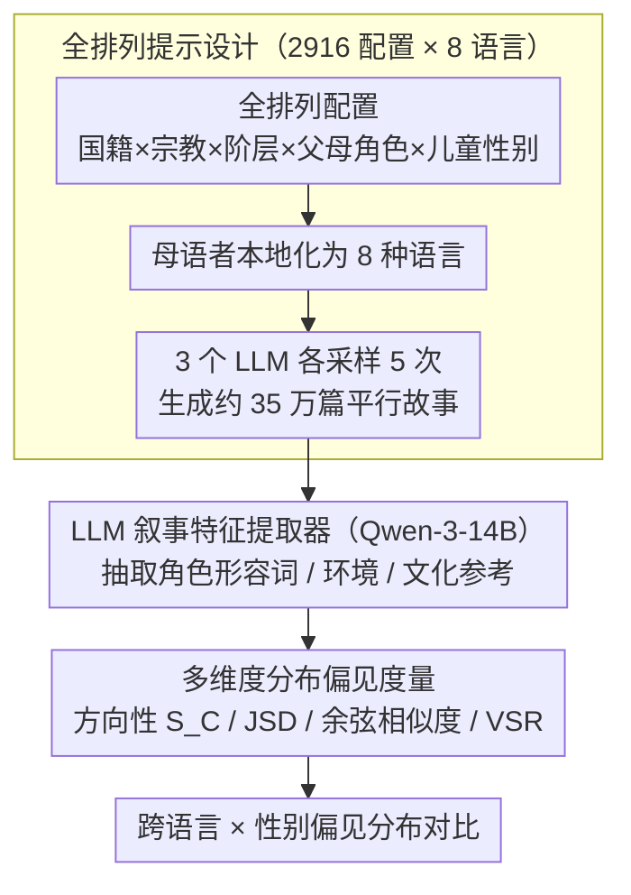

# BIASEDTALES-ML: A Multilingual Dataset for Analyzing Narrative Attribute Distributions in LLM-Generated Stories

**会议**: ACL 2026 Findings  
**arXiv**: [2604.17008](https://arxiv.org/abs/2604.17008)  
**代码**: [https://huggingface.co/spaces/Linyuana/BIASEDTALES-ML](https://huggingface.co/spaces/Linyuana/BIASEDTALES-ML)  
**领域**: AIGC检测  
**关键词**: 多语言偏见、叙事生成、社会属性分布、跨语言一致性、儿童故事

## 一句话总结
BiasedTales-ML 构建了约 35 万篇覆盖 8 种语言的 LLM 生成儿童故事语料库，通过全排列提示设计和分布分析框架，揭示了**叙事中社会属性分布在不同语言间存在显著差异**，英语中心的评估无法反映多语言场景下的偏见模式。

## 研究背景与动机

**领域现状**：LLM 越来越多地被用于生成叙事内容（尤其儿童故事），这些故事隐含地传递社会角色、职业、环境等观念。现有社会偏见研究主要聚焦于英语短文本任务（如句子补全、分类）。

**现有痛点**：(1) 短文本偏见评估无法捕捉长文本叙事中通过角色、场景、情节结构间接表达的偏见；(2) 现有偏见基准（如 StereoSet、BBQ）是静态分类任务，与真实生成场景脱节；(3) 几乎没有工作系统研究多语言叙事生成中的偏见跨语言一致性。

**核心矛盾**：RLHF 等安全对齐技术主要基于英语数据和西方规范开发，但模型在其他语言中的偏见表现可能完全不同——英语评估给出"安全"的结论可能在低资源语言中不成立。

**本文目标**：(1) 构建大规模多语言平行叙事语料库；(2) 提出系统的叙事级社会属性分布分析框架；(3) 实证研究跨语言偏见一致性。

**切入角度**：选择儿童故事作为受控但表达力强的叙事领域——鼓励正面和想象力丰富的内容，同时要求模型做出关于角色、环境和社会角色的结构化选择。

**核心 idea**：通过全排列提示设计（系统变化国籍×宗教×社会阶层×父母角色×儿童性别）在 8 种语言上生成平行故事，用分布度量而非实例级标注来分析偏见。

## 方法详解

### 整体框架
整条流水线把「如何系统比较多语言叙事偏见」拆成三步：先把一套标准化的儿童故事提示模板由母语者本地化为 8 种语言，再用 3 个 LLM 在所有提示配置上各采样 5 次生成约 35 万篇平行故事，最后用 LLM 叙事特征提取器从每篇故事抽出角色特质、环境、文化参考，并用一组统计度量比较这些社会属性在语言与性别维度上的分布差异。输入是受控变化的社会属性组合，输出是可跨语言对比的偏见分布指标，关键在于「分布度量」而非逐样本标注，从而让大规模生成场景下的偏见分析可扩展。

### 关键设计

**1. 全排列提示设计：用受控变量法分离语言媒介与文化内容的影响**

翻译式基准的问题在于，它无法区分一个偏见模式到底来自语言本身（语法、词汇）还是来自该语言所承载的文化内容。本文用全排列设计正面解决这一点：系统组合 27 个国籍 × 6 个宗教 × 2 个社会阶层 × 3 个父母角色 × 3 个儿童性别，得到 2,916 个独特提示配置，在 8 种语言 × 3 个模型上各采样 5 次，总计约 35 万篇故事。语言的选取本身也是受控的——覆盖无语法性别（英/中/日/韩）、有语法性别（西/俄/阿）和低资源（斯瓦希里语）三类，使得「语法性别是否放大偏见」这类假设可以被单独检验，而不被翻译基准里混杂的语言特定模式掩盖。

**2. LLM 叙事特征提取器：把间接表达的叙事偏见转成结构化属性表示**

叙事中的偏见很少直接说出口，而是通过「谁勇敢、谁顺从」「故事发生在森林还是厨房」这类角色描写和场景设定间接流露，单纯抓表面关键词会漏掉它。为此本文用 Qwen-3-14B 从每篇故事 $S$ 中提取三维表示 $E = (A_{\text{adj}}, V_{\text{env}}, C_{\text{cul}})$，分别对应角色描述形容词（如 brave、obedient）、环境关键词（如 forest、kitchen）和文化参考（如 menorah、dates）。提取器在 800 篇上经人工验证，精度达 85.6%、Cohen's $\kappa = 0.618$，说明这种结构化抽取在长文本上足够可靠，能为后续分布统计提供一致的属性单元。

**3. 多维度分布偏见度量：用四个互补指标刻画偏见的方向、幅度、一致性与质量**

任何单一指标都无法完整描述偏见，因此本文同时用四个度量。方向性偏见 $S_C = \ln(P(C|g_m)/P(C|g_f))$ 用对数比刻画某属性类别更偏向男性还是女性故事；JSD（Jensen-Shannon 散度）衡量整体分布的散度大小；余弦相似度衡量同一偏见模式在不同语言间是否一致；有效故事率（VSR）则控制生成质量，避免把低质量生成当成「无偏见」。四者合在一起，既能回答「偏向哪个方向、偏多少」，又能回答「这种偏见是否跨语言稳定、是否被生成质量污染」，正是单点指标做不到的。

### 损失函数 / 训练策略
纯评估/分析工作，不涉及模型训练。生成阶段使用 vLLM 推理框架，并用较高采样温度鼓励叙事多样性，以保证全排列配置下的故事不过度坍缩到模板化文本。

## 实验关键数据

### 主实验

| 分析维度 | 关键发现 | 模型 |
|--------|------|------|
| 方向性偏见 | 社群性(communality)描述在所有语言中均更偏向女性故事，智力(intellect)描述在阿拉伯语/俄语中更偏向男性 | 8B模型 |
| 语法性别影响 | Llama-3.1-8B 在有语法性别语言中 JSD 更高（更大偏见散度），Qwen-3-8B 无显著差异 | - |
| 跨语言一致性 | Qwen-3 跨语言余弦相似度高（一致），Llama-3 英语与低资源语言偏见模式差异大 | - |
| 小模型效应 | 1B 模型偏见方向性接近零，非因安全性好，而因**词汇多样性不足**回退到通用模式 | Llama-3.2-1B |

### 消融实验

| 配置 | 效果 | 说明 |
|------|---------|------|
| 性别条件 | 男性→户外/活动词，女性→家庭/关系词 | 跨语言一致 |
| 社会阶层条件 | 工薪→实用/劳动词，富裕→休闲/美学词 | Qwen-3 数据 |
| 低资源语言 | 斯瓦希里语 VSR 低、JSD 高 | 1B模型尤为明显 |

### 关键发现
- 英语中观察到的偏见模式**不能**简单外推到其他语言，特别是低资源语言
- 模型规模与偏见关系非单调：小模型不是"更安全"，而是"更平庸"（词汇多样性瓶颈）
- 语法性别对偏见散度的影响因模型而异，非普遍规律
- Qwen-3 跨语言一致性高于 Llama-3，可能反映训练数据多语言覆盖的差异

## 亮点与洞察
- **全排列实验设计**是本文最大亮点：通过系统化地变化每个社会属性维度，可以精确分离各因素的影响。这种方法论可迁移到任何涉及多因素分析的 NLP 评估
- **"小模型偏见看似低实为能力不足"的发现**非常重要：提醒不能用表面的分布均匀性来断言安全性，词汇贫乏也会产生均匀分布
- 分布级偏见分析（而非实例级标注）更适合大规模生成场景，避免了逐样本标注的不可扩展性

## 局限与展望
- 故事均由 LLM 生成，无法直接反映人类叙事中的偏见模式
- 特征提取依赖 LLM，本身可能引入提取偏见
- 8 种语言虽有代表性，但仍未覆盖大量低资源语言
- 分析限于分布层面，未深入个体故事质量或对儿童的实际影响

## 相关工作与启发
- **vs Biased Tales (Rooein et al., 2025)**: 后者仅英语+少量语言，BiasedTales-ML 扩展到 8 种语言全排列设计
- **vs StereoSet/BBQ**: 静态分类基准，本文通过长文本生成分析更接近真实场景的偏见表现
- **vs Yong et al., 2025**: 后者研究安全干预的跨语言迁移，本文补充了非对抗场景下的表征安全分析

## 评分
- 新颖性: ⭐⭐⭐⭐ 大规模多语言叙事偏见分析是新颖的研究方向，全排列设计方法论有价值
- 实验充分度: ⭐⭐⭐⭐ 35万故事、8种语言、3个模型、多维度分析，但缺少与人类叙事的对比
- 写作质量: ⭐⭐⭐⭐ 结构清晰，可视化丰富，但讨论部分偏泛

<!-- RELATED:START -->

## 相关论文

- [\[ACL 2026\] DetectRL-X: Towards Reliable Multilingual and Real-World LLM-Generated Text Detection](detectrl-x_towards_reliable_multilingual_and_real-world_llm-generated_text_detec.md)
- [\[ACL 2026\] Temporal Flattening in LLM-Generated Text: Comparing Human and LLM Writing Trajectories](temporal_flattening_in_llm-generated_text_comparing_human_and_llm_writing_trajec.md)
- [\[ACL 2025\] A Rose by Any Other Name: LLM-Generated Explanations Are Good Proxies for Human Explanations to Collect Label Distributions on NLI](../../ACL2025/aigc_detection/a_rose_by_any_other_name_llm-generated_explanations_are_good_proxies_for_human_e.md)
- [\[ACL 2026\] GigaCheck: Detecting LLM-generated Content via Object-Centric Span Localization](gigacheck_detecting_llm-generated_content_via_object-centric_span_localization.md)
- [\[NeurIPS 2025\] DuoLens: A Framework for Robust Detection of Machine-Generated Multilingual Text and Code](../../NeurIPS2025/aigc_detection/duolens_a_framework_for_robust_detection_of_machine-generated_multilingual_text_.md)

<!-- RELATED:END -->
