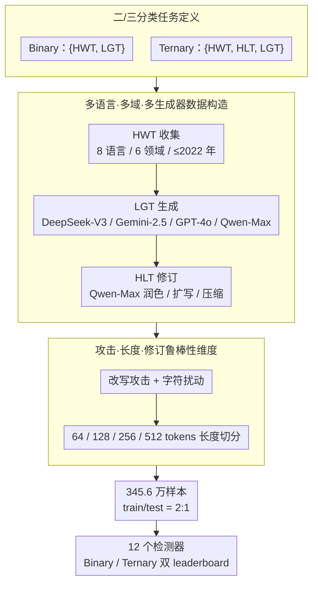

# DetectRL-X: Towards Reliable Multilingual and Real-World LLM-Generated Text Detection

**会议**: ACL2026  
**arXiv**: [2605.15518](https://arxiv.org/abs/2605.15518)  
**代码**: https://github.com/AIDC-AI/Marco-LLM/tree/main/DetectRL-X  
**领域**: AIGC检测 / LLM生成文本检测  
**关键词**: LLM生成文本检测, 多语言鲁棒性, 三分类检测, 攻击评测, DetectRL-X

## 一句话总结
DetectRL-X 构建了一个 345.6 万样本、多语言、多域、多攻击、多长度和二/三分类并行的 LLM 生成文本检测基准，证明现有检测器在真实多语言和人机协作写作场景下仍存在明显鲁棒性短板。

## 研究背景与动机
**领域现状**：LLM 生成文本检测通常把任务定义为二分类，即区分 Human-Written Text (HWT) 和 LLM-Generated Text (LGT)。已有检测器大致分为两类：基于统计特征的方法，如 Log-Likelihood、Log-Rank、DetectLLM-LRR、GECScore、Binoculars；以及基于监督训练的神经检测器，如 XLM-RoBERTa-Classifier 和 mDeBERTa-Classifier。

**现有痛点**：很多 benchmark 只覆盖少数语言、少数生成器或干净分布，难以回答真实部署问题。例如商业场景里文本可能来自不同领域、不同生成器、不同语言，还可能经过润色、扩写、压缩、改写、回译或字符扰动。更关键的是，实际文本常常不是纯人写或纯机写，而是人写后由 LLM 改写，这类 Hybrid LLM-Text (HLT) 会让传统二分类变得不够真实。

**核心矛盾**：检测器在单域、单语言、单生成器设置下的高分，并不能说明它能处理真实互联网文本。检测评测需要同时覆盖语言差异、领域差异、生成器差异、文本长度、攻击和人机协作写作，否则会系统性高估检测器可靠性。

**本文目标**：作者希望构建一个更接近真实使用的检测基准，覆盖 8 种商业常用语言、6 个高风险应用领域、4 个主流生成器、8 种攻击/扰动维度、4 个文本长度粒度和 3 种修订操作，并同时评测 Binary 与 Ternary 两类任务。

**切入角度**：论文不提出单个新检测器，而是先把评测空间做完整。它把 HWT、LGT、HLT 都纳入统一数据框架，并建立 leaderboard，比较 12 个代表性检测方法在多种 distribution shift 下的表现。

**核心 idea**：用更复杂、更贴近真实的多语言评测暴露检测器的脆弱性，而不是继续在干净二分类 benchmark 上追求接近饱和的分数。

## 方法详解

### 整体框架
DetectRL-X 不提出新检测器，而是把整个评测空间做完整，其「方法」体现在数据构建、任务定义、攻击生成和评价模块的设计上。它围绕三个文本类别组织：HWT 是人写文本，LGT 是 LLM 生成文本，HLT 是人写文本经 LLM 辅助修订后的混合文本，对应 Binary 任务判断 $\{HWT,LGT\}$、Ternary 任务判断 $\{HWT,HLT,LGT\}$。数据构建先收集 8 种语言（English、German、Spanish、French、Portuguese、Russian、Arabic、Chinese）的真实人写文本，按语言复杂度分为 high/medium/low 三组，来源覆盖 Academic、News、Novel、SEO、Wiki、WebText 六个领域，且只用 2022 年之前发布的文本以降低 LGT 污染风险。随后用 DeepSeek-V3、Gemini-2.5-flash、GPT-4o、Qwen-Max 生成 LGT，并用 Qwen-Max 对 HWT/LGT 做 polishing、expanding、condensing 修订构造 HLT 与后处理 LGT；最后叠加多语言 paraphrase / perturbation 攻击，并按 64/128/256/512 tokens 切出不同长度子样本。最终数据规模为 3,456,000 个样本，train/test 按 2:1 划分。

### 关键设计

**1. 从二分类扩展到三分类：把人机协作写作的灰区纳入评测**

传统检测把任务定义为 $f_{Binary}:T\to\{HWT,LGT\}$，只能回答「有没有机器味」，却处理不了「人类原稿被 LLM 局部润色」这种现实中最常见的灰区。本文因此新增 $f_{Ternary}:T\to\{HWT,HLT,LGT\}$，其中 HLT 来自人写文本经 LLM 润色、扩写或压缩，直接对应真实办公和内容生产中的辅助写作。引入这一类别后，评测就能逼检测器在「混合作者身份」上做边界判断——实验也证实正是 HLT 把 HWT 与 LGT 的边界模糊化，使三分类成绩相比二分类显著下降，更能反映真实部署难度。

**2. 多语言、多域、多生成器数据构造：避免检测器只在英语单一风格上虚高**

多数 LLM 与检测器的训练分布偏英语，导致在干净英语集上的高分根本无法外推到真实互联网文本。为此数据覆盖 8 种语言和 6 个领域，生成器横跨 DeepSeek-V3、Gemini-2.5-flash、GPT-4o、Qwen-Max 四家，并按形态丰富度和与英语的类型距离把语言划分复杂度——高复杂度含 Arabic、Russian、Chinese，中等含 German、French、Spanish、Portuguese，低为 English。这种划分让「文字系统和形态结构差异越大、tokenization 与表示越难」这一假设可被显式检验，从而把跨语言迁移的脆弱性暴露成可量化的掉点维度，而非被英语成绩掩盖。

**3. 攻击、长度和修订维度的鲁棒性评测：模拟真实用户对文本的改写与噪声**

真实检测面对的从来不是原始模型输出，而是被改过的 LLM 文本，因此基准把用户可能做的操作系统化为多个攻击维度：Paraphrase Attacks 含 Encoder / Seq2seq / Decoder Paraphrasing 与 Back-Translation，Perturbation Attacks 含 Character Insertion / Substitution / Deletion 与 Zero-width Insertion，再叠加 64/128/256/512 tokens 的长度子样本评估长度敏感性。这套压力测试的价值在于能测出检测器是否依赖可被改写抹除的脆弱表面统计特征——实验显示 paraphrase 比字符扰动破坏性大得多，正说明很多检测信号经不起改写。

### 损失函数 / 训练策略
论文没有提出新的训练损失，而是评测 12 个已有检测器。统计方法包括 Log-Likelihood、Log-Rank、DetectLLM-LRR、GECScore、ReviseDetect、Fast-DetectGPT、Binoculars、Lastde++、RepreGuard 和 Biscope；神经方法包括 X-Rob-Classifier 与 mDeBERTa-Classifier。由于真实场景中 LLM 多为黑盒且不可访问，论文排除了 watermarking 方法。评价指标使用 Binary 与 Ternary 两个 leaderboard，并比较 In-Distribution、Cross-Domain、Cross-Generator、Cross-Language、Cross-Paraphrase、Cross-Perturbation、Cross-Length 和 Cross-Operation 等维度。

## 实验关键数据

### 主实验
| 任务 | 最佳 / 代表方法 | 平均 $F^B_1$ | 平均 $F^F_1$ | 结果解读 |
|--------|------|------|----------|------|
| Binary | X-Rob-Classifier | 95.58% | 91.31% | 二分类 leaderboard 第一，神经检测器整体最强 |
| Binary | mDeBERTa-Classifier | 95.48% | 93.20% | 二分类第二，但 $F^F_1$ 高于 X-Rob-Classifier |
| Ternary | mDeBERTa-Classifier | 87.68% | 81.10% | 三分类最强，但相比 Binary 明显下降 |
| Binary / Ternary | Biscope | 80.06% / 59.69% | 63.62% / 37.91% | 即使较弱神经检测器也超过最佳统计检测器若干平均指标 |
| In-Distribution 统计检测器 | GECScore | 83.22% | 缓存未给出对应精确值 | 统计方法在复杂多语言混合分布中即使 ID 也不稳 |

### 消融实验
| 鲁棒性维度 | 观察到的性能变化 | 说明 |
|------|---------|------|
| Cross-Language | 神经检测器 Binary 平均 $F^B_1$ 从 95.3% 降到 91.4%；Ternary 从 87.10% 降到 66.28% | 跨语言迁移在三分类中尤其困难，mDeBERTa-Classifier 下降 20.55% |
| Cross-Domain vs Cross-Generator | Binary 中神经检测器 Cross-Domain 下降 2.95%，Cross-Generator 只下降 0.78% | 域迁移比生成器迁移更像真实瓶颈 |
| Paraphrase / Perturbation | Binary 中神经检测器分别下降 28.1% 和 13.1%；Ternary 中分别下降 16.8% 和 4.3% | 改写比细粒度字符扰动更破坏检测信号 |
| Length / Operation | Binary 中神经检测器分别下降约 4.5% 和 1%；Ternary 中下降 11.9% 和 13.4% | 文本长度和修订操作对三分类影响更大 |
| Binary vs Ternary | ID 下统计检测器从 67.9% 降到 39.3%；神经检测器从 97.6% 降到 87.1% | HLT 类别显著增加任务难度，更能反映真实混合作者身份 |

### 关键发现
- 神经检测器整体强于统计检测器，但不是“已解决”。在 Cross-Language、Cross-Domain 和 paraphrase 场景下，神经方法仍出现大幅掉点。
- 统计检测器对真实混合分布很脆弱。即使在 In-Distribution 设置中，统计检测器平均 $F^B_1$ 只有 67.89%，说明单域/单生成器实验会高估其效果。
- Ternary 任务更接近真实部署。整体平均上，统计方法从 58.3% 降到 35.3%，神经方法从 90.4% 降到 76.7%，说明 HLT 会模糊 HWT 和 LGT 的边界。
- Paraphrase 比字符扰动更危险。统计检测器在 Binary paraphrase 下损失 25-40%，神经检测器也最高下降 35.5%，表明检测器仍依赖可被改写消除的表面特征。
- 语言复杂度提供了分析维度。论文把 Arabic、Russian、Chinese 归为高复杂度语言，指出它们在 tokenization、表示和跨语言迁移上更具挑战。

## 亮点与洞察
- 最大亮点是把评测任务从“漂亮但简单”的二分类拉回真实世界。HLT 类别非常关键，因为很多实际文本并不是全自动生成，而是人写后由模型润色。
- 8 个 evaluation dimensions 让 benchmark 更像压力测试，而不是单一排行榜。它能告诉开发者到底是跨语言、跨域、长度还是改写在拖垮检测器。
- 论文对统计方法的结论很实际：统计检测器部署成本低、可解释性较好，但在多域多语言和攻击场景下不够稳，不能只看干净测试集。
- 对检测器训练也有启发。未来模型需要语言不变特征、域鲁棒特征，以及显式识别 HLT 的训练数据，而不是只学习 LGT 的生成器指纹。

## 局限与展望
- 作者承认 benchmark 有时间相关性。LLM 生成质量快速提升，未来模型输出会更接近人类文本，当前数据里的生成器和风格可能很快过时。
- 语言覆盖仍有限。虽然 8 种语言已经比多数 benchmark 更广，但仍不包括更多区域语言、低资源语言和方言变体。
- watermarking 方法被排除。论文理由是真实应用中商业 LLM 多为黑盒，但这也意味着 benchmark 没有覆盖“生成端主动嵌水印”的检测路线。
- 三分类的定义还可以继续细化。HLT 只覆盖 polishing、expanding、condensing 三种操作，未来可加入多轮人机共写、局部段落改写和跨语言翻译后编辑。

## 相关工作与启发
- **vs 传统 LGT 二分类 benchmark**: 传统数据集通常只区分 HWT/LGT，DetectRL-X 增加 HLT，使评测更贴近真实人机协作写作。
- **vs M4 / RAID 类多生成器评测**: 这类 benchmark 已经扩展生成器和攻击，但 DetectRL-X 更强调多语言、三分类和统一的 8 维鲁棒性比较。
- **vs 统计检测器**: DetectLLM-LRR、GECScore、Binoculars 等依赖概率或 logit 特征，优势是无监督或少监督，弱点是跨域、跨语言和改写鲁棒性不足。
- **vs 神经检测器**: X-Rob-Classifier 和 mDeBERTa-Classifier 排名更高，但 Cross-Language 和 Ternary 仍有明显下降，说明监督检测也需要更广泛的训练分布。

## 评分
- 新颖性: ⭐⭐⭐⭐☆ 新检测算法不多，但 benchmark 设计把 HLT、多语言和真实攻击整合得很完整。
- 实验充分度: ⭐⭐⭐⭐⭐ 数据规模 345.6 万，覆盖 8 语言、6 领域、4 生成器、12 检测器和 8 个评测维度。
- 写作质量: ⭐⭐⭐⭐☆ 论证清楚，但 PDF 抽取后的表格非常长，部分指标命名对读者有一定门槛。
- 价值: ⭐⭐⭐⭐⭐ 对 AIGC 检测实际部署很有价值，尤其提醒大家不要只看英语干净二分类准确率。

<!-- RELATED:START -->

## 相关论文

- [\[ACL 2026\] C-ReD: A Comprehensive Chinese Benchmark for AI-Generated Text Detection Derived from Real-World Prompts](c-red_a_comprehensive_chinese_benchmark_for_ai-generated_text_detection_derived_.md)
- [\[ACL 2026\] Temporal Flattening in LLM-Generated Text: Comparing Human and LLM Writing Trajectories](temporal_flattening_in_llm-generated_text_comparing_human_and_llm_writing_trajec.md)
- [\[ACL 2026\] BIASEDTALES-ML: A Multilingual Dataset for Analyzing Narrative Attribute Distributions in LLM-Generated Stories](biasedtales-ml_a_multilingual_dataset_for_analyzing_narrative_attribute_distribu.md)
- [\[ACL 2026\] Beyond the Final Actor: Modeling the Dual Roles of Creator and Editor for Fine-Grained LLM-Generated Text Detection](beyond_the_final_actor_modeling_the_dual_roles_of_creator_and_editor_for_fine-gr.md)
- [\[NeurIPS 2025\] DuoLens: A Framework for Robust Detection of Machine-Generated Multilingual Text and Code](../../NeurIPS2025/aigc_detection/duolens_a_framework_for_robust_detection_of_machine-generated_multilingual_text_.md)

<!-- RELATED:END -->
