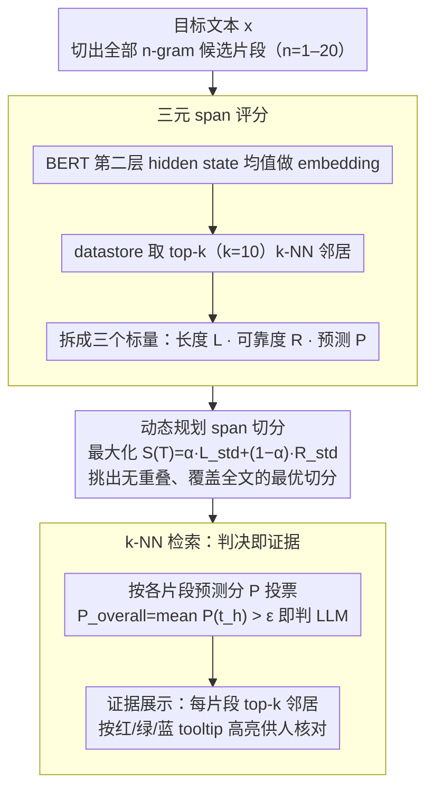

# ExaGPT: Example-Based Machine-Generated Text Detection for Human Interpretability

**会议**: ACL 2026  
**arXiv**: [2502.11336](https://arxiv.org/abs/2502.11336)  
**代码**: https://github.com/ryuryukke/ExaGPT  
**领域**: AIGC 检测 / 可解释机器学习 / 检索增强  
**关键词**: LLM 文本检测, 可解释性, k-NN 检索, 动态规划, 跨域泛化

## 一句话总结
ExaGPT 把"判定一段文本是人写还是 LLM 生成"这件事重构成"在数据存储里找哪一侧的相似 span 更多"，通过 BERT 嵌入 + k-NN 检索 + 动态规划做最优 span 切分，既给出可解释证据（最相似的检索 span 例子）又在 1% FPR 下把准确率刷到比此前可解释检测器最高高出 +37.0 个点。

## 研究背景与动机
**领域现状**：LLM 生成文本检测主要分三类——文本水印、基于度量（log-prob / 熵 / 困惑度 / 概率曲率）和有监督分类器（RoBERTa fine-tune、Ghostbuster、Pangram），整体 AUROC 都已经能做到 99% 以上，看起来已经"解决"。

**现有痛点**：但只输出二元标签的检测器在 false positive 上不可接受——已经有写手因被 AI 检测器误判而被解雇、学生因被误判作弊而声誉受损。现有的"可解释"检测器（GLTR 高亮 token、SHAP/LIME 归因、DNA-GPT n-gram 重叠）给的证据都是 token-level 的统计量或机器视角的归因分数，普通用户看不懂。

**核心矛盾**：人类判定"这段是不是 AI 写的"时的直觉过程是——"这话/这种说法我在 AI 文本里见过还是在人写文本里见过更多次"，即"按相似 span 数量来归类"。但现有检测器没有任何一个对齐到这种 example-based 的判定流程，于是检测器再准也无法帮用户判断"这次预测是否可信"。

**本文目标**：(1) 设计一个本身就按"找相似 span 例子"工作的检测器；(2) 把"相似 span"自然变成给人看的证据；(3) 在 1% FPR 这种实战场景下保持 SOTA 准确率。

**切入角度**：作者借鉴抄袭检测里的判定逻辑（Maurer 2006, Barrón-Cedeño 2013）——人靠 verbatim overlap + 语义相似 span 判定文本来源。把这种逻辑搬到 LLM 检测：建一个由人写文本和 LLM 文本组成的 datastore，给目标文本切 span 后做 k-NN 检索，看哪一侧的相似 span 更多。

**核心 idea**：把检测重构为"k-NN 多数投票 + 动态规划 span 切分"——一句话即"用 retrieval 替代分类器，让模型的决策路径天然就是给人看的证据"。

## 方法详解

### 整体框架
ExaGPT 把"判定文本来源"的二分类拆成两段检索式流程：先给目标文本 $x$ 的每个候选片段做"它更像 datastore 里哪一侧"的打分，再用动态规划挑出一组互不重叠、覆盖全文的最优切分，最后按这些片段的"像 LLM 程度"投票得到整段判定。整个过程不训练任何分类器——decision 直接来自检索到的相似片段，所以同一批片段既是判决依据，也是给人看的证据。

### 关键设计

**1. 三元 span 评分：把"这片段算不算证据"拆成长度、可靠度、预测三个可分别使用的信号**

人在判定 AI 文本时其实同时在问两件事——"这种说法我在 AI 文本里见过吗"以及"是哪一侧见得多"，单一相似度分数无法同时承载这两层信息。ExaGPT 因此对每个 $n$-gram span（$n \in [1,20]$）先用 BERT 第二层 hidden state 的均值做 embedding，在 datastore 上取 top-$k$（$k=10$）k-NN 邻居，再拆出三个标量：长度分 $L=n$、可靠度分 $R=\frac{1}{k}\sum_j c_j$（邻居平均相似度，衡量 datastore 里到底有没有真正像它的片段）、预测分 $P=\frac{1}{k}\sum_j \mathbb{1}(l_j=\text{LLM})$（邻居里 LLM 标签的比例，即这段看起来更偏哪一侧）。把可靠度和预测分开后，第二阶段才能既用 $R$ 挑"证据扎实"的切分、又用 $P$ 投票判源，避免了把"像不像"和"是哪侧"混成一个分数后两边都失真。

**2. 动态规划 span 切分：在指数级的 $n$-gram 组合里挑出"既够长又真有相似邻居"的那组切分**

固定粒度的朴素切分（比如一律取 $n=5$）会两头落空：既丢掉非常 verbatim 的长重叠，也错过虽短但判别力极高的稀有片段。ExaGPT 把切分定义成最大化目标 $S(T)=\frac{1}{H}\sum_h[\alpha L^{\text{std}}(t_h)+(1-\alpha)R^{\text{std}}(t_h)]$，其中 $L^{\text{std}},R^{\text{std}}$ 是在 validation 上归一化的标准分，$\alpha$ 调节长度与可靠度的偏好。求解用 DP：状态 $\text{dp}[i]$ 记录前缀 $x_{0:i}$ 的最佳累积分与回溯指针，转移时枚举上一个切点 $j\in[i-N,i)$ 取均值最大者，回溯得到切分序列 $T=[t_1,\dots,t_H]$，复杂度 $O(m\cdot N)$（$N=20$ 为最大 $n$-gram）。这样长片段和高相似片段会被同时偏好，落到 UI 上就是用户能看到"又长又像"的连续证据，可读性最高。

**3. k-NN 检索同时充当判决与证据：让模型决策路径本身就是给人看的解释**

传统 SHAP/LIME 只能事后说"哪几个 token 对预测重要"，解释和真实决策路径未必一致，用户还得先理解 likelihood 或 attribution 才能读懂。ExaGPT 把整段判定写成 $P_{\text{overall}}=\frac{1}{H}\sum_h P(t_h)>\epsilon$ 即判 LLM，而判定所依赖的每个片段的 top-$k$ 邻居 $E=\{(t_h,[s_h^1,\dots,s_h^k])\}_{h=1}^H$ 直接以 tooltip 形式按颜色（红/绿/蓝对应 Human/中性/LLM）呈现，鼠标悬停就能看到"datastore 里和这段最像的 10 个真实片段"及其标签分布。决策与证据是同一套 k-NN 产物，从机制上消除了事后归因的不一致，用户自己就能判断这次预测靠不靠谱。

### 一个完整示例
输入一句疑似 AI 写的句子，ExaGPT 先把它切成 $n=1$ 到 $20$ 的所有候选片段，逐个检索 datastore：某个长片段在 arXiv 人写语料里找到 10 个高相似邻居（$R$ 高、$P\approx 0$，偏 Human），另一个短片段在 ChatGPT 语料里命中多数邻居（$P\approx 1$，偏 LLM）。DP 在这些片段里挑出一组无重叠覆盖全句、$S(T)$ 最大的切分——长且可靠的片段被优先保留。最后对所选片段的 $P$ 取均值，若超过阈值 $\epsilon$ 就判 LLM，同时把每个片段连同它的 top-10 邻居高亮展示，用户悬停即可核对"这句到底像谁"。

### 损失函数 / 训练策略
ExaGPT 完全 training-free：检测阶段只用 BERT-large-uncased 做 embedding（取第二层 mean pooling，因为该层在 lexical 与 semantic 相似之间最平衡），datastore 取 M4 数据集 train split（每个 domain×generator 组合 2000 对样本）建 FAISS 索引。唯一需要调的"超参"是切分系数 $\alpha\in\{0,0.125,0.25,\dots,1.0\}$，在 validation 上选 detection 最好的值（实验显示偏向 reliability、即 $\alpha$ 小一点更好），以及 detection 阈值 $\epsilon$ 按"validation 上 FPR=1%"反推。

## 实验关键数据

### 主实验
在 M4 数据集（4 个 domain：Wikipedia/Reddit/WikiHow/arXiv × 3 个 generator：ChatGPT/GPT-4/Dolly-v2）上，1% FPR 下的检测准确率平均：

| Generator | Detector | Wikipedia ACC | Reddit ACC | WikiHow ACC | arXiv ACC | Avg ACC | Avg AUROC |
|-----------|----------|---------------|------------|-------------|-----------|---------|-----------|
| ChatGPT | RoBERTa-SHAP | 77.1 | 61.0 | 50.0 | 87.3 | 68.9 | 100.0 |
| ChatGPT | LR-GLTR | 60.0 | 94.0 | 85.8 | 97.7 | 84.4 | 97.9 |
| ChatGPT | DNA-GPT | 49.4 | 62.9 | 93.5 | 59.9 | 66.4 | 91.4 |
| ChatGPT | **ExaGPT** | **92.3** | 86.6 | **96.0** | 95.8 | **92.7** | 99.2 |
| GPT-4 | RoBERTa-SHAP | 87.8 | 66.4 | 77.4 | 68.6 | 75.1 | 100.0 |
| GPT-4 | LR-GLTR | 85.7 | 97.2 | 77.8 | 98.5 | 89.8 | 98.1 |
| GPT-4 | **ExaGPT** | 87.3 | 91.1 | **92.2** | **98.7** | **92.3** | 99.0 |
| Dolly-v2 | **ExaGPT** | **63.8** | 76.6 | **75.6** | 67.3 | **70.8** | 90.4 |

可解释性人评（96 样本 × 4 检测器）：

| Detector | Acc. of Human Judgments (%) |
|----------|------------------------------|
| RoBERTa-SHAP | 47.9 |
| LR-GLTR | 57.3 |
| DNA-GPT | 53.1 |
| **ExaGPT** | **61.5** |

### 消融实验
跨域（GPT-4 generator）/ 跨生成器（arXiv domain）/ paraphrase 鲁棒性 / 推理成本：

| 配置 | 关键指标 | 说明 |
|------|---------|------|
| 单域训练，跨域测试（Wikipedia → arXiv，GPT-4） | AUROC 89.3 / ACC@1%FPR 60.5 | 单一来源 datastore 跨域掉点严重 |
| ALL 多域训练，跨域测试 | AUROC 94.3-99.5 / ACC 73.4-96.7 | 混合 datastore 几乎抵消跨域 gap |
| 单生成器（GPT-4 → Dolly，arXiv） | AUROC 61.8 / ACC 51.5 | 跨开源 vs 闭源 LLM 几乎失效 |
| DIPPER paraphrase（ChatGPT，avg 4 域） | AUROC 96.0 / ACC 76.5 | 仍大幅领先 LR-GLTR (93.9 / 72.9) |
| Datastore 2000 → 500 对 | AUROC 99.5 → 99.4 | 几乎无损 |
| 500 对 + FAISS-IVFPQ | GPU 162→20 GB (-87%), 延迟 14.6→1.22 sec (-91%), AUROC 97.8 | 工程可部署化代价仅 1.7% AUROC |

### 关键发现
- 最强的可解释 baseline LR-GLTR 在 ChatGPT × Wikipedia 上 ACC@1%FPR 只有 60.0，而 ExaGPT 是 92.3，差 +32.3 个绝对点；说明现有"可解释"检测器在低 FPR 区间根本不能用，可解释性和性能并非 trade-off。
- 切分系数 $\alpha$ 越小（即越偏向 reliability score）性能越好——比起"选长 span"，"选 datastore 里真有相似邻居的 span"才是有效证据；但即使把 $\alpha$ 调到最差，AUROC 也不会跌破 98.5%，说明 method 对超参不敏感。
- 跨开源 vs 闭源 LLM 是最大失败 mode：用 GPT-4 datastore 测 Dolly 输出时 AUROC 只有 61.8，原因是 Dolly 的输出风格、词汇分布与商用 LLM 差距过大，相似 span 检索失效。
- "datastore 500 对就够"这个发现非常关键——意味着实际部署只要几千条标注样本就能起步，相比 RoBERTa 这种 2000 对训练样本起步的有监督方法门槛更低。

## 亮点与洞察
- **决策即证据**：ExaGPT 把"模型做预测"和"给人看的解释"统一为同一个 k-NN 检索过程，从机制上避免了 SHAP/LIME 这类事后解释和模型实际决策路径不一致的硬伤——这是 example-based interpretability 在 NLP 检测任务上罕见的清晰落地。
- **DP 用在 span 切分**：把"找最具说服力的证据片段"形式化为带长度-相似度权衡的最优切分问题，比启发式固定 $n$-gram 切分更优雅；这种 DP-on-spans 思路完全可以迁移到 plagiarism detection、attribution、长文本摘要的关键句选择等任务。
- **training-free 但打过 SOTA 监督方法**：ExaGPT 不训练任何模型，靠 BERT embedding + retrieval + DP 就在 1% FPR 下打过 RoBERTa fine-tune（GPT-4 上 +17.2 ACC）和 Binoculars/Fast-DetectGPT 这种 SOTA 度量方法；说明在低 FPR 区，把分类问题转化为检索问题可能本质上更鲁棒。
- **第二层 BERT hidden state**：通过 pilot study 选用 BERT 第 2 层而非默认最后一层做 span embedding，因为浅层更平衡 lexical 和 semantic 相似——这个工程细节对检索质量影响巨大，值得任何 retrieval-based NLP 系统借鉴。

## 局限与展望
- **datastore 依赖**：方法上需要预先标注的 datastore，跨域/跨生成器场景需要重建索引；且对未见过的 LLM（如新发布模型）需要额外标注一批样本。
- **跨开源 vs 闭源 generator 失效**：GPT-4 → Dolly 几乎掉到随机水平，限制了实战中"一个 datastore 通吃所有 LLM"的可行性；作者只用 ALL 多源 datastore 缓解，未根本解决。
- **人评样本量小**：只有 4 个 NLP 背景标注者评 96 样本，可解释性 +13.6 点的优势统计意义有限，且未覆盖普通用户群体。
- **推理成本仍高**：原始 setting 下 162 GB GPU 内存 + 14.6 秒/样本，靠 IVFPQ 才压到 20 GB；对短文本（如学生作业 100 字）这开销显然过高，需要更激进的索引压缩。
- **改进方向**：(1) 引入对比学习训练专门的 span encoder 替代通用 BERT，提升跨域稳定性；(2) 把 datastore 做成可在线扩充的（user-feedback loop），让误判样本回流；(3) 探索 span 级别的对抗 paraphrase 防御。

## 相关工作与启发
- **vs DNA-GPT**：DNA-GPT 也用 $n$-gram 重叠做证据，但只能匹配 verbatim 字面重叠，且需要 LLM 在线 re-generate 续写比对；ExaGPT 用语义嵌入 + 检索，可以匹配"意思像但用词不同"的语义相似 span，且完全离线，可解释性人评 +8.4 点（53.1→61.5）。
- **vs GLTR / RoBERTa+SHAP**：前者高亮 token 概率排名，后者高亮 SHAP 归因分数——两者都是"机器视角"的解释，用户需要理解 likelihood 或 attribution 概念；ExaGPT 直接给"人能秒懂"的相似句子例子，可解释性 +13.6 点。
- **vs Binoculars / Fast-DetectGPT**：SOTA 度量方法靠 cross-perplexity 或概率曲率打高分但完全不可解释；ExaGPT 在性能持平的同时多出一层证据展示，说明 interpretability tax 在 retrieval 框架下可以接近零。
- **vs kNN-MT / kNN-LM**：这些工作把 retrieval 用在生成任务的解码插值；ExaGPT 把同样的 retrieval 思想搬到二分类检测，但创新点在于"用 DP 选最优切分"——这是检测任务专属的额外结构。

## 评分
- 新颖性: ⭐⭐⭐⭐ 把 example-based interpretability 引入 LLM 检测、并配合 DP 做 span 切分，是清晰且未被探索的组合，但单看 retrieval-as-classifier 思想此前已有 kNN-LM/MT 等先例。
- 实验充分度: ⭐⭐⭐⭐⭐ 4 域 × 3 生成器主实验 + 跨域/跨生成器/paraphrase/datastore 大小/$\alpha$ 敏感性/推理成本/SOTA 对比 + 人评，几乎覆盖所有合理的 ablation 维度。
- 写作质量: ⭐⭐⭐⭐ 动机清晰、图示直观（Figure 1/2 一眼看懂方法）、限制和伦理部分有真实思考；但 DP 算法的伪代码写得偏紧、首次阅读容易卡。
- 价值: ⭐⭐⭐⭐ 对教育、内容审核等高 stakes 场景非常实用——比纯黑盒检测器多出"可审计"维度；training-free + 500 对 datastore 起步的特性也降低部署门槛。

<!-- RELATED:START -->

## 相关论文

- [\[ACL 2026\] When Personalization Tricks Detectors: The Feature-Inversion Trap in Machine-Generated Text Detection](when_personalization_tricks_detectors_the_feature-inversion_trap_in_machine-gene.md)
- [\[ACL 2026\] Temporal Flattening in LLM-Generated Text: Comparing Human and LLM Writing Trajectories](temporal_flattening_in_llm-generated_text_comparing_human_and_llm_writing_trajec.md)
- [\[ACL 2025\] HACo-Det: A Study Towards Fine-Grained Machine-Generated Text Detection under Human-AI Coauthoring](../../ACL2025/aigc_detection/haco-det_a_study_towards_fine-grained_machine-generated_text_detection_under_hum.md)
- [\[ACL 2026\] Can AI-Generated Persuasion Be Detected? Persuaficial Benchmark and AI vs. Human Linguistic Differences](can_ai-generated_persuasion_be_detected_persuaficial_benchmark_and_ai_vs_human_l.md)
- [\[NeurIPS 2025\] DuoLens: A Framework for Robust Detection of Machine-Generated Multilingual Text and Code](../../NeurIPS2025/aigc_detection/duolens_a_framework_for_robust_detection_of_machine-generated_multilingual_text_.md)

<!-- RELATED:END -->
