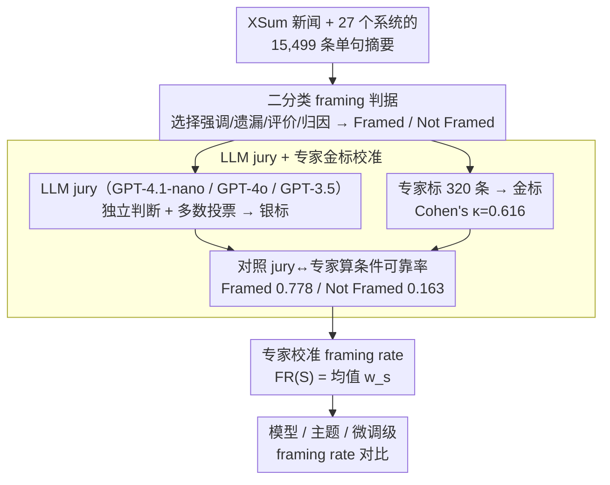

# Frame In, Frame Out: Measuring Framing Bias in LLM-Generated News Summaries

**会议**: ACL2026  
**arXiv**: [2505.05406](https://arxiv.org/abs/2505.05406)  
**代码**: https://github.com/vpastorino/FIFO  
**领域**: AIGC检测 / 摘要评测 / 媒体偏见  
**关键词**: 框架偏见, 新闻摘要, LLM评测, XSum, 专家校准  

## 一句话总结
本文提出 FIFO，用 LLM jury 加专家校准的方式在 XSum 上大规模测量 LLM 新闻摘要是否引入 framing bias，并发现若干高容量模型的框架化表达比例高于人工摘要基线。

## 研究背景与动机
**领域现状**：新闻摘要模型通常用事实一致性、覆盖率、流畅度和偏好打分来评估，尤其在 XSum 这类单句新闻摘要任务中，主流评测更关注“说得对不对”和“写得顺不顺”。但新闻文本不只是事实集合，标题和摘要会通过选择、强调、遗漏、责任归因等方式影响读者如何理解事件。

**现有痛点**：已有 framing 研究多来自传播学或监督式 framing detection，目标通常是判断一段新闻文本属于哪类 frame。摘要评测则很少检查模型是否把原文中并不突出的解释角度带进摘要里。这样一来，一个摘要可以事实兼容、语言流畅，却仍然把读者推向更情绪化、政治化或道德化的解读。

**核心矛盾**：摘要模型的压缩过程天然需要选择和省略，而 framing 正是由选择、强调和省略产生的解释偏移。传统指标把压缩看成信息保真问题，本文把它进一步看成“解释视角是否被模型改变”的问题。

**本文目标**：作者希望构建一个可扩展的 benchmark，既能覆盖很多模型和主题，又能避免完全依赖 LLM 标注带来的偏差；同时给出模型级、主题级、训练设置级的 framing rate 分析。

**切入角度**：论文没有要求模型识别细粒度 frame 类型，而是先回答更基础的问题：摘要是否存在可识别的 framing。这个二分类设定让标注和校准更容易规模化，也更适合作为摘要系统的评测维度。

**核心 idea**：用三模型 LLM jury 批量标注 framing，再用小规模专家标注估计 jury 的可靠性权重，从而把原始银标转换为专家校准的 framing rate。

## 方法详解
FIFO 的核心不是训练一个新的摘要模型，而是提出一条 framing-aware summarization evaluation pipeline。它先收集来自 27 个摘要系统的 XSum 输出，再用 LLM jury 给每条摘要打 Framed / Not Framed 标签，最后用专家标注集对这些标签做可靠性校准，得到可以跨模型、跨主题比较的 framing rate。

### 整体框架
输入是一批新闻文章及其系统生成的单句摘要。对每个摘要，FIFO 判断它是否通过选择性强调、评价性措辞、责任归因、因果组织或遗漏等方式引入了一个解释框架。输出不是单条摘要的最终裁判，而是模型、主题或子集层面的专家校准 framing rate。

整个流程分为四步。第一步，在 XSum 上汇总 27 个系统的 15,499 条摘要，这些系统覆盖 BART、T5、FLAN-T5、GPT、Claude、LLaMA 等不同架构和微调设置。第二步，用 GPT-4.1-nano、GPT-4o、GPT-3.5-Turbo 组成 jury，每个模型独立判断 Framed / Not Framed，并用多数投票形成银标。第三步，随机抽取 320 条摘要由 framing 分析专家人工标注，得到金标并计算 Cohen's $\kappa=0.616$。第四步，根据 jury 标签与专家标签的对应关系，把每条银标转换为概率权重，再聚合为专家校准 framing rate。

### 关键设计

**1. 二分类 framing operationalization：把复杂的 framing 理论压成一个可评测的摘要属性——这条摘要有没有解释性框架**

传播学的细粒度 frame taxonomy（责任归因、道德评价、冲突框架……）适合做内容分析，但要给摘要系统做大规模评测，第一步需要的是一个稳、可扩展的判据。FIFO 因此只问二分类：当摘要通过选择性强调、遗漏、评价措辞、因果组织或责任归因让某种解读变得突出时，标为 Framed；若只陈述核心事件、不引入明显解释视角，则标为 Not Framed。粒度粗一点换来的是标注一致性和可规模化，正好适合作为摘要系统的一个新评测维度。

**2. LLM jury + 专家金标校准：在大规模覆盖和专家可靠性之间找平衡**

只靠专家标 15,499 条摘要成本太高，只靠 LLM 标又会把模型自己的偏见当真值。FIFO 让 GPT-4.1-nano、GPT-4o、GPT-3.5-Turbo 三个模型各自独立判断、多数投票，先批量产出银标；再随机抽 320 条交给 framing 分析专家人工标注得到金标，与 jury 算出 Cohen's $\kappa=0.616$。关键在于用这批金标估出 jury 的系统性偏差：jury 标 Framed 时专家也认 Framed 的概率是 77.8%，jury 标 Not Framed 时专家仍认 Framed 的概率是 16.3%。这两个条件概率就是把“便宜但有噪声的 LLM 标签”接到“贵但可靠的专家判断”上的那座桥。

**3. 专家校准 framing rate：把每个模型或主题的 framing 频率从原始二值银标换成承认 jury 会错的估计**

直接数“jury 标 Framed 的比例”等于默认 LLM 标签是真值，会系统性偏高或偏低。FIFO 改用校准权重聚合：对一个摘要集合 $S$，

$$FR(S)=\frac{1}{|S|}\sum_{s\in S}w_s,$$

其中 jury 标 Framed 的摘要取 $w_s=0.778$、标 Not Framed 的取 $w_s=0.163$，正好是上一步算出的两个专家一致率。这样既承认 jury 会错、不把它当绝对真值，又保住了大规模统计的能力，可以放心去比较模型容量、微调方式和新闻主题对 framing 的影响。

### 损失函数 / 训练策略
本文没有训练新的生成模型，也没有提出神经网络损失函数。它的“训练策略”更接近评测校准策略：先用 prompt-based LLM jury 产生银标，再用专家金标估计条件可靠性，最后用可靠性权重聚合出 framing rate。这个设计使 FIFO 可以作为外部评测工具接入不同摘要系统，而不是依赖某个特定模型架构。

## 实验关键数据

### 主实验
| 项目 | 数值 / 设置 | 作用 | 备注 |
|------|-------------|------|------|
| 摘要来源 | XSum | 单文档单句摘要 | 强压缩场景更容易暴露选择性强调 |
| 系统数量 | 27 个摘要系统 | 模型级比较 | 覆盖 encoder-decoder 与 decoder-only 模型 |
| 银标规模 | 15,499 条摘要 | 大规模 framing 分析 | 由三模型 LLM jury 多数投票生成 |
| 专家金标 | 320 条摘要 | 校准与验证 | 专家与 jury 的 Cohen's $\kappa=0.616$ |
| jury 标为 Framed 的专家一致率 | 77.8% | 校准权重 | 对应 $w=0.778$ |
| jury 标为 Not Framed 但专家认为 Framed | 16.3% | 校准权重 | 对应 $w=0.163$ |

### 消融实验
| 分析维度 | 关键结果 | 说明 |
|----------|----------|------|
| 模型容量 / 预训练范围 | 大模型整体 framing rate 更高，差异显著，$p=0.0012$ | 作者指出小模型低 framing rate 可能部分来自输出质量不足 |
| XSum 微调 | 微调模型 framing rate 显著低于 base 模型，$p=0.0006$，95% CI 为 -19.27% 到 -7.78% | 任务特定微调可能约束摘要风格 |
| 同一家族尺寸效应 | Pearson $r=-0.44$ | 家族内部更大模型 framing rate 略低，说明训练数据和设置比参数量本身更关键 |
| 主题效应 | 政治新闻人类基线约 53%，健康与科学人类基线约 31% | 多个高容量模型在这两类上超过人类基线 |
| 长度关系 | 点二列相关 $r_{pb}\approx0.1904$；Framed 平均 147 词，Not Framed 平均 83 词 | framing 与长度弱相关，但不能被长度解释掉 |

### 关键发现
- FIFO 显示 framing 不是个别模型的偶发现象，而是随模型能力、训练方式和新闻主题系统变化的评测维度。
- 大模型更容易写出语言丰富、解释性更强的摘要，这提升了可读性，也增加了引入 framing 的空间。
- XSum 微调能降低 framing rate，说明任务数据和摘要风格约束可能比简单扩大模型更重要。
- 论文缓存中没有给出每个模型在图 1、图 2 中的精确单点数值，因此这里不复写具体柱状图数值。

## 亮点与洞察
- 最有价值的地方是把 framing 从传播学概念变成摘要评测指标。它提醒我们：事实正确的摘要仍可能在“如何讲述事实”上产生偏差。
- 专家校准权重很务实。作者没有假装 LLM jury 是真值，而是用小规模金标估计系统性误差，这比直接报告 LLM 标注比例更可信。
- 二分类 framing 虽然粗，但很适合做第一层风险筛查。未来摘要系统可以先用 FIFO 类指标发现高风险主题或模型，再做细粒度 frame type 分析。
- 结果暗示“更强模型”不一定天然更中立。高容量模型可能因为更擅长组织叙事、补足语境和生成评价性语言，反而更容易塑造解释框架。

## 局限与展望
- FIFO 依赖 LLM jury 产生银标，尽管有专家校准，标注仍可能继承 jury 模型的盲点或社会文化偏见。
- 数据集中只覆盖英语单文档摘要和 XSum 风格，不能直接说明多文档、多语言或长篇新闻生成中的 framing 行为。
- 二分类设定无法说明具体是哪一种 frame，例如责任归因、道德评价、冲突框架或经济后果框架。
- 未来可以扩展到多语言新闻、不同媒体生态和细粒度 frame taxonomy，并结合 factuality / stance / sentiment 指标形成更完整的新闻摘要评测。

## 相关工作与启发
- **vs 传统 framing detection**: 传统工作识别新闻文本表达了什么 frame，本文关注生成摘要是否引入 framing；前者是内容分析任务，后者是生成系统评测任务。
- **vs ROUGE / factuality / coherence 评测**: 这些指标衡量信息覆盖、事实正确和语言质量，FIFO 衡量解释视角是否偏移；它补上了“事实兼容但叙事有偏”的盲区。
- **vs LLM-as-a-judge**: 普通 LLM 评审直接把模型输出当判决，FIFO 进一步用专家金标校准 judge 的可靠性，启发其他主观评测任务也采用小规模专家校准。

## 评分
- 新颖性: ⭐⭐⭐⭐☆ 将 framing bias 系统引入摘要评测，问题定义清楚，但方法主要是标注与校准框架。
- 实验充分度: ⭐⭐⭐⭐☆ 覆盖 27 个系统和主题分析，专家集较小但有校准；缺少多语言和多文档场景。
- 写作质量: ⭐⭐⭐⭐☆ 动机、例子和校准公式都清楚，图中部分单模型数值若能表格化会更便于复现。
- 价值: ⭐⭐⭐⭐⭐ 对新闻摘要、媒体生成和 LLM 内容治理都很有实用意义，是一个容易被后续评测工作复用的维度。

<!-- RELATED:START -->

## 相关论文

- [\[ACL 2025\] Comparing LLM-generated and human-authored news text using formal syntactic theory](../../ACL2025/aigc_detection/llm_vs_human_formal_syntax.md)
- [\[AAAI 2026\] BAID: A Benchmark for Bias Assessment of AI Detectors](../../AAAI2026/aigc_detection/baid_a_benchmark_for_bias_assessment_of_ai_detectors.md)
- [\[ACL 2026\] DetectRL-X: Towards Reliable Multilingual and Real-World LLM-Generated Text Detection](detectrl-x_towards_reliable_multilingual_and_real-world_llm-generated_text_detec.md)
- [\[ACL 2026\] Temporal Flattening in LLM-Generated Text: Comparing Human and LLM Writing Trajectories](temporal_flattening_in_llm-generated_text_comparing_human_and_llm_writing_trajec.md)
- [\[ACL 2026\] From Scoring to Explanations: Evaluating SHAP and LLM Rationales for Rubric-based Teaching Quality Assessment](from_scoring_to_explanations_evaluating_shap_and_llm_rationales_for_rubric-based.md)

<!-- RELATED:END -->
