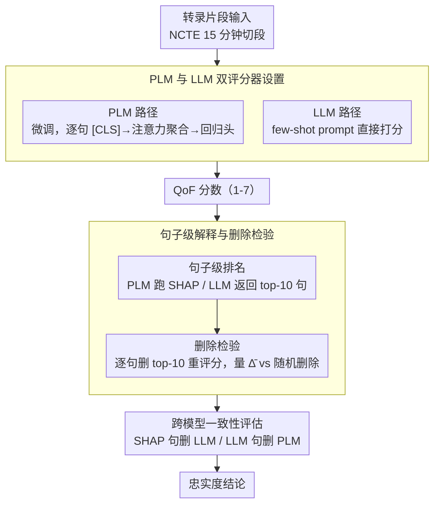

# From Scoring to Explanations: Evaluating SHAP and LLM Rationales for Rubric-based Teaching Quality Assessment

**会议**: ACL2026 Findings  
**arXiv**: [2606.05180](https://arxiv.org/abs/2606.05180)  
**代码**: 未在 cache 中给出  
**领域**: 教育NLP / 可解释性 / Rubric自动评分  
**关键词**: SHAP, LLM解释, 教学质量评估, 句子级归因, 删除检验  

## 一句话总结
这篇论文提出一个面向 rubric 自动评分的句子级解释评估框架，在课堂教学反馈质量评分任务上比较微调 PLM、prompted LLM、SHAP 归因和 LLM rationale，发现 fine-tuned PLM 更准，而 SHAP 比 LLM 生成的解释更忠实、更可迁移。

## 研究背景与动机
**领域现状**：自动 rubric 评分已经被用于作文、同伴反馈、课堂转录、临床记录等开放式语言表现评估。模型通常输出一个标量分数，用来表示文本是否符合某个评分维度。

**现有痛点**：只给分数远远不够，尤其是在教育这类高风险场景中。教师、学生和管理者需要知道模型为什么给出某个评分，才能信任、质疑或改进相关反馈。LLM 可以生成看起来很合理的自然语言解释，但已有研究表明这些 explanation 往往只是 plausible，不一定 faithful。

**核心矛盾**：rubric 评分要求可解释、可追责，但强模型的内部决策过程很难直接观察；LLM rationale 易读，却可能不反映真实计算依据；SHAP 这类归因方法更接近因果影响，但在长课堂转录和多级 rubric 场景中缺少系统比较。

**本文目标**：作者希望回答三个问题：PLM 和 LLM 谁更适合给 Quality of Feedback 打分；SHAP 和 LLM sentence ranking 哪个更能找出真正影响评分的句子；一种模型生成的解释能否迁移到另一类模型。

**切入角度**：论文把 explanation 定义为句子级 evidence ranking，而不是自由文本理由。这样可以用统一的删除检验衡量忠实性：如果删除解释方法选出的 top-k 句子后模型预测明显改变，说明这些句子确实影响了评分。

**核心 idea**：用“句子级 SHAP / LLM ranking → 删除 top-10 句子 → 重新评分 → 比较预测变化”的协议，系统检验 rubric 评分解释是否 faithful，并进一步做跨模型 transfer 测试。

## 方法详解
这篇论文的方法更像一个 evaluation framework，而不是单个新模型。作者先训练或调用两类评分器，再用两类解释方法找出重要句子，最后通过删除这些句子后的分数变化来评估解释质量。

### 整体框架
数据来自 NCTE elementary mathematics classroom transcripts，共 1,600 多节课，切成 6,005 个 15 分钟片段，并由专家按 CLASS 框架标注。本文只研究 Instructional Support 下的 Quality of Feedback 维度，分数为 1-7。训练集 4,775 段，测试集 1,230 段，同一班级不会跨 split。对于每个转录片段，模型先输出 QoF 分数；解释方法再给出最重要的句子排名；系统逐个删除 top-10 句子并重新评分，用平均连续预测变化 $\overline{\Delta}$ 衡量解释是否真的命中模型依赖的证据。

### 关键设计

**1. PLM 与 LLM 双评分器设置：先把两条技术路线摆在同一张桌子上，才能看清解释方法到底依附于谁**

rubric scoring 既可以走任务专门微调的老路，也可以走通用 instruction LLM 直接打分的新路，但单看任何一边，都无法判断后续的解释评估结论是普适的、还是只对某类模型成立。所以作者把两条路并列搭建：PLM 侧微调 BERT、ALBERT、RoBERTa、DeBERTaV3 的 base/large 版本，对一个 transcript segment 先逐句编码、每句取 `[CLS]` 表示，再经一层可训练 attention 聚合成文档向量，最后接线性回归头预测 1-7 的 QoF 标量；LLM 侧则直接调用 Llama 3.1、Mixtral、Qwen3、Mistral 等开源 instruction 模型，用 few-shot prompt 让它们读完片段后给分。前者代表有标注、需训练的监督式 rubric scoring，后者代表零训练、可即插即用的方案，两者并列之后，“解释方法是不是只在某一类模型上才忠实”这个问题才有了可比的实验基础。

**2. 句子级解释与删除检验：把“解释是否忠实”这种说不清的判断，变成一个能量出来的预测变化**

自由文本 rationale 读起来头头是道，却无法直接验证真假，这正是高风险评分场景最危险的地方。作者的破解办法是把 explanation 统一定义成句子级的 evidence ranking，再用删除检验把它和模型预测绑在一起。对 PLM，他们在文档级回归输出上跑 SHAP，把每个句子 embedding 当作一个 feature，得到该句的 Shapley value；对 LLM，则在 zero-shot prompt 下让模型直接返回最有影响力的 10 个句子编号。拿到排名后按顺序逐句删除，记第 $i$ 步删除后的预测变化为 $\Delta_i=f(x_{-r_{i-1}})-f(x_{-r_i})$，并以 top-10 的平均变化 $\overline{\Delta}$ 作为忠实度度量——$\overline{\Delta}$ 越大，说明被选中的句子越接近模型真正依赖的证据。为排除“删任何句子都会扰动模型”这一混淆，作者同时跑随机删除 baseline 作对照，只有 ranked deletion 明显大于随机删除时，才能把变化归功于解释方法本身。

**3. 跨模型一致性评估：检验一种模型找到的证据，对另一类架构是否也算数**

如果某个解释只能扰动它自己的源模型，那它更像是模型私有的行为癖好，而非真正的 rubric 相关证据。为此作者挑出 3 个 PLM（BERT large、DeBERTaV3 large、ALBERT base）和 3 个 LLM（Qwen3 235B、Mistral Small、Llama 3.1 8B）做交叉扰动：一边拿 LLM 选出的句子去删 PLM 的输入，另一边拿 PLM 的 SHAP 句子去删 LLM 的输入，再比较两条预测变化轨迹。能跨架构稳定改变预测的句子，说明它捕捉到的是更一般的 rubric-relevant evidence；只对源模型有效的句子，则暴露出该解释的“局部性”。

### 损失函数 / 训练策略
PLM 微调使用均方误差优化 1-7 QoF 回归目标。输入层面，每个句子截断到 128 tokens，每篇最多 263 个句子，覆盖 98% 句长和 90% 文档长度。LLM 不做任务微调，只用 deterministic decoding 进行 few-shot scoring 和 zero-shot sentence ranking，本地推理使用 4-bit nf4 quantization。解释评估统一使用同一句子切分、同样的删除规则和同样的 top-10 设置；少于 10 句或删空文本的情况在 1,230 个测试片段中只出现 17 个，占 1.3%。

## 实验关键数据

### 主实验
| 数据集 / 设置 | 指标 | 本文关键结果 | 对照方法 | 结论 |
|--------|------|------|----------|------|
| NCTE QoF test | MAE / MSE | DeBERTaV3 large 微调后 0.96 / 1.31 | constant baseline 0.96 / 1.35 | 最强 PLM 略优于常数基线，平均约 1 个 rubric point 误差 |
| NCTE QoF test | MAE / MSE | Mistral Small Instruct 1.02 / 1.78 | 最强 fine-tuned PLM 0.96 / 1.31 | LLM 不如微调 PLM 准，但输出范围更宽 |
| PLM 预测分布 | 分数范围 | DeBERTaV3 large 从不低于 2.03、不高于 5.89 | 真实标尺 1-7 | PLM 有 label compression，极端分数学不好 |
| LLM 预测分布 | 均值 / 标准差 | Mistral Small 4.37 / 0.77 | DeBERTaV3 large 4.14 / 0.16 | LLM 覆盖更广但误差更大 |
| 解释对齐 | Jaccard / Spearman | 平均 Jaccard 0.085，Spearman 0.062 | SHAP vs 9 个 LLM ranking | SHAP 与 LLM rationale 基本不选同一批句子 |

### 消融实验
| 配置 | 关键指标 | 说明 |
|------|---------|------|
| BERT large + SHAP ranked deletion | $\overline{\Delta}=0.0329$ | PLM 中删除 SHAP 重要句子影响最大 |
| DeBERTaV3 large + SHAP ranked deletion | $\overline{\Delta}=0.0049$ | 即便评分最准，预测也可能对单句删除不敏感 |
| Qwen3 235B + LLM ranked deletion | $\overline{\Delta}=0.0388$ | LLM 中 Qwen3 235B 的自解释扰动最大 |
| Mistral Small + LLM ranked deletion | $\overline{\Delta}=0.0033$ | 最准 LLM 的 rationale 不一定最 faithful |
| Random deletion baseline | 多数接近 0，如 BERT large 0.0082、Qwen3 235B -0.0036 | ranked deletion 的更大变化不是由随机删句造成 |
| SHAP → LLM transfer | 首个 SHAP 句子常导致 LLM 预测立即大幅变化 | SHAP evidence 对 LLM 也有影响 |
| LLM rationale → PLM transfer | 变化显著小于 SHAP 删除，且轨迹常非单调 | LLM rationale 对 PLM 决策依据迁移差 |

### 关键发现
- 微调 PLM 的 scoring accuracy 更好，但会把预测压缩到 3-5 分附近，极端课堂反馈质量不容易识别。
- LLM 能输出更完整的 1-7 分布，但 MAE/MSE 更高，而且 sentence-ranking 输出格式不稳定，有些模型即使重试 10 次也不能稳定返回 10 个句子。
- SHAP 解释在自模型删除和跨模型删除中都更稳定；LLM rationale 直观上可能像“理由”，但对模型预测的实际影响有限。
- 教师话语确实是主要证据来源：LLM 选择教师 utterance 的比例为 79.5%，PLM 为 74.0%，符合 QoF 维度的任务定义。

## 亮点与洞察
- **把解释评估从“看起来合理”拉回到“是否改变预测”**：教育场景很容易被自然语言 rationale 的可读性说服，本文用删除检验提醒我们，解释必须和模型行为绑定。
- **SHAP 和 LLM rationale 的不对称很有启发**：LLM 选出的句子通常对 PLM 影响不大，但 SHAP 句子能明显扰动 LLM。这说明传统归因方法在某些高风险 NLP 应用里仍然不可替代。
- **结果暴露了评分准确率和解释忠实性的错位**：DeBERTaV3 large 是最强 scorer，却不是最敏感的 explanation target；Mistral Small 是最强 LLM scorer，却拥有很低的删除变化。这提示模型选择不能只看 MAE。
- **框架可迁移性强**：只要任务是长文本 rubric scoring，并且可按句子或片段删除，就能复用这个协议到作文评分、同伴反馈、医疗记录质量评估等场景。

## 局限与展望
- 数据集规模和标签分布受限。虽然 QoF 是 CLASS 维度里相对不偏的一个，6k 片段中仍只有 19% 标签在 3-5 之外，这直接导致 PLM label compression。
- 论文只研究文本转录，CLASS 真实评分还依赖语音、停顿、节奏、视觉互动等多模态信号，文本-only 模型可能漏掉关键教学行为。
- 每个片段只有一个专家标注，无法估计 inter-rater reliability，也无法区分模型误差和人类主观标注噪声。
- 删除句子会破坏课堂话语连贯性，尤其可能影响依赖 discourse flow 的 LLM。未来可以加入 human rationale 或 construct relevance 标注，验证被选句子是否真的符合 rubric 构念。
- LLM sentence ranking 的格式可靠性仍是工程风险，高风险教育系统不能直接依赖自由生成解释。

## 相关工作与启发
- **vs attention-based explanation**: attention 权重是否等同解释一直有争议；本文选择 SHAP 和删除检验，更接近“证据是否影响输出”的 faithfulness 标准。
- **vs LIME / SHAP essay scoring**: 早期 SHAP 用于自动作文评分和 rubric 解释，本文把它扩展到长课堂转录、层次化 PLM 和跨模型评估。
- **vs LLM chain-of-thought rationale**: CoT 或自然语言理由可能提高可读性，但不一定忠实。本文的句子 ranking 结果进一步说明，LLM rationale 在高风险评分中需要被独立验证。
- **启发**：以后做可解释教育 NLP 时，可以把 explanation 模块当成一个可测试组件：既看用户是否理解，也看删除、替换、反事实扰动是否真的改变模型预测。

## 评分
- 新颖性: ⭐⭐⭐⭐☆ 删除检验和 SHAP 不是新概念，但把 PLM/LLM rubric scoring、sentence rationale、跨模型 transfer 放在同一协议下很有价值。
- 实验充分度: ⭐⭐⭐⭐☆ 模型覆盖广，解释评估细；不足是只有 QoF 一个维度、一个教育数据集，缺少人工句子级证据标注。
- 写作质量: ⭐⭐⭐⭐☆ 研究问题清晰，实验叙述扎实，教育动机充分；表格多但主线不乱。
- 价值: ⭐⭐⭐⭐☆ 对高风险场景里的 LLM explanation 使用有很强警示意义，尤其提醒不要把流畅 rationale 当成 faithful rationale。

<!-- RELATED:START -->

## 相关论文

- [\[ACL 2025\] A Rose by Any Other Name: LLM-Generated Explanations Are Good Proxies for Human Explanations to Collect Label Distributions on NLI](../../ACL2025/aigc_detection/a_rose_by_any_other_name_llm-generated_explanations_are_good_proxies_for_human_e.md)
- [\[ACL 2026\] Who Wrote This Line? Evaluating the Detection of LLM-Generated Classical Chinese Poetry](who_wrote_this_line_evaluating_the_detection_of_llm-generated_classical_chinese_.md)
- [\[AAAI 2026\] BAID: A Benchmark for Bias Assessment of AI Detectors](../../AAAI2026/aigc_detection/baid_a_benchmark_for_bias_assessment_of_ai_detectors.md)
- [\[CVPR 2026\] Quality-Aware Calibration for AI-Generated Image Detection in the Wild](../../CVPR2026/aigc_detection/quality-aware_calibration_for_ai-generated_image_detection_in_the_wild.md)
- [\[ACL 2026\] AEGIS: A Holistic Benchmark for Evaluating Forensic Analysis of AI-Generated Academic Images](aegis_a_holistic_benchmark_for_evaluating_forensic_analysis_of_ai-generated_acad.md)

<!-- RELATED:END -->
