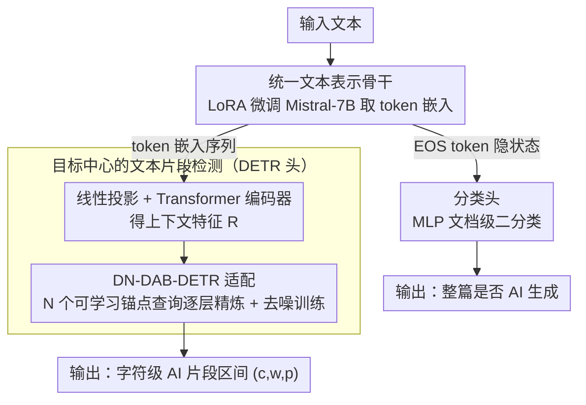

# GigaCheck: Detecting LLM-generated Content via Object-Centric Span Localization

**会议**: ACL 2026 Findings  
**arXiv**: [2410.23728](https://arxiv.org/abs/2410.23728)  
**代码**: [GitHub](https://github.com/ai-forever/gigacheck)  
**领域**: 目标检测  
**关键词**: LLM生成文本检测, 目标检测范式, DETR, 文本片段定位, 人机协作文本

## 一句话总结

提出 GigaCheck，一个双策略框架：文档级使用微调 LLM 进行分类，片段级创新地将 AI 生成文本片段视为"目标"，用 DETR-like 架构实现端到端的字符级定位。

## 研究背景与动机

**领域现状**：随着 LLM 生成内容质量的快速提升，AI 生成文本在许多场景下已难以与人写文本区分。检测 AI 生成内容已成为对抗虚假信息、学术欺诈和垃圾内容传播的重要需求。

**现有痛点**：(1) 文档级检测方法在人机协作文本（部分人写+部分机写）上可靠性不足；(2) 现有的片段级检测方法主要基于 token 级序列标注(BIO)，需要手动后处理来聚合 token 为连续片段，且受限于句子边界和固定粒度；(3) 检测方法的发展速度落后于生成模型的进步。

**核心矛盾**：需要同时解决文档级分类（"这篇文章是否为 AI 生成？"）和片段级定位（"具体哪些段落是 AI 生成的？"），且两个任务之间应共享表示以提高效率。

**本文目标**：提出一个统一框架，既能进行高精度的文档级检测，又能精确定位 AI 生成的文本片段。

**核心idea**：将 AI 生成的文本片段类比为图像中的"目标"，利用视觉目标检测中成熟的 DETR 架构进行端到端的 1D 片段检测，将视觉检测的鲁棒性迁移到文本领域。

## 方法详解

### 整体框架

GigaCheck 用一套"共享骨干 + 双头"结构同时回答两个问题。输入文本先经 LoRA 微调的 Mistral-7B 提取 token 嵌入；分类头取末位 EOS token 的隐状态接 MLP 给出"整篇是否 AI 生成"的文档级判断，DETR 头则把嵌入序列当作一维特征图、像检测图像目标一样直接回归出"哪几段是 AI 写的"的字符级区间。两个头共享同一微调骨干、可独立使用，于是文档级分类与片段级定位都建立在同一份文本表示之上。

### 关键设计

**1. 统一文本表示骨干：用一份 LoRA 微调嵌入同时喂分类头和检测头**

检测数据集通常偏小，全参微调容易过拟合且训练慢，所以骨干用 LoRA 微调 Mistral-7B——冻结预训练权重、只训练低秩矩阵，在小数据上泛化更好、收敛更快。训练时设两个代理任务：三类分类（人写/机写/协作）用于产出冻结特征供 DETR 头使用，二类分类（人写/机写）与分类头联合训练。同一份嵌入能在分类和检测两条任务上都表现优异，本身就验证了这份表示的通用性。这份共享骨干是后两个设计的共同输入：EOS token 隐状态走分类头，整段 token 嵌入序列走检测头。

**2. 目标中心的文本片段检测：把 AI 生成的连续片段当成一维"目标"端到端定位，绕开序列标注的后处理**

序列标注（BIO）方法只能给每个 token 打标签，再靠启发式规则把 token 聚合成连续片段，受限于句子边界和固定粒度。GigaCheck 把这件事重构成检测问题：从微调 LLM 得到 token 嵌入 $\mathbf{E}$，经线性投影和 Transformer 编码器得到上下文特征 $\mathbf{R}$；$N$ 个可学习锚点查询 $(c,w)$（中心、宽度）在 Transformer 解码器里逐层精炼，每层预测偏移 $(\Delta c,\Delta w)$，最终输出 $(c,w,p)$ 三元组——中心、宽度、置信度，全部归一化到 $[0,1]$ 的字符级区间。因为直接回归连续区间，既不需要任何聚合后处理，定位粒度也是字符级、不受分词器影响。

**3. DN-DAB-DETR 适配：把视觉检测里最稳的定位机制搬到文本上**

把检测范式落到一维文本上，同样面临 DETR 训练不稳、收敛慢的老问题。GigaCheck 采用 DAB-DETR 的可学习锚框作为位置查询、并叠加 DN-DETR 的去噪训练策略（可学习查询与加噪 GT 查询一起训练），预测与 GT 之间用匈牙利匹配配对。作者对比了 DAB-DETR、Deformable DETR、CO-DETR 等变体，DN-DAB-DETR 在定位精度与训练稳定性上都最好，因此被选作检测头的解码器。

### 损失函数 / 训练策略

检测头的损失是 L1 + gIoU + Focal Loss 的加权和，分别对匈牙利匹配的预测和去噪 GT 查询计算；分类头用二元交叉熵。训练时分两段：训练 DETR 头时冻结骨干，训练分类头时骨干可训练。

## 实验关键数据

### 主实验（分类）

| 数据集 | GigaCheck(Mistral-7B) | 之前SOTA | 说明 |
|--------|---------------------|----------|------|
| TuringBench(FAIR) | 高精度 | 基于 RoBERTa 的方法 | 统一骨干即可达到强分类性能 |
| TweepFake | 高精度 | - | 推文领域验证 |
| MAGE | 高精度 | - | 多生成器、多领域的大规模验证 |

### 主实验（片段检测）

| 数据集 | GigaCheck(DETR) | 之前方法 | 说明 |
|--------|---------------|---------|------|
| RoFT | 强定位精度 | 序列标注方法 | 单边界场景 |
| RoFT-ChatGPT | 强定位精度 | - | ChatGPT 生成场景 |
| TriBERT | 强定位精度 | - | 多边界(1-3)场景 |

### 关键发现
- DETR 架构可以成功从视觉空间推广到文本空间，证明了目标检测范式在 NLP 中的可行性
- 同一微调骨干在分类和检测两个任务上都表现优异，验证了学到的嵌入具有强泛化能力
- 端到端的片段检测消除了序列标注方法中的启发式后处理需求
- 基于 LoRA 的参数高效微调在小数据集上特别有效

## 亮点与洞察
- **范式创新**：将文本片段检测重新定义为 1D 目标检测问题，是一个优雅且有效的跨领域迁移
- **统一框架**：一个微调骨干同时服务于检测和分类，不仅高效，还验证了嵌入的通用性
- **端到端设计**：DETR 直接输出字符级区间，避免了 BIO 标注+后处理的繁琐流程
- **模型无关性**：骨干可替换为任何解码器式 LLM，框架具有良好的扩展性
- **开源贡献**：完整代码公开发布，促进可复现性

## 局限与展望
- 当前仅在英语文本上评估，多语言适配是重要的未来方向
- 检测数据集中的生成器主要是较早期的模型（GPT-2/3、CTRL），对最新 LLM 的检测效果未知
- DETR 的查询数量 $N$ 需要根据数据集预设，无法动态适应
- 与对抗性攻击（如释义、水印移除）的鲁棒性分析不足
- 未来可探索多粒度检测（段落级 + 句子级 + 词级的联合检测）

## 相关工作与启发
- **vs Sci-SpanDet**：Sci-SpanDet 依赖 IMRaD 文档结构进行科学论文检测，GigaCheck 领域无关，可应用于任意文本
- **vs 序列标注方法(BIO)**：序列标注需要手动聚合 token 为片段，GigaCheck 直接回归连续区间
- **vs 统计方法(DetectGPT等)**：统计方法需要访问被检测 LLM 的概率分布，GigaCheck 无此需求

## 评分
- 新颖性: ⭐⭐⭐⭐⭐ 首次将 DETR 应用于文本片段定位，范式创新意义重大
- 实验充分度: ⭐⭐⭐⭐ 3个分类+3个检测基准的双重验证，但缺乏最新 LLM 的测试
- 写作质量: ⭐⭐⭐⭐ 架构图清晰，方法描述严谨，跨模态类比恰当
- 价值: ⭐⭐⭐⭐ 为 AI 生成文本检测提供了新的技术路线，开源增强了影响力

<!-- RELATED:START -->

## 相关论文

- [\[ACL 2026\] Temporal Flattening in LLM-Generated Text: Comparing Human and LLM Writing Trajectories](temporal_flattening_in_llm-generated_text_comparing_human_and_llm_writing_trajec.md)
- [\[ACL 2025\] KatFishNet: Detecting LLM-Generated Korean Text through Linguistic Feature Analysis](../../ACL2025/aigc_detection/katfishnet_detecting_llm-generated_korean_text_through_linguistic_feature_analys.md)
- [\[NeurIPS 2025\] Can LLMs Write Faithfully? An Agent-Based Evaluation of LLM-generated Islamic Content](../../NeurIPS2025/aigc_detection/can_llms_write_faithfully_an_agent-based_evaluation_of_llm-generated_islamic_con.md)
- [\[CVPR 2026\] Inconsistency-aware Multimodal Schrodinger Bridge for Deepfake Localization](../../CVPR2026/aigc_detection/inconsistency-aware_multimodal_schrodinger_bridge_for_deepfake_localization.md)
- [\[ACL 2025\] Cognitive Framework for Detecting AI-Generated Fiction](../../ACL2025/aigc_detection/cognitive_framework_for_detecting_ai-generated_fiction.md)

<!-- RELATED:END -->
