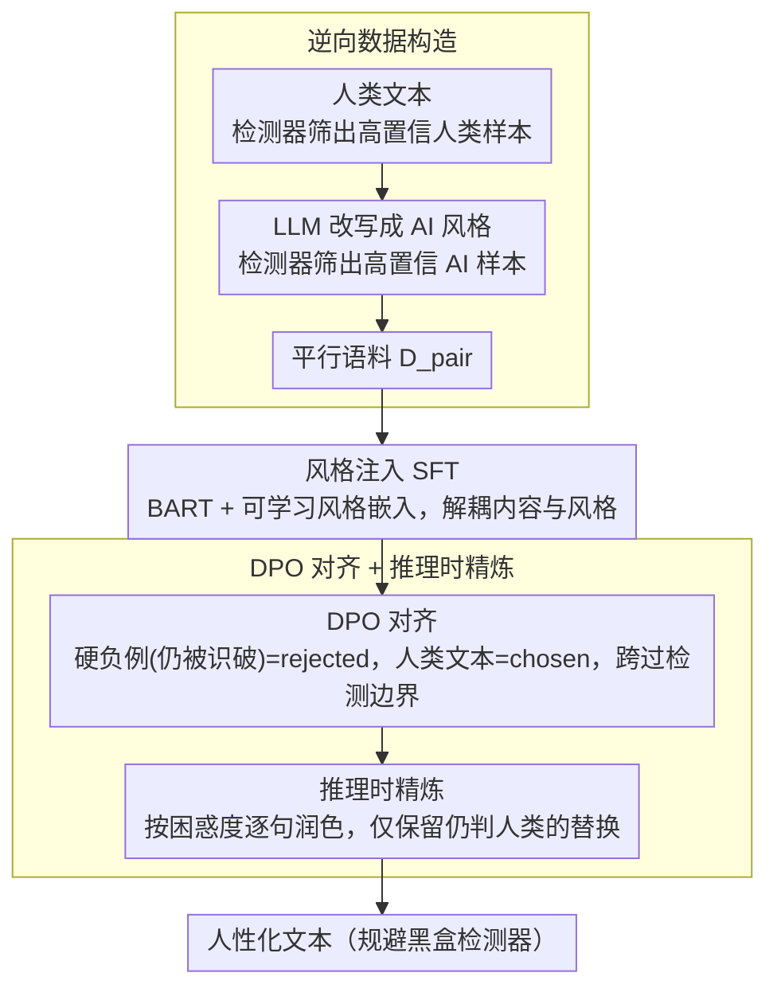

# MASH: Evading Black-Box AI-Generated Text Detectors via Style Humanization

**会议**: ACL 2026 Findings  
**arXiv**: [2601.08564](https://arxiv.org/abs/2601.08564)  
**代码**: [https://github.com/githigher/MASH](https://github.com/githigher/MASH)  
**领域**: 图像生成/文本检测对抗  
**关键词**: AI生成文本检测, 黑盒对抗攻击, 风格迁移, 文本人性化, DPO对齐

## 一句话总结

本文提出 MASH（多阶段风格人性化对齐），通过风格注入 SFT → DPO 对齐 → 推理时精炼三阶段流水线，训练一个仅 0.1B 参数的改写器，在黑盒设置下以 92% 的平均攻击成功率规避 AI 文本检测器，同时保持优秀的语言质量。

## 研究背景与动机

**领域现状**：AI 生成文本（AIGT）的滥用催生了大量检测方法的发展，包括基于训练的检测器（如 RoBERTa fine-tuned 分类器）和零样本检测器（如 Binoculars、Fast-DetectGPT）。这些检测器在标准基准上已取得很高的准确率，部分商业 API（Writer、Scribbr）也已广泛部署。

**现有痛点**：现有对抗规避策略存在严重的实用性障碍——（1）基于扰动的方法（如 TextFooler、Charmer）在黑盒设置下攻击成功率有限；（2）基于提示的方法（如 PromptAttack）依赖模型的指令遵循一致性，效果不稳定；（3）基于改写的方法（如 DIPPER、DPO-Evader）通常需要白盒访问源生成器或目标检测器的内部信息。

**核心矛盾**：检测器通过捕捉 AI 文本与人类文本在语义和统计特征分布上的差异来识别 AI 文本。要有效规避检测，必须从根本上改变 AI 文本的风格分布使其接近人类文本分布，但这需要在保持语义不变的同时完成"机器风格→人类风格"的迁移——而直接获取平行训练数据（AI文本→对应人类文本）非常困难。

**本文目标**：设计一个纯黑盒的风格迁移框架，无需访问源生成器或目标检测器的内部信息，能将任意 LLM 生成的文本人性化以规避检测。

**切入角度**：逆向构造训练数据——虽然"AI→人类"的平行数据难以获取，但"人类→AI"方向很容易（用 LLM 改写人类文本即可）。利用这种逆向构造获得平行语料，然后通过风格注入 SFT 学习人类风格模式。

**核心 idea**：将检测器规避重新定义为专门的"机器风格→人类风格"文本风格迁移任务，通过 SFT 学习人类风格 + DPO 学习跨越检测边界 + 推理时精炼保证质量的三阶段流水线实现。

## 方法详解

### 整体框架

MASH 把"规避检测器"重构成一个"机器风格→人类风格"的文本风格迁移问题，用一条四阶段流水线训练出一个仅 0.1B 参数的改写器。先逆向构造平行语料——从现成人类文本反向生成对应的 AI 风格文本，绕开"AI→人类"平行数据稀缺的难题；再用风格注入 SFT 让改写器学会"人类风格长什么样"；接着用 DPO 把它推到"知道怎么跨过检测边界"；最后在推理时按句精炼修复流畅度。整条链路全程黑盒，不需要源生成器或目标检测器的内部信息。

### 关键设计

**1. 逆向数据构造：用"人类→AI 容易"的方向不对称性，零标注地造出平行语料**

要学"AI→人类"的风格迁移，最直接的是拿成对的 AI 文本和对应人类文本来训，但这种平行数据极难获取。MASH 反过来利用一个不对称性：让 LLM 把人类文本改写成 AI 风格非常容易。具体做法是从开源数据集收原始文本，用检测器筛出高置信度人类文本 $\mathbf{x}_{human}$（$D(\mathbf{x}_{human})<\tau$），再用 LLM 把每条改写成语义等价的 AI 文本、并用检测器筛出高置信度 AI 文本（$D(\mathbf{x}_{ai})>\tau$），最终得到 $N$ 对平行数据 $\mathcal{D}_{pair}=\{(\mathbf{x}_{ai}^{(i)},\mathbf{x}_{human}^{(i)})\}$。整个过程无需任何人工标注或对齐，把"难的方向"换成"容易的方向"来凑训练集。

**2. 风格注入 SFT：用可学习风格嵌入解耦内容与风格，给改写器一个不丢语义的起点**

直接拿平行数据微调容易过拟合并丢语义。MASH 在预训练 BART 上引入两个可学习风格嵌入 $\mathbf{s}_{ai},\mathbf{s}_{human}\in\mathbb{R}^d$，编码器先产出内容表示 $\mathbf{H}_{content}$，融合层再把选定风格线性注入：$\mathbf{H}_{fused}^{(t)}=\mathbf{W}_p\cdot[\mathbf{h}_{content}^{(t)};\mathbf{s}_{style}]+\mathbf{b}_p$。训练用多任务目标 $\mathcal{L}_{SFT}=\lambda\mathcal{L}_{recon}+(1-\lambda)\mathcal{L}_{trans}$——重建损失 $\mathcal{L}_{recon}$（注入 AI 风格后重建原 AI 文本，约束语义保持）加迁移损失 $\mathcal{L}_{trans}$（注入人类风格后生成人类文本，学习风格模式）。风格嵌入把"写什么内容"和"用什么风格写"拆开，双任务联合训练让改写器既会换风格又不丢原意。

**3. DPO 对齐 + 推理时精炼：先把改写器推过检测边界，再在不牺牲规避效果的前提下补流畅度**

SFT 只让模型知道"目标风格是什么"，但不知道"离检测边界还有多远、怎么跨过去"。MASH 把检测器置信度的负缩放当作隐式奖励 $r(x,y)=-C\cdot D(y)$，最大化它会让最优策略收敛到 $D(y)\to 0$ 的区域；训练对用硬负例挖掘——把 SFT 输出中仍被识破的样本当 rejected response、真实人类文本当 chosen response 构成 DPO 数据。推理阶段再按困惑度降序逐句精修：对低流畅度的句子用 LLM 改写，仅当检测器仍判为人类时才接受替换。这样 SFT 与 DPO 在"是什么风格"和"如何越界"上功能互补，末端精炼又在不破坏攻击效果的前提下把流畅度补回来。

### 一个完整示例

给定一段 ChatGPT 生成的文本，MASH 先在数据准备期反向造好平行语料；改写器接收这段文本后，编码出内容表示并注入 $\mathbf{s}_{human}$ 风格嵌入，生成一版"读起来像人写"的改写。若此版仍被检测器判为 AI（$D>\tau$），它就是 DPO 阶段的硬负例，驱动模型往检测边界外再走一步。最终输出前，系统按困惑度挑出最不通顺的几句逐句润色，只保留那些"既更流畅、又仍被判人类"的替换，于是得到一段既规避检测又读得通顺的文本。

### 损失函数 / 训练策略

- SFT 阶段：多任务损失 $\mathcal{L}_{SFT} = \lambda\mathcal{L}_{recon} + (1-\lambda)\mathcal{L}_{trans}$，基于 BART-base 初始化
- DPO 阶段：$\mathcal{L}_{DPO} = -\mathbb{E}[\log\sigma(h_\theta(\mathbf{y}_w|\mathbf{x}) - h_\theta(\mathbf{y}_l|\mathbf{x}))]$，其中 $h_\theta(\mathbf{y}|\mathbf{x}) = \beta\log\frac{\pi_\theta(\mathbf{y}|\mathbf{x})}{\pi_{ref}(\mathbf{y}|\mathbf{x})}$
- 硬负例筛选条件：$D(\mathbf{y}_l) > \tau$，确保最大化偏好对之间的概率间隔
- 使用 AdamW 优化器，单张 NVIDIA RTX 3090 GPU 训练

## 实验关键数据

### 主实验（对 RoBERTa 检测器，ASR↑）

| 方法 | Essay | Reuters | WP | Humanity | Social | STEM | 平均 |
|------|-------|---------|-----|----------|--------|------|------|
| DeepWordBug | 0.13 | 0.02 | 0.51 | 0.07 | 0.11 | 0.07 | 0.15 |
| TextFooler | 0.38 | 0.29 | 0.59 | 0.11 | 0.10 | 0.07 | 0.26 |
| Charmer | 0.45 | 0.05 | 0.62 | 0.73 | 0.84 | 0.29 | 0.50 |
| GradEscape | 0.22 | 0.02 | 0.00 | 0.37 | 0.52 | 0.38 | 0.25 |
| CoPA | 0.01 | 0.00 | 0.17 | 0.20 | 0.19 | 0.16 | 0.12 |
| **MASH (Ours)** | **0.95** | **0.73** | **0.90** | **0.87** | **0.98** | **1.00** | **0.92** |

### 消融实验（对 Binoculars 检测器）

| 配置 | Essay ASR | Reuters ASR | WP ASR | 说明 |
|------|-----------|-------------|--------|------|
| MASH Full | 0.94 | 0.95 | 0.85 | 完整方法 |
| w/o DPO | ~0.23* | ~0.16* | ~0.33* | 去掉 DPO 后 ASR 大幅下降 |
| w/o Style-SFT | ~0.03* | ~0.03* | ~0.02* | 去掉 SFT 后几乎无效 |

*消融数值从 DPO-Evader baseline 估算（该方法仅用 DPO 无 Style-SFT）

### 关键发现

- **0.1B 参数模型超越大模型**：基于 BART-base（0.14B）的 MASH 在攻击成功率上全面超越使用大 LLM 的 PromptAttack、DIPPER 等方法，证明精细的风格对齐比模型规模更重要。
- **文本质量保持优秀**：MASH 在 GRUEN（流畅度）指标上与最佳基线持平或更优，BERTScore（语义保持）保持在 0.89-0.90 范围，PPL 控制在合理水平。
- **跨检测器泛化性强**：对 RoBERTa（训练式）、Binoculars（零样本）、SCRN（去噪重建式）以及商业 API（Writer、Scribbr）均表现出色。
- **每阶段递进贡献**：Style-SFT 提供基础风格迁移能力，DPO 显著提升跨越检测边界的能力，推理时精炼进一步保证输出质量。三阶段缺一不可。

## 亮点与洞察

- **逆向数据构造的巧妙性**：利用"AI 改写人类文本容易、人类改写 AI 文本困难"的不对称性，零成本获取高质量平行语料。这个思路可推广到任何存在单向转换不对称性的风格迁移任务。
- **检测规避 = 风格迁移的重新定义**：将对抗检测器的目标重新框架为一个风格迁移问题，从"如何骗过检测器"转变为"如何让文本读起来像人写的"，视角转变带来了方法论上的突破。
- **DPO 的隐式对抗训练**：将检测器置信度作为隐式奖励嵌入 DPO 框架，不需要显式定义奖励模型，优雅地将偏好学习与对抗优化统一。
- **极低计算开销**：单张 3090 GPU 即可训练，BART-base 仅 0.14B 参数，推理时无需查询检测器（仅训练阶段需要有限交互），适合实际部署。

## 局限与展望

- 仅测试了 ChatGPT 生成的文本作为源，其他 LLM（如 Claude、Llama）生成的文本的迁移效果未验证。
- DPO 阶段需要对检测器的有限查询交互，在检测器完全无法访问时需要替代方案。
- 仅评估了英文文本，多语言场景下的风格差异和检测规避待探索。
- 论文仅从攻击者视角出发，未深入讨论如何构建对 MASH 鲁棒的检测器。
- 推理时精炼阶段依赖外部 LLM Polisher，增加了一定的推理成本。

## 相关工作与启发

- **vs DIPPER (Krishna et al., 2023)**: DIPPER 使用 T5-XXL（11B）改写器控制词汇和句法参数，但需要白盒访问源生成器且在黑盒下 ASR 极低（Essay 仅 0.07）。MASH 仅用 0.14B 模型在纯黑盒下达到 0.95。
- **vs DPO-Evader (Nicks et al., 2023)**: DPO-Evader 直接用 DPO 优化但缺少 Style-SFT 初始化，ASR 极低（Essay 0.00）。证明 SFT 提供的风格先验对 DPO 成功至关重要。
- **vs CoPA (Fang et al., 2025)**: CoPA 依赖高计算开销的对比学习改写，在黑盒下 ASR 仅 0.01-0.20。MASH 通过更高效的 SFT+DPO 流水线全面超越。
- **vs GradEscape (Meng et al., 2025)**: GradEscape 需要检测器梯度信息，在严格黑盒下效果大幅下降。MASH 在纯黑盒设置下仍保持高 ASR。

## 评分

- 新颖性: ⭐⭐⭐⭐ 将检测规避重定义为风格迁移是新颖视角，逆向数据构造巧妙
- 实验充分度: ⭐⭐⭐⭐⭐ 6 个领域、5 个检测器、11 个基线的全面对比，质量指标覆盖完整
- 写作质量: ⭐⭐⭐⭐ 方法描述清晰，各阶段动机阐述充分，理论推导严谨
- 价值: ⭐⭐⭐⭐ 揭示了当前 AIGT 检测器的脆弱性，对检测器鲁棒性研究有重要启示

<!-- RELATED:START -->

## 相关论文

- [\[ICML 2026\] Black-Box Detection of LLM-Generated Text Using Generalized Jensen-Shannon Divergence](../../ICML2026/aigc_detection/black-box_detection_of_llm-generated_text_using_generalized_jensen-shannon_diver.md)
- [\[ACL 2026\] When Personalization Tricks Detectors: The Feature-Inversion Trap in Machine-Generated Text Detection](when_personalization_tricks_detectors_the_feature-inversion_trap_in_machine-gene.md)
- [\[AAAI 2026\] BAID: A Benchmark for Bias Assessment of AI Detectors](../../AAAI2026/aigc_detection/baid_a_benchmark_for_bias_assessment_of_ai_detectors.md)
- [\[ACL 2026\] mdok-style at SemEval-2026 Task 10: Finetuning LLMs for Conspiracy Detection](mdok-style_at_semeval-2026_task_10_finetuning_llms_for_conspiracy_detection.md)
- [\[ACL 2026\] REFLEX: Self-Refining Explainable Fact-Checking via Verdict-Anchored Style Control](reflex_self-refining_explainable_fact-checking_via_verdict-anchored_style_contro.md)

<!-- RELATED:END -->
