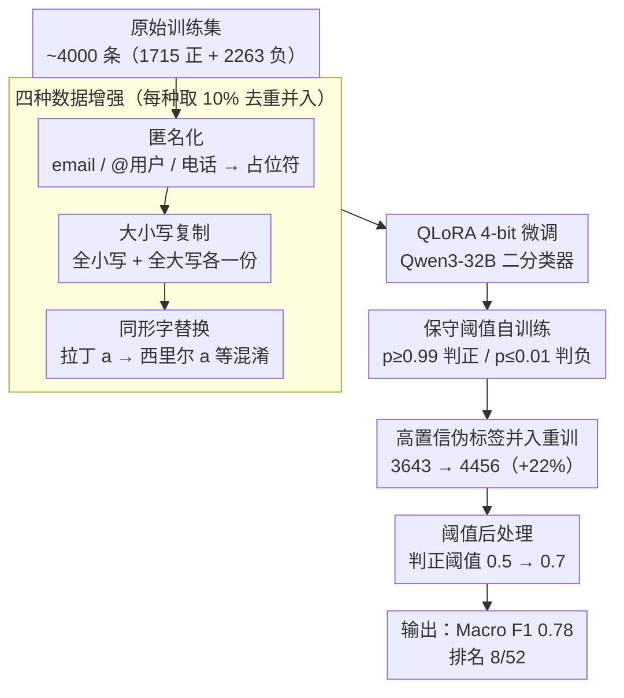

# mdok-style at SemEval-2026 Task 10: Finetuning LLMs for Conspiracy Detection

**会议**: ACL 2026 (SemEval-2026 Task 10)  
**arXiv**: [2605.02712](https://arxiv.org/abs/2605.02712)  
**代码**: https://github.com/kinit-sk/mdok-style-psycomark2026 (有)  
**领域**: 阴谋论检测 / SemEval / LLM 微调  
**关键词**: PsyCoMark、QLoRA、自训练、数据增强、Qwen3-32B

## 一句话总结
作者把自己在 PAN@CLEF2025 拿冠军的 mdok（机器生成文本检测器）的 finetuning 范式平移到阴谋论检测：用四种数据增强（匿名化 / 大小写 / 同形字 / 去重）扩训练集，再做一轮自训练（只保留 ≥0.99 或 ≤0.01 的高置信伪标签），用 QLoRA 4-bit PEFT 微调 Qwen3-32B，最终在 SemEval-2026 Task 10 subtask 2 拿 Macro F1 = 0.78，排名 8/52（85 百分位）。

## 研究背景与动机

**领域现状**：SemEval-2026 Task 10（PsyCoMark）把心理学与 NLP 结合起来，让参赛系统判断一条 Reddit 评论是否在表达阴谋论信念。subtask 2 是英文 Yes/No 二分类。提供的训练数据规模偏小——1715 正例 + 2263 负例，文本长度限制在 160–1000 字符。早期工作用 SVM + 词汇/风格特征；后续加心理语言学特征（确定性、情绪强度、不信任 framing）有所提升；近年 LLM 加入战局但有 hallucination 与 precision 问题，emotion-aware finetuned LLM（如 ConspEmoLLM）才把 vanilla LLM 推上去。

**现有痛点**：① 训练集对 32B 量级 LLM 太小，直接 fine-tune 会 overfit；② 阴谋论 text 在社媒里大量充斥 URL、@、邮箱、电话、同形字符号等噪声，模型的 tokenizer 容易被这些表面形态干扰；③ 大小写不一致是社媒常态，但传统分类器会被 case 误导；④ 主办方 dev / test set 都没公布 ground truth，无法做 supervised iteration 调参，只能盲打 Codabench。

**核心矛盾**：要在一个新任务上把 LLM 微调到 SOTA 级别，需要足够规模 + 多样性的训练数据；但 PsyCoMark 既小又狭窄，单纯监督训练顶不上去；同时用大模型还要控算力成本（DeBERTa <0.5B 已能拿 0.75，32B 提升空间未必大）。

**本文目标**：以最小工程改动把 mdok 的成功配方移植到阴谋论检测，验证"以 MGT 检测为母任务的 LLM 微调流水线"具有跨任务可迁移性。

**切入角度**：把"阴谋论检测"看作一个鲁棒二分类任务，借用 mdok 在 PAN@CLEF2025 第一名的三大武器——anonymization-as-augmentation、homoglyph-aware training、QLoRA 高效微调，再叠加一轮自训练利用未标 dev/test。

**核心 idea**：mdok-style 数据增强 + 高置信度阈值自训练 + Qwen3-32B QLoRA = 排进 SemEval top 20% 的稳健方案。

## 方法详解

### 整体框架

这篇 SemEval 系统论文的核心思路是：不发明新方法，而是把作者团队在 PAN@CLEF2025 拿冠军的 MGT 检测器 mdok 的整套微调配方，几乎原样搬到阴谋论检测上，验证它的跨任务可迁移性。整条流水线分三步串起来：先对仅 ~4000 条的原始训练集做四种数据增强扩样、去掉表面噪声的干扰，再用 QLoRA 4-bit 把 Qwen3-32B 微调成一个二分类器，最后用这个第一轮模型给主办方未公布答案的 dev/test 打高置信伪标签、并入训练集重训一遍，推理时再把判正阈值从 0.5 上调到 0.7 收一波 precision。最终 Macro F1 = 0.78，排名 8/52。

### 关键设计

**1. mdok 风格的四种数据增强：在 ~4000 条的小数据上注入多样性，逼模型学语义而非表面捷径**

阴谋论文本和 MGT 一样，社媒里塞满了 URL、@用户、CAPS 喊叫、故意替换的奇怪字符这类 spurious surface cue，模型一旦把它们当 shortcut 学进去，换个分布就崩。作者用四种增强把这些表面变化提前变成训练时见过的 noise：(i) **Anonymization** 用 regex 把 email、@用户、电话号码统一替换成 `[EMAIL]`、`[USER]`、`[PHONE]`（URL 已被组织方替成 `[URL]`），抹掉有标识性的 token；(ii) **Lower-casing / Upper-casing** 各复制一份全小写、全大写，把"阴谋论判断与大小写无关"这条先验显式注入，对治社媒大小写乱用；(iii) **Homoglyphication** 用同形不同源字符替换（如拉丁 `a` 换成西里尔 `а`），复刻攻击者常用的混淆手法，让分类器对 tokenizer 级扰动更鲁棒。每种增强只取 10% 再去重并入训练池，刻意控制比例避免增强样本淹没原始数据，最终得到 2126 负 + 1517 正。

**2. 保守阈值自训练：榨干未标的 dev/test，又把伪标签错误率压到最低**

主办方的 dev/test 没放 ground truth，但这些未标样本不用白不用。自训练的标准范式是先用 golden label 训出 teacher，teacher 在 unlabeled 集上打 silver label 再合并训 student——风险是 silver label 的错误会在迭代中复利累计。本文的关键改动是把阈值卡得极严：只有正类概率 $p\ge 0.99$ 才打正、$p\le 0.01$ 才打负，其余一律丢弃，等于只把模型"已经非常确定"的预测扩进训练池，silver label 错误率因此被压到极低。这一轮把训练集从 3643 扩到 4456（约 +22%，2575 负 + 1881 正）。这种"高 precision 低 recall"的自训练在不能调超参的比赛场景里尤其合适：既然只有一发子弹，就必须保证单轮收益是干净的，宁可少加样本也不引噪声。

**3. QLoRA 高效微调 + 阈值后处理：单卡驯服 32B，再白捡一个 F1 点**

32B 全量微调对学术 lab 不现实，作者用 QLoRA（4-bit 量化 + 低秩适配器）只更新一小部分参数，让 Qwen3-32B 能在单张 A100 64GB 上跑完（约 100 GPU·h），分类头用 transformers 的 sequence classification。推理阶段的阈值后处理则是不动模型参数就能拿到的额外增益：正类概率默认按 0.5 判正，但作者发现调到 0.7 能再涨 1 个 F1 点（0.77 → 0.78），因为这个任务对 precision 更敏感——把无害评论误判成阴谋论的代价远高于漏判。在比赛里这等于"白捡"的一分。

### 损失函数 / 训练策略
- 二分类 cross-entropy（transformers seq-cls 默认），无 class weighting；
- 用 holdout 100×2 样本做验证（因为 dev set 无 label），按 Macro F1 选 checkpoint；
- 自训练只跑一轮——作者明确没做多轮迭代，可能是为了控制错误累积；
- base 模型选择阶段比较了 Qwen3 (4B base / 14B base / 32B) 与 Gemma-3 (1B PT / 12B PT)，最终 dev 阶段（无 self-training）Qwen3-32B 胜出。

## 实验关键数据

### 主实验（PsyCoMark subtask 2 官方测试集，Macro F1）

| 系统 | Macro F1 |
|---|---|
| **Qwen3-32B_ST_th0.7（提交版）** | **0.78** |
| Qwen3-32B_ST | 0.77 |
| Qwen3-32B_th0.7 | 0.77 |
| Qwen3-32B | 0.76 |
| DeBERTa-Large (<0.5B) | 0.75 |
| Qwen3-14B-Base | 0.75 |
| Gemma-3-1B-PT_ST | 0.75 |
| Qwen3-4B-Base | 0.75 |
| Gemma-3-12B-PT | 0.74 |
| Gemma-3-1B-PT | 0.73 |
| Qwen3-4B-Base_ST | 0.72 |
| Random baseline | 0.50 |

**Codabench 非官方排名**（节选）：

| Rank | Team | Macro F1 |
|---|---|---|
| 1 | NJUST_KMG | 0.89 |
| 2 | AGAI | 0.87 |
| 3 | jia57 | 0.86 |
| 4 | baishanxiaoqi | 0.80 |
| 5 | CSECU-DSG | 0.80 |
| 6 | joccerrillo | 0.79 |
| 7 | qinchihongye | 0.79 |
| **8** | **mdok-style** | **0.78** |
| ... | ... | ... |
| 52 | bpiper02 | 0.41 |

排名 8/52（85 百分位），距离冠军 0.89 还有 11 点差距，但优于 80%+ 团队。

### 消融实验（自训练 + 阈值的组合效果）

| 配置 | Macro F1 | $\Delta$ vs base |
|---|---|---|
| Qwen3-32B（裸） | 0.76 | – |
| + Self-Training | 0.77 | +0.01 |
| + threshold=0.7 | 0.77 | +0.01 |
| + Self-Training + threshold=0.7 | **0.78** | +0.02 |

Qwen3-4B 上自训练反而掉点（0.75→0.72），说明自训练对模型容量有要求——小模型已经欠拟合，silver label 引入的噪声反伤；大模型才有"以数据换性能"的本钱。

### 关键发现
- 32B 模型 + 全套技巧仅比 DeBERTa-Large (0.5B) 高 0.03，**性价比警示**：在这种 small-data 二分类任务上，大模型的边际收益有限，工程实践中 DeBERTa 仍是合适首选。
- 自训练 + 阈值后处理两个轻量技巧各自贡献约 1 F1 点，组合起来 +2 点；但都是 stack 在 base 强模型上的微调技巧，base 模型选择本身才是 0.73→0.76 的最大跳点。
- 即便用极严 ≥0.99 / ≤0.01 阈值，自训练在小模型（Qwen3-4B base、Gemma-3-1B PT）上仍有反向收益——这提示 silver label 的真实噪声率与基础模型预测可靠性高度相关。
- 跨任务迁移（mdok MGT → conspiracy）能跑通 85 百分位，验证了"finetuning + 数据增强 + 自训练"是 binary text classification 的通用骨架；具体任务只是换 label 含义。

## 亮点与洞察
- 把 mdok 的 anonymization + homoglyphication + case 三件套迁到阴谋论检测，证明"针对 spurious surface cue 的数据增强"对任何社媒文本分类都通用，可直接复用到 hate speech / scam / sentiment 等任务。
- ≥0.99 / ≤0.01 这种 ultra-strict 阈值的自训练策略在"主办方不放 ground truth"的比赛场景里特别适用——你只能信自己"非常确信"的预测，错了也不会反噬。
- 阈值移动（0.5→0.7）这个 free lunch 提醒大家：当任务对 false positive 敏感（阴谋论误判会被认为是 censorship）时，post-hoc threshold 比改 loss 函数省事且常常有效。
- 老老实实公开承认"DeBERTa 0.5B 拿 0.75 比 32B 拿 0.78 性价比好"，对 reproducibility 是诚意；写比赛系统论文敢说"用更小模型更便宜"难能可贵。

## 局限与展望
- 只在英文 PsyCoMark 上跑过，跨语言（西、法、德等）效果未知，作者本人也承认。
- 只比较了 Qwen3 与 Gemma-3 两个家族，没试 LLaMA-3 / Mistral / DeepSeek，model selection 空间不充分。
- 没引入外部数据集（其它公开 conspiracy / misinfo 语料），可能进一步提升泛化但未尝试。
- 自训练只跑 1 轮，多轮迭代 + 动态阈值是否能再涨 1-2 F1 没探索。
- 缺 error analysis（主办方未放 ground truth，作者承诺等数据公开再补），不清楚 32B 模型的 0.78 是输在哪一类语言模式上。
- 没有训练成本对比表，只在 acknowledgment 提了"100 GPU·h on A100 64GB"。

## 相关工作与启发
- **vs mdok (PAN@CLEF2025 winner, Macko 2025)**: 母系统聚焦 MGT detection 拿了双 subtask 第一名；本文几乎原样移植配方到阴谋论检测，证明该流水线的任务无关性。
- **vs ConspEmoLLM (Liu 2024)**: 他们把情绪信号显式拼进 transformer，本文走纯 prompt-agnostic finetune 路线，但用增强 + 自训练抹平表面变形，思路完全不同。
- **vs DeBERTa baseline**: DeBERTa-Large 0.75 vs Qwen3-32B 0.78，但 32B 算力开销超 50 倍——这是 small-data 任务上"大模型边际效益递减"的又一个典型案例。
- **vs SemEval-2024 Task 8 自己的早期工作 (spiegel-macko-2024-kinit)**: 那次他们已经证明 7B finetuned LLM 优于 BERT-like 小模型；本次在 32B 上验证规模再放大仍有提升但增量缩小。

## 评分
- 新颖性: ⭐⭐ 主要是已有 mdok 配方的跨任务复用，技术上无新方法
- 实验充分度: ⭐⭐⭐ 11 个系统对比 + 自训练/阈值消融到位，但缺多轮自训练、缺 error analysis、缺其它模型家族
- 写作质量: ⭐⭐⭐⭐ SemEval system paper 风格简洁、动机清晰、复现说明完整
- 价值: ⭐⭐⭐ 作为 SemEval 系统报告很扎实，但对学术界新知贡献有限；其工程经验（增强 + 严格自训练 + 阈值后处理）对 NLP 比赛参与者有直接借鉴价值

<!-- RELATED:START -->

## 相关论文

- [\[ACL 2026\] MASH: Evading Black-Box AI-Generated Text Detectors via Style Humanization](mash_evading_black-box_ai-generated_text_detectors_via_style_humanization.md)
- [\[ACL 2026\] REFLEX: Self-Refining Explainable Fact-Checking via Verdict-Anchored Style Control](reflex_self-refining_explainable_fact-checking_via_verdict-anchored_style_contro.md)
- [\[ICLR 2026\] PoliCon: Evaluating LLMs on Achieving Diverse Political Consensus Objectives](../../ICLR2026/aigc_detection/policon_evaluating_llms_on_achieving_diverse_political_consensus_objectives.md)
- [\[NeurIPS 2025\] Can LLMs Write Faithfully? An Agent-Based Evaluation of LLM-generated Islamic Content](../../NeurIPS2025/aigc_detection/can_llms_write_faithfully_an_agent-based_evaluation_of_llm-generated_islamic_con.md)
- [\[ACL 2026\] ExaGPT: Example-Based Machine-Generated Text Detection for Human Interpretability](exagpt_example-based_machine-generated_text_detection_for_human_interpretability.md)

<!-- RELATED:END -->
