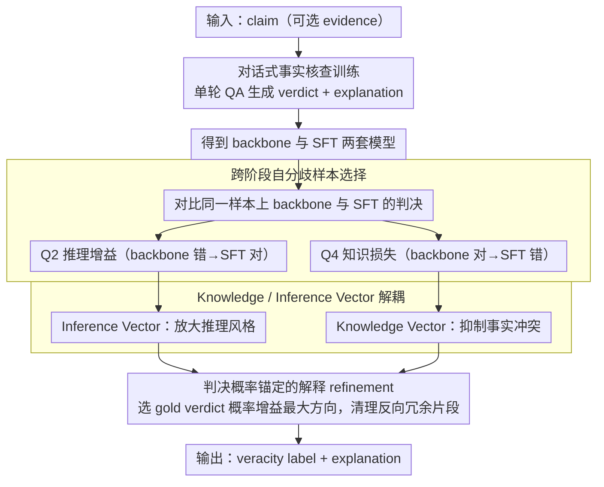

# REFLEX: Self-Refining Explainable Fact-Checking via Verdict-Anchored Style Control

**会议**: ACL2026  
**arXiv**: [2511.20233](https://arxiv.org/abs/2511.20233)  
**代码**: 论文称已开源，缓存未提供具体 URL  
**领域**: AIGC 检测 / 可解释事实核查  
**关键词**: 可解释事实核查, 激活 steering, 幻觉抑制, 判决锚定解释, 自 refinement  

## 一句话总结
REFLEX 将事实核查中的判决预测和解释生成绑定起来，用 backbone 与微调模型之间的自分歧样本构造内部 steering 向量，在不依赖搜索 API 或闭源教师模型的情况下提升判决 Macro-F1，并让解释更短、更一致、更少误导。

## 研究背景与动机
**领域现状**：自动事实核查系统通常要同时给出 veracity verdict 和解释。随着 LLM 被用于事实核查，主流方案一类直接让模型生成判决与解释，另一类依赖检索、Google Search API、闭源教师模型或多智能体对话来补充证据与推理轨迹。

**现有痛点**：这类外部依赖方案虽然能增强信息来源，但也带来两个问题。第一，检索证据、教师蒸馏和多轮 agent 交互本身可能引入幻觉或传播错误；第二，外部 API 和多智能体流程增加延迟，不适合实时事实核查。更关键的是，LLM 生成的解释可能看起来合理，却和最终判决不一致，甚至用有欺骗性的叙述风格误导人类判断。

**核心矛盾**：事实核查解释既包含事实内容，也包含推理/叙述风格。现有方法常把两者混在一起处理：若只追求外部证据，可能放大噪声；若只做模型微调，又可能把局部训练信号中的知识冲突写进模型行为。作者认为，需要把“事实敏感信号”和“风格/推理敏感信号”从模型内部表示中拆开。

**本文目标**：论文希望在单模型、少样本、低外部依赖的条件下，让模型同时做到更准的判决和更忠实的解释。具体来说，它要识别哪些样本体现微调带来的 reasoning gain，哪些样本体现微调导致的 knowledge loss，并据此控制生成过程。

**切入角度**：作者观察 backbone 和 SFT 模型在同一训练样本上的预测差异，把“微调后从错变对”视为推理风格被激活，把“微调后从对变错”视为事实知识被扰动。这个跨训练阶段的 self-disagreement 提供了一种不用人工构造对比样本的内部监督。

**核心 idea**：用 backbone/SFT 自分歧样本把 steering vector 分解为 Inference Vector 和 Knowledge Vector，再根据 verdict 概率增益自适应选择并干预生成，使解释被判决锚定而不是被表面风格带偏。

## 方法详解
REFLEX 的方法不是先检索证据再让 LLM 编写解释，而是把事实核查改写成一个 dialogue-style 的单轮问答任务，并在模型内部寻找可控制的解释方向。整体流程可以理解为：先训练一个会输出判决和解释的 fact-checker，再从 backbone 与 SFT 模型的分歧中抽取“好方向”和“坏方向”，最后在推理时用这些方向修正解释。

### 整体框架
输入是一条 claim，可选地包含 evidence；输出是 veracity label 和 explanation。REFLEX 分三步运行。

第一步是 Dialogue-style Fact-Checker Training。论文把传统文档式监督转换为 QA/对话式训练，让模型在单轮对话中生成 $v$ 或 $v;exp$。作者认为 backbone 已经包含大量事实知识，有限监督更可能是在激活已有知识与塑造任务风格，因此 QA 风格训练比简单文档续写更适合事实核查。

第二步是 Adaptive Sample Selection。训练完成后，作者分别用 backbone 和 SFT 模型在训练集上推理，并按预测是否等于 gold verdict 分成象限。若 backbone 错而 SFT 对，这类 Q2 样本被视为 Reasoning Gain；若 backbone 对而 SFT 错，这类 Q4 样本被视为 Knowledge Loss。

第三步是 Self-Explanation Guided Steering。方法从 Q2/Q4 中提取内部 steering 方向，将其拆为 Inference Vectors 和 Knowledge Vectors。推理时，如果某个方向能提高 gold verdict 的概率差，就用它控制 decoder block 的激活，并进一步清理解释中与最优方向相反的片段。

### 关键设计

**1. 跨阶段自分歧样本选择：不靠人工造对比样本，而是让微调前后的“自己跟自己吵架”充当监督信号**

事实核查里最难的一件事，是构造“只改解释风格、不改事实内容”的干净对比样本——人工标注几乎做不到。REFLEX 的巧思是直接利用 backbone 和 SFT 模型在同一训练样本上的预测分歧。记 $\hat{v}^{base}$、$\hat{v}^{sft}$ 为两者的判决：若 $\hat{v}^{base}\neq v^{gold}$ 而 $\hat{v}^{sft}=v^{gold}$，说明微调把这条样本从错救对，归为 reasoning gain；若 $\hat{v}^{base}=v^{gold}$ 而 $\hat{v}^{sft}\neq v^{gold}$，说明微调反而把对的带歪，归为 knowledge loss。这种跨训练阶段的 self-disagreement 天然分离出“微调激活了哪种推理风格”和“微调损害了哪部分事实表示”，比人工成对反事实样本更自然，也更贴近模型内部的真实行为。

**2. Knowledge Vector 与 Inference Vector 解耦：把一条笼统的 steering 方向拆成“该放大的推理风格”和“该抑制的事实冲突”**

解释幻觉往往不是单纯的事实写错，而是事实内容和叙述风格纠缠在一起的产物，用一条 steering vector 同时管两件事必然顾此失彼。REFLEX 据此把方向拆成两支：Inference Vector 来自上一步的 reasoning gain 样本（微调修正了 backbone 的错误），代表应当放大的 reasoning/style 信号；Knowledge Vector 来自 knowledge loss 样本（微调破坏了 backbone 原本正确的判断），代表应当抑制的事实冲突方向。为压低额外开销，作者用 logistic probes 在 decoder block 级别提取并施加这两类方向。拆开之后，模型可以一手保住一致的事实表示、一手增强与判决一致的解释风格，而不是把两者一并推、一并拉。

**3. 判决概率锚定的解释 refinement：让 steering 永远服务于判决，而不是只把解释写得更顺**

一个解释“读起来像解释”毫无意义，关键是它得忠实地支撑最终判决。所以 REFLEX 在选方向时不看流畅度，而看它对 gold verdict 的概率贡献：对每个候选方向，比较 steered 与 unsteered 输出在 gold verdict 上的概率差，取增益最大的方向去控制 decoder block 的激活。选定最优方向 $s_l$ 后，再算每个 token hidden state 与它的余弦相似度 $a_{l,t}=h_{l,t}\cdot s_l/(\|h_{l,t}\|\|s_l\|)$，把那些与最优方向密集相反的冗余片段判为噪声，并用 Ratcliff-Obershelp 模式匹配做轻量后处理清掉。用 verdict probability gap 选方向，等于把解释控制牢牢锚在任务目标上，避免它被表面叙述风格带偏。

### 损失函数 / 训练策略
训练阶段使用标准 cross-entropy 目标，让模型联合生成 verdict 和 explanation。论文比较了四种输入输出配置：$c\to v$、$c\to v;exp$、$c;evi\to v$、$c;evi\to v;exp$。实验后作者选择在 RAW-FC 和 LIAR-RAW 上使用无 evidence、带 explanation 的目标，因为 evidence 在多数设置下会带来噪声并放大幻觉；AVeriTeC 由于解释天然依赖 evidence，则按其任务格式处理。推理温度固定为 0，few-shot 样本从其他训练 split 或验证集抽取以避免泄漏。

## 实验关键数据

### 主实验
主实验比较了外部依赖方案和 REFLEX 在 RAW-FC / LIAR-RAW 上的事实核查表现。缓存中 Table 1 的关键信息表明，REFLEX 在 RAW-FC 上超过 RAV 和 L-Defense，同时只用单个开源 backbone 与 465 个自提取样本；在 LIAR-RAW 上，REFLEX 的 best reported Macro-F1 为 50.59。

| 方法 | 外部依赖 | 训练解释规模 | RAW-FC Macro-F1 | LIAR-RAW Macro-F1 | 备注 |
|------|----------|--------------|-----------------|-------------------|------|
| ChatGPT | 闭源 API | 无 | 44.43 / 39.31 | 25.11 / 21.90 | 两种输入设置，含 evidence 反而更差 |
| HiSS | Google Search API | 无 | 53.90 | 37.50 | 检索式外部证据 |
| FactLLaMA | Google Search API | LLaMA2-7B | 55.65 | 30.44 | 同样依赖外部搜索 |
| L-Defense | ChatGPT + RoBERTa-Large | 32,240 | 61.20 | 30.53 | 使用大规模 GPT-3.5 蒸馏解释 |
| RAV | 3 个 LLaMA-3.1-70B-Instruct | 未报告 | 59.19 | 25.40 | 多智能体方案 |
| REFLEX / S-EGS | 无闭源 API / 无检索 API | 465 自提取样本 | 64.99 | 50.59 | RAW-FC 比 L-Defense 高 3.79 点，比 RAV 高 5.80 点 |

### 消融实验
作者做了多个层面的消融：跨 backbone、跨数据集 transfer、pairing strategy、解释质量与向量类型分析。下面选取最能说明 REFLEX 机制的结果。

| 消融设置 | 关键指标 | 说明 |
|----------|----------|------|
| S-EGS across backbones | 最高带来 5.03 Macro-F1 提升 | 在 LLaMA-2 与 Qwen-3、多个数据集上多数设置优于 SFT |
| Cross-dataset transfer: LLaMA-2 R→L | Target LIAR-RAW Macro-F1 50.59，提升 +7.54 | 强源模型抽出的方向能显著帮助弱目标设置 |
| Cross-dataset transfer: LLaMA-2 L→R | Target RAW-FC Macro-F1 47.20，变化 -13.39 | 弱源方向会伤害强目标，说明 transfer 依赖源方向质量 |
| Vertical steering w/o exp, LLaMA-2 RAW-FC | 34.01，提升 +7.57 | explanation-guided signal 可帮助无解释输出 |
| Horizontal steering w/o exp, LLaMA-2 RAW-FC | 34.82，提升 +8.38 | SFT 内部横向方向也能起效，但在 AVeriTeC 有下降 |

### 关键发现
- REFLEX 的数据效率很强：RAW-FC 上用 465 个 self-extracted samples 超过 L-Defense 的 32,240 条 GPT-3.5 蒸馏解释。
- Evidence conditioning 不一定有益。作者在 RAW-FC 和 LIAR-RAW 上发现，带 explanation 但不带 evidence 的目标通常优于带 evidence 的目标，说明外部证据可能引入噪声并放大幻觉。
- Transfer 不是无条件成立。源模型 Macro-F1 与目标提升高度相关，缓存报告 source Macro-F1 与 target gain 的 Pearson 相关为 0.95，说明好的 steering 方向来自足够强的源设置。
- KV 与 IV 的行为不同：Table 6 中 KV 的 misleadingness 更低，IV 的 informativeness/soundness 更高，支持“事实敏感”和“风格敏感”的解耦解释。

## 亮点与洞察
- 最有意思的点是把“模型训练前后自分歧”当成监督信号。它避开了事实核查中难以构造干净对比样本的问题，也比简单 prompt engineering 更接近模型内部行为控制。
- REFLEX 没有把 explanation faithfulness 简化成检索更多证据。论文反而指出，外部 evidence 在一些设置下会让模型更容易混入噪声，这对事实核查系统设计很有提醒意义。
- 判决概率锚定是一个可迁移的设计。很多任务都有“解释看起来对但不服务于决策”的问题，例如医疗 triage、法律问答和安全审核，都可以借鉴这种用最终任务概率选择解释控制方向的思路。
- 论文对 transfer 的讨论比较克制：不是说 steering vector 一定泛化，而是明确指出强源到弱目标更可靠、弱源到强目标会退化，这让方法的适用边界更清楚。

## 局限与展望
- 模型规模有限。作者受实验资源与磁盘配额限制，主要测试 LLaMA-2、Qwen-3 和 Mistral-v0.1，规模集中在 7B-8B，不能直接证明在更大模型或不同架构上同样有效。
- LIAR-RAW 使用三分类标签。论文为了和解释生成难度以及 prior work 对齐，把细粒度标签合并为三类，因此结果不能完全代表六分类政治事实核查场景。
- 内部知识会过时。REFLEX 减少了外部检索依赖，也就更依赖模型已有知识；作者认为可用轻量 activation editing 适配新事件，但缓存中的实验没有直接验证时间迁移数据集。
- 解释质量仍部分依赖 LLM-as-a-Judge 和人工子集评估。虽然作者补充了人工 pairwise evaluation，但自动评价可能有长度偏置，后续可以加入更严格的事实一致性审计和用户实验。

## 相关工作与启发
- **vs HiSS / FactLLaMA**: 它们依赖检索或 Google API 获取外部证据，优势是能访问新信息；REFLEX 不依赖外部搜索，优势是延迟低且少引入检索幻觉，但也需要面对内部知识过时问题。
- **vs L-Defense**: L-Defense 用 ChatGPT 和 RoBERTa-Large 蒸馏大量解释，REFLEX 用少量 self-extracted samples 与内部激活控制达到更高 RAW-FC Macro-F1，启发是“少量高信号内部样本”可能比大规模教师解释更适合解释忠实性。
- **vs RAV**: RAV 采用多智能体对话核查，REFLEX 是单模型内部控制。前者适合需要多轮证据审议的复杂场景，后者更适合低延迟、少外部依赖的事实核查。
- **vs ITI / CAA 等 steering-vector 方法**: 传统方法多用单一 truthfulness/style direction，REFLEX 的贡献是把方向拆成 KV 和 IV，并用 verdict probability gap 做任务锚定选择。

## 评分
- 新颖性: ⭐⭐⭐⭐⭐ 用跨阶段自分歧拆解 KV/IV 的思路很清晰，且贴合事实核查解释的“事实-风格纠缠”问题。
- 实验充分度: ⭐⭐⭐⭐☆ 主实验、跨 backbone、transfer、pairing、解释质量和人工评估都覆盖了，但模型规模仍局限在 7B-8B。
- 写作质量: ⭐⭐⭐⭐☆ 动机和实验解释扎实，不过方法细节与 appendix 表格较多，读者需要反复对照不同设置。
- 价值: ⭐⭐⭐⭐⭐ 对可解释事实核查、低延迟内容审核和内部激活控制都有直接参考价值。

<!-- RELATED:START -->

## 相关论文

- [\[ICLR 2026\] Calibrating Verbalized Confidence with Self-Generated Distractors](../../ICLR2026/aigc_detection/calibrating_verbalized_confidence_with_self-generated_distractors.md)
- [\[ACL 2026\] mdok-style at SemEval-2026 Task 10: Finetuning LLMs for Conspiracy Detection](mdok-style_at_semeval-2026_task_10_finetuning_llms_for_conspiracy_detection.md)
- [\[ACL 2026\] MASH: Evading Black-Box AI-Generated Text Detectors via Style Humanization](mash_evading_black-box_ai-generated_text_detectors_via_style_humanization.md)
- [\[NeurIPS 2025\] QiMeng-NeuComBack: Self-Evolving Translation from IR to Assembly Code](../../NeurIPS2025/aigc_detection/qimeng-neucomback_self-evolving_translation_from_ir_to_assembly_code.md)
- [\[ACL 2026\] DetectRL-X: Towards Reliable Multilingual and Real-World LLM-Generated Text Detection](detectrl-x_towards_reliable_multilingual_and_real-world_llm-generated_text_detec.md)

<!-- RELATED:END -->
