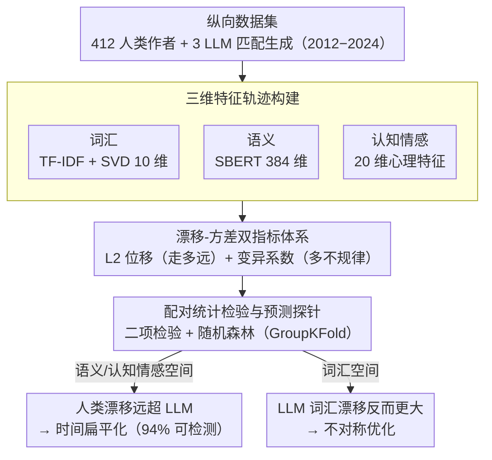

# Temporal Flattening in LLM-Generated Text: Comparing Human and LLM Writing Trajectories

**会议**: ACL 2026  
**arXiv**: [2604.12097](https://arxiv.org/abs/2604.12097)  
**代码**: [GitHub](https://github.com/yjkim717/Cognitive-Emotional-Trajectories)  
**领域**: AIGC检测  
**关键词**: 时间扁平化, LLM生成文本检测, 纵向写作分析, 认知情感特征, 合成数据

## 一句话总结

本文通过构建跨12年的纵向写作数据集，发现LLM生成文本存在"时间扁平化"现象——虽然词汇多样性高，但在语义和认知情感维度上的时间漂移显著低于人类，仅凭时间变异模式就能以94%准确率区分人类与LLM文本。

## 研究背景与动机

**领域现状**：大语言模型已广泛应用于内容生成、对话系统和合成训练数据生产。当前LLM的部署范式是无状态的——每次生成独立响应，不保留历史记忆。

**现有痛点**：人类写作本质上是纵向的（longitudinal），作者的风格、认知状态和情感表达会随时间自然演化。然而，现有的LLM生成范式假设独立采样的文档能够充分近似人类写作分布，这一假设是否成立从未被系统验证。

**核心矛盾**：LLM在静态质量指标上表现优异（如语义保留、流畅度），但可能在时间维度上系统性地丧失人类写作固有的纵向结构。这种丧失对需要时间一致性的下游应用（如合成训练数据、作者归属、心理健康轨迹建模）构成隐患。

**本文目标**：回答两个核心问题——(1) LLM能否在长时间跨度内再现人类的时间结构？(2) 如果存在差异，人类写作的哪些时间动态被系统性地丢失或扁平化？

**切入角度**：作者从心理语言学和计算文体学出发，将写作视为纵向过程，通过漂移（drift）和方差（variance）两种互补指标在语义、词汇和认知情感三个表示空间中量化时间结构。

**核心 idea**：LLM生成文本存在"时间扁平化"——在词汇空间表现出高多样性，但在语义和认知情感空间的时间漂移和波动显著低于人类，这种差异在有无历史条件下均持续存在。

## 方法详解

### 整体框架

研究构建了一个包含412位人类作者、6086篇文档的纵向数据集（2012-2024），覆盖学术摘要、博客和新闻三个领域。对每位人类作者，使用DeepSeek V1、GPT-4o mini和Claude 3.5 Haiku三个LLM生成匹配的写作轨迹，共产生103,459篇LLM文档。通过在三个表示空间（词汇、语义、认知情感）上计算漂移和方差指标，量化人类与LLM的时间动态差异，并通过统计检验和分类器进行验证。

### 关键设计

**1. 三维特征轨迹构建：从互补的三个表示空间捕捉写作随时间的演化**

只看单一维度无法分辨"扁平化"到底发生在哪一层，所以作者为每位作者、每个年份都算三种表示：词汇表示（TF-IDF 再用 SVD 降到 10 维）刻画表层用词的变化，语义表示（SBERT 384 维嵌入）刻画深层含义的迁移，认知情感特征（20 个可解释的心理特征，含大五人格代理、情感、可读性等）刻画心理与风格层面的演化。把每位作者逐年的特征向量按时间拼起来，就得到一条时间轨迹 $\mathcal{T}(e) = (\mathbf{x}_1^{(e)}, \ldots, \mathbf{x}_T^{(e)})$。三个空间互补，正是后面发现"LLM 在词汇空间多样、却在语义和认知情感空间扁平"这一不对称现象的前提。

**2. 漂移-方差双指标体系：分别量化轨迹"走了多远"和"走得多不规律"**

时间动态有两个互补侧面，单看一个会漏掉信息。漂移用相邻年份特征向量的 L2 距离测量总位移 $\text{drift}_t^{(e)} = \|\mathbf{x}_{t+1}^{(e)} - \mathbf{x}_t^{(e)}\|_2$，反映写作在表示空间里整体"走了多远"；方差用变异系数量化年际波动的不规则性 $\mathrm{CV}(f) = \frac{\mathrm{std}(\Delta f_{1:T})}{\mathrm{mean}(\Delta f_{1:T})}$，反映"走得多不规律"。两者合起来才能完整刻画人类那种既有方向性漂移、又有不规则起伏的时间结构，而 LLM 恰恰在这两个量上都被压低。

**3. 配对统计检验与预测探针：把"人类更会随时间演化"从观察上升为可验证、可预测的结论**

光看均值差容易被个体差异迷惑，作者对每一对匹配的人类-LLM 作者做二项检验，检验"人类演化幅度超过 LLM"的比率是否显著高于 50%，用配对设计排除作者间的混淆。为进一步证明这种差异是可预测的，他们只用 20 维认知情感 CV 特征训练随机森林分类器，并用 GroupKFold（按 author_id 分组）交叉验证防止同一作者的轨迹泄漏到训练和测试两侧——结果仅凭这组时间变异特征就能以 94% 准确率区分人类与 LLM，说明扁平化不只是统计上显著，还强到足以当检测信号。

### 损失函数 / 训练策略

本文为分析型研究，不涉及模型训练。分类器使用5折GroupKFold交叉验证（按author_id分组），确保同一作者的所有轨迹不会同时出现在训练集和测试集中。对多重比较应用Benjamini-Hochberg FDR校正（$q < 0.05$）。

## 实验关键数据

### 主实验

| 表示空间 | 指标 | 人类胜率范围 | p值 | 含义 |
|----------|------|-------------|------|------|
| TF-IDF（词汇） | 漂移 | 0.20-0.33 | p=1.0 | LLM词汇漂移更大 |
| SBERT（语义） | 漂移 | 0.75-0.86 | p<0.0001 | 人类语义漂移远超LLM |
| Cog-Emo（认知情感） | 漂移 | 0.76-0.99 | p<0.0001 | 人类认知情感漂移极显著高于LLM |

### 消融实验

| 配置 | Accuracy | AUC | F1 | 说明 |
|------|---------|------|-----|------|
| 池化（IW） | 0.936 | 0.977 | 0.863 | Instance-wise条件 |
| 池化（Hist） | 0.933 | 0.977 | 0.856 | History-augmented条件 |
| 平衡-Claude 3.5（IW） | 0.97 | 1.00 | 0.97 | Claude最易区分 |
| 平衡-GPT-4o mini（IW） | 1.00 | 1.00 | 1.00 | GPT-4o mini几乎完美区分 |

### 关键发现

- LLM存在"不对称优化"：词汇多样性高但语义和认知情感漂移低，表明LLM优化了表层变化但未能复现深层演化
- GPT-4o mini表现出最严重的认知情感扁平化：97%的作者对中人类Cog-Emo漂移更大，在历史条件下上升至99%
- 时间扁平化在instance-wise和history-augmented两种条件下均持续存在，说明这是当前部署范式的系统性属性
- 最具区分力的特征：平均句长（18.7%）、宜人性（15.9%）和神经质（9.3%）

## 亮点与洞察

- 提出"时间扁平化"这一新概念，揭示了LLM生成文本在时间维度上的系统性缺陷
- 仅用20维认知情感CV特征就能达到94%分类准确率和98% AUC，提供了一种新的AIGC检测思路
- 公开发布包含412位作者的纵向数据集，为后续研究提供基础
- 发现历史增强并不能修复时间扁平化，暗示问题根源在于模型架构或训练范式本身

## 局限与展望

- 数据集主要覆盖英文写作，跨语言的时间扁平化现象有待验证
- 仅测试了三个商业LLM，开源模型和微调后的模型是否表现不同有待探索
- 研究侧重于发现现象而非提出解决方案，如何让LLM生成具有真实时间结构的文本仍是开放问题
- 认知情感特征依赖于LIWC等工具的准确性，其在不同领域的泛化性需进一步验证

## 相关工作与启发

- **vs 合成数据质量研究（Chim et al.）**: 合成数据研究主要关注静态质量指标，本文揭示了时间维度的系统性缺陷
- **vs 模型坍塌研究（Shumailov et al.）**: 模型坍塌关注迭代训练中的分布退化，本文从时间一致性角度提供了互补视角
- **vs 人-LLM共演化研究（Geng & Trotta）**: 已有工作主要在词汇层面分析，本文扩展到语义和认知情感维度

## 评分

- 新颖性: ⭐⭐⭐⭐⭐ "时间扁平化"概念新颖，从纵向视角审视LLM生成文本是全新角度
- 实验充分度: ⭐⭐⭐⭐ 三领域三模型两条件的全面设计，统计检验严谨
- 写作质量: ⭐⭐⭐⭐ 论文结构清晰，研究问题驱动
- 价值: ⭐⭐⭐⭐ 对AIGC检测、合成数据生成和纵向文本建模有直接启示

<!-- RELATED:START -->

## 相关论文

- [\[ACL 2025\] Comparing LLM-generated and human-authored news text using formal syntactic theory](../../ACL2025/aigc_detection/llm_vs_human_formal_syntax.md)
- [\[ACL 2026\] Beyond the Final Actor: Modeling the Dual Roles of Creator and Editor for Fine-Grained LLM-Generated Text Detection](beyond_the_final_actor_modeling_the_dual_roles_of_creator_and_editor_for_fine-gr.md)
- [\[ACL 2026\] GigaCheck: Detecting LLM-generated Content via Object-Centric Span Localization](gigacheck_detecting_llm-generated_content_via_object-centric_span_localization.md)
- [\[ACL 2026\] ExaGPT: Example-Based Machine-Generated Text Detection for Human Interpretability](exagpt_example-based_machine-generated_text_detection_for_human_interpretability.md)
- [\[ACL 2026\] DetectRL-X: Towards Reliable Multilingual and Real-World LLM-Generated Text Detection](detectrl-x_towards_reliable_multilingual_and_real-world_llm-generated_text_detec.md)

<!-- RELATED:END -->
