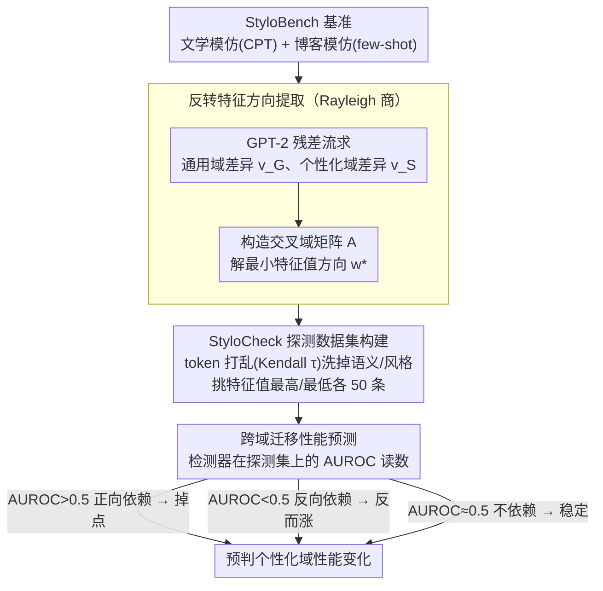

# When Personalization Tricks Detectors: The Feature-Inversion Trap in Machine-Generated Text Detection

**会议**: ACL 2026  
**arXiv**: [2510.12476](https://arxiv.org/abs/2510.12476)  
**代码**: GitHub  
**领域**: AIGC检测  
**关键词**: 机器生成文本检测, 个性化文本, 特征反转, 风格迁移, 鲁棒性

## 一句话总结

揭示了个性化场景下 MGT 检测器的"特征反转陷阱"——通用域中区分人写文本和机器文本的特征在个性化域中发生反转，导致检测器性能骤降甚至翻转，并提出 StyloCheck 框架通过量化检测器对反转特征的依赖程度来预测跨域性能变化，预测相关性达 0.85 以上。

## 研究背景与动机

**领域现状**：大语言模型越来越擅长模仿个人写作风格，个性化文本生成（如风格模仿、代笔写作）已成为现实威胁。现有 MGT 检测方法在通用场景（如新闻、维基百科）中表现良好，AUROC 可达 85%+。

**现有痛点**：没有人系统研究过 MGT 检测器在个性化场景下的表现。作者构建了首个个性化 MGT 检测基准 StyloBench，发现现有检测器在个性化文本上性能急剧下降，甚至出现反转——如 Fast-DetectGPT 在通用域 AUROC 98.78%，但在个性化文学风格模仿文本上降至 8.71%，几乎完全反转。

**核心矛盾**：检测器依赖的区分特征（如文本多样性——假设人写文本比机器文本更多样）在个性化场景下失效。个性化 MGT 反而可能比原始人写文本更多样、更不连贯，导致特征方向翻转。

**本文目标**：(1) 构建个性化 MGT 检测基准；(2) 解释检测器性能退化的机制；(3) 提出预测检测器跨域迁移性能的诊断工具。

**切入角度**：作者训练域分类器发现，通用域中 MGT 的域特征值略低于 HWT，但个性化域中反转为 MGT 高于 HWT——这暗示存在一个特征方向在跨域时发生系统性反转。

**核心 idea**：将特征反转问题形式化为 Rayleigh 商最优化问题，提取最大反转方向，并基于此构建诊断框架 StyloCheck。

## 方法详解

### 整体框架

方法分三部分：(1) StyloBench 基准构建——包含文学作品模仿（通过 CPT 微调 LLM）和博客风格模仿（通过 few-shot 提示）两个子场景；(2) 特征反转陷阱的理论分析——通过 Rayleigh 商找到反转特征方向并验证与检测器性能的相关性；(3) StyloCheck 诊断框架——通过 token 打乱生成仅保留反转特征的探测数据集，评估检测器对反转特征的依赖程度。其中 StyloBench 是数据脚手架，后续三步（找反转方向 → 造探测集 → 预判迁移）才是核心贡献。

### 关键设计

**1. 反转特征方向提取（Rayleigh 商方法）：把"特征会反转"这一直觉观察变成可求解的数学对象**

作者先要找到那个在通用域和个性化域之间、HWT/MGT 差异反转最剧烈的特征方向。他们用 GPT-2 深层残差流作为文本表示空间，分别在通用域和个性化域算出 MGT 减 HWT 的差异向量 $v_G$ 和 $v_S$，再构造交叉域矩阵 $A = \sum_i \frac{1}{2}(v_G v_S^\top + v_S v_G^\top)$，求解 $\min_{\|\mathbf{w}\|=1} \mathbf{w}^\top A \mathbf{w}$，取最小特征值对应的特征向量 $\mathbf{w}^*$ 即为反转最强的方向。把文本投影到这个方向上后，通用域里 MGT 的特征值明显高于 HWT，而到了个性化域完全翻了过来。用 Rayleigh 商的好处是它有闭式解、保证拿到的是全局最优反转方向，从而把"凭感觉看到反转"升级成一个可量化、可验证的结构性量。

**2. StyloCheck 探测数据集构建：造一批只在反转特征上有差异、其余信息全被洗掉的样本**

要准确衡量某个检测器到底有多依赖这条反转特征，就必须把语义、风格、类别这些混淆因素剥离干净，否则测出来的是综合表现而非对反转特征的依赖。作者对文本做不同强度的 token 打乱（用 Kendall τ 控制打乱程度），打乱会破坏语义和风格信息，却能保留反转特征值；然后从打乱变体中挑特征值最高的 50 条当正样本、最低的 50 条当负样本。验证显示域分类器和 MGT 分类器在这个探测集上都接近随机，证明混淆因素确实被洗掉了——剩下能被区分的，只有反转特征本身。

**3. 跨域迁移性能预测：用一份"体检报告"提前预判检测器在个性化域会不会翻车**

有了只含反转特征的探测集，就能把检测器在它上面的 AUROC 当成"对反转特征的依赖度"读数，用来预测从通用域迁到个性化域的性能变化：AUROC > 0.5 说明检测器正向依赖反转特征，迁移后会掉点；AUROC < 0.5 说明反向依赖，迁移后反而可能涨（这正好解释了 Entropy 检测器为何在个性化域逆势上升）；AUROC ≈ 0.5 说明不依赖，性能稳定。实验中 StyloCheck 的预测与实际跨域性能差距的 Pearson 相关性在 78% 的设置里超过 0.7。这套诊断的实用价值在于：部署前无需在目标域采集大量数据做跨域测试，只用打乱 token 的探测集就能预判风险。

### 损失函数 / 训练策略

本文的核心方法 StyloCheck 是诊断性框架而非训练方法。反转特征方向通过特征值分解求解，无需训练。

## 实验关键数据

### 主实验（检测器跨域性能）

| 检测器 | M4 (通用) Avg AUROC | Stylo-Blog Avg | Stylo-Literary Avg |
|--------|-------------------|---------------|-------------------|
| Fast-DetectGPT | 84.52 | 77.20 | 20.13 |
| Lastde | 91.72 | 70.78 | 66.04 |
| Lastde++ | 90.55 | 76.68 | 49.24 |
| Entropy | 34.90 | 44.56 | 76.18 |
| Log-Likelihood | 79.86 | 71.63 | 25.59 |

### 消融实验（StyloCheck 预测可靠性）

| 探测数据集数量 | Pearson r > 0.5 占比 | Pearson r > 0.7 占比 |
|--------------|---------------------|---------------------|
| 5 个 | 90% | 78% |
| 增加数量 | 更高 | 更高 |

### 关键发现
- 个性化程度越深（CPT vs few-shot），检测器性能退化越严重——Stylo-Literary（CPT 训练）比 Stylo-Blog（few-shot 提示）的性能下降更为剧烈
- Entropy 检测器是唯一在个性化域性能提升的方法（AUROC 从 ~35% 升至 ~76%），因为它对反转特征的依赖方向与其他检测器相反
- 反转特征方向在不同数据集间具有高度一致性（余弦相似度均值 0.547），说明这是跨域的结构性现象而非特定数据集的偶然
- 反转特征与"文本多样性"相关——个性化 MGT 打破了"HWT 比 MGT 更多样"的传统假设

## 亮点与洞察

- **将实际问题转化为优雅的数学形式**：特征反转现象被精确地表述为 Rayleigh 商问题，有闭式解且可解释。这种从现象到理论的路径值得学习
- **StyloCheck 的"体检"思路极具实用价值**：无需在目标域收集大量数据，只用打乱 token 的探测集就能预测检测器的跨域表现，部署成本极低
- **反直觉发现**：个性化 MGT 比原始 HWT 更"多样"，颠覆了 MGT 检测领域"机器生成文本更单调"的基本假设

## 局限与展望

- 仅研究英文场景，不同语言的风格特征分布可能不同
- StyloBench 仅包含 7 位作者和 4 个博客生成器，规模有限
- StyloCheck 只能预测基于反转特征的性能变化，如果检测器因其他因素退化则无法捕获
- 未提出根本性的修复方案——如何训练不依赖反转特征的检测器仍是开放问题

## 相关工作与启发

- **vs RAID / M4 等通用基准**: 这些基准关注通用域 MGT 检测，未考虑个性化场景；StyloBench 填补了这一空白并揭示了通用检测器的结构性弱点
- **vs Fast-DetectGPT**: 在通用域最强的检测器之一，但在个性化文学模仿场景下 AUROC 降至 8.71%，几乎完全翻转，说明高通用域性能不能保证鲁棒性
- **vs training-based detectors**: 在域内微调后可以恢复性能，但跨域泛化仍然有限

## 评分

- 新颖性: ⭐⭐⭐⭐⭐ 首次揭示特征反转陷阱并给出数学刻画，StyloCheck 诊断框架思路新颖
- 实验充分度: ⭐⭐⭐⭐ 7 个检测器、11 个生成器、多域测试，但数据集规模可以更大
- 写作质量: ⭐⭐⭐⭐ 从现象到理论到应用的逻辑清晰，但 notation 较多需要反复对照
- 价值: ⭐⭐⭐⭐⭐ 对 MGT 检测领域具有警示意义，StyloCheck 有直接实用价值

<!-- RELATED:START -->

## 相关论文

- [\[ACL 2026\] ExaGPT: Example-Based Machine-Generated Text Detection for Human Interpretability](exagpt_example-based_machine-generated_text_detection_for_human_interpretability.md)
- [\[ACL 2026\] MASH: Evading Black-Box AI-Generated Text Detectors via Style Humanization](mash_evading_black-box_ai-generated_text_detectors_via_style_humanization.md)
- [\[ICML 2026\] Feature-Augmented Transformers for Robust AI-Text Detection Across Domains and Generators](../../ICML2026/aigc_detection/feature-augmented_transformers_for_robust_ai-text_detection_across_domains_and_g.md)
- [\[ACL 2025\] Iron Sharpens Iron: Defending Against Attacks in Machine-Generated Text Detection with Adversarial Training](../../ACL2025/aigc_detection/greater_adversarial_mgt_detection.md)
- [\[NeurIPS 2025\] DuoLens: A Framework for Robust Detection of Machine-Generated Multilingual Text and Code](../../NeurIPS2025/aigc_detection/duolens_a_framework_for_robust_detection_of_machine-generated_multilingual_text_.md)

<!-- RELATED:END -->
