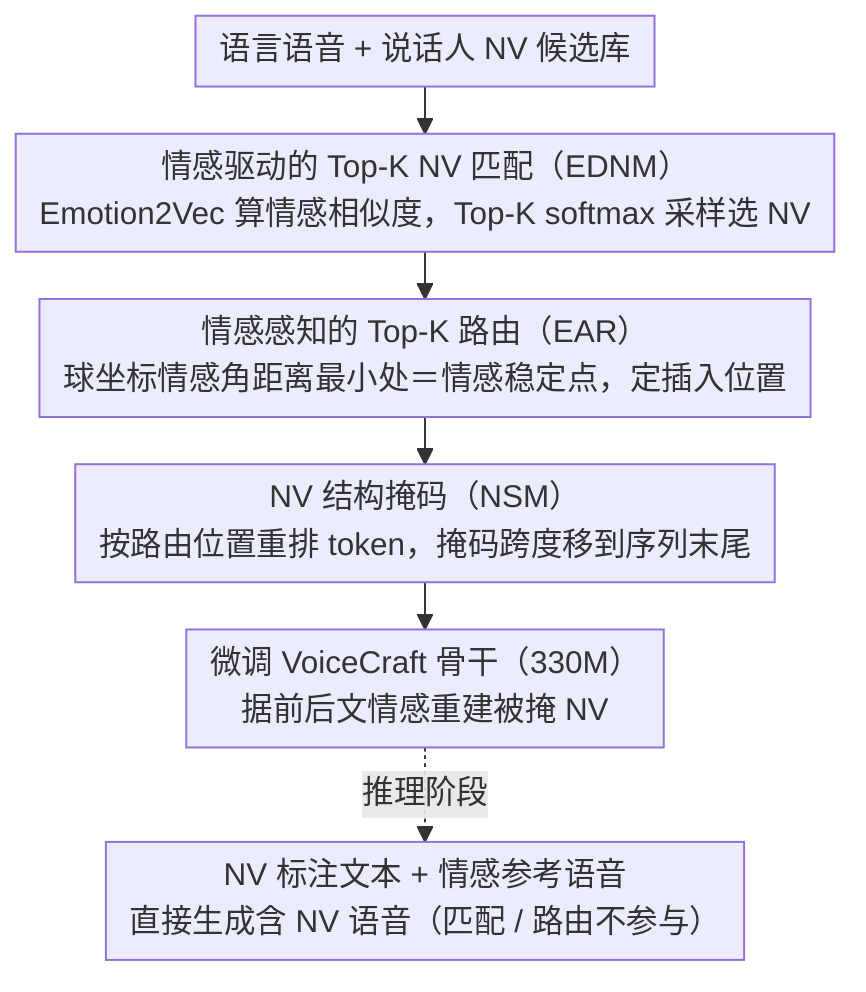

# Affectron: Emotional Speech Synthesis with Affective and Contextually Aligned Nonverbal Vocalizations

**会议**: ACL 2026 Findings  
**arXiv**: [2603.14432](https://arxiv.org/abs/2603.14432)  
**代码**: [https://github.com/choddeok/Affectron](https://github.com/choddeok/Affectron)  
**领域**: 音频语音 / 语音合成  
**关键词**: 非语言发声、情感语音合成、NV增强训练、情感路由、神经编解码语言模型

## 一句话总结
本文提出 Affectron 框架，通过情感驱动的 Top-K NV 匹配和情感感知的 Top-K 路由两个训练时增强策略，在小规模开源解耦语料上实现了多样且情感对齐的非语言发声（如笑声、叹息）合成，显著超越了基于纯语言预训练的 VoiceCraft 基线。

## 研究背景与动机

**领域现状**：非语言发声（NVs），如笑声、叹息和哭泣，是情感语音合成中表达情感的关键手段。现有的表达性 TTS 系统主要依赖两类方法：标签控制 TTS（手动插入 NV 标签控制类型和位置）和自发风格 TTS（从上下文线索隐式预测 NV）。

**现有痛点**：标签控制方法依赖对齐标注或 NV 检测模型，检测模型的偏差和错误传播导致 NV 位置的时间不一致性。自发风格方法受限于专有数据集的不可复现性。公开可用的 NV 语料普遍偏向基础类型（如呼吸和笑声），且存在声学伪影，无法建模细粒度的 NV 变体（如轻笑、咯咯笑、窃笑的区别）。

**核心矛盾**：缺乏大规模、多样化、高质量的公开 NV 语料是根本瓶颈。现有的神经编解码语言模型（NCLM）虽然能在低质量语料上生成自然语音，但主要面向语音克隆，对细粒度 NV 的韵律变化控制能力不足。

**本文目标**：在小规模开源解耦语料上（语言语音和 NV 分别录制），实现情感一致且上下文对齐的多样化 NV 生成。

**切入角度**：作者观察到情感属性在相邻词段之间通常是渐变的而非突变的，时间间隔较短的词段之间情感角距离较小。因此，情感变化最小的位置可作为 NV 插入的自然锚点。

**核心 idea**：设计训练时 NV 增强策略，通过情感嵌入匹配选择合适的 NV 类型、通过情感角距离路由确定合适的插入位置，然后用增强后的样本微调预训练的 VoiceCraft 模型。

## 方法详解

### 整体框架

Affectron 要解决的根本困境是：公开 NV 语料稀缺且语言语音和 NV 分开录制，没有现成的"含 NV 完整句子"可供学习。它的思路是把缺失的训练样本在训练时"拼"出来——以纯语言语音预训练的 VoiceCraft（330M 参数）为骨干，输入侧的语言语音先经过情感匹配挑出合适的 NV、再经过情感路由决定插在哪个位置，拼成含 NV 的增强样本，然后用结构掩码让骨干学会基于前后情感上下文生成 NV；微调完成后，推理时直接从 NV 标注文本和情感参考语音生成输出，匹配与路由这两套增强机制完全不参与推理。

### 关键设计

**1. 情感驱动的 Top-K NV 匹配（EDNM）：解决随机配对 NV 与语音情感不搭的问题**

要给一段语言语音配 NV，最省事的做法是随机抽一个，但笑声配在悲伤语句上会破坏情感一致性。EDNM 改为按情感选：给定语言语音 $u$ 和说话人 $s$，先检索该说话人的全部 NV 候选，用 Emotion2Vec 计算每个候选与语音的情感嵌入余弦相似度，取 Top-K（设为 10），再经温度缩放的 softmax（$\tau=0.7$）归一化成概率分布，最多采样 2 个 NV。关键在于它不取相似度最高的那一个确定性结果，而是在 Top-K 上按概率采样——既保证选出的 NV 与语音情感状态对齐，又用采样的随机性保留了 NV 类型的多样性，兼顾了一致性与丰富度。

**2. 情感感知的 Top-K 路由（EAR）：解决 NV 插在哪里才不割裂情感连贯的问题**

NV 选好了还要决定插在句中哪个词缝。本文的核心观察是情感属性在相邻词段间通常渐变而非突变，因此情感变化最小的"情感稳定点"是最自然的插入锚点。EAR 先用 Montreal Forced Aligner 切出词级片段，用情感属性预测器给每段打情感伪标签，并把情感属性映射到球坐标系；对每个 NV 候选，计算它与所有候选位置的情感角距离 $\Delta$（基于球面弧余弦距离），取距离最小的 Top-K 位置后按负距离的 softmax 采样确定最终插入点。用球坐标而非欧氏距离，是为了捕捉情感属性的方向性变化，比直线距离更贴合情感空间的几何结构。

**3. NV 结构掩码（NSM）：让模型生成 NV 时能同时看到前后文情感而非只看历史**

标准自回归只能依赖左侧历史 token，但一声叹息是否自然，取决于它前后两句的情感铺垫，是个双向条件问题。NSM 扩展 VoiceCraft 的因果掩码：先把 NV 编解码 token 序列按路由确定的位置重排，随机选一个 NV 片段连同其周围语言 token 构成掩码跨度，将这段掩码内容移到序列末尾，再用延迟堆叠（delayed stacking）做高效的多码本自回归建模。经过这样重排，模型在"补"被掩 NV 时实际可同时利用其前后文的情感上下文，使生成的 NV 在自然度和情感表达上都更贴合语境。

### 一个完整示例

以一句带情感的语言语音"今天真是太顺利了"（说话人 $s$，整体偏喜悦）为例：EDNM 先检索 $s$ 的全部 NV，算出"轻笑""咯咯笑"与该句情感相似度最高，进入 Top-10 并按 softmax 采样到"轻笑"；EAR 接着把句子切成"今天/真是/太顺利了"三段打情感伪标签，发现"真是"与"太顺利了"之间情感角距离最小（情感稳定点），于是把"轻笑"插在此处；NSM 再把这段 NV 及邻近 token 移到序列末尾形成掩码跨度，骨干模型据前后文重建出与喜悦语境一致的轻笑声学 token。训练阶段反复这样构造样本微调 VoiceCraft，推理时则只需输入带 NV 标注的文本和情感参考语音即可直接产出。

### 损失函数 / 训练策略

使用 AdamW 优化器，学习率 $1\times10^{-5}$，batch size 100（通过梯度累积达成），训练 50,000 步，在 4 块 NVIDIA RTX A6000 上约 5 天完成。训练数据取自 EARS 数据集（约 100 小时清洁语音 + 4 小时 NV，107 位说话人）。

## 实验关键数据

### 主实验（Seen Speakers）

| 方法 | NV-Acc↑ | NV-Sim↑ | NV-EECS↑ | NV-SECS↑ | WER↓ | V-EECS↑ |
|------|---------|---------|----------|----------|------|---------|
| VoiceCraft (基线) | 10.49 | 0.5898 | 0.6149 | 0.8950 | 9.05 | 0.6212 |
| Affectron (全部) | 37.75 | 0.6118 | 0.5748 | 0.8906 | 6.59 | 0.6216 |

### 消融实验

| 配置 | NV-Acc↑ | NV-EECS↑ | 说明 |
|------|---------|----------|------|
| w/ DA only | 58.78 | 0.5455 | 仅数据增强，Acc高但情感不对齐 |
| w/ DA + EDNM | 35.83 | 0.5648 | 加情感匹配后EECS提升 |
| w/ DA + EDNM + EAR | 32.93 | 0.5707 | 加路由后EECS继续提升 |
| Full (+ NSM) | 37.75 | 0.5748 | 完整模型，NV质量最优 |

### NV 类型与位置预测 vs LLM

| 方法 | Type JSD↓ | Type Acc@1↑ | Location JSD↓ |
|------|-----------|-------------|--------------|
| GPT-oss-20B | 0.1130 | 16.98 | 0.1278 |
| Affectron-330M | **0.0051** | **75.77** | **0.0523** |

### 关键发现
- Affectron 的 NV 类型分布对齐度远超所有 LLM 基线（JSD 仅 0.0051 vs 最好的 0.1130）
- 去掉 EDNM 后 NV-Acc 反而升高（随机匹配增加多样性），但 EECS 显著下降，证实情感对齐的重要性
- NSM 利用双向情感上下文，比标准因果掩码更适合 NV 生成
- 在 unseen speakers 上趋势一致，验证了零样本泛化能力

## 亮点与洞察
- **训练时增强、推理时零成本**：匹配和路由模块仅训练时使用，推理时模型直接从标注文本生成，不增加推理开销。这种 train-time augmentation → inference-time simplification 模式值得借鉴。
- **球坐标系建模情感动态**：将多维情感属性映射到球面上用角距离度量变化，比欧氏距离更好地捕捉情感方向性变化，可迁移到其他情感计算任务。
- **330M 小模型超越 7B-20B LLM**：在 NV 类型预测上专用小模型大幅优于通用大模型，说明领域特定的显式情感建模比纯文本推理更有效。

## 局限与展望
- 仅在 EARS 数据集（约 100 小时）上验证，规模有限
- 语言语音和 NV 分开录制，无法建模两者在真实场景中的重叠现象
- NV 类型仅覆盖 15 种，未涵盖更丰富的非语言表达
- 未与 CosyVoice 等最新大规模 NV-capable TTS 系统直接比较

## 相关工作与启发
- **vs VoiceCraft**：原始仅支持语音克隆，NV 能力极弱。Affectron 通过增强训练赋予 NV 生成能力
- **vs 标签控制 TTS（ELaTE, EmoCtrl-TTS）**：依赖 NV 检测模型标注数据，误差传播严重。Affectron 的情感路由基于情感属性计算
- **vs CosyVoice**：需要大规模高质量标注语料。Affectron 在小规模开源解耦语料上即可工作

## 评分
- 新颖性: ⭐⭐⭐⭐ 情感驱动的 NV 匹配和路由是新颖的增强策略
- 实验充分度: ⭐⭐⭐⭐ 消融实验细致，LLM 对比有说服力
- 写作质量: ⭐⭐⭐⭐ 从背景到方法到实验逻辑清晰
- 价值: ⭐⭐⭐ 领域较为细分，但增强策略思路可推广

<!-- RELATED:START -->

## 相关论文

- [\[ICLR 2026\] TASTE: Text-Aligned Speech Tokenization and Embedding for Spoken Language Modeling](../../ICLR2026/audio_speech/taste_text-aligned_speech_tokenization_and_embedding_for_spoken_language_modelin.md)
- [\[ACL 2026\] ReStyle-TTS: Relative and Continuous Style Control for Zero-Shot Speech Synthesis](restyle-tts_relative_and_continuous_style_control_for_zero-shot_speech_synthesis.md)
- [\[ACL 2026\] LLM-MC-Affect: LLM-Based Monte Carlo Modeling of Affective Trajectories and Latent Ambiguity for Interpersonal Dynamic Insight](llm-mc-affect_llm-based_monte_carlo_modeling_of_affective_trajectories_and_laten.md)
- [\[ACL 2025\] Autoregressive Speech Synthesis without Vector Quantization](../../ACL2025/audio_speech/autoregressive_speech_synthesis_without_vq.md)
- [\[ICLR 2026\] Incentive-Aligned Multi-Source LLM Summaries](../../ICLR2026/audio_speech/incentive-aligned_multi-source_llm_summaries.md)

<!-- RELATED:END -->
