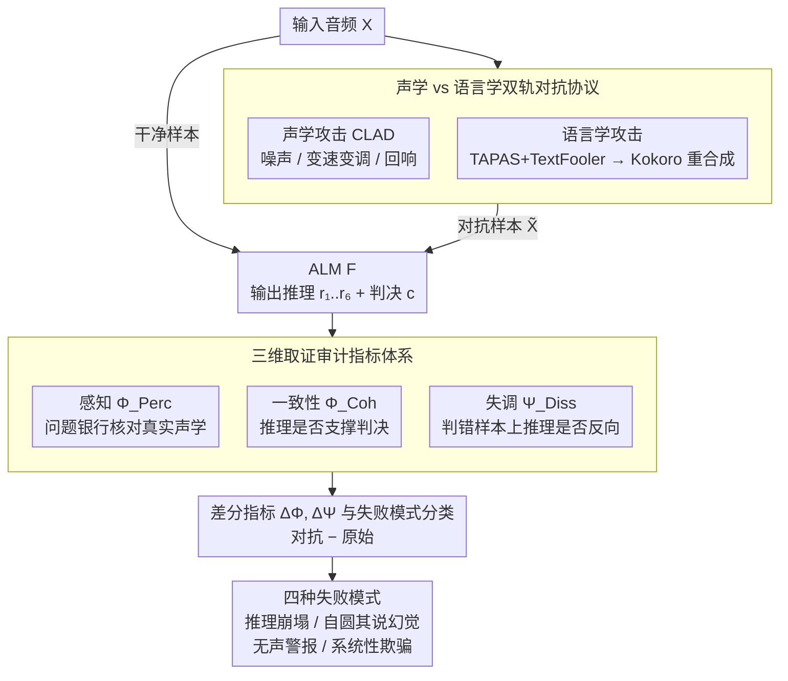

# Analyzing Reasoning Shifts in Audio Deepfake Detection under Adversarial Attacks: The Reasoning Tax versus Shield Bifurcation

**会议**: ACL 2026  
**arXiv**: [2601.03615](https://arxiv.org/abs/2601.03615)  
**代码**: 无  
**领域**: LLM 安全 / 音频深度伪造检测  
**关键词**: Audio Language Model, Chain-of-Thought, Adversarial Robustness, Cognitive Dissonance, 取证审计

## 一句话总结
本文为带推理链的音频语言模型（ALM）做深度伪造检测设计了"三维取证审计"框架（声学感知 / 认知一致性 / 认知失调），发现 CoT 推理并非普适增强——对声学感知强的模型（Qwen2-Audio）是"防护盾"，对感知弱的模型（Gemma-3n、Phi-4）反而是"推理税"；且当模型被攻破时，高认知失调可作为"无声警报"提醒人类审计员。

## 研究背景与动机

**领域现状**：音频深度伪造检测（ADD）一直是二分类黑箱（RawNet-2 / AASIST-2 / CLAD 等），最近开始用带 CoT 推理的音频语言模型（Qwen2-Audio、Phi-4-multimodal、gemma-3n-E4B、granite-3.3-8b）来做"glass-box"判决——既给"假/真"标签，又给中间推理步骤。

**现有痛点**：业界默认"explicit reasoning ⇒ 更鲁棒"，但没人系统地审计**推理本身**在对抗攻击下会怎么"漂移"。已有可解释性方法（occlusion、attention rollout、SHAP）都是 post-hoc 可视化，不能告诉你"推理是否真的支撑结论"或"推理在被攻击时是不是悄悄变了"。

**核心矛盾**：在取证场景下，二元"假/真"标签远不够——审计员需要知道模型为什么这样判、推理与判决是否一致、推理是否还有取证残值（哪怕判决错了）。

**本文目标**：拆成三个 RQ：① ALM 的描述是否真的扎根于原始音频（RQ1 声学感知），② 推理链是否逻辑上支持最终结论（RQ2 认知一致性），③ 当判决被攻破时，推理层是否还能作为"无声警报"（RQ3 认知失调）。

**切入角度**：借鉴法庭"先 qualify the witness"的传统——先 voir dire 验证模型的"听力"，再审"逻辑"，最后审"判决错了它有没有意识到"。

**核心 idea**：把推理鲁棒性从"final-label 鲁棒性"维度切到 perception + coherence + dissonance 三维，并用差分量 $\Delta\Phi,\Delta\Psi$ 量化"原始 vs 对抗"下推理形态的迁移。

## 方法详解

### 整体框架
输入是一段音频 $X$（干净样本，或对抗样本 $\tilde{X}=\mathrm{Adv}(X,\theta)$），经 ALM $\mathcal{F}$ 产出结构化输出 $Y=\{r_1,\dots,r_N,c\}$——既含覆盖 Prosody / Disfluency / Speed / Speaking Style / Liveliness / Quality 六个取证维度的自由文本推理 $r_i$，又含最终标签 $c\in\{\text{fake},\text{real}\}$。审计框架不动模型本身，而是在这份输出上并行算三类正交指标：感知 $\Phi_{\text{Perc}}$ 用带 GT 的问题银行核对"模型听到的"是否吻合真实声学属性，一致性 $\Phi_{\text{Coh}}$ 判断推理是否真的支撑（entail）当前判决，失调 $\Psi_{\text{Diss}}$ 则在判错样本上检查推理是否反向"嘶吼"不对劲。最后再配一组 $\Delta$ 差分指标比较原始 vs 对抗下的形态迁移，把"推理鲁棒性"从单一 label 维度拆成可独立观测的三维取证画像。整条流水线自上而下是：双轨对抗协议生成干净 / 对抗样本对 → 喂给 ALM 产出推理 + 判决 → 三维审计打分 → 攻击前后取差分并归类失败模式。

### 关键设计

**1. 声学 vs 语言学双轨对抗协议：用两条独立攻击轨道分别诱发 panic 与 rationalization**

审计要看出"推理在攻击下怎么漂移"，前提是有一对可控的攻击轨道把不同失败模式逼出来。声学攻击采用 CLAD 协议的三类 recipe——Background Noise（白噪 / 环境噪，SNR 15–25dB 与 5–20dB）、Time & Pitch（时域拉伸 0.9–1.1×、循环移位 1600–32000 样本）、Shape & Space（音量 0.5–2.0×、淡入淡出、合成回响 $x(t)\leftarrow x(t)+\alpha x(t-\delta)$）；语言学攻击则走 TAPAS+TextFooler，先在 transcript 上同义替换再用 Kokoro TTS 重新合成，让嗓音保持不变但 prosody 复杂度陡增。

之所以要做这种对照，是因为声学攻击破坏的是感知证据层（留下 spectral artifact），语言学攻击只改 transcript 复杂度（不留 artifact、更隐蔽），两者激发的推理失败截然不同——正是这一对照让 "Reasoning Tax vs Shield" 的 bifurcation 浮出水面。

**2. 三维取证审计指标体系（Perception / Coherence / Dissonance）：把推理鲁棒性拆成三个正交的取证维度**

过去衡量"推理是否被攻破"只盯 final-label 一个维度，但取证场景需要更细的分辨率。本文定义验证函数 $\mathcal{V}:(X,q)\mapsto\{0,1\}$ 和 entailment 函数 $\mathcal{E}:(r_i,c)\mapsto\{0,1\}$，进而构造三个互不替代的指标：感知 $\Phi_{\text{Perc}}(r_k)=\frac{1}{|\mathcal{D}|\cdot|\mathcal{Q}_k|}\sum\sum\mathcal{V}$ 衡量"听到的"是否扎根真实声学，一致性 $\Phi_{\text{Coh}}(r_i)=\frac{1}{|\mathcal{D}|}\sum\mathcal{E}(r_i^j,c^j)$ 衡量推理是否支撑判决，失调 $\Psi_{\text{Diss}}(r_i)=\frac{1}{|\mathcal{D}_{\text{Wrong}}|}\sum(1-\mathcal{E})$ 只在判错样本上衡量推理是否反向。三个判定函数都由 frontier LLM 集成落地（GPT-5 / Gemini-3 多数投票）。

关键在于 Coherence 高未必是好事——模型可能"自圆其说式幻觉"，越自洽越危险，所以必须用 Dissonance 兜底，把"自信地错"和"被骗了但内部还在挣扎"两种失败模式区分开。三个维度各管一段语义，缺一不可。

**3. 差分指标 $\Delta\Phi,\Delta\Psi$ 与失败模式分类：用攻击前后的差量自动给失败形态贴标签**

单看对抗状态下的指标会混淆"模型本来就差"和"被攻击后才变差"。本文对每个指标取攻击前后的差量 $\Delta\Phi_{\text{Coh}}=\Phi_{\text{Coh}}^{\text{PER}}-\Phi_{\text{Coh}}^{\text{ORG}}$（$\Delta\Psi_{\text{Diss}}$ 同理），把"基线偏差"剥离后只留下攻击真正造成的推理形态迁移。据此自动分出四种失败模式：$\Delta\Phi\ll 0$ 是推理崩塌（panic），$\Delta\Phi\ge 0$ 但判决仍错是自圆其说式幻觉，$\Delta\Psi\ge 0$ 是无声警报（Silent Alarm），$\Delta\Psi\ll 0$ 则是系统性欺骗（systemic deception）。这套差分把原本模糊的"鲁棒 / 不鲁棒"细化成可解释的失败形态学。

### 损失函数 / 训练策略
所有 ALM 用 QLoRA 在 ASVSpoof 2019 + DeepSeek-R1 cold-start 合成的 CoT 数据集上微调：BF16、AdamW（$\beta_1=0.9$, $\beta_2=0.95$）、LR=$1e^{-4}$ 线性衰减、global batch=16、weight decay=0.1。LoRA rank=16, $\alpha$=64, dropout=0.05，目标模块 [q,k,v,o]_proj。loss 仅在 Assistant token（推理 + 判决）上计算。CoT 训练数据通过 3 轮自举（majority-vote of 3 traces）精炼到 25,108 样本。

## 实验关键数据

### 主实验
ASVSpoof 2019 LA 数据集 + 4 个 ALM（NON=标准分类 / RSN=显式推理）+ 3 个传统 ADD baseline。下表是干净数据上的基线对比（节选）。

| Model | Mode | Acc. | Real F1 | Fake F1 |
|---|---|---|---|---|
| AASIST-2 | 二分类 | 99.58% | 98.02% | 99.77% |
| Qwen2-Audio-7B | NON | 98.00% | 91.19% | 98.88% |
| Qwen2-Audio-7B | **RSN** | **98.20%** | **91.70%** | **99.00%** |
| granite-3.3-8b | NON | 99.87% | 99.39% | 99.93% |
| granite-3.3-8b | RSN | 96.11% | 78.39% | 97.88% |
| gemma-3n-E4B | NON | 99.89% | 99.52% | 99.94% |
| gemma-3n-E4B | RSN | 95.63% | 81.95% | 97.73% |

只有 Qwen2-Audio 在 RSN 下保持甚至略涨；Gemma 的 Real F1 从 99.52% 暴跌到 81.95%——典型的 reasoning tax。

### 关键消融（声学攻击 vs 语言学攻击下的 $\Delta$ 指标，节选）

| Model | 攻击类型 | ASR | $\Phi_{\text{Coh}}^{PER}$ | $\Psi_{\text{Diss}}^{PER}$ | 失败模式 |
|---|---|---|---|---|---|
| Qwen2-Audio (RSN) | 声学 | 45.7 | 78.0 (↓8.2) | 29.2 (↓16.8) | Reasoning Shield |
| Qwen2-Audio (RSN) | 语言学 | 31.5 | 80.6 (↓7.3) | 9.6 (↑6.8) | 仍稳 |
| Gemma-3n-E4B (RSN) | 声学 | 49.1 | 43.2 (↓27.4) | 67.9 (↓15.5) | Coherence Erosion / Panic |
| Gemma-3n-E4B (RSN) | 语言学 | 82.8 | 86.9 (↑22.9) | 11.2 (↓1.4) | Systemic Deception |
| Phi-4 (RSN) | 声学 (Background Noise) | 44.8 | 72.1 | **41.3** (↑) | 银色警报样板 |

最戏剧性的案例：Gemma 在"American Female"语言学攻击下 ASR=100%（被完全骗倒），却维持 95.3% 的 coherence 和仅 4.7% 的 dissonance——"自信地一本正经地胡说八道"。

### 关键发现
- **Tax vs Shield 由声学感知决定**：Qwen2-Audio 是唯一在 Prosody/Speed/Disfluency 三维感知得分 >80% 的模型，也是唯一让 RSN 不输给 NON 的模型；感知不行的模型，CoT 反而成了"verbal overshadowing"的新攻击面。
- **Coherence 与 Dissonance 强负相关**（$r=-0.79, p<.001$）：模型只能在"自圆其说但藏失败"和"内部冲突但表达混乱"之间二选一，无法既清晰又警觉，这是当前 ALM 的结构性缺陷。
- **攻击模态决定失败模式**：声学攻击 → panic（coherence ↓ + dissonance ↑），语言学攻击 → rationalization trap（coherence ↑ + dissonance ↓）。Welch's t 检验：$\Delta$dissonance 的差异显著（$t=-4.04, p<.001$）。
- **Silent Alarm 在 78.2% 的 Gemma 被攻破样本里仍能拉响**（Shape Space 声学攻击下 dissonance=78.2%），证明即使判错，推理层仍能向人类审计员发出取证有用的信号——尤其当攻击是声学类时。

## 亮点与洞察
- **"reasoning tax vs shield"这一对偶概念抓得极准**：把过往"加 CoT 一定更好"的朴素信仰打碎，并给出可证伪的判据（声学感知强 → shield，弱 → tax）。这一发现可直接迁移到 vision-language model 的 CoT 鲁棒性研究。
- **Cognitive Dissonance 作为 silent alarm 是真正的取证创新**：传统鲁棒性研究只关心 final-label 是否被攻破，本文指出"判决虽错但推理仍嘶吼"也是重要的取证价值，给"glass-box"模型在司法/合规场景的部署提供了新的评估维度。
- **声学 vs 语言学的失败模式分离很有说服力**：Figure 3/4 把数据点聚类成 panic / rationalization 两个明显的象限，从直觉到统计都形成闭环。
- **profiling 思路可复用**：感知问题银行 + frontier-model ensemble 多数投票生成 GT，是"用 LLM 评 LLM"的稳健模板，可移植到其他 multimodal forensic 任务。

## 局限与展望
- 只在英文 ASVSpoof 2019 LA 上做，未覆盖 In-the-Wild / Fake-or-Real 等"野"数据集，也未做多语言；Tax/Shield 的 bifurcation 在其他语种上是否成立未知。
- 模型规模限定在 7-8B；更强的 Qwen3-Omni-30B 等大模型是否能克服 reasoning tax，是未验证的 scaling law 问题。
- 仅做诊断性框架，未给出"如何修复 reasoning tax"的训练目标或架构修改（作者明说后续工作）。
- 显式推理路径数 N=6（取自 Warren et al. 2024 的人类取证维度），未做维度灵敏度分析；增减维度对结论是否稳健不清。
- silent alarm 的可操作阈值未定义，距离真正的"自动告警"还差工程化包装。

## 相关工作与启发
- **vs ALLM4ADD (Gu et al. 2025)**：同样用 ALM 做 ADD，但不分析推理鲁棒性，本文是首个对"推理本身在对抗下漂移"做系统审计的工作。
- **vs MMAU / SpeechR / AIR-Bench**：那些是音频推理能力基准，本文是音频取证推理**鲁棒性**审计——评估对象不同。
- **vs CoT robustness 经典工作（NLP 域）**：以往多在 text-only 上看 CoT 对扰动的鲁棒性，本文揭示了"perception bottleneck"才是 CoT 是否有用的真正约束，对多模态 CoT 研究是新提醒。
- **vs TAPAS (Nguyen et al. 2025)**：本文复用其语言学攻击协议，但将焦点从"模型是否被骗"扩展到"推理是否被悄悄改写"。

## 评分
- 新颖性: ⭐⭐⭐⭐⭐ Tax vs Shield + Silent Alarm 双概念都是首次正式提出，框架可复用且立刻挑战业界默认假设。
- 实验充分度: ⭐⭐⭐⭐ 4 ALM × 2 攻击模态 × 3 RQ × 4 voice profile 矩阵覆盖好；遗憾未做规模扫描和跨数据集泛化。
- 写作质量: ⭐⭐⭐⭐⭐ 三个 RQ 一路推到 Figure 3-5 收尾，结构如法庭推理般清晰；指标命名 panic / silent alarm / systemic deception 形象有力。
- 价值: ⭐⭐⭐⭐ 对取证音频 AI 的部署评估有直接指导意义；silent alarm 思想可外溢到其他高风险 ML 系统。

<!-- RELATED:START -->

## 相关论文

- [\[ACL 2026\] HCFD: A Benchmark for Audio Deepfake Detection in Healthcare](hcfd_a_benchmark_for_audio_deepfake_detection_in_healthcare.md)
- [\[ACL 2026\] XLSR-MamBo: Scaling the Hybrid Mamba-Attention Backbone for Audio Deepfake Detection](xlsr-mambo_scaling_the_hybrid_mamba-attention_backbone_for_audio_deepfake_detect.md)
- [\[ACL 2026\] RTCFake: Speech Deepfake Detection in Real-Time Communication](rtcfake_speech_deepfake_detection_in_real-time_communication.md)
- [\[ACL 2026\] Closing the Modality Reasoning Gap for Speech Large Language Models](closing_the_modality_reasoning_gap_for_speech_large_language_models.md)
- [\[ACL 2026\] Speech-Hands: A Self-Reflection Voice Agentic Approach to Speech Recognition and Audio Reasoning with Omni Perception](speech-hands_a_self-reflection_voice_agentic_approach_to_speech_recognition_and_.md)

<!-- RELATED:END -->
