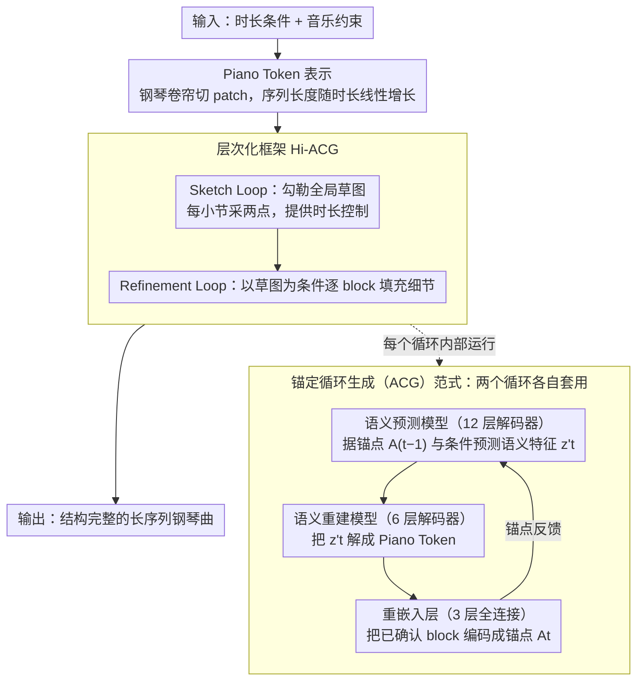

# Anchored Cyclic Generation: A Novel Paradigm for Long-Sequence Symbolic Music Generation

**会议**: ACL 2026  
**arXiv**: [2604.05343](https://arxiv.org/abs/2604.05343)  
**代码**: 无  
**领域**: 音频语音 / 序列生成  
**关键词**: 符号音乐生成、误差累积、锚定循环生成、层次化框架、钢琴Token

## 一句话总结
本文提出锚定循环生成（ACG）范式，通过在自回归过程中用已确认的音乐内容作为锚点来校准生成方向，有效缓解长序列符号音乐生成中的误差累积问题，并构建了层次化框架Hi-ACG实现从全局到局部的音乐生成。

## 研究背景与动机

**领域现状**：符号音乐生成是音乐生成的核心分支，主要方法包括基于Transformer的自回归模型（如Music Transformer、BPE Transformer）和扩散模型（如Cascaded-Diff）。自回归方法在短序列上效果不错，但在长序列生成时面临严重的质量退化。

**现有痛点**：自回归模型存在固有的误差累积问题——每一步预测都可能与最优值存在偏差，这些偏差在迭代过程中不断积累，导致长序列中音乐质量和结构完整性严重下降。Transformer的计算复杂度随序列长度呈二次增长。扩散模型虽提供了非自回归替代方案，但难以高效生成完整的长序列音乐。

**核心矛盾**：长序列音乐生成同时需要维护局部连贯性（音符级别的表达力）和全局结构完整性（曲式、和声走向），而现有方法难以兼顾。

**本文目标**：设计一种能显著减少误差累积、维持全局结构一致性、并具备精确时长控制能力的长序列音乐生成方法。

**切入角度**：受teacher forcing训练方法的启发——在训练时使用真实历史信息而非模型预测来指导下一步生成能大幅降低误差。作者将此思想迁移到推理阶段：每次生成后，将已确认的输出重新编码为锚点特征，用于引导后续生成。

**核心 idea**：将长序列生成分解为两级循环——sketch loop捕获高层语义，refinement loop生成详细音符内容，每个循环内通过锚定机制用已确认内容校准生成方向。

## 方法详解

### 整体框架
ACG 把长序列音乐生成组织成三个层次。最底层是 Piano Token 表示，把二值钢琴卷帘压成离散 token，使序列长度随时长线性增长；中间是 ACG 范式，每生成一步就把已确认的输出重新编码为锚点特征，靠"语义预测→语义重建→重嵌入"的闭环校准下一步方向；最上层是 Hi-ACG，用 Sketch Loop 先勾勒全局草图、再用 Refinement Loop 逐 block 填充细节。系统输入为时长条件与可选的音乐约束，输出为结构完整的长序列钢琴曲。

### 关键设计

**1. Piano Token 表示：让序列长度与音乐时长线性相关**

MIDI 事件编码的序列长度与时长呈非线性关系，复杂段落动辄需要极长序列，既放大误差累积又容易丢关键 token。本文把 $D \times T$ 的二值钢琴卷帘切成 $d \times t$ 的 patch，每个 patch 用一个 token 表示，词汇表大小为 $2^{d \times t}$；同一列的所有 token 组成一个 block $B$，承载 $t$ 个时间步的完整音乐信息。实验取 $d=2, t=4$，矩阵从 $D\times T$ 压成 $44 \times (T/4)$，从而保证 $L \propto T$ 的线性关系，patch 大小还能灵活调节词表与序列长度之间的 trade-off。

**2. 锚定循环生成（ACG）范式：用已确认的历史内容作锚点逐步校准**

ACG 把 teacher forcing 的思想从训练迁移到推理：训练时用真实标签引导下一步能压低误差，推理时则用已确认输出的重嵌入近似真实特征，保证每步预测都建立在高质量历史之上。它由三个级联组件端到端联合训练——12 层 Transformer 解码器的语义预测模型根据锚点特征 $A_{t-1}$ 和输入条件 $C$ 预测语义特征 $z_t'$，6 层 Transformer 解码器的语义重建模型把 $z_t'$ 解码成 Piano Token 序列，3 层全连接的重嵌入层再把生成的 block 映射回锚点特征供下一步使用。

这一闭环让预测特征与真实语义特征的余弦距离平均降低 34.7%，时间复杂度也从 $O(L^2)$ 降到 $O(L_{\text{sem}}^2) + L_{\text{sem}} \times O(L_{\text{rec}}^2)$。

**3. 层次化锚定循环生成（Hi-ACG）框架：把全局结构与局部细节拆到两级循环**

直接一口气生成长序列的全部细节，全局结构往往会涣散。Hi-ACG 模拟人类"先搭骨架再填血肉"的作曲过程：Sketch Loop 对真实音乐数据重采样（每小节采两个点）得到训练数据，生成粗粒度的全局草图并顺带提供精确的时长控制；Refinement Loop 以草图为输入，逐 block 扩展成详细的音符内容。两个循环各自独立训练、各自套用 ACG 范式，从而把"全局一致性"和"局部表达力"分到不同循环里互不干扰地优化。

### 一个完整示例
以生成一段 30 秒钢琴曲为例：先由 Sketch Loop 在锚点驱动下逐步产出一串粗粒度草图 block（每小节两点，勾勒和声走向与曲式骨架）；随后 Refinement Loop 以草图为条件从第一个 block 起步——语义预测模型据锚点 $A_0$ 与条件预测 $z_1'$，语义重建模型把 $z_1'$ 解成第一段 Piano Token，重嵌入层再把这段已确认内容编码成锚点 $A_1$ 喂给下一步；如此逐 block 推进，直到铺满草图规定的时长，最后把 token 矩阵还原成钢琴卷帘，输出完整曲子。

### 损失函数 / 训练策略
Sketch Loop 和 Refinement Loop 分别训练。在 MuseScore 数据（14 万双轨钢琴曲）上预训练 30 个 epoch，使用 4 块 RTX 4090，然后在 POP909 上微调。

## 实验关键数据

### 主实验（30秒短音乐生成）

| 模型 | 音高熵 | 节奏熵 | 和声一致性 | 旋律平滑度 | LLM评分 |
|------|--------|--------|-----------|-----------|---------|
| Ground Truth | 1.92 | 1.43 | 0.87 | 0.52 | 3.50 |
| Music Transformer | 1.95 | 1.66 | 0.94 | 0.41 | 2.25 |
| BPE Transformer | 3.16 | 1.74 | 0.90 | 0.55 | 2.43 |
| Cascaded-Diff | 3.26 | 2.36 | 0.91 | 0.66 | 3.37 |
| Hi-ACG (Full) | **1.43** | **1.69** | **0.89** | 0.60 | **3.10** |

### 消融实验

| 配置 | 音高熵 | LLM评分 | 说明 |
|------|--------|---------|------|
| Full (Hi-ACG) | 1.43 | 3.10 | 完整模型 |
| w/o Sketch Loop & SP | 2.44 | 2.22 | 去掉层次化和语义预测后退化严重 |
| w/o Sketch Loop | 1.32 | 3.06 | 仅靠Refinement Loop也能保持不错质量 |

### 关键发现
- ACG范式使预测特征与真实语义特征的余弦距离平均减少34.7%，验证了锚定机制有效性
- Hi-ACG在2分钟长音乐生成中优势更为明显，音高熵和旋律平滑度更接近真实音乐
- Sketch Loop对全局结构一致性贡献最大，去掉后音乐质量显著下降
- 框架在条件输入长音乐生成中展现了优秀的音乐理解和续写能力

## 亮点与洞察
- **锚定机制是teacher forcing的推理端适配**：训练时用真实标签引导是常见做法，但在推理时用已生成内容的重嵌入作为锚点来近似真实特征，这个思路可迁移到其他长序列生成任务（文本、视频等）。
- **Piano Token的线性序列长度设计**：通过控制patch大小灵活调节词汇量和序列长度的trade-off，使序列长度与时长线性相关，对处理变长音乐非常关键。
- **两级循环的分离训练**：草图和精炼各自独立训练、独立优化，避免了端到端训练中全局和局部目标的互相干扰。

## 局限与展望
- 仅在钢琴曲（双轨）上验证，未扩展到多乐器编曲或更复杂的音乐形式
- Piano Token的patch大小固定为2×4，不同复杂度的音乐可能需要自适应patch尺寸
- 重嵌入层是简单的全连接网络，可能无法完全恢复block中的所有信息
- 未与最新的大规模音乐生成模型（如MuPT、ChatMusician）进行直接比较

## 相关工作与启发
- **vs Music Transformer**：标准自回归，误差累积严重。ACG通过锚定机制在每步校正偏差
- **vs Cascaded-Diff**：也采用层次化策略但扩散步骤计算成本高。Hi-ACG两个循环都是高效自回归
- **vs 传统层次化方法**：SymphonyNet等方法层次间信息流较弱，Hi-ACG通过锚定机制保持强信息传递

## 评分
- 新颖性: ⭐⭐⭐⭐ 锚定循环生成范式在误差累积问题上提供了新思路
- 实验充分度: ⭐⭐⭐ 覆盖短/长/条件生成，但缺少与最新大规模模型的比较
- 写作质量: ⭐⭐⭐⭐ 从范式到框架到表示层层展开，逻辑清晰
- 价值: ⭐⭐⭐⭐ 锚定机制可推广到其他长序列生成任务

<!-- RELATED:START -->

## 相关论文

- [\[NeurIPS 2025\] Segment-Factorized Full-Song Generation on Symbolic Piano Music](../../NeurIPS2025/audio_speech/segment-factorized_full-song_generation_on_symbolic_piano_music.md)
- [\[ACL 2026\] Comprehensive Benchmarking of Long-Form Speech Generation in Diverse Scenarios](comprehensive_benchmarking_of_long-form_speech_generation_in_diverse_scenarios.md)
- [\[ACL 2026\] PlanRAG-Audio: Planning and Retrieval Augmented Generation for Long-form Audio Understanding](planrag-audio_planning_and_retrieval_augmented_generation_for_long-form_audio_un.md)
- [\[ACL 2026\] UniSonate: A Unified Model for Speech, Music, and Sound Effect Generation with Text Instructions](unisonate_a_unified_model_for_speech_music_and_sound_effect_generation_with_text.md)
- [\[ACL 2026\] SegTune: Structured and Fine-Grained Control for Song Generation](segtune_structured_and_fine-grained_control_for_song_generation.md)

<!-- RELATED:END -->
