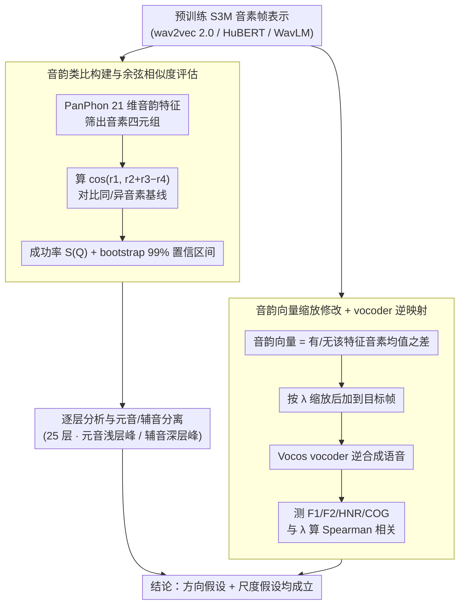

# [b] = [d] − [t] + [p]: Self-supervised Speech Models Discover Phonological Vector Arithmetic

**会议**: ACL 2026 Findings  
**arXiv**: [2602.18899](https://arxiv.org/abs/2602.18899)  
**领域**: Audio & Speech / 语音表示学习  
**关键词**: 自监督语音模型, 音韵向量算术, 语音表示结构, 声学可控合成, 跨语言泛化

## 一句话总结

系统性地证明自监督语音模型（S3M）的表示空间中存在线性的音韵特征向量，这些向量满足类似 word2vec 的向量算术关系，且其缩放比例与声学测量呈连续相关性。

## 研究背景与动机

**领域现状**：自监督语音模型（如 wav2vec 2.0、HuBERT、WavLM）在语音识别、合成和口语理解等下游任务中展现了强大性能。已有研究表明 S3M 编码了丰富的语音信息，表示空间中的距离关系反映声学相似性，且能形成对应音素单元的聚类。

**现有痛点**：虽然知道 S3M 编码了"什么"信息，但对于这些信息是"如何"结构化的仍然缺乏深入理解。类比于 word2vec 中经典的语义向量算术（king - man + woman ≈ queen），语音表示空间是否也存在类似的组合性结构尚未被探索。

**核心矛盾**：S3M 在各种任务上表现优异，但其表示空间的内部结构——特别是音韵特征是否以可组合、可操控的方式编码——仍不清楚。

**本文目标**：验证两个假设——（1）S3M 表示空间中存在线性的音韵特征向量（方向假设），（2）这些向量的缩放因子与声学特征的实现程度连续相关（尺度假设）。

**切入角度**：借鉴 word2vec 的向量类比测试方法论，将其推广到语音领域的音韵特征。

**核心 idea**：[b] - [p] + [t] ≈ [d]（浊音向量），即语音模型的表示空间中存在可组合的音韵向量，缩放这些向量可以连续控制对应声学特征的程度。

## 方法详解

### 整体框架

整个研究不训练新的语音模型，而是对已有 S3M 的表示空间做 post-hoc 探测，围绕两个假设展开两组实验。方向实验检验"是否存在满足音韵类比的线性方向"：用 PanPhon 的音韵特征筛出音素四元组，比较余弦相似度的排序关系。尺度实验检验"缩放音韵向量是否连续改变声学实现程度"：训练一个 vocoder 把 S3M 表示逆映射回语音，缩放向量后重新合成并测量声学量。数据覆盖 TIMIT（英语）与 VoxAngeles（95 种语言）共 96 种语言，输入是音素帧表示，输出是类比成功率与缩放-声学的相关系数。

### 关键设计

**1. 音韵类比构建与余弦相似度评估：检验表示空间里是否存在满足类比的线性方向**

要验证 [b]−[p]+[t]≈[d] 这类关系是否成立，先得稳健地构造类比并量化"成立"的标准。本文用 PanPhon 为每个音素提取 21 维音韵特征向量，按特征差异一致性筛出音素四元组（quadruplet），计算 $\cos(r_{p_1},\, r_{p_2}+r_{p_3}-r_{p_4})$，并与同音素基线 $\cos^+$ 和不同音素基线 $\cos^-$ 比较，定义成功率 $S(Q)$ 为满足 $\cos^- < \cos < \cos^+$ 排序的四元组比例。为避免单次随机采样带来的偏差，再用 bootstrap 构建 99% 置信区间确保统计可靠性。

**2. 音韵向量的缩放修改与 vocoder 逆映射：验证缩放因子 $\lambda$ 与声学实现程度连续相关**

光证明方向存在还不够，还要证明这个方向是"可连续操控"的。本文把音韵向量定义为"具备某特征"与"不具备该特征"的所有音素平均表示之差，将缩放后的向量加到目标帧上以修改 S3M 表示，再训练一个基于 Vocos 的 vocoder 把修改后的表示重新合成为语音，最后提取 F1、F2、HNR、COG 等声学测量与 $\lambda$ 计算 Spearman 秩相关。之所以选 Vocos，是因为它对分布外输入具有鲁棒性，特别适合分析这种经过人为修改的 S3M 表示。

**3. 逐层分析与元音/辅音分离：揭示不同层如何编码音韵信息**

S3M 各层对音韵的编码并不均匀。本文对 25 层分别计算成功率，并把音韵类比按元音/辅音分组做细粒度分析，发现 WavLM 呈现三个峰值——元音在中间层早期达峰，辅音在中间层后期达峰，最终层再融合所有信息。这一拆分背后的动机是元音与辅音的声学-时域特性不同（元音线索更局部化，辅音线索跨越更大的时间窗口），因而很可能在不同深度被优先编码。

### 损失函数 / 训练策略

Vocoder 训练使用标准的 Vocos 框架，在 LibriTTS（英语）和 FLEURS-R（多语言）上训练。核心分析不涉及模型训练，而是对已有预训练 S3M 的表示空间进行 post-hoc 探测。

## 实验关键数据

### 主实验

TIMIT 上不同模型的音韵类比成功率（最佳层）：

| 模型 | 最佳成功率 | 最佳层 |
|------|-----------|--------|
| MelSpec | 0% | - |
| MFCC | 19% | - |
| wav2vec 2.0 | 61% | 中间层 |
| HuBERT | 94% | 最后层 |
| WavLM | 92% | 最后层 |

VoxAngeles（95 种语言）上的成功率：

| 模型 | 最佳成功率 |
|------|-----------|
| MelSpec | 0% |
| MFCC | 19% |
| wav2vec 2.0 | 39% |
| HuBERT | 45% |
| WavLM | 93% |

跨语言泛化：468 个类比中 316 个（68%）包含至少一个英语中不存在的音素，WavLM 仍达到 93% 成功率。

### 消融实验

8 个音韵特征的缩放因子 λ 与声学测量的 Spearman 相关性（TIMIT，WavLM）：

| 音韵特征 | 声学测量 | 相关系数 ρ | 预期符号 |
|---------|---------|-----------|---------|
| High | F1 | -0.801 | - ✓ |
| Low | F1 | +0.908 | + ✓ |
| Back | F2 | -0.759 | - ✓ |
| Round | F2 | -0.833 | - ✓ |
| Nasal | F1BW | -0.441 | - ✓ |
| Sonorant | HNR | +0.649 | + ✓ |
| Strident | COG | +0.819 | + ✓ |
| Voice | COG | -0.720 | - ✓ |

所有 8 个特征的相关符号均与理论预期一致。

### 关键发现

- S3M 表示空间中的音韵类比在 19 个音韵特征上一致成立，远超频谱特征基线
- WavLM 在跨语言设置中（95 种语言）仍保持 93% 的成功率，展现出强大的泛化能力
- 元音相关类比在较浅层就达到峰值，辅音类比需要更深层——这与两类音素不同的时域特性一致
- 缩放因子 λ 不仅在插值范围（|λ| ≤ 1）有效，在外推范围（|λ| > 1）也保持连续相关性
- 仅在英语上训练的 S3M 能泛化到英语中不存在的音素的音韵算术

## 亮点与洞察

- **优雅的类比**：将 word2vec 的语义向量算术推广到语音领域的音韵特征，概念简洁而深刻
- **跨语言泛化的发现令人惊讶**：仅在英语上预训练的模型能编码 96 种语言的音韵结构，说明 S3M 学到了真正普遍的语音学知识而非语言特定的模式
- **实验规模宏大**：覆盖 96 种语言、19 个音韵特征、3 个 S3M 模型、25 层逐层分析
- **可控语音合成的潜力**：通过缩放音韵向量实现声学特征的连续控制，为可解释的语音合成提供了新思路

## 局限与展望

- 仅测试了 3 个英语预训练 S3M（wav2vec 2.0、HuBERT、WavLM），未包含多语言预训练模型
- Vocoder 重合成的质量可能引入噪声，影响声学测量的准确性
- 当前分析以音素级别为主，未探索更高层次（如音节、韵律）的组合性
- 未来可探索利用音韵向量进行可控语音转换或语音增强的应用

## 相关工作与启发

- **vs word2vec 类比测试**：本文的类比测试方法不同于 Mikolov et al. (2013b) 的 3CosAdd/3CosMul，使用了基于统计置信区间的评估方式，更加稳健
- **vs 传统语音探测（probing）**：probing 研究仅关注 S3M 编码了什么信息，本文进一步揭示了信息的组合性结构
- **vs Choi et al. (2024)**：此前的聚类分析发现 S3M 形成音素聚类，本文在此基础上发现了聚类之间的线性关系

## 评分

- 新颖性: ⭐⭐⭐⭐⭐ 首次系统性证明 S3M 中存在音韵向量算术，概念非常新颖
- 实验充分度: ⭐⭐⭐⭐⭐ 96 种语言、19 个特征、多模型多层分析，极其全面
- 写作质量: ⭐⭐⭐⭐⭐ 行文流畅，图表清晰，类比引入方式优雅
- 价值: ⭐⭐⭐⭐ 深化了对 S3M 表示结构的理解，对语音合成和分析有启发意义

<!-- RELATED:START -->

## 相关论文

- [\[ACL 2026\] An Exploration of Mamba for Speech Self-Supervised Models](an_exploration_of_mamba_for_speech_self-supervised_models.md)
- [\[ACL 2026\] Pseudo2Real: Task Arithmetic for Pseudo-Label Correction in Automatic Speech Recognition](pseudo2real_task_arithmetic_for_pseudo-label_correction_in_automatic_speech_reco.md)
- [\[ACL 2026\] Semi-Supervised Diseased Detection from Speech Dialogues with Multi-Level Data Modeling](semi-supervised_diseased_detection_from_speech_dialogues_with_multi-level_data_m.md)
- [\[ACL 2026\] How Tokenization Limits Phonological Knowledge Representation in Language Models and How to Improve Them](how_tokenization_limits_phonological_knowledge_representation_in_language_models.md)
- [\[ACL 2026\] Speech-Hands: A Self-Reflection Voice Agentic Approach to Speech Recognition and Audio Reasoning with Omni Perception](speech-hands_a_self-reflection_voice_agentic_approach_to_speech_recognition_and_.md)

<!-- RELATED:END -->
