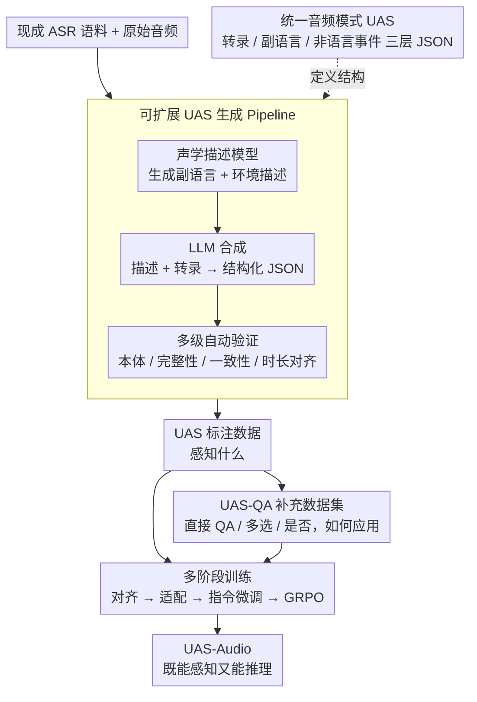

# Beyond Transcription: Unified Audio Schema for Perception-Aware AudioLLMs

**会议**: ACL 2026 Findings  
**arXiv**: [2604.12506](https://arxiv.org/abs/2604.12506)  
**代码**: [GitHub](https://github.com/Tencent/Unified_Audio_Schema)  
**领域**: 语音处理  
**关键词**: 音频大语言模型, 感知增强, 统一音频模式, 副语言信息, ASR

## 一句话总结
揭示当前 AudioLLM 的感知弱点源于 ASR 中心的训练范式（系统性抑制副语言和非语言信息），提出 Unified Audio Schema（UAS）将音频信息结构化为转录、副语言和非语言事件三个维度的 JSON 格式，在 MMSU 基准上感知精度提升 10.9% 同时保持推理能力。

## 研究背景与动机

**领域现状**：AudioLLM 呈现出一个反常现象——在复杂推理任务上表现优异（~70%），但在基础声学感知任务上急剧下降（~40%）。例如，模型可以正确转录"I'm fine"但完全忽略颤抖的声音所暗示的痛苦，或者无法注意到门砰的关门声。

**现有痛点**：这种感知缺陷跨模型规模和架构持续存在，表明问题不在于模型容量，而在于训练方式。绝大多数 AudioLLM 以 ASR 为核心训练信号，而 ASR 本质上是选择性的——为了恢复规范文本，它故意归一化掉韵律、说话人身份、情感和声学上下文。

**核心矛盾**：ASR 训练创造了根本性的不对称——模型被持续奖励去推理"说了什么"，同时被隐式地惩罚去关注"怎么说的"和"还有什么声音"。感知不是训练不足，而是被系统性地去强调了。

**本文目标**：设计一种训练监督格式，能显式保留声学感知信息而不牺牲语义对齐。

**切入角度**：从 Laver 的语音信号符号学框架出发，将音频信号分解为语言层、副语言层和超语言层三个信息层。

**核心 idea**：用结构化的 JSON schema 将音频的三个信息层显式编码为训练目标，将 ASR 的"隐式丢弃"变为"显式保留"。

## 方法详解

### 整体框架

这篇论文要解决的是 AudioLLM "只会转录、不会听"的感知缺陷。它的思路不是改架构，而是改监督格式：先把一段音频该被听到的所有信息定义成一个三层 JSON schema（说了什么 / 怎么说的 / 还有什么声音），再用一条全自动 pipeline 把现成 ASR 语料批量改写成这种 schema 标注，并据此生成配套的问答数据；最后把这些数据塞进标准的多阶段训练流程，让模型在学转录的同时被迫保留声学细节，得到既能感知又能推理的 UAS-Audio。

### 关键设计

**1. Unified Audio Schema：把 ASR 丢弃的声学信息显式写进监督目标**

ASR 训练的根本问题在于它只奖励"恢复规范文本"，韵律、情感、环境声这些信息没有落点，于是被系统性地归一化掉。UAS 的对策是给每段音频一个固定结构的 JSON，把信息拆成三层：Transcription（与 ASR 等价的逐字文本）、Paralinguistics（六个子字段——年龄、性别、情感、口音、韵律、音色）、Non-linguistic Events（环境描述、离散声音事件如门砰声、持续背景声如引擎轰鸣）；纯非语音音频则把转录和副语言字段置为 null。这样设计有三重好处：把"整体理解"解耦成显式子任务、避免不同维度的特征互相混淆；JSON 是低熵且语法一致的目标，比自由文本描述更容易被模型稳定学习；字段结构化后下游应用能直接、可靠地把声学属性读出来用。

**2. 可扩展的 UAS 生成 Pipeline：零人工标注地把 ASR 语料改写成感知监督**

要让 schema 真正可用，必须有海量标注，而手工标六个副语言维度成本不可接受。Pipeline 因此把标注完全自动化为三步：先用声学描述模型从原始音频里生成副语言和环境描述，再用 LLM 把这些描述和原始转录合成成结构化 UAS JSON，最后过一道多级自动验证——本体约束、转录完整性、逻辑一致性、时长-内容对齐逐项检查。人工审计 400 个样本显示大多数属性准确率超过 95%，说明用现成模型把标准 ASR 数据集转成感知监督这条路是可靠的。

**3. UAS-QA 补充数据集：教模型把声学知识用起来而不只是认出来**

只给 schema 标注，模型学到的是"该感知什么"，但未必会在被提问时调用这些信息。UAS-QA 因此基于 UAS 标注自动生成三类问答对——直接 QA（查询某个特定字段）、多选题、是/否题，覆盖 schema 的所有字段。它和 schema 标注形成互补：标注负责"感知什么"，QA 负责"如何应用"，消融里也正是两者叠加才把感知精度推到最高。

### 训练策略

沿用标准四阶段流程，在中间两阶段注入 UAS 数据：(1) 离散 token 对齐（扩展词表）；(2) Audio-LLM 适配，冻结 LLM 和编码器、只训练投影层并喂入 UAS 数据；(3) 全参数指令微调，混合 ASR/TTS + UAS + UAS-QA；(4) GRPO 强化。

## 实验关键数据

### 主实验（MMSU / MMAR / MMAU 基准）

| 模型 | MMSU 感知 | MMSU 推理 | MMSU 整体 | MMAR | MMAU | 三基准均值 |
|------|----------|----------|----------|------|------|-----------|
| Qwen2.5-Omni | 42.0 | 70.0 | ~56 | 55.8 | 64.2 | ~58.7 |
| Kimi-Audio | ~38 | ~68 | ~53 | 56.3 | 65.0 | ~58.1 |
| Step-Audio2-mini | ~40 | ~69 | ~55 | 57.2 | 63.8 | ~58.7 |
| **UAS-Audio** | **52.9** | **70.1** | **~61** | **60.1** | **65.2** | **~62.1** |

### 消融实验

| 配置 | MMSU 感知 | MMSU 推理 | 说明 |
|------|----------|----------|------|
| 无 UAS (仅 ASR) | ~40 | ~70 | 感知弱但推理正常 |
| 仅 UAS 标注 | ~48 | ~69 | 感知提升但不完全 |
| 仅 UAS-QA | ~45 | ~69 | QA 单独不够 |
| **UAS + UAS-QA** | **52.9** | **70.1** | 两者互补效果最好 |

### 关键发现
- **UAS-Audio 在 MMSU 感知上绝对提升约 11%**，同时推理性能完全保持
- **UAS 同时适用于连续和离散 AudioLLM 架构**，证明问题确实在监督而非架构
- **UAS 标注和 UAS-QA 提供互补监督**：标注教"感知什么"，QA 教"如何用"
- **在 MMAR 推理基准上取得 SOTA（60.1%）**，说明感知增强不损害推理
- **数据验证确认 pipeline 质量高**：人工审计 400 样本，大多数属性 >95% 准确率

## 亮点与洞察
- **诊断出 AudioLLM 感知弱点的根本原因**是 ASR 中心训练的"系统性去强调"而非"训练不足"——这个洞察比方法本身更有价值，为整个领域指明了方向
- **JSON 结构化 schema 作为训练目标**的思路可以推广到任何多维度感知任务——将隐式的"整体理解"分解为显式的结构化子任务
- **无需额外人工标注的 pipeline**使方法高度可扩展，可以将任何 ASR 数据集转化为感知增强数据

## 局限与展望
- UAS 的六个副语言子字段是手工定义的，可能遗漏某些重要维度（如呼吸模式、语速变化率）
- pipeline 依赖声学描述模型的质量，在低资源语言上可能退化
- 仅在 7B 规模验证，更大/更小模型上的效果待确认
- 非语言事件的检测精度可能在复杂声学场景中下降
- 可以探索让模型在需要时自动决定是否输出 UAS 而非始终生成

## 相关工作与启发
- **vs Qwen2.5-Omni**: Qwen2.5-Omni 是多模态模型但仍以 ASR 为核心训练，感知弱。UAS 通过改变监督方式解决问题
- **vs Caption-based 方法**: 非结构化描述有高熵变异性（同一声音可以有多种描述方式），UAS 的 JSON 格式提供低熵一致目标
- **vs 专用感知模型**: 如情感识别或说话人识别的专用模型精度高但单一。UAS 在统一模型中实现全维度感知

## 评分
- 新颖性: ⭐⭐⭐⭐ 核心洞察（ASR 中心训练抑制感知）比方法本身更创新
- 实验充分度: ⭐⭐⭐⭐⭐ 三大基准+消融+人工验证，跨架构验证
- 写作质量: ⭐⭐⭐⭐⭐ 问题诊断清晰，理论基础（Laver 框架）扎实
- 价值: ⭐⭐⭐⭐⭐ 为 AudioLLM 领域指出了方向性问题和解决路径

<!-- RELATED:START -->

## 相关论文

- [\[ACL 2026\] Beyond Transcripts: A Renewed Perspective on Audio Chaptering](beyond_transcripts_a_renewed_perspective_on_audio_chaptering.md)
- [\[CVPR 2026\] HAVE-Bench: Hierarchical Audio-Visual Evaluation from Perception to Interaction](../../CVPR2026/audio_speech/have-bench_hierarchical_audio-visual_evaluation_from_perception_to_interaction.md)
- [\[ACL 2026\] Speech-Hands: A Self-Reflection Voice Agentic Approach to Speech Recognition and Audio Reasoning with Omni Perception](speech-hands_a_self-reflection_voice_agentic_approach_to_speech_recognition_and_.md)
- [\[CVPR 2026\] Omni2Sound: Towards Unified Video-Text-to-Audio Generation](../../CVPR2026/audio_speech/omni2sound_towards_unified_video-text-to-audio_generation.md)
- [\[CVPR 2026\] PAVAS: Physics-Aware Video-to-Audio Synthesis](../../CVPR2026/audio_speech/pavas_physics-aware_video-to-audio_synthesis.md)

<!-- RELATED:END -->
