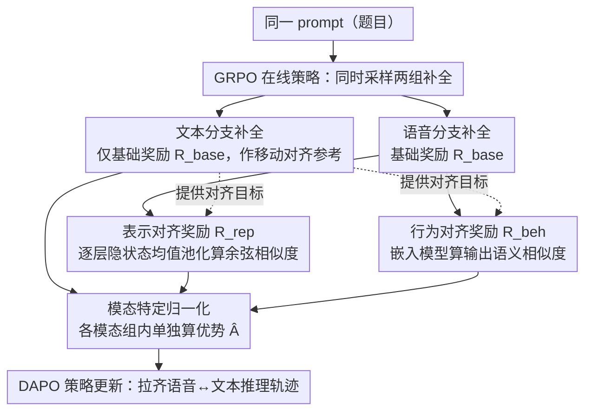

# Closing the Modality Reasoning Gap for Speech Large Language Models

**会议**: ACL 2026  
**arXiv**: [2601.05543](https://arxiv.org/abs/2601.05543)  
**代码**: [https://github.com/AmphionTeam/TARS](https://github.com/AmphionTeam/TARS)  
**领域**: LLM评测  
**关键词**: Speech LLM, 模态推理差距, 强化学习, 表示对齐, 轨迹对齐

## 一句话总结

本文提出 TARS（Trajectory Alignment for Reasoning in Speech），一个基于强化学习的框架，通过表示对齐和行为对齐两种密集奖励信号，将语音条件下的推理轨迹与文本条件下的推理轨迹对齐，在 7B 规模模型中达到 SOTA，MRR（模态恢复率）接近甚至超过 100%。

## 研究背景与动机

**领域现状**：语音大语言模型（Speech LLMs）已取得显著进展，采用语音编码器+适配器+文本 LLM 的三阶段架构，使语音输入能利用文本 LLM 的推理能力。

**现有痛点**：语音输入下的推理性能显著弱于文本输入，即存在"模态推理差距"。(1) 输入端融合方法（如冻结 LLM 训练适配器）只能实现表面对齐，细微的表示差异会在 Transformer 层间传播放大；(2) 输出端监督方法（如知识蒸馏）以离线方式强制 token 级匹配，但语音条件分布与文本不同，严格匹配是不可达目标，且存在 exposure bias。

**核心矛盾**：语音和文本的底层逻辑推理过程应该是模态不变的，但现有方法要么只对齐输入表示，要么以离线方式强制对齐输出，都无法有效引导推理轨迹本身的对齐。

**本文目标**：设计一个在线策略优化框架，同时对齐语音和文本条件下的内部表示和外部行为，消除模态推理差距。

**切入角度**：利用 GRPO 强化学习框架，以文本条件下的推理轨迹为移动参考，设计非对称奖励：对语音补全同时优化任务准确率+表示对齐+行为对齐，对文本补全仅优化准确率。

**核心 idea**：通过在线策略探索和密集对齐奖励，使语音模态与不断进步的文本推理能力共同演化，避免离线监督的 exposure bias 问题。

## 方法详解

### 整体框架

TARS 要消除的是"同一道题，文本能答对、语音就答不对"的模态推理差距。它把这件事放进 GRPO 的在线强化学习里：对每个 prompt 同时采样语音条件和文本条件两组补全，文本分支只用基础奖励优化、并把自己当作语音分支的对齐参考；语音分支则在基础奖励之外额外吃两种密集奖励——表示对齐和行为对齐。由于文本分支随训练持续变强，它给语音分支提供的对齐目标也越来越好，二者在同一框架里共同演化，从内部隐状态到外部输出一起被拉齐。

### 关键设计

**1. 表示对齐奖励：在 Transformer 层间就把语音和文本的隐状态拉回同一条轨迹**

模态差距的一个重要来源是输入端那点细微的表示差异会沿 Transformer 层层传播、逐层放大。表示对齐奖励直接在内部状态上给密集反馈：对每个层 $l$，把推理 token 的隐状态 $\mathbf{H}^{(l)}$ 均值池化成固定向量 $\bar{\mathbf{h}}^{(l)}$，再算语音补全与文本补全跨 $L$ 层的平均余弦相似度 $R_{\text{rep}} = \frac{1}{L}\sum_{l=1}^{L}\text{CosSim}(\bar{\mathbf{h}}_{\text{speech}}^{(l)}, \bar{\mathbf{h}}_{\text{text}}^{(l)})$。这是一种粗粒度但每层都有信号的表示级监督，把漂移在传播放大之前就压住。

**2. 行为对齐奖励：只要最终语义一致，就允许推理路径千姿百态**

光对齐隐状态可能过度约束——逼模型逐 token 复刻文本轨迹既不现实也有 exposure bias。行为对齐改在输出端做语义层面的软约束：用一个外部嵌入模型（如 Qwen3-Embedding-0.6B）算语音补全 $y_{\text{speech}}$ 与文本参考 $y_{\text{text}}^*$ 的语义余弦相似度 $R_{\text{beh}} = \text{CosSim}(\mathcal{E}(y_{\text{speech}}), \mathcal{E}(y_{\text{text}}^*))$。它和表示对齐互补：前者保证内部状态不漂，后者只盯最终行为是否一致，于是模型可以走多样的有效推理轨迹，只要落点对得上。

**3. 模态特定归一化：别让语音补全因为天生分低而被一棍子打死**

GRPO 用组内优势驱动学习，但如果把语音和文本补全混在一组归一化，文本天然分高、语音几乎总落在均值以下、持续拿负优势，学习信号就被压没了。对策是分模态各算各的优势：$\hat{A}_{i,m} = r_{i,m} - \mu_m$，其中 $\mu_m$ 是模态 $m$ 组内的奖励均值。这样即便某些语音补全的任务准确率全为零，对齐奖励仍能在语音组内部拉出相对优劣、给出有效梯度，对训练稳定性至关重要。

### 损失函数 / 训练策略

采用 DAPO 损失估计器（Dr. GRPO 变体），总奖励 $R_{\text{total}} = R_{\text{base}} + \alpha \cdot R_{\text{rep}} + \beta \cdot R_{\text{beh}}$（$\alpha = \beta = 1.0$），其中 $R_{\text{base}} = R_{\text{acc}} + 0.5 \cdot R_{\text{fmt}}$。训练用 LoRA 微调所有线性层，冻结音频编码器和投影器。

## 实验关键数据

### 主实验

**7B 模型在推理基准上的准确率（%）**

| 模型 | MMSU(A) | MMSU(T) | OBQA(A) | OBQA(T) | Avg(A) | MRR |
|------|---------|---------|---------|---------|--------|-----|
| Qwen2.5-Omni | 61.51 | 67.94 | 81.09 | 84.40 | 71.30 | 91.76% |
| TARS(Qwen2.5-Omni) | **67.96** | 68.54 | **85.71** | 88.57 | **76.84** | **98.89%** |
| Phi-4-MM | 54.81 | 72.15 | 71.65 | 84.62 | 63.23 | 79.59% |
| TARS(Phi-4-MM) | **70.14** | 75.76 | **89.45** | 91.87 | **79.80** | **100.45%** |

### 消融实验

| 训练策略 | MMSU(A) | OBQA(A) | Avg(A) | MRR |
|----------|---------|---------|--------|-----|
| SFT | 60.83 | 81.54 | 71.19 | 89.36% |
| DPO | 59.99 | 79.78 | 69.89 | 89.39% |
| Standard GRPO | 63.73 | 82.86 | 73.30 | 94.04% |
| + Rep. Alignment | 65.91 | 84.40 | 75.16 | 96.43% |
| + Beh. Alignment | 66.20 | 84.84 | 75.52 | 95.57% |
| + Both (TARS) | **67.96** | **85.71** | **76.84** | **98.89%** |

### 关键发现

- TARS 在 Phi-4-MM 上将 MRR 提升至 100.45%，即语音推理性能超越了文本
- 表示对齐和行为对齐互补，单独使用各提供约 2% 的提升，组合使用效果更佳
- 模态特定归一化对训练稳定性至关重要，朴素归一化会抑制语音学习
- TARS 不仅提升语音性能，还同时提升文本性能（Qwen2.5-Omni: 76.17→78.56%）
- 端到端模型超越了级联 ASR+LLM 系统，说明直接处理语音信号可避免 ASR 错误

## 亮点与洞察

- 非对称奖励设计巧妙：文本分支只优化任务准确率持续进步，同时为语音分支提供越来越强的对齐目标，形成共演化
- 即使所有语音补全的任务准确率为零（推理困难场景），对齐奖励仍能提供有效梯度信号
- MRR > 100% 的结果说明语音处理学到的知识可以反过来增强文本推理

## 局限与展望

- 仅在多选 QA 基准上评估，在自由形式生成任务上的效果待验证
- 表示对齐使用均值池化可能丢失位置信息，更精细的对齐方式可能更有效
- 依赖合成语音训练，真实语音（带噪声、口音）上的鲁棒性需进一步验证

## 相关工作与启发

- **vs AlignChat/DeSTA**: 这些方法冻结 LLM 只训练适配器，只能实现输入端对齐；TARS 通过 RL 对齐整个推理轨迹
- **vs Knowledge Distillation**: KD 以离线方式强制 token 级匹配，存在 exposure bias；TARS 通过在线探索避免此问题
- **vs SoundMind-RL**: 并发工作也用 RL 训练语音推理，但仅用稀疏规则奖励，缺乏密集对齐信号

## 评分

- 新颖性: ⭐⭐⭐⭐⭐ 首次将轨迹对齐的 RL 框架应用于语音-文本推理差距消除
- 实验充分度: ⭐⭐⭐⭐ 两个基础模型、多种基线对比、详细消融，但评估基准有限
- 写作质量: ⭐⭐⭐⭐⭐ 问题定义清晰，方法直觉性强，公式简洁
- 价值: ⭐⭐⭐⭐⭐ MRR>100% 的结果具有里程碑意义，为多模态推理对齐开辟新方向

<!-- RELATED:START -->

## 相关论文

- [\[ACL 2026\] VAPO: End-to-end Slide-Enhanced Speech Recognition with Omni-modal Large Language Models](vapo_end-to-end_slide-enhanced_speech_recognition_with_omni-modal_large_language.md)
- [\[ACL 2025\] Mind the Gap! Static and Interactive Evaluations of Large Audio Models](../../ACL2025/audio_speech/mind_the_gap_static_and_interactive_evaluations_of_large_audio_models.md)
- [\[ACL 2026\] SpeakerSleuth: Can Large Audio-Language Models Judge Speaker Consistency across Multi-turn Dialogues?](speakersleuth_can_large_audio-language_models_judge_speaker_consistency_across_m.md)
- [\[ACL 2026\] Do We Need Distinct Representations for Every Speech Token? Unveiling and Exploiting Redundancy in Large Speech Language Models](do_we_need_distinct_representations_for_every_speech_token_unveiling_and_exploit.md)
- [\[ACL 2026\] Temporal Contrastive Decoding: A Training-Free Method for Large Audio-Language Models](temporal_contrastive_decoding_a_training-free_method_for_large_audio-language_mo.md)

<!-- RELATED:END -->
