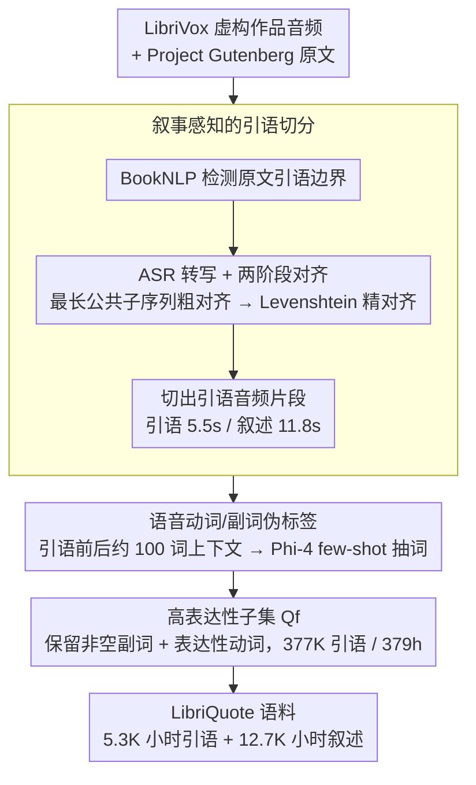

# Computational Narrative Understanding for Expressive Text-to-Speech

**会议**: ACL 2026 Findings  
**arXiv**: [2509.04072](https://arxiv.org/abs/2509.04072)  
**代码**: [GitHub](https://github.com/deezer/libriquote)  
**领域**: 语音合成 / 表达性TTS  
**关键词**: 有声书, 表达性语音, 叙事理解, 角色对话, 数据集

## 一句话总结

本文从有声书虚构作品中提取角色直接引语，构建了大规模表达性语音数据集 LibriQuote（5.3K 小时引语 + 12.7K 小时叙述），并用语音动词和副词伪标签标注说话风格，实验表明在 flow-matching 模型上微调可同时提升表达性和可懂度，且 LibriQuote-test 构成了一个具有挑战性的表达性 TTS 基准。

## 研究背景与动机

**领域现状**：近年来 TTS 系统通过大规模多域语音语料库（如 Emilia 约 100K 小时）实现了显著进步，展现出自然度和声音跟随能力。有声书（如 LibriSpeech、LibriHeavy）是最常见的开源 TTS 数据源。

**现有痛点**：(1) 现有有声书数据集（LibriTTS、LibriHeavy）在切分时完全忽略了叙事结构——要么丢弃角色引语，要么将引语和中性叙述混在同一个 30 秒片段中，导致片段内包含多种不同的韵律分布；(2) 有人认为有声书缺乏表达性多样性，但这忽略了虚构作品中角色对话固有的丰富韵律变化；(3) 现有表达性语音数据集规模小（EXPRESSO 仅数十小时）或标注方案有限（仅离散情感标签）。

**核心矛盾**：有声书中蕴含丰富的表达性语音（角色对话），但现有数据集的切分方式使 TTS 模型难以利用这些资源——混合了中性叙述和表达性引语的片段迫使模型倾向于学习更简单的中性部分。

**本文目标**：(1) 构建以角色引语为中心的大规模表达性语音数据集；(2) 用叙事上下文中的语音动词/副词作为伪标签标注说话风格；(3) 验证该数据集对 TTS 表达性和可懂度的提升效果。

**切入角度**：从叙事学理论（Genette 的叙事话语理论）出发，利用引语检测和文本-音频对齐技术，从 LibriVox 虚构作品中系统性地提取和标注角色引语。

**核心 idea**：有声书中角色引语天然构成了大规模、多样化的表达性语音数据——叙述者在朗读角色对话时会根据上下文切换说话风格，而周围的语音动词/副词（如 "he whispered softly"）则提供了自然的风格伪标签。

## 方法详解

### 整体框架

这篇论文的核心不是模型而是数据：要从海量有声书里把"角色对话"这部分天然表达性语音干净地抠出来并打上风格标签。整条流水线从 LibriVox 的虚构作品音频出发，先下载对应的 Project Gutenberg 原文，用 BookNLP 在文本里定位引语边界；同时对音频做 ASR 转写并与原文对齐，把每段引语落到精确的音频区间切出来；再回到原文上下文，用 LLM 把叙述里描述说话方式的语音动词和副词提成伪标签；最后按表达性强弱筛出高表达性子集 $\mathbf{Q}_f$。产物就是大规模、带风格标签的表达性 TTS 语料 LibriQuote。

### 关键设计

**1. 叙事感知的引语切分：把表达性的角色对话从中性叙述里分离出来**

现有有声书数据集按句子边界随机切片，75% 的片段只含叙述、25% 混了 1-12 个引语，而引语越多片段内韵律的标准差越大（Spearman $\rho=0.218$）——把表达性和中性混在一个 30 秒片段里，模型只会偷懒去学更简单的中性部分。切分的做法是用 BookNLP 在原文里检测引语边界，再靠两阶段对齐把它落到音频上：先用最长公共子序列做粗对齐，再用 Levenshtein 做精对齐，从而把每个引语映射到精确的音频片段。切出来的引语平均 5.5 秒、叙述平均 11.8 秒，得到的就是成分干净的表达性语音样本。

**2. 语音动词/副词伪标签：用叙述里的提示词当免费的风格标注**

叙述者朗读对话时会按上下文切换语气，而原文里"he whispered softly"这类语音动词和副词正是他切换风格的依据，天然可以当风格标签用。提取时取每段引语前后各约 100 词作为上下文窗口，把窗口内所有引语替换成特殊标记、只留叙述结构，再用 LLM（Phi-4）few-shot 抽出语音动词（如 whispered、shouted）和副词（如 softly、angrily）；LLM 同时自报置信度，用来剪掉不确定的预测以拉高精确率。人工核验的 Cohen's $\kappa=0.87$ 说明这种伪标签一致性很高，比离散情感标签细粒度得多又几乎零成本。

**3. 高表达性子集 $\mathbf{Q}_f$：用更少但更"会演"的数据训出更强表达性**

全量引语里掺了大量 "said" 这种中性动词，直接拿全集训练表达性增益会被稀释。$\mathbf{Q}_f$ 的筛选规则是：保留所有带非空副词伪标签的引语，外加语音动词落在一份手工定义的表达性动词列表里的引语，最终得到 377,776 个引语（占 11%）、共 379 小时。后续实验也证实，这 379 小时的小而精子集在数据高效设定下就能带来明显的表达性提升。

### 损失函数 / 训练策略

SparkTTS（自回归）在语义 token 上用标准语言建模损失微调 LLM 骨干（Qwen2-0.5B）；F5-TTS（flow-matching）沿用官方微调脚本。训练涵盖在不同数据子集上的微调与从头训练两类配置。

## 实验关键数据

### 主实验

**LibriQuote-test 上的 TTS 评估**

| 模型配置 | WER ↓ | SIM-O ↑ | CtxMOS ↑ |
|---------|-------|---------|----------|
| GT（真值） | 6.5 | - | 3.55 |
| SparkTTS（基线） | 4.8 | 0.46 | 2.94 |
| SparkTTS FT($\mathbf{Q}_f$) | 4.6 | 0.47 | 2.97 |
| SparkTTS Scratch($\mathbf{Q}$) | 9.5 | 0.40 | 3.09 |
| SparkTTS Full($\mathbf{N} \cup \mathbf{Q}$) | 5.1 | 0.41 | 3.30 |
| F5-TTS（基线） | 6.9 | 0.53 | 2.95 |
| F5-TTS FT($\mathbf{Q}_f$) | **6.6** | **0.54** | **3.33** |

### 消融实验

**域外评估（LibriSpeech-PC / SeedTTS）**

| 配置 | LibriSpeech WER ↓ | SeedTTS WER ↓ |
|------|-------------------|--------------|
| SparkTTS | 3.06 | 2.64 |
| FT($\mathbf{Q}_f$) | **2.10** | **2.07** |
| FT($\mathbf{Q}$) | **2.00** | **1.90** |

### 关键发现

- F5-TTS 微调后 CtxMOS 从 2.95 提升至 3.33（显著），同时 WER 下降——flow-matching 模型可同时提升表达性和可懂度
- SparkTTS 微调主要提升可懂度（域外 WER 从 3.06 降至 2.10），表达性提升有限
- 从头训练可提升表达性（CtxMOS 3.09）但牺牲可懂度（WER 9.5）
- 完整数据集（叙述+引语）从头训练效果更好（CtxMOS 3.30），二者互补
- LibriQuote-test 中 67% 引语被预测为非中性情感，LibriHeavy 中 91% 为中性

## 亮点与洞察

- 从叙事学理论出发解决 TTS 数据问题——有声书不缺表达性，缺的是正确的数据切分方式
- 语音动词/副词伪标签是极其自然且低成本的表达性标注方式，无需人工情感标注
- 高表达性子集 $\mathbf{Q}_f$ 仅 379 小时但效果显著，数据质量 > 数据量

## 局限与展望

- LibriVox 朗读者为志愿者，录音质量和表达水平参差不齐
- 仅覆盖英语虚构作品，未扩展到其他语言和体裁
- 未探索如何在推理时利用上下文语音动词/副词控制合成风格

## 相关工作与启发

- **vs LibriHeavy**: LibriHeavy 不区分引语和叙述，本文的叙事感知切分揭示了被忽视的表达性信号
- **vs EXPRESSO**: EXPRESSO 高质量但仅数十小时且 26 种预定义风格，LibriQuote 提供 5.3K 小时自然表达性多样性
- **vs 情感语音数据集**: 离散情感标签过于粗糙，语音动词/副词提供更细粒度的风格描述

## 评分

- 新颖性: ⭐⭐⭐⭐ 叙事感知切分+语音动词伪标签的数据构建范式新颖
- 实验充分度: ⭐⭐⭐⭐ 多模型多配置实验含域外评估和人类评估
- 写作质量: ⭐⭐⭐⭐ 动机清晰，数据构建流程详尽
- 价值: ⭐⭐⭐⭐ 数据集和方法论对表达性 TTS 社区有直接价值

<!-- RELATED:START -->

## 相关论文

- [\[CVPR 2026\] AudioStory: Generating Long-Form Narrative Audio with Large Language Models](../../CVPR2026/audio_speech/audiostory_generating_long-form_narrative_audio_with_large_language_models.md)
- [\[AAAI 2026\] DualSpeechLM: Towards Unified Speech Understanding and Generation via Dual Speech Token Modeling](../../AAAI2026/audio_speech/dualspeechlm_towards_unified_speech_understanding_and_generation_via_dual_speech.md)
- [\[ICLR 2026\] Latent Speech-Text Transformer](../../ICLR2026/audio_speech/latent_speech_text_transformer.md)
- [\[ICCV 2025\] Understanding Co-speech Gestures in-the-wild](../../ICCV2025/audio_speech/understanding_co-speech_gestures_in-the-wild.md)
- [\[ICML 2026\] Evaluating and Rewarding LALMs for Expressive Role-Play TTS via Mean Continuation Log-Probability](../../ICML2026/audio_speech/evaluating_and_rewarding_lalms_for_expressive_role-play_tts_via_mean_continuatio.md)

<!-- RELATED:END -->
