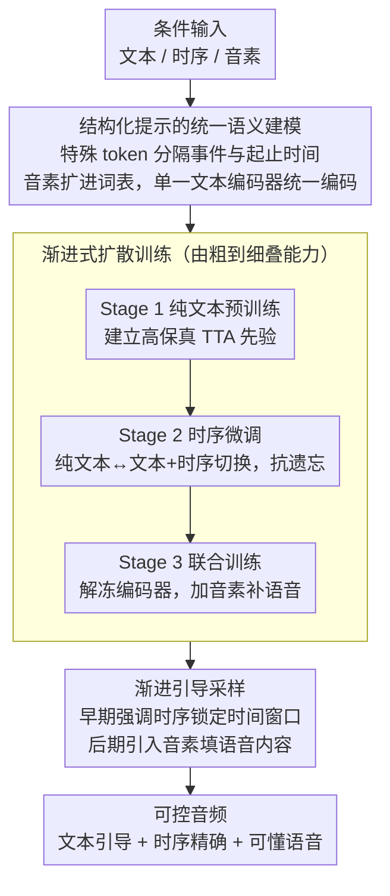

# ControlAudio: Tackling Text-Guided, Timing-Indicated and Intelligible Audio Generation via Progressive Diffusion Modeling

**会议**: ACL 2026  
**arXiv**: [2510.08878](https://arxiv.org/abs/2510.08878)  
**代码**: [项目页面](https://control-audio.github.io/Control-Audio/)  
**领域**: 图像生成  
**关键词**: 文本到音频, 时序控制, 可懂语音, 渐进式扩散, DiT

## 一句话总结

本文提出 ControlAudio，一个统一的渐进式扩散建模框架，通过三阶段渐进训练（TTA 预训练→时序控制微调→时序+可懂语音联合训练）和渐进引导采样，在单个扩散模型中实现文本引导、时序精确控制和可懂语音生成三种能力，在时序精度和语音清晰度上显著超越现有方法。

## 研究背景与动机

**领域现状**：文本到音频（TTA）生成已通过大规模扩散模型取得显著进展。近期研究开始探索细粒度控制：一类工作实现精确时序控制（如"鸟叫，2-5秒"），另一类工作实现可懂语音生成（音频中包含清晰可辨的语音内容）。

**现有痛点**：(1) 由于大规模标注数据稀缺（同时包含时序标注和语音转写的数据极少），可控 TTA 在规模化后性能仍受限；(2) 此前没有工作在统一框架中同时实现时序控制和可懂语音生成；(3) 添加细粒度控制信号时常常牺牲纯文本条件下的生成质量（灾难性遗忘）；(4) 自然语言描述复杂多事件场景时存在歧义。

**核心矛盾**：可控 TTA 需要同时处理多种粒度的条件信号（文本→时序→音素），但不同粒度的训练数据规模差异巨大（百万级文本-音频对 vs 数万级时序标注数据），直接联合训练效果差。

**本文目标**：在单个扩散模型中统一实现文本引导、时序指示和可懂语音三种能力，且不牺牲各单项能力。

**切入角度**：将可控 TTA 建模为多任务学习问题，通过渐进式扩散建模——在数据构建、模型训练和引导采样三个层面都采用由粗到细的渐进策略。

**核心 idea**：渐进式建模天然匹配控制粒度的层次性（文本→时序→音素）和扩散采样的由粗到细特性——在扩散轨迹的早期阶段强调粗粒度时序结构，在后期阶段引入细粒度音素内容。

## 方法详解

### 整体框架

ControlAudio 想在单个扩散模型里同时塞进三种控制能力——文本引导、精确时序、可懂语音，而难点在于这三类的训练数据规模差着两个数量级（百万级文本-音频对 vs 数万级时序标注）。它的解法是把"渐进"思想贯穿数据、训练、推理三层：先在大规模文本-音频对上预训练一个高保真 DiT 拿到 TTA 先验，再在时序标注数据上微调补上时间控制，最后解冻全部模块在多源数据上联合训练补上语音；推理时同样由粗到细，扩散早期用时序条件锁住事件的时间窗口，后期才引入音素条件填进语音内容。

### 关键设计

**1. 结构化提示的统一语义建模：用一个文本编码器吃下文本、时序、音素三种条件**

自然语言描述复杂多事件场景天生有歧义——"from 2 to 5"既可能指音调滑动也可能指时间范围——所以 ControlAudio 不再依赖自由文本，而是设计了带特殊 token 的结构化格式，把事件描述和精确起止时间显式分隔（如 `<event>鸟叫<start>2.0<end>5.0`）。语音时长直接由时序窗口定义，并把音素 token 扩进文本编码器的词表，于是三种粒度的条件都被同一个编码器统一编码，既消除了歧义又天然可扩展，避免了为每种条件单独搭一套模块。

**2. 渐进式扩散训练：分三阶段由粗到细叠能力，每加一种都不损伤前面已有的**

直接用全部条件联合训练，会因数据规模不平衡和任务复杂度而性能崩塌，所以训练被拆成三阶段逐步加难度。Stage 1 只用文本条件预训练，先建立高保真 TTA 先验；Stage 2 在时序标注数据上微调，但训练时随机在"纯文本"和"文本+时序"两种条件间切换，逼模型别忘掉原来的纯文本生成能力，对抗灾难性遗忘；Stage 3 解冻文本编码器联合优化，在文本 / 文本+时序 / 文本+时序+音素三种条件间切换。这样控制粒度一层层叠上去，模型逐步建立起从粗到细的控制能力。

**3. 渐进引导采样：让条件粒度跟着扩散采样阶段走**

扩散采样本身就是由粗到细的过程——早期步骤决定大尺度结构，后期步骤雕细节，固定不变的引导信号没法匹配不同阶段的需求。渐进引导采样因此让条件粒度对齐采样粒度：早期强调时序条件，先把每个事件该出现在哪个时间窗口定下来；后期再引入音素条件，往确定的窗口里填具体语音内容。这种"条件粒度对齐采样粒度"的设计实测显著优于固定引导。

### 损失函数 / 训练策略

标准条件扩散训练目标（预测噪声）。数据构建：标注数据从 AudioSet-SL 提取含语音片段并用 Gemini 2.5 Pro 转写；模拟数据从 LibriTTS-R 组合单/多说话人场景并与非语音背景混合（SNR 2-10 dB），生成 171,246 个复杂音频场景。

## 实验关键数据

### 主实验

**AudioCondition 测试集上的时序控制评估**

| 方法 | Eb ↑ | At ↑ | FAD ↓ | CLAP ↑ | Temporal(主观) ↑ | OVL(主观) ↑ |
|------|------|------|-------|--------|----------------|------------|
| Ground Truth | 43.37 | 67.53 | - | 0.377 | 4.52 | 4.48 |
| Stable Audio | 11.28 | 51.67 | 1.93 | 0.318 | 1.94 | 3.44 |
| PicoAudio | 29.96 | 57.70 | 3.43 | 0.296 | 2.70 | 2.44 |
| **ControlAudio** | **38.50** | **67.87** | **0.98** | **0.347** | **4.01** | **3.74** |

### 消融实验

**训练策略消融**

| 配置 | At ↑ | FAD ↓ | 语音 WER ↓ |
|------|------|-------|----------|
| 仅 Stage 1 | 基线 | 基线 | 无语音能力 |
| + Stage 2（时序） | 显著提升 | 微降 | 无语音能力 |
| + Stage 3（时序+语音） | 最佳 | 最佳 | **最佳** |
| 无渐进引导（固定引导） | 下降 | 上升 | 上升 |

### 关键发现

- ControlAudio 在时序精度上接近 Ground Truth（At 67.87 vs 67.53），远超其他方法
- Stage 3 的联合训练不仅解锁了语音能力，还进一步提升了时序精度——这得益于时序标注语音数据提供了更丰富的时间-内容对齐信号
- 解冻文本编码器联合优化是关键——使条件编码和生成骨干协同适应复杂多目标任务
- 渐进引导采样显著优于固定引导——条件粒度与采样粒度的对齐提升了生成质量
- CoT LLM 规划可将自由文本转化为结构化提示，扩展了实际使用场景

## 亮点与洞察

- 渐进式设计贯穿数据→训练→推理三个层面，形成一致的由粗到细范式
- 结构化提示+音素扩展实现了用单一文本编码器处理三种条件，避免了多模块的复杂性
- Stage 3 联合训练反而提升时序精度的发现是反直觉的——多任务学习的正迁移

## 局限与展望

- 模拟数据的 SNR 范围（2-10 dB）可能不覆盖所有实际场景
- 语音生成的说话人身份控制尚未探索
- 未评估超过 10 秒的长音频生成能力
- 依赖外部 LLM 将自由文本转化为结构化提示

## 相关工作与启发

- **vs PicoAudio/AudioComposer**: 仅实现时序控制而无语音能力，ControlAudio 首次统一两者
- **vs VoiceLDM/VoiceDiT**: 专注语音合成但不支持通用音频事件的时序控制
- **vs 视频生成中的渐进建模**: ControlAudio 首次将渐进建模引入可控 TTA 领域

## 评分

- 新颖性: ⭐⭐⭐⭐ 渐进式扩散建模+统一语义编码的框架设计新颖
- 实验充分度: ⭐⭐⭐⭐⭐ 主客观评估全面，消融实验充分
- 写作质量: ⭐⭐⭐⭐ 方法描述系统清晰，渐进设计动机阐述充分
- 价值: ⭐⭐⭐⭐ 首次统一时序控制和可懂语音生成，推动了可控音频生成发展

<!-- RELATED:START -->

## 相关论文

- [\[ICML 2025\] IMPACT: Iterative Mask-based Parallel Decoding for Text-to-Audio Generation with Diffusion Modeling](../../ICML2025/audio_speech/impact_iterative_mask-based_parallel_decoding_for_text-to-audio_generation_with_.md)
- [\[AAAI 2026\] Diff-V2M: A Hierarchical Conditional Diffusion Model with Explicit Rhythmic Modeling for Video-to-Music Generation](../../AAAI2026/audio_speech/diff-v2m_a_hierarchical_conditional_diffusion_model_with_explicit_rhythmic_model.md)
- [\[ACL 2026\] Omni-Embed-Audio: Leveraging Multimodal LLMs for Robust Audio-Text Retrieval](omni-embed-audio_leveraging_multimodal_llms_for_robust_audio-text_retrieval.md)
- [\[ICML 2026\] Towards Streaming Synchronized Spatial Audio Generation via Autoregressive Diffusion Transformer](../../ICML2026/audio_speech/towards_streaming_synchronized_spatial_audio_generation_via_autoregressive_diffu.md)
- [\[ACL 2025\] In-the-wild Audio Spatialization with Flexible Text-guided Localization](../../ACL2025/audio_speech/tas_audio_spatialization.md)

<!-- RELATED:END -->
