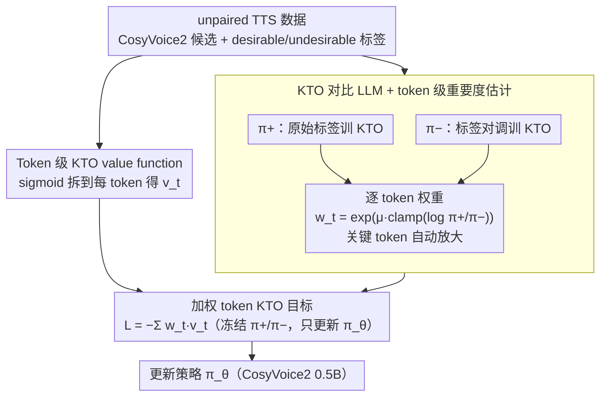

# Data-efficient Targeted Token-level Preference Optimization for LLM-based Text-to-Speech

**会议**: ACL 2026  
**arXiv**: [2510.05799](https://arxiv.org/abs/2510.05799)  
**代码**: 论文未公开说明（缓存中未给出仓库链接）  
**领域**: LLM 对齐 / TTS / 偏好优化  
**关键词**: TKTO, KTO, 无配对偏好, token 级 reward, 日语模糊发音

## 一句话总结
针对 LLM-based TTS 中模糊发音（如日语「辛い」既可读 karai 也可读 tsurai）的对齐难题，作者提出 TKTO：先用两个标签对调训练的对比 KTO 模型估计每个 token 的重要度权重 $w_t$，再把 KTO 的 utterance 级 value function 拆到 token 级并加权聚合，实现「无需配对数据 + 自动定位目标 token」的双重升级，把日语发音准确率从 0.668 抬到 0.958（+39%），CER 降 54%。

## 研究背景与动机
**领域现状**：LLM-based TTS（CosyVoice2、F5-TTS 等）已普遍接入 DPO 系列偏好优化（Zhang et al. 2025, Tian et al. 2025）来提升可懂度和说话人相似度，避开传统 G2P 转换器的硬规则。

**现有痛点**：对模糊发音场景（日语「辛い」、汉字异读、人名地名）有两大瓶颈 —— (i) **必须成对数据**：DPO 需要同一句话同时存在「正确发音 + 错误发音」两条样本，但实际 TTS 输出常常「全对」或「全错」，论文统计发现 89.5% 的句子只有单边样本，只有 10.5% 有完整配对；(ii) **utterance 级优化**：发音问题本质是 char/token 级的，但 DPO 把整条 utterance 视作单一标签，目标信号被稀释到几百个 token 上。

**核心矛盾**：fine-grained 信号（应在 token 级、应能用 unpaired 数据） vs 现有偏好优化（utterance 级 + 强制 paired）。前者直接限制 sample efficiency 和 alignment 精度。

**本文目标**：(i) 摆脱 paired 限制以利用更多数据；(ii) 自动在没有 token 标注的情况下找出「真正决定发音正确性」的 token 并加重权重。

**切入角度**：作者借用 KTO（Kahneman-Tversky Optimization）天生支持 unpaired 数据这一性质，再用「同一份数据训两个标签相反的 KTO」差分出每个 token 的隐式 reward —— 这恰恰是用 DPO/KTO 公式做 token 级 reward 估计的经典做法（Rafailov et al. 2024），但用法是「先估权重、再加权 KTO」。

**核心 idea**：用 KTO 对比对（$\pi^+ / \pi^-$）做 token 级 reward 估计 → 把这个 reward exp 之后作为 token 权重 → 加权到 token 级 KTO loss 上，端到端地把对齐压力集中到关键 token。

## 方法详解

### 整体框架
LLM-based TTS 在遇到模糊发音（日语「辛い」既能读 karai 又能读 tsurai）时很难对齐，根因有二：发音错误本质是 token 级的，而真实数据里 89.5% 的句子只有「全对」或「全错」的单边样本、配不成对。TKTO 用两步把这两个痛点一起解决：Step 1 先在同一份 unpaired 数据上训两个标签相反的对比 KTO 模型 $\pi^+$（原始标签）和 $\pi^-$（desirable ↔ undesirable 翻转），用两者 log-ratio 估出每个 token 的重要度权重 $w_t$，自动定位「真正决定发音对错」的 token；Step 2 把 KTO 原本 utterance 级的 sigmoid value 拆到 token 级得到 $v_t$，再用 $w_t$ 加权求和当 loss。底座是 CosyVoice2 (0.5B)，只训这一层偏好优化，不动 vocoder。

### 关键设计

**1. KTO 对比 LLM + token 级重要度估计：在没有 token 标注时自动找出决定好坏的关键 token**

人工标 token 级偏好成本极高，而 paired 数据又稀缺，TKTO 的办法是「同一份数据、翻转标签」训两个不共享参数的模型：$\pi^+$ 用原始 desirable/undesirable 标签，$\pi^-$ 把两个标签对调。对每个生成 token 算权重 $w_t = \exp\left(\mu\cdot \text{clamp}\left(\log\frac{\pi^+(y_t\mid x, y_{<t})}{\pi^-(y_t\mid x, y_{<t})}, L, U\right)\right)$，desirable 样本取 $\mu>0$、undesirable 取 $\mu<0$，$[L,U]$ 是裁剪范围。直觉很清楚：若某 token 在正样本模型下概率高、负样本模型下概率低，说明它是区分好坏的关键，权重被放大；若两个模型给出的概率差不多，说明它与偏好无关，权重接近 1。这相当于用对比 KTO 在 unpaired 设置下蒸馏出一个无需额外标注的 token-level reward —— 作者实测在目标字符「辛」位置上 desirable token 的 reward = 0.22（高于全句平均 0.12），undesirable token 的 reward = −1.54，目标 token 自动被放大 12.8×。

**2. Token 级 KTO value function：把 sigmoid value 从整句拆到每个 token**

原始 KTO 在 utterance 级把整条 reward 求和后再过一次 sigmoid，等价于「先平均再非线性」，会把关键 token 的贡献淹没在几百个无关 token 里。TKTO 把它拆开：每个 token $y_t$ 的 reward 为 $r_{\theta,t}(x,y)=\log\frac{\pi_\theta(y_t\mid x, y_{<t})}{\pi_{\text{ref}}(y_t\mid x, y_{<t})}$，参考基线 $z_{0,t}=\mathrm{KL}(\pi_\theta(\cdot\mid x,y_{<t})\|\pi_{\text{ref}}(\cdot\mid x,y_{<t}))$（按 microbatch 估计、不回传梯度）。token 级 value 为：desirable 样本时 $v_t = \lambda_D\sigma(\beta(r_{\theta,t}-z_{0,t}))$，undesirable 时 $v_t = \lambda_U\sigma(\beta(z_{0,t}-r_{\theta,t}))$。这样 sigmoid 在每个位置独立饱和，强信号 token 不会被弱信号 token 拖平。

**3. 加权 token KTO 目标：把权重和 value 合进一个求和 loss，端到端训练**

最终目标只是把前两步合到一起：$\mathcal{L}_{\text{TKTO}} = \mathbb{E}_{(x,y)}\left[-\sum_{t=1}^{|y|} w_t \cdot v_t(x,y)\right]$。前向时冻结两个对比 LLM、只用它们算 $w_t$，后向只更新策略 $\pi_\theta$。这样「重要度估计」和「偏好优化」被彻底解耦——前者一次性预计算（论文中 10 分钟 / 8×A100），后者不过是普通 KTO 多带一项位置权重，整体改动极小却能把对齐压力精准压到关键 token 上。

### 损失函数 / 训练策略
对比 LLM 训练用标准 KTO；TKTO 阶段冻结对比模型，预先算 $w_t$ 缓存。底模 CosyVoice2 (0.5B)，已在 20K 小时日语 TTS 上微调；构造数据时每条文本生成 5 条 male / 5 条 female 候选，按发音正确性 + CER 选最优 desirable 与最差 undesirable；CER 用 whisper-v3-large 计算。

## 实验关键数据

### 主实验
日语 5,000 句包含「辛い」的测试集，对 female / male 两个 speaker 分别报 Acc（目标字读音正确率）/ CER / Bad（CER > 0.3 比例），节选 Table 1：

| 模型 / 数据形态 | Female Acc ↑ | Female CER ↓ | Male Acc ↑ | Male CER ↓ |
|------------------|-----------:|----------:|-----------:|----------:|
| Base CosyVoice2 (Du et al. 2024) | 0.683 | 0.128 | 0.668 | 0.138 |
| SFT (desirable only) | 0.674 | 0.119 | 0.654 | 0.130 |
| DPO (paired) | 0.706 | 0.120 | 0.693 | 0.130 |
| KTO (paired) | 0.654 | 0.066 | 0.651 | 0.074 |
| KTO (unpaired) | 0.933 | 0.079 | 0.952 | 0.087 |
| **TKTO (paired)** | 0.681 | 0.059 | 0.701 | 0.066 |
| **TKTO (unpaired)** | **0.949** | **0.075** | **0.958** | 0.085 |
| F5-TTS / F5-TTS+G2P（非 LLM 参考） | 0.498–0.500 | 0.136–0.177 | 0.500 | 0.146–0.177 |
| gpt-4o-mini-tts（强行业基线） | 0.900 | 0.109 | 0.939 | 0.111 |

TKTO unpaired 同时刷新 Acc 与 CER，且双指标全部超过 gpt-4o-mini-tts、gemini-2.5-pro-preview-tts 等闭源工业模型。

### 消融实验

| 配置 | Acc / CER 趋势 | 说明 |
|------|----------------|------|
| TKTO（unpaired） | 0.949 / 0.075（F），0.958 / 0.085（M） | 完整方法 |
| TKTO（paired，10.5% 数据） | 0.681 / 0.059, 0.701 / 0.066 | 仍能拿到与 DPO 相当的 Acc，但少了 6× 数据 |
| KTO（unpaired，去掉 token 加权） | 0.933 / 0.079, 0.952 / 0.087 | 验证 token 级加权再加 +1.6 / +0.6 pt Acc |
| KTO（paired） | 0.654 / 0.066, 0.651 / 0.074 | 配对数据稀缺导致 Acc 反而比 base 还低 |
| SFT desirable-only | 0.674 / 0.119, 0.654 / 0.130 | 无对比信号，CER 没有改善 |

NMOS 主观打分（表 2）：Base 4.09 < KTO 4.17 < TKTO 4.21；ABX 偏好测试（Figure 6）也以 TKTO 占优。

### 关键发现
- **token 级加权比换数据更值钱**：在同样 unpaired 数据上加 token 权重，又比 vanilla KTO 涨 0.6–1.6 pt Acc，且 CER 同步降；说明哪怕数据规模相同，把权重导到「真正决定发音的 token」上能稳定提升。
- **训练动力学反映：TKTO 只抬 desirable token 的 log-likelihood**（Figure 3），而 SFT 会同时把 undesirable token 的 likelihood 也抬起来，说明 TKTO 的梯度更聚焦、更安全。
- **token 权重自动定位目标字符**：未在训练中告诉模型「辛」是关键字符，但平均权重在该位置达到 12.8× 全句平均，case study 显示其他汉字权重接近 1，证明 $\pi^+/\pi^-$ 差分确实在做 implicit token attribution。
- **paired 数据成为瓶颈**：DPO 只能用 1.5K 配对，KTO/TKTO unpaired 能用 9K，6× 数据红利直接体现在 Acc 上 0.668 → 0.958 的跃迁。

## 亮点与洞察
- 「翻标签训第二个模型，再用 log-ratio 当 token reward」是个简单到优雅的 trick：不需要额外人工标 token 偏好、不依赖外部 reward model，把 KTO 的隐式 reward 性质榨干了。
- 解耦「权重估计 → 偏好优化」让方法与下游 PO 算法正交，未来可以把 $w_t$ 套到 DPO、IPO、ORPO 上做同款 token 级扩展。
- 在 TTS 这个 G2P 长期统治的领域里，方法做的是「让 LLM 自己学会哪个字最容易读错并加重训练」，这种 self-attributed curriculum 思想在所有「输出局部决定整体质量」的任务（speech / OCR / code）都有迁移空间。

## 局限与展望
- 评测仅覆盖日语 + 一个目标字符「辛」+ 5,000 句 + 三位标注员，缺乏多语言 / 多歧义字符的泛化验证。
- 对比 LLM 训练用了「同数据翻标签」假设，当 desirable / undesirable 边界模糊（如多个候选都接近）时，$\pi^-$ 可能学不到稳定信号；clamp $[L,U]$ 与 $\mu$ 全靠手调。
- 全流程只调 TTS 解码器，没有把 vocoder / 文本 G2P 也加入端到端优化，可能仍有上游 G2P 的偏置残留。
- NMOS 与 ABX 只比了 Base / KTO / TKTO，未与 gpt-4o-mini-tts 等闭源模型做主观盲测。

## 相关工作与启发
- **vs DPO (Tian et al. 2025)**: 同样做 TTS 偏好优化，但必须配对，数据效率只有 TKTO 的 1/6；TKTO 在配对设定下也持平 / 略好，在 unpaired 设定下大幅领先。
- **vs vanilla KTO (Ethayarajh et al. 2024)**: 只在 utterance 级算 value；TKTO 拆到 token 级 + 学习到的 token 权重，同样 unpaired 数据上 +1–2 pt Acc。
- **vs G2P 类硬规则方案 (Oura et al. 2010 + F5-TTS)**: 即使补上 G2P，F5-TTS 的 Acc 仍只 0.500（说明字典层面无法消歧 polysemic 汉字）；TKTO 把消歧学到了 LLM 的上下文里。
- **vs Liu et al. 2025 的 token-level importance sampling**: 同样思路用 log-ratio 算 token reward，但本文先用 KTO 形式构造 $\pi^\pm$，与 TTS 的 unpaired 现实更契合。

## 评分
- 新颖性: ⭐⭐⭐⭐ 对比 KTO 做 token attribution + 加权 KTO 二段式设计，简单但首次系统化用于 TTS。
- 实验充分度: ⭐⭐⭐ 客观 + 主观双评，缺多语言扩展；消融已覆盖关键变量。
- 写作质量: ⭐⭐⭐⭐ 公式推导清晰，case study 直观。
- 价值: ⭐⭐⭐⭐ 6× 数据红利 + 39% 准确率提升，对工业 TTS 对齐有直接借鉴价值。

<!-- RELATED:START -->

## 相关论文

- [\[ACL 2026\] Semi-Supervised Diseased Detection from Speech Dialogues with Multi-Level Data Modeling](semi-supervised_diseased_detection_from_speech_dialogues_with_multi-level_data_m.md)
- [\[ICLR 2026\] AVERE: Improving Audiovisual Emotion Reasoning with Preference Optimization](../../ICLR2026/audio_speech/avere_improving_audiovisual_emotion_reasoning_with_preference_optimization.md)
- [\[ACL 2025\] Spark-TTS: An Efficient LLM-Based Text-to-Speech Model with Single-Stream Decoupled Speech Tokens](../../ACL2025/audio_speech/spark-tts_an_efficient_llm-based_text-to-speech_model_with_single-stream_decoupl.md)
- [\[ICML 2026\] Sparse Tokens Suffice: Jailbreaking Audio Language Models via Token-Aware Gradient Optimization](../../ICML2026/audio_speech/sparse_tokens_suffice_jailbreaking_audio_language_models_via_token-aware_gradien.md)
- [\[ACL 2026\] Do We Need Distinct Representations for Every Speech Token? Unveiling and Exploiting Redundancy in Large Speech Language Models](do_we_need_distinct_representations_for_every_speech_token_unveiling_and_exploit.md)

<!-- RELATED:END -->
