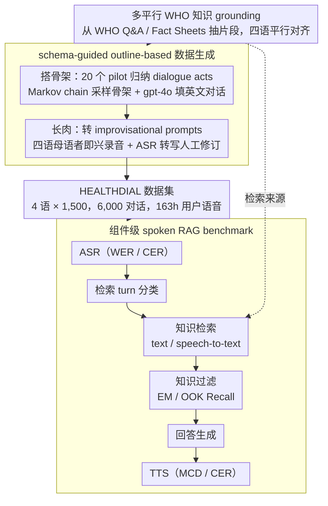

# Dial HEALTHDIAL for Advice: A Multilingual and Multi-Parallel Spoken Dialogue Dataset for Knowledge-Grounded Information Seeking

**会议**: ACL2026  
**arXiv**: [2605.30107](https://arxiv.org/abs/2605.30107)  
**代码**: https://github.com/cambridgeltl/healthdial  
**领域**: 语音对话 / 多语言RAG  
**关键词**: spoken dialogue, multilingual benchmark, health RAG, WHO knowledge, ASR

## 一句话总结
HEALTHDIAL 构建了一个包含 4 种 WHO 官方语言、6,000 个多平行健康信息寻求对话和 163 小时真实用户语音的数据集，并基于 ASR、TTS、检索、知识过滤和用户研究建立了多语言 spoken RAG benchmark。

## 研究背景与动机
**领域现状**：大多数对话系统研究仍以文本为主，即使支持语音，也常采用 ASR → 文本对话模型 → TTS 的模块化 pipeline。已有多语言对话数据集通常覆盖旅游、日常对话或任务型文本，对真实语音、知识 grounding、多平行结构和说话人元数据支持不足。

**现有痛点**：语音是人类最自然的交流方式，但 speech-first dialogue dataset 构建成本高、隐私风险大、跨语言平行数据难自然收集。健康领域更敏感：真实患者咨询包含个人健康信息，直接采集风险高；但没有高质量语音对话数据，又难以评估未来 speech-native 或 multilingual RAG 系统。

**核心矛盾**：研究社区需要真实自然的多语言 spoken dialogue，但真实健康咨询数据难以公开。完全机器生成对话容易重复、缺少自然口语差异；纯翻译数据又会产生 translationese，削弱各语言自然性。

**本文目标**：作者希望构建一个既多语言、多平行、知识 grounded，又带真实用户语音和说话人社会语言学变量的数据集；同时提供 baseline、原型系统和可复用数据收集 toolkit。

**切入角度**：论文采用 bottom-up、outline-based 数据收集。先用 WHO 知识构建受控知识库，再用 pilot dialogues 和 Markov chain 生成对话 schema，之后让母语标注者根据 improvisational prompts 自然实现用户话语，而不是简单朗读或翻译 LLM 输出。

**核心 idea**：把内容控制和语言自然性拆开：用 LLM 和 schema 控制对话结构与知识 grounding，用母语说话者完成自然口语表达和录音。

## 方法详解

### 整体框架
HEALTHDIAL 既是一个数据集，也是一套 benchmark。要解决的问题是：真实健康咨询语音因隐私无法公开，而纯 LLM 生成又缺乏跨语言自然口语，如何造出一份既知识 grounded、又多语言多平行、还带真实用户语音的对话资源。整体思路是把「内容控制」和「语言自然性」拆开——先用 WHO 知识和对话 schema 控制结构与 grounding，再让母语者把骨架自然实现成本族语口语并录音。数据收集分四步：从 WHO Q&A 与 Fact Sheets 抽知识片段并打平行标记，用 20 个 pilot 文本咨询归纳 dialogue acts，用 Markov chain 采样对话骨架并由 gpt-4o 填成英文假想对话，最后转成 improvisational prompts 交给四语母语者即兴录音转写。最终覆盖 Arabic、Chinese、English、Spanish 各 1,500 个对话，共 6,000 个对话、41,988 个 turns、约 163 小时用户语音和 208 小时系统语音，每个系统 turn 都显式关联一条 WHO 知识片段并标注是否需要检索。benchmark 端，输入是带历史的当前用户语音，依次经过 ASR、retrieval turn classification、knowledge retrieval、knowledge filtering、response generation、TTS 六个组件，作者为每个组件单独建 baseline 而非只给一个端到端分数。

### 关键设计

**1. 多平行 WHO 知识 grounding：把回答锁死在可追溯的权威知识里**

健康对话最怕模型靠无边界的参数化知识自由发挥，说出无据可查甚至危险的建议。HEALTHDIAL 把所有系统回答都约束在一个受控知识库内：知识片段全部来自 WHO Q&A 和 Fact Sheets，共 12,045 条（Arabic 2,317、Chinese 2,431、English 4,785、Spanish 2,512），其中 1,618 条在四种语言里完全平行，对应 6,472 个平行 snippet 实例，靠 parallel identifier 对齐。这样设计的好处是给了 hallucination 一个可操作的定义——任何无法由知识库支持的回答都算 extrinsic hallucination，同时也能显式构造并评估 out-of-knowledge（OOK）场景，让「该拒答时拒答」变成可量化的能力。

**2. schema-guided outline-based 数据生成：先搭骨架再让母语者长肉**

直接让 LLM 端到端生成对话容易千篇一律，机器翻译又会引入 translationese，两条路都达不到「跨语言可比 + 各语言自然」。作者改用自下而上的 outline 方法：先从 20 个 pilot dialogues 归纳出 11 类 dialogue acts，用一阶 Markov chain 从真实对话结构里采样 1,500 条 act sequence 作为骨架，再结合同 topic 的 WHO snippets 让 gpt-4o 生成英文假想对话；关键一步是把用户 utterance 转成 improvisational prompts，由四种语言的母语者依据上下文即兴说出、录音、ASR 转写并人工修订，而不是照稿朗读或翻译。骨架保证了四语内容可平行对比，即兴实现则让每种语言保留自己的口语表面形态，同时彻底绕开了真实患者隐私。

**3. 组件级 spoken RAG benchmark：把失败拆到每个模块上诊断**

当前 speech-native 模型还不够稳，一个端到端分数很难解释错在哪。HEALTHDIAL 因此为 pipeline 的每一段都定制了指标：ASR 用 WER/CER，TTS 用 MCD 和 ASR-based CER，retrieval turn classification 用 accuracy，知识检索同时跑 text-to-text 和 speech-to-text retrieval，knowledge filtering 用 Exact Match 和 OOK Recall——过滤阶段输入 top-5 retrieved snippets，让模型判断哪几条真正支持当前回答。这种拆解能直接看出瓶颈是 ASR 不准、跨模态检索失效还是 deductive filtering 拖后腿，比一个笼统的总分更有诊断价值。

### 损失函数 / 训练策略
这篇论文以数据集和 benchmark 为主，不提出新的模型损失，重点在为各组件配齐可比的 baseline。retrieval turn classification 比较 fine-tuned XLM-R_large 和带 10 个 in-context examples 的 LLaMA3.1-8B-Inst；知识检索比较 text-embedding-3L、gte-multilingual-B、MiniLM-L12-v2、NV-Embed-v2、BM25，以及 CLAP、SpeechT5 等 speech-to-text encoder；知识过滤比较固定阈值法、gpt-4.1-nano、LLaMA3.1-8B-Inst 和 OpenAI GPT family；TTS 用 gpt-4o-mini-tts，并以年龄、主要语言、原籍、居住地区、教育水平等说话人变量作为条件合成。

## 实验关键数据

### 主实验
| 语言 | ASR WER ↓ | ASR CER ↓ | TTS MCD ↓ | TTS CER ↓ | Turn Cls. Acc. ↑ | R@10 (Text) ↑ | R@10 (Speech) ↑ | Filtering EM ↑ | OOK Recall ↑ |
|--------|------|------|------|------|------|------|------|------|------|
| Arabic | 0.23 | 0.07 | 12.08 | 0.10 | 95.39 | 65.88 | 0.20 | 34.27 | 0.00 |
| Chinese | 0.24 | 0.14 | 11.46 | 0.17 | 95.23 | 70.63 | 0.23 | 39.19 | 14.29 |
| English | 0.03 | 0.01 | 11.44 | 0.06 | 96.30 | 75.72 | 0.52 | 44.29 | 42.86 |
| Spanish | 0.02 | 0.01 | 10.84 | 0.07 | 95.93 | 71.82 | 0.42 | 39.54 | 14.29 |
| Average | 0.13 | 0.06 | 11.46 | 0.10 | 95.71 | 71.01 | 0.34 | 39.32 | 17.36 |

### 消融实验
| Knowledge Filtering 方法 | Arabic EM | Chinese EM | English EM | Spanish EM | Average EM | 说明 |
|------|---------|------|------|------|------|------|
| Threshold | 6.26 | 6.61 | 6.88 | 6.46 | 6.55 | 固定相似度阈值，效果很低 |
| LLM @ Top-5 | 19.96 | 19.86 | 23.02 | 21.09 | 21.05 | gpt-4.1-nano 从 top-5 中筛选，平均最好 |
| LLM @ Top-10 | 12.58 | 17.15 | 23.33 | 19.55 | 18.15 | 候选增加后干扰更多，平均下降 |
| LLM @ Top-50 | 10.85 | 12.28 | 18.72 | 11.03 | 13.72 | 长候选列表显著伤害过滤准确率 |

### 关键发现
- ASR 在英语和西班牙语上很强，但阿拉伯语和中文明显更难。WER 分别为 Arabic 0.23、Chinese 0.24、English 0.03、Spanish 0.02。
- text-to-text 检索远强于 speech-to-text 检索。平均 R@10(Text) 为 71.01，而 R@10(Speech) 只有 0.34，说明当前跨模态语音-文本检索几乎不可用。
- 检索 turn classification 相对简单。四种语言 accuracy 都在 95% 左右，原因之一是 75.5% 的 dialogue turns 需要知识检索。
- 知识过滤是高价值难点。即使用 gpt-4.1-nano 在 top-5 candidates 上筛选，平均 EM 也只有 21.05；扩大到 top-50 反而降到 13.72。
- 英语在多个组件中表现最好，阿拉伯语最弱，这种差距在完全平行设置下仍存在，说明不是数据内容不一致，而是模型能力和表示差异造成的系统性问题。

## 亮点与洞察
- HEALTHDIAL 的数据设计非常细。它不是简单“健康 QA + 语音”，而是同时满足多语言、多平行、知识 grounding、真实用户语音、speaker metadata 和 OOK 场景。
- outline-based collection 是这篇论文的方法学亮点。它绕开真实患者隐私，又避免纯 LLM 对话的模板感，使数据更适合作为 spoken dialogue benchmark。
- 组件级 benchmark 很务实。作者没有强行做端到端大一统分数，而是承认现有 speech-native 模型还不稳，把失败拆到 ASR、检索、过滤和 TTS 各处。
- 知识过滤表有一个重要结论：不是把更多 retrieved snippets 塞给 LLM 就更好。top-50 会引入大量 distracting snippets，导致 EM 从 top-5 的 21.05 降到 13.72。

## 局限与展望
- 作者明确说明 HEALTHDIAL 的内容由 LLM 辅助生成，且未经过医疗专家验证。因此它应被视为研究多语言知识 grounded spoken dialogue 的语言资源，而不是临床建议数据。
- WHO 知识库保证了平行性和权威来源，但也限制了本地文化适配。不同地区对健康实践、传统医学和公共卫生需求的差异，需要未来与医疗和文化专家合作补充。
- 当前 benchmark 仍是 pipeline 架构。ASR、retrieval、generation、TTS 分开评估有利于诊断，但不能完全代表未来 speech-native end-to-end 系统。
- 用户研究只在 25 名英语流利参与者上进行，主要用于展示 TAM2 评估流程；大规模跨语言可用性、信任和满意度评估仍是未来工作。

## 相关工作与启发
- **vs MultiWOZ / Multi3WOZ**: 这些多语言任务型对话数据集以文本为主，HEALTHDIAL 进一步提供真实用户语音、健康知识 grounding 和说话人社会语言学变量。
- **vs MedDialog / 医疗论坛数据**: 医疗论坛更真实但隐私和噪声更复杂，且多为中文/英文文本。HEALTHDIAL 牺牲临床真实性，换取可公开、多平行和可控 grounding。
- **vs Common Voice / Switchboard**: 这些语音数据有 speaker metadata 或丰富语音，但不提供知识 grounded 多轮健康对话。HEALTHDIAL 把语音和对话任务结合起来。
- **vs RAG benchmark**: 传统 RAG benchmark 多为文本检索问答，HEALTHDIAL 把 spoken input、turn classification、knowledge filtering、TTS 和用户体验纳入同一系统评估。

## 评分
- 新颖性: ⭐⭐⭐⭐⭐ 多语言、多平行、真实用户语音、健康 RAG 和 speaker metadata 的组合很少见，数据收集方法也有启发性。
- 实验充分度: ⭐⭐⭐⭐☆ 组件 benchmark 全面，但端到端 speech-native 评估和跨语言用户研究仍不足。
- 写作质量: ⭐⭐⭐⭐⭐ 数据流程、伦理限制和 benchmark 任务定义都写得清楚，数字也足够透明。
- 价值: ⭐⭐⭐⭐⭐ 对多语言 spoken dialogue、医疗 RAG、ASR/TTS 公平性和跨模态检索研究都很有长期价值。

<!-- RELATED:START -->

## 相关论文

- [\[ACL 2026\] SDiaReward: Modeling and Benchmarking Spoken Dialogue Rewards with Modality and Colloquialness](sdiareward_modeling_and_benchmarking_spoken_dialogue_rewards_with_modality_and_c.md)
- [\[ACL 2026\] VoxMind: An End-to-End Agentic Spoken Dialogue System](voxmind_an_end-to-end_agentic_spoken_dialogue_system.md)
- [\[ACL 2026\] ZipVoice-Dialog: Non-Autoregressive Spoken Dialogue Generation with Flow Matching](zipvoice-dialog_non-autoregressive_spoken_dialogue_generation_with_flow_matching.md)
- [\[ICML 2025\] Aligning Spoken Dialogue Models from User Interactions](../../ICML2025/audio_speech/aligning_spoken_dialogue_models_from_user_interactions.md)
- [\[ACL 2026\] Full-Duplex-Bench-v2: A Multi-Turn Evaluation Framework for Duplex Dialogue Systems with an Automated Examiner](full-duplex-bench-v2_a_multi-turn_evaluation_framework_for_duplex_dialogue_syste.md)

<!-- RELATED:END -->
