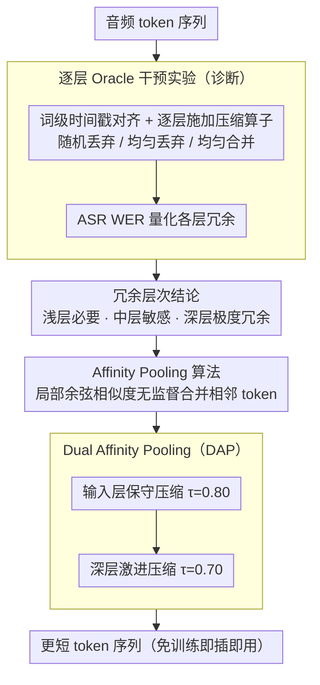

# Do We Need Distinct Representations for Every Speech Token? Unveiling and Exploiting Redundancy in Large Speech Language Models

**会议**: ACL 2026  
**arXiv**: [2604.06871](https://arxiv.org/abs/2604.06871)  
**代码**: [https://xchen-zero.github.io/speech-token-redundancy/](https://xchen-zero.github.io/speech-token-redundancy/)  
**领域**: 音频语音 / LLM效率  
**关键词**: 语音语言模型、token冗余、token压缩、Affinity Pooling、推理加速

## 一句话总结
本文通过逐层oracle干预实验揭示了大语音语言模型（LSLM）中语音token表示的结构化冗余层次——浅层编码必要声学细节而深层极度冗余——并提出Affinity Pooling这一免训练的基于相似度的token合并机制，在减少27.48% FLOPs的同时保持竞争力的准确率。

## 研究背景与动机

**领域现状**：大语音语言模型（如Qwen2-Audio、Kimi-Audio）通过高token率（12.5-25 tokens/s）处理音频以保证声学保真度，但产生的序列远长于其语义内容。视觉语言模型（VLM）社区已有丰富的token压缩研究，但LSLM的压缩仍未被充分探索。

**现有痛点**：高token率导致LLM骨干需要处理大量冗余token，带来显著且不必要的计算开销。现有的语音压缩方法大多从VLM直接借鉴（如对频谱图操作）或应用于特定架构，缺乏对LSLM内部冗余分布的系统理解。

**核心矛盾**：语音的信息密度在时间上高度不均匀——有意义的语义变化远少于token变化的速度——但现有方法对所有层的所有token一视同仁地处理。更重要的是，冗余在不同层间如何分布尚不清楚，阻碍了有原则的压缩策略设计。

**本文目标**：(1) 通过控制实验系统解剖LSLM各层的冗余分布；(2) 基于发现设计有原则的、免训练的token压缩算法。

**切入角度**：使用word-level时间戳作为Oracle，将音频token流与语义单元对齐，然后在特定层进行丢弃/合并干预，通过ASR任务的WER变化来量化冗余程度。这为压缩决策提供了实验基础而非纯经验设计。

**核心 idea**：浅层保留、中层不动、深层激进压缩——利用token间的余弦相似度进行自适应合并（Affinity Pooling），免训练即可大幅减少推理成本。

## 方法详解

### 整体框架
这篇论文要解决的问题是：大语音语言模型为保声学保真度用了很高的 token 率，序列远长于其语义内容，但冗余到底藏在哪些层、能压多少，此前没人系统量化过。作者的做法是「先诊断、再压缩」两步走。诊断阶段把音频 token 流按词级时间戳对齐到语义单元，逐层做 oracle 干预，量化出冗余的层次结构——浅层编码必要声学细节、中层是声学到语义的关键转换区（敏感）、深层极度冗余。应用阶段据此设计 Dual Affinity Pooling：在诊断确认安全的输入层和深层两处，用基于余弦相似度的免训练合并算子分别压缩。输入是一段音频 token 序列，输出是更短的 token 序列，全程不改模型参数、即插即用。

### 关键设计

**1. 逐层 Oracle 干预实验：把「哪层能压、压多狠」变成可测量的问题**

要做有原则的压缩，不能照搬 VLM 那套对所有层一视同仁的方案——语音有自己的时间局部性和声学-语义转换。作者先用 Montreal Forced Aligner 拿到词级时间戳，把音频 token 对齐到语义单元；然后每隔 5 层选一层做单层干预，对该层的每个语义单元施加三种压缩算子（随机丢弃、均匀丢弃、均匀合并），把每个单元压到 $R$ 个 token，再用 ASR 任务的 WER 衡量语义是否还能恢复。三种算子的对比不只给出「能压多少」，还揭示了冗余的结构性质——这套受控实验为后续压缩策略提供了实证依据，而非拍脑袋。

**2. Affinity Pooling 算法：靠局部余弦相似度无监督地把相邻冗余 token 合掉**

语音的信息密度在时间上极不均匀，相邻 token 常常几乎重复。Affinity Pooling 顺着 token 序列维护一个当前 group $\mathcal{G}_{curr}$，对每个新来的 token $h_t$，计算它与 group 内最近 $\omega$ 个 token 的最大余弦相似度 $s_{\max}$：若 $s_{\max} \geq \tau$ 就把 $h_t$ 并入当前 group，否则把当前 group 做 mean-pooling 收成一个 token 并另起新 group，关键超参是 lookback 窗口 $\omega$（默认 3）和阈值 $\tau$。和视觉里 ToMe 那种全局二分匹配不同，语音有严格时间局部性，所以只在局部窗口里比较；把窗口放宽到 $\omega>1$（而非只看紧邻）则是为了扛住高频声学抖动带来的脆弱性。值得注意的是，这种纯无监督合并实测还胜过基于监督词边界的 Oracle 合并，说明模型内在的相似性结构比语言学定义的边界更贴近压缩本质。

**3. Dual Affinity Pooling（DAP）：在两个安全窗口各压一刀，叠加收益**

诊断实验给出的结论是中层碰不得、但输入层和深层都安全，单点压缩又收益有限。DAP 因此在两处分别施压：输入层 $l_{\text{in}}$ 用较保守的阈值（如 $\tau=0.80$，此处已有一定冗余），深层 $l_{\text{deep}}$ 用较激进的阈值（如 $\tau=0.70$，此处极度冗余），两次压缩前后叠加。绕开敏感的中层、在两个安全区各取所需，整体压缩率比任何单点方案都更高。

### 损失函数 / 训练策略
完全免训练。Affinity Pooling 在推理时作为即插即用模块插入指定层，不修改任何模型参数。

## 实验关键数据

### 主实验（Qwen2-Audio）

| 方法 | 最终保留率 | FLOPs比率 | ASR WER↓ | QA Acc↑ | ST BLEU↑ |
|------|-----------|----------|----------|---------|----------|
| Vanilla | 100% | 100% | 2.94 | 30.41 | 32.91 |
| AP_in only | 78.64% | 78.49% | 2.94 | 30.31 | 32.52 |
| DAP (保守) | — | 72.52% | 2.91 | 30.89 | 32.33 |
| DAP (激进) | — | — | 3.07 | 29.98 | 32.15 |

### 消融实验

| 压缩位置 | 保留率 | WER | 说明 |
|---------|--------|-----|------|
| 仅输入层 (τ=0.80) | 78.64% | 2.94 | 无损 |
| 仅深层 l=30 (τ=0.70) | 14.30% | — | 深层极度冗余 |
| 仅深层 l=30 (τ=0.60) | 5.18% | 1.64 | 压缩到5%仍低于基线WER |
| 中层 l=5 (τ=0.60) | — | 高 | 中层敏感，不适合压缩 |

### 关键发现
- 冗余呈层次化分布：浅层编码细粒度声学细节、中层经历声学到语义的关键转换（高敏感）、深层极度冗余
- 在Qwen2-Audio的 $l=30$ 层（$\tau=0.60$），序列压缩到仅5.18%仍获得WER 1.64%（优于基线1.65%），证明深层token高度冗余
- Affinity Pooling在输入层优于Oracle方法（1.99% vs 2.50% WER），说明内在相似性比监督对齐更能捕获本质信息
- 实际部署中在长语音上实现约1.7×内存节省和约1.1×TTFT加速

## 亮点与洞察
- **诊断驱动的方法设计**：先通过系统的控制实验理解冗余结构，再据此设计压缩策略。这种"先理解、再行动"的方法论比直接试验各种压缩方案更有说服力，且揭示了可推广的洞察。
- **深层5%保留仍无损的发现**：这一极端结果表明LLM embedding的信息容量远未被充分利用，单个向量理论上可编码超过1500个token的信息。这为更激进的压缩策略提供了理论空间。
- **无监督优于有监督**：Affinity Pooling基于内在相似度的合并优于基于词边界的Oracle合并，说明模型内部的语义分组可能比语言学定义的分组更适合压缩。

## 局限与展望
- 仅在语义理解任务（ASR、QA、翻译）上验证，未测试声学保真度要求高的任务（如说话人识别、情感检测）
- 阈值 $\tau$ 和窗口 $\omega$ 需要根据模型和任务手动调整
- 仅在Qwen2-Audio和Kimi-Audio上验证，其他LSLM架构的适用性未知
- 未探索将压缩感知融入训练过程（如压缩感知微调）的可能性

## 相关工作与启发
- **vs ToMe (Token Merging)**：ToMe使用全局二分图匹配，适合视觉token的空间分布；本文的Affinity Pooling严格保持时间局部性，更适合语音的序列结构
- **vs SpeechPrune**：SpeechPrune使用注意力引导的剪枝，是经验设计；本文通过诊断实验提供了理论依据，且方法更简单（仅需余弦相似度）
- **vs VLM token压缩**：VLM方法主要在输入层压缩视觉token；本文揭示了深层也是重要的压缩点，且深层压缩收益更大

## 评分
- 新颖性: ⭐⭐⭐⭐ 首次系统解剖LSLM的逐层冗余分布，诊断驱动的设计方法论值得学习
- 实验充分度: ⭐⭐⭐⭐⭐ 逐层干预、多种压缩算子、多模型验证、实际部署测量，实验设计非常系统
- 写作质量: ⭐⭐⭐⭐⭐ 从诊断到方法到验证的完整故事线，图表信息量大
- 价值: ⭐⭐⭐⭐ 免训练即可减少27%+ FLOPs，实用价值高；冗余层次结构的发现对社区有广泛启发

<!-- RELATED:START -->

## 相关论文

- [\[ACL 2026\] Closing the Modality Reasoning Gap for Speech Large Language Models](closing_the_modality_reasoning_gap_for_speech_large_language_models.md)
- [\[ACL 2026\] VAPO: End-to-end Slide-Enhanced Speech Recognition with Omni-modal Large Language Models](vapo_end-to-end_slide-enhanced_speech_recognition_with_omni-modal_large_language.md)
- [\[ACL 2026\] Data-efficient Targeted Token-level Preference Optimization for LLM-based Text-to-Speech](data-efficient_targeted_token-level_preference_optimization_for_llm-based_text-t.md)
- [\[ACL 2026\] Temporal Contrastive Decoding: A Training-Free Method for Large Audio-Language Models](temporal_contrastive_decoding_a_training-free_method_for_large_audio-language_mo.md)
- [\[ACL 2026\] SpeakerSleuth: Can Large Audio-Language Models Judge Speaker Consistency across Multi-turn Dialogues?](speakersleuth_can_large_audio-language_models_judge_speaker_consistency_across_m.md)

<!-- RELATED:END -->
