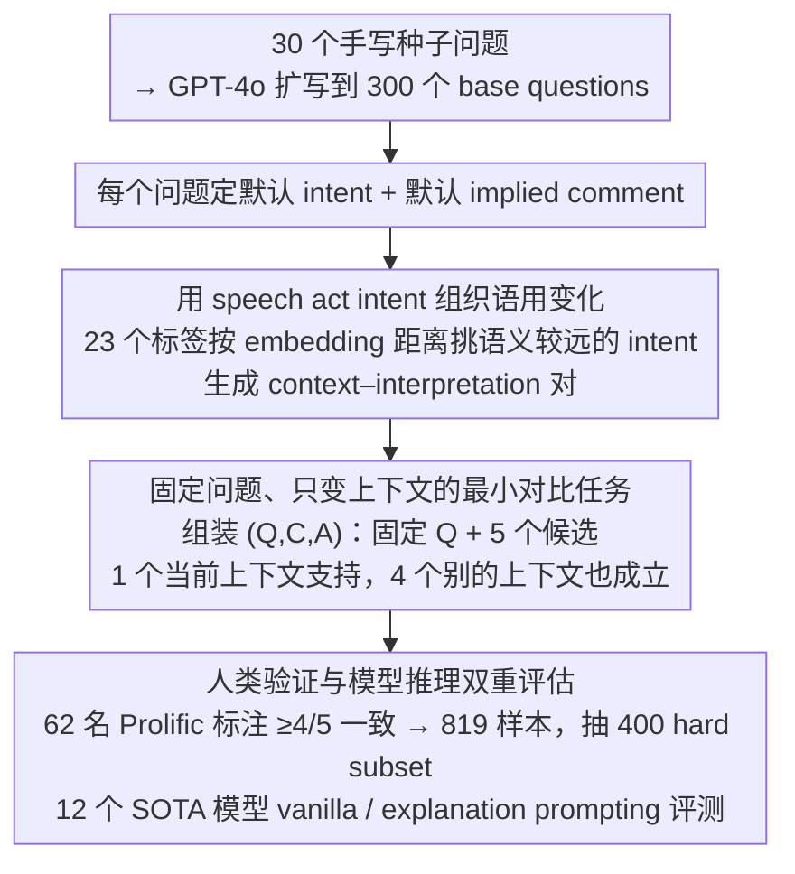

# DRInQ: Evaluating Conversational Implicature with Controlled Context Variation

**会议**: ACL 2026  
**arXiv**: [2605.24267](https://arxiv.org/abs/2605.24267)  
**代码**: https://github.com/hjarai/drinq  
**领域**: 语用推理 / LLM 评测  
**关键词**: 会话含义、语用推理、上下文控制、speech acts、LLM 评测

## 一句话总结
DRInQ 用固定问题表面形式、系统变化上下文的方式构建会话含义评测集，发现 LLM 能生成看似合理的语用场景，却常在推理时过度解读上下文、低于人类判断一致性。

## 研究背景与动机
**领域现状**：人类对话大量依赖 conversational implicature，也就是话里没有明说但由上下文、礼貌原则、社会关系和共同知识共同触发的隐含意义。现有 LLM 在表面语义、社会常识和流畅对话上已经很强，但对“这句话在这个场景下到底暗示什么”仍然不稳定。

**现有痛点**：已有语用 benchmark 往往使用粗粒度标签，例如 literal / non-literal，或聚焦讽刺、隐喻、预设、标量含义等较明确现象。这些资源难以隔离“同一个问题因为上下文不同而产生不同含义”的变化，也很难判断模型错误来自不懂问题、忽略上下文，还是把上下文细节推得太远。

**核心矛盾**：会话含义既依赖上下文，又不能让上下文把答案直接说穿。数据构建需要同时满足三件事：上下文足够支持唯一解释、干扰项在别的上下文中也合理、变化因素确实是语用相关而不是随意改写。这使得大规模人工构建成本很高。

**本文目标**：作者提出 DRInQ，用 question-context-interpretation 的多选任务评估模型是否能从上下文恢复问题 utterance 的隐含意图；同时比较模型生成数据和人类写作数据，分析 LLM 在语用场景构建与语用推理中的不同能力。

**切入角度**：论文专注 question utterances，因为问题形式经常承担非字面功能，例如请求、责备、邀请、安慰、讽刺。作者用 speech act 作为 intent label，把上下文变化组织成可控维度，而不是只靠自由生成。

**核心 idea**：保持问题 $Q$ 不变，只改变上下文 $C$，并把每个候选解释设计成同一问题在不同上下文中的合理含义，从而专门测试模型能否校准“上下文到底支持哪一种隐含意义”。

## 方法详解

### 整体框架
DRInQ 想测的不是模型懂不懂常识，而是它能否在上下文里校准「这句话到底暗示什么」。为了把语用推理从其他混淆因素里隔离出来，作者构造的每个样本固定一个问题、配一段上下文和 5 个候选 implied comment，其中只有一个由当前上下文支持，其余四个都是同一问题在别的上下文里同样成立的合理解释——这样模型不能靠问题本身或选项词面取巧，必须真正掂量上下文证据的力度。数据构建 pipeline 从 30 个手写日常问题出发，用 GPT-4o 扩到 300 个 base questions；对每个问题先定下默认 intent 和默认 implied comment，再从 23 个 speech act intent label 中挑语义较远的 intent 生成多组 context-interpretation pair，转成多选题后交给 Prolific 标注者验证，保留至少 4/5 人一致的样本，最后抽 400 个困难样本作为评测 benchmark。

### 关键设计

**1. 用 speech act intent 组织语用变化：让差异是「在做不同的事」而非随意改写**

上下文若只是任意 paraphrase，覆盖面既不可控也不够细，难以保证变化真的落在「语用」这一维度上。作者从 Searle 的言语行为理论里取 Directive、Assertive、Commissive、Expressive 四大类、共 23 个代表性 act verb 作为 intent 标签；对每个问题，先按默认 implied comment 与其他 intent 的 embedding 距离排序，再挑语义差距较大的 intent 去生成新上下文。这样每次变化对应的是说话人在执行一种不同的交际行为（请求、责备、邀请、警告、感谢、抱怨……），既让生成可控，又能系统覆盖细粒度的语用功能——这些不同 intent 下生成的上下文，正是下一步组装候选项的素材。

**2. 固定问题、只变上下文的最小对比任务：把上下文做成唯一变量**

会话含义难评的根源在于它同时依赖上下文，又不能让上下文把答案直接说穿，普通多选题里模型常靠选项显著性或问题模板蒙对。DRInQ 把每个实例写成 $(Q,C,A)$——$Q$ 是固定问题、$C$ 是当前语境、$A$ 是 5 个候选解释，并刻意让错误选项都不是随机干扰，而是同一个 $Q$ 在其他语境下也成立的 implied comment（即上一步用不同 intent 生成的那些解释）。由于所有候选在语用上都讲得通，模型唯一能依靠的就是上下文证据的强弱，这才逼近真实的语用 disambiguation，也让「错在哪」可归因到对上下文力度的误判。

**3. 人类验证与模型推理双重评估：既滤掉不可靠样本，又暴露生成-识别的不对称**

语用含义天然有模糊性，单一 gold label 容易过度确定，而且数据若全由模型自问自答会缺乏可信度。作者请 62 名预筛选 Prolific 标注者参与验证，保留至少 4/5 人一致的 819 个样本，再构造 400 个 hard subset；模型侧覆盖 12 个 SOTA 模型，对比 vanilla few-shot 与 explanation prompting，另设人工写作研究让 16 名人类作者与 GPT-4o 各写上下文做质量对照。人类一致性一方面过滤掉明显不可靠的样本，另一方面恰好暴露出 LLM「能生成一个像样的语用场景」却「未必能在别人场景里恢复恰当含义」的系统性不对称。

### 损失函数 / 训练策略
论文不训练新模型，核心是数据生成、人工验证和 prompting 评测。生成阶段用 GPT-4o 产出 context-interpretation pair，并要求模型在不合理的 question-intent 组合上 abstain；推理评测用 few-shot prompt，vanilla 条件给 3 个 in-context example，explanation 条件要求先给简短理由再选答案。后续还设计了 conservative、charitable、reasoning、all 四种 prompt 干预，用来抑制模型的过度推断和恶意意图归因。

## 实验关键数据

### 主实验
| 数据集 / 设置 | 指标 | 本文 | 对比对象 | 说明 |
|--------|------|------|----------|------|
| DRInQ 构建 | base questions / intents | 300 / 23 | 30 个手写 seed questions | 每个问题至少关联 5 个不同 intents |
| 人类验证 | 保留样本 | 819 | 至少 4/5 标注者同意 | 用于形成 validated pool |
| Benchmark | hard subset | 400 | 来自低模型一致性或争议样本 | 用于模型主评测 |
| hard subset | Human Avg | 0.88 ± 0.10 | SOTA LLM 约 0.56-0.67 | 人类仍明显领先 |
| hard subset | 最好模型 | OpenAI-o3: 0.67 ± 0.02/0.03 | GPT-4o: 0.62/0.63 | explanation 对大模型收益有限 |

### 消融实验
| 配置 | 关键指标 | 说明 |
|------|---------|------|
| GPT-5-Nano prompting | 41% -> 73% | 结构化 prompt 对小模型帮助最大 |
| GPT-5-Mini prompting | 71% -> 81% | reasoning scaffold 缩小与强模型差距 |
| GPT-4o prompting | 约 82% ceiling | 大模型对 prompt 干预不太敏感 |
| LLM 生成 vs 人类写作 | LLM novelty 37%，human novelty 22%，tie 40% | LLM 更愿意生成新奇场景，人类更保守稳定 |
| Human consensus vs generated label | 标准抽样 81%，validated overall 67%，hard baseline 27% | 难样本刻意保留了更多模型/人类分歧 |

### 关键发现
- LLM 的主要错误不是完全不懂语义，而是推断强度校准不准。它们会把上下文中的负面细节放大成恶意意图，或把一个可能解释当成唯一解释。
- 人类标注者倾向于更 charitable 的解释，除非上下文明确支持恶意或责备；模型则更容易选择过强、过负面的选项。
- prompt 干预对小模型有效，说明部分错误可由推理流程约束缓解；但强模型提升有限，表明语用校准不只是 prompt 格式问题。
- 数据生成上，LLM 生成的场景更有变化和新颖性，但有时把 implied comment 写得过于显性或超出上下文支持；人类上下文更安全、更可预期，但也可能欠指定。

## 亮点与洞察
- 任务设计很聪明：固定同一个 question，让上下文成为唯一变化源，能比普通语用多选更清楚地定位模型是否真正读懂场景。
- 论文把“会话含义”从抽象语言学概念落实成可扩展生成流程，speech act labels 在这里不是理论装饰，而是控制数据多样性的实用工具。
- “生成-推理不对称”是很重要的观察。模型能生成一个听起来合理的语用场景，并不代表它能像人一样在别人的场景中恢复恰当含义。
- 错误分析对安全评测也有启发：模型过度归因恶意、过度读入隐藏意图，可能会影响客服、心理支持、内容审核等需要谨慎理解用户意图的场景。

## 局限与展望
- 多选形式只能作为诊断代理，不能完整衡量真实对话能力。真正的语用理解还应体现在模型生成恰当回应、追问或保持不确定性的能力上。
- 固定候选解释会遮蔽其他合理含义。即使 4/5 标注者达成一致，也不代表剩余解释一定错误。
- 数据是英语中心的，并且反映 Prolific 标注者的文化和语言背景。会话含义高度依赖文化规范，因此对低语境/高语境文化、非英语社群的泛化有限。
- intent-conditioned 生成把 GPT-4o 放入数据生产链，可能带来模型风格偏差。未来可以引入更强的不确定性建模、开放式生成评估和跨文化标注。

## 相关工作与启发
- **vs IMPRES / GRICE**: 这些数据集也关注 implicature 或 presupposition，但更偏语言现象和规则控制；DRInQ 更强调同一个 question 在上下文变化下的细粒度语用差异。
- **vs FLUTE**: FLUTE 覆盖讽刺、隐喻、习语等非字面语言；DRInQ 聚焦问题句的交际功能，任务更贴近日常对话中的间接表达。
- **vs 社会常识 benchmark**: 社会常识任务常问“接下来会怎样”或“人物感受如何”，DRInQ 则要求判断说话人通过问题正在做什么交际行为。
- **对 LLM 评测的启发**: 未来评测不应只看模型是否能给出一个 plausible interpretation，还要看它是否知道哪些解释“证据不足”。

## 评分
- 新颖性: ⭐⭐⭐⭐☆ 固定问题、控制上下文的会话含义评测设计很有辨识度，speech act 组织生成也实用。
- 实验充分度: ⭐⭐⭐⭐☆ 有数据验证、12 个模型、prompt 干预、人机写作比较和错误分析，但仍受多选格式限制。
- 写作质量: ⭐⭐⭐⭐☆ 任务动机和错误模式讲得清楚，个别地方摘要数字与主表设置可能来自不同切分，需要读者留意。
- 价值: ⭐⭐⭐⭐☆ 对语用推理、LLM 对话评测和安全场景下的意图校准都有直接参考价值。

<!-- RELATED:START -->

## 相关论文

- [\[ACL 2025\] Does Your Voice Assistant Remember? Analyzing Conversational Context Recall and Utilization in Voice Interaction Models](../../ACL2025/audio_speech/does_your_voice_assistant_remember_analyzing_conversational_context_recall_and_u.md)
- [\[ACL 2026\] Still Between Us? Evaluating and Improving Voice Assistant Robustness to Third-Party Interruptions](still_between_us_evaluating_and_improving_voice_assistant_robustness_to_third-pa.md)
- [\[ACL 2026\] Multimodal In-Context Learning for ASR of Low-Resource Languages](multimodal_in-context_learning_for_asr_of_low-resource_languages.md)
- [\[ACL 2026\] S2S-Arena: Evaluating Paralinguistic Instruction Following in Speech-to-Speech Models](s2s-arena_evaluating_paralinguistic_instruction_following_in_speech-to-speech_mo.md)
- [\[ICML 2026\] Algorithmic Recourse of In-Context Learning for Tabular Data](../../ICML2026/audio_speech/algorithmic_recourse_of_in-context_learning_for_tabular_data.md)

<!-- RELATED:END -->
