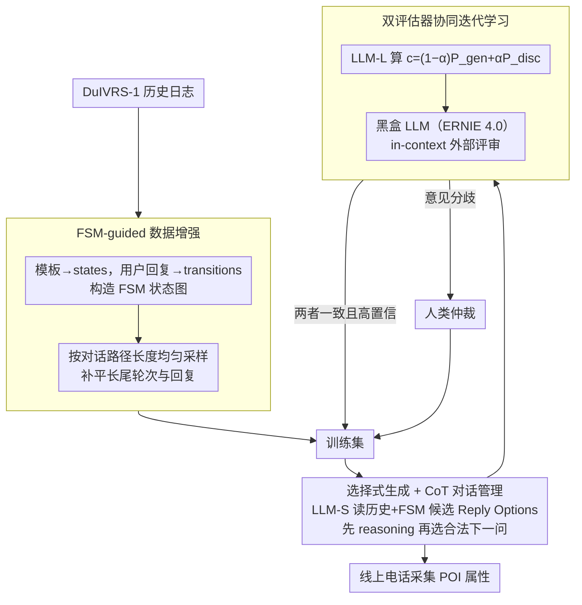

# DuIVRS-2: An LLM-based Interactive Voice Response System for Large-scale POI Attribute Acquisition

**会议**: ACL 2026  
**arXiv**: [2605.17900](https://arxiv.org/abs/2605.17900)  
**代码**: 无公开代码（缓存未提供项目代码链接）  
**领域**: 语音对话系统 / 工业 LLM Agent  
**关键词**: IVR、POI 属性采集、任务型对话、选择式生成、协同迭代学习

## 一句话总结
DuIVRS-2 将百度地图大规模 POI 属性采集的模块化电话 IVR 系统改造成 LLM 驱动的端到端对话系统，通过 FSM 数据增强、选择式生成和双评估器迭代学习，在生产中达到 83.9% TSR、130ms 平均响应和每天 0.4M 通话能力。

## 研究背景与动机
**领域现状**：地图服务需要持续更新 POI 名称、地址、营业状态、营业时间等属性。网页、街景和用户贡献可以提供部分信息，但覆盖率、时效性和抽取成本都有限。DuIVRS-1 采用电话 IVR 主动呼叫 POI 经营者，通过 NLU、对话管理、NLG 等模块化流水线采集属性，已经在百度地图中长期部署。

**现有痛点**：模块化 IVR 的问题是误差会逐级传播，NLU 误判会影响 DST/DM，NLG 模板又需要持续维护。直接把通用 LLM 接入工业 IVR 也不现实，因为它们成本高、推理慢、稳定性和幻觉控制不足，难以满足电话场景通常低于 200ms 的响应要求。

**核心矛盾**：工业电话对话既需要 LLM 的语义理解能力，又必须保留规则系统的可控性、低延迟和安全边界。开放式生成越灵活，越容易产生不在业务流程内的询问；候选模板越固定，又越难处理长尾用户回复。

**本文目标**：作者希望在不牺牲生产可用性的前提下，把 DuIVRS 从传统模块化系统升级为 LLM-based end-to-end agent，用于大规模 POI 属性采集，并证明它在离线 CR、线上 TSR、成本、延迟和吞吐上都可部署。

**切入角度**：论文没有让 LLM 自由生成下一句，而是把历史 FSM 的可选回复和 LLM 的理解能力结合起来。LLM-S 在候选动作中选择最合适的下一问，LLM-L 与黑盒 LLM 共同评估样本，形成低人工成本的迭代数据飞轮。

**核心 idea**：用 FSM 约束 LLM 的动作空间，用 CoT 提升候选选择稳定性，再用 LLM-L + 黑盒 LLM + 人类仲裁构成协同迭代学习，让小模型逐步适配真实长尾电话对话。

## 方法详解

### 整体框架
DuIVRS-2 要解决的是工业电话采集 POI 属性这件事：保留 ASR/TTS 等成熟语音设施不动，只把最容易出错、最难维护的对话管理模块换成一个受控的 LLM 选择器。整个系统串成三层流水——先从 DuIVRS-1 的历史日志里抽出状态转移构造 FSM，用均匀采样把长尾对话补平成训练数据；再让小模型 LLM-S 读对话历史和 FSM 给出的候选回复，做一步简短 reasoning 后选出下一问；最后让 LLM-L 和一个独立黑盒 LLM 共同给 LLM-S 的输出打分，高置信样本自动回流训练集、分歧样本交人类仲裁，形成持续自我清洗的数据飞轮。

### 关键设计

**1. FSM-guided 数据增强：把业务流程当成采样骨架**

真实生产日志的痛点是分布极度倾斜——高频的简单对话占了绝大多数，直接拿去 SFT 会让模型把罕见却关键的边界场景当噪声忽略掉。作者的做法是把 DuIVRS-1 的固定响应模板映射成 FSM 的 states、把用户回复映射成 transitions，于是整条业务流程就变成一张可遍历的状态图。采样时不再照搬日志频率，而是按 dialogue path length 做均匀 path sampling，再在每个状态转移上均匀抽取历史用户回复的各种变体。这样既不破坏业务逻辑的合法性，又能系统性地把冷门状态的覆盖补足，让训练集对长尾轮次和长尾回复都有足够曝光。

**2. 选择式生成 + CoT 对话管理：把"写新句子"降级成"选合法动作"**

电话 IVR 对安全和延迟的容错空间极小，直接让 LLM 自由生成下一句既慢又容易问出业务流程外的问题。这里的关键是把输出空间锁死：输入 prompt 只给截断后的对话历史加当前 FSM 允许的候选 Reply Options，输出也不是任意文本，而是先走一步 reasoning、再从候选里选一个。这一步 CoT 既让决策可解释（能说清为什么挑这个下一问），又把"生成一句全新的话"这个高风险任务转化成"理解用户意图后选择合法动作"，幻觉和模板维护成本随之大幅下降——消融里去掉 CoT 后平均 CR 从 77.18% 暴跌到 39.00%，正说明这一步 reasoning 是稳定性的命门。

**3. 双评估器协同迭代学习：用异源评审防止模型近亲繁殖**

数据飞轮要持续运转，就得在低人工成本下把 noisy logs 清干净，但只用同一模型家族当 evaluator 会产生 inbreeding——它们会一起继承 ASR 噪声和业务偏见，把错误越滚越大。作者让 LLM-L 同时从生成视角算 LLM-S 输出的条件似然、从判别视角判断 input-output pair 是否正确，用 $c=(1-\alpha)P_{gen}+\alpha P_{disc}$ 把两种置信度融成一个分数；再引入一个完全独立的黑盒 LLM（ERNIE 4.0）用 in-context reasoning 做外部评审。只有两个评估器一致且高置信的样本才自动采纳进训练集，意见分歧的样本才交给人类仲裁。异源评审加人类兜底，让自动清洗既省人力又不至于自我强化错误。

### 损失函数 / 训练策略
离线训练初始集包含 5,000 段对话，每轮微调额外加入 5,000 个样本。LLM-S 使用 ERNIE-Bot-tiny，LLM-L 使用 ERNIE-Bot-turbo，黑盒评估器为 ERNIE 4.0。训练在百度 PaddleCloud 的 8 张 A100-80G 上进行，AdamW 参数为 $\beta_1=0.9$、$\beta_2=0.95$、$eps=1e-5$，batch size 128，序列长度 1024，warm-up 占 3%，EB-turbo 最大学习率 $2\times10^{-5}$，EB-tiny 最大学习率 $1\times10^{-4}$。EB-tiny 用 bf16 全参数微调，EB-turbo 用 LoRA，均训练 2 个 epoch。

## 实验关键数据

### 主实验
| 数据集 / 场景 | 指标 | DuIVRS-2 | 对比对象 | 提升 / 说明 |
|--------|------|------|----------|------|
| 离线 Deffect | CR | 81.62% | DuIVRS-1: 72.20% | 高频自然分布场景显著提升 |
| 离线 Dgeneral | CR | 73.70% | DuIVRS-1: 62.99% | 均匀回复采样下泛化更好 |
| 离线 Drobust | CR | 76.22% | DuIVRS-1: 69.05% | 长文本/复杂语义更稳 |
| 离线平均 | CR | 77.18% | DuIVRS-1: 68.08%，GPT-4o: 66.68%，DeepSeek-V3: 67.20% | 比 DuIVRS-1 高 13.37%，比 GPT-4o 高 15.74% |
| 线上 A/B | TSR | 83.9% | DuIVRS-1: 79.9%，Human: 89.6% | 比旧系统高 4 个百分点，达到人类 93.64% |

### 消融实验
| 配置 | 平均 CR | 说明 |
|------|---------|------|
| DuIVRS-2 | 77.18% | 完整 FSM 数据增强、CoT、协同迭代学习 |
| HybridLLMs | 77.03% | 用 Qwen2.5-1.5B / Qwen2.5-7B / GPT-4o 替换 ERNIE 系列，说明框架不强依赖单一模型家族 |
| LLM-DM | 68.35% | 尚未加入协同迭代学习，已接近 DuIVRS-1 |
| Direct-SFT | 60.80% | 直接生成下一问，稳定性不足 |
| w/o-CoT | 39.00% | 去掉 reasoning 后严重退化 |
| w/o-DA | 64.33% | 去掉数据增强后长尾泛化变差 |

### 关键发现
- 线上部署满足工业约束：DuIVRS-2 成本低于 ¥0.2/通，与 DuIVRS-1 相当，显著低于人工 ¥1.5/通；平均 reaction time 为 130ms，低于 200ms 人类感知阈值。
- 系统吞吐达到 0.4 million calls/day，而人工每天不超过 200 通；A/B 测试期间 DuIVRS-2 在受控一小时窗口中分配约 3,000 calls/day 进行稳定性验证。
- 选择式生成显著抑制幻觉。附录人工评估中 DuIVRS-2 hallucination rate 为 0%，Direct-SFT 为 1.30%，w/o-CoT 为 2.08%。
- 部署优化后，8-bit quantization 下每张 A10 GPU 显存约 22GB，平均 130ms/query，吞吐约 61.5 QPS/GPU。

## 亮点与洞察
- 这篇论文的价值在“工业可落地”而不是单点模型炫技。它完整覆盖数据、策略、评估、部署、成本、吞吐和线上 A/B，工程闭环很强。
- 最关键的设计是把 LLM 限制在 FSM 候选动作内。这样既利用语义理解，又不把业务系统交给开放式文本生成，适合电话这种容错空间很小的场景。
- 双评估器机制很实用：领域内 LLM-L 有业务知识，黑盒 LLM 有独立判断，人类只处理不确定样本，形成可持续的数据清洗流程。
- HybridLLMs 的结果很有说服力，说明收益主要来自框架设计，而不是 ERNIE 系列模型的私有优势。

## 局限与展望
- 系统高度依赖已有 FSM 和候选动作空间。对于没有成熟流程的开放域电话任务，冷启动仍需要人工定义状态和合法回复。
- 论文使用的是百度地图内部生产日志和 ERNIE 生态，外部研究者很难完全复现线上数据、ASR 噪声分布和业务约束。
- DuIVRS-2 的 130ms 延迟虽然满足电话交互，但仍明显慢于 DuIVRS-1 的 15ms，极端并发或更复杂模型下可能需要更多推理优化。
- 当前系统保留旧 ASR/TTS 模块，真实失败可能来自语音识别、噪声环境、用户打断等语音链路问题，论文主要聚焦对话管理部分。

## 相关工作与启发
- **vs DuIVRS-1**: DuIVRS-1 是 NLU-DM-NLG 模块化流水线，DuIVRS-2 改为 LLM-based end-to-end dialogue management，减少模块误差传播，同时保留 FSM 可控性。
- **vs 通用 GPT-4o / DeepSeek-V3**: 通用强模型在离线 CR 上低于 DuIVRS-2，说明工业任务需要领域数据、候选动作约束和业务评估闭环。
- **vs 传统任务型对话系统**: 传统 TOD 往往需要 DST、Policy、NLG 多模块维护；DuIVRS-2 把策略选择整合到 LLM 选择式生成中，更适合快速更新业务流程。
- **对语音 Agent 的启发**: 面向生产的 LLM Agent 不应追求完全自由生成，而应把模型能力嵌入可验证的动作空间，再用在线数据持续修正。

## 评分
- 新颖性: ⭐⭐⭐⭐☆ 把 LLM 工业化接入电话 IVR 的框架完整且务实，核心组件不是全新理论，但组合设计有价值。
- 实验充分度: ⭐⭐⭐⭐⭐ 离线、消融、线上 A/B、成本、延迟、吞吐、幻觉和资源分析都覆盖到了。
- 写作质量: ⭐⭐⭐⭐☆ 工程流程和指标清楚，部分图表依赖内部系统背景，外部读者需要补充理解 DuIVRS 业务。
- 价值: ⭐⭐⭐⭐⭐ 对工业 LLM Agent、低延迟语音系统和可控对话生成都有很强参考价值。

<!-- RELATED:START -->

## 相关论文

- [\[CVPR 2026\] Pushing the Frontier of Audiovisual Perception with Large-Scale Multimodal Correspondence Learning](../../CVPR2026/audio_speech/pushing_the_frontier_of_audiovisual_perception_with_large-scale_multimodal_corre.md)
- [\[ACL 2026\] VoxMind: An End-to-End Agentic Spoken Dialogue System](voxmind_an_end-to-end_agentic_spoken_dialogue_system.md)
- [\[CVPR 2025\] LiveCC: Learning Video LLM with Streaming Speech Transcription at Scale](../../CVPR2025/audio_speech/livecc_learning_video_llm_with_streaming_speech_transcription_at_scale.md)
- [\[NeurIPS 2025\] Sensorium Arc: AI Agent System for Oceanic Data Exploration and Interactive Eco-Art](../../NeurIPS2025/audio_speech/sensorium_arc_ai_agent_system_for_oceanic_data_exploration_and_interactive_eco-a.md)
- [\[ACL 2025\] Mind the Gap! Static and Interactive Evaluations of Large Audio Models](../../ACL2025/audio_speech/mind_the_gap_static_and_interactive_evaluations_of_large_audio_models.md)

<!-- RELATED:END -->
