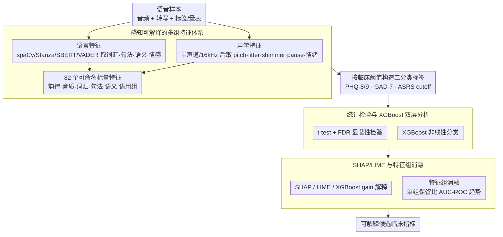

# Exploration of Perceptual Speech Features for Clinical Decision-Support in Mental Health Care

**会议**: ACL2026  
**arXiv**: [2605.24678](https://arxiv.org/abs/2605.24678)  
**代码**: 无公开代码（cache 未见源码仓库）  
**领域**: 临床语音分析 / 心理健康  
**关键词**: 语音心理健康, 可解释机器学习, 声学特征, 语言特征, SHAP/LIME  

## 一句话总结
这篇论文提出一个面向心理健康临床辅助的可解释语音分析框架，用感知可理解的声学与语言特征结合 XGBoost、统计检验、SHAP 和 LIME，在压力、抑郁、焦虑、ADHD 等多个数据集上寻找稳定的语音行为线索，而不是追求黑盒端到端诊断。

## 研究背景与动机
**领域现状**：语音与语言已经被广泛用于心理健康评估，因为说话方式会反映情绪、认知负荷、神经状态和社交表达。近年的系统常使用大规模语音模型、端到端声学表征或多模态深度模型，在抑郁、焦虑、压力、失眠和疲劳等任务上取得不错的分类性能。

**现有痛点**：临床场景中只给一个分类结果远远不够。黑盒模型即使准确率可观，也很难告诉医生“这个判断来自哪里”，更难区分模型捕捉的是症状线索，还是录音设备、语言背景、噪声、疲劳等混杂因素。心理健康评估又属于高风险场景，错误标签可能带来污名化和不恰当干预，因此可解释性和临床可读性比纯粹的 leaderboard 指标更重要。

**核心矛盾**：端到端表示通常更强，但它们学习到的维度不一定能映射到临床现象；人工特征更可解释，但单一特征组又不足以覆盖心理健康表达的复杂性。本文试图在“可解释特征”和“非线性建模”之间折中：特征必须能被临床人员理解，模型又要足够捕捉跨特征交互。

**本文目标**：作者希望构建一套跨数据集可复用的分析流程，系统地比较声学、语言、情绪、语义连贯性、语用线索与心理健康量表或诊断标签之间的关系。目标不是声明可以替代医生诊断，而是提供可审计、可解释、可用于临床决策支持的候选指标。

**切入角度**：论文从“感知特征”出发：语速、停顿、jitter、shimmer、音高变化、句法复杂度、词汇丰富度、语义连贯性、情感极性和讽刺概率都可以被解释为具体的说话行为。再用 XGBoost 这类适合表格特征的模型处理非线性关系，并用 SHAP/LIME 追踪哪些特征推动判断。

**核心 idea**：用可感知、可解释的声学和语言特征代替纯黑盒 embedding，并通过统计检验与可解释机器学习共同验证这些特征是否稳定关联心理健康状态。

## 方法详解
本文的方法更像一个临床分析 pipeline，而不是单一神经网络。它先把每段语音和转写文本转成 82 个标量特征，再按临床任务构造二分类标签，随后用统计检验、XGBoost、SHAP、LIME 和特征组消融来判断哪些线索有解释价值。

### 整体框架
输入是一组带有音频、转写文本和心理健康标签或量表分数的语音样本。系统首先进行音频预处理：转单声道、重采样到 16 kHz、幅度归一化，并从 voiced segments 中抽取声学指标。文本侧使用 spaCy 和 Stanza 做分词、词性、依存、成分句法等分析，同时用 Sentence-BERT 估计语义连贯性，用 VADER 提取情绪极性。

随后，所有特征被组织成若干可解释组：prosodic/fluency、voice quality、lexical、syntactic、semantic、psycholinguistic 等。每个数据集根据已有标签或量表阈值形成二分类任务，例如 STRESSID 的 stress / non-stress、DAIC-WOZ 的 PHQ-8 抑郁阈值、REAL 数据集的 PHQ-9/GAD-7/ASRS 临床 cutoff。

分析阶段分三路进行：第一路是独立样本 t-test 并用 FDR 控制多重比较，观察组间特征差异；第二路是 XGBoost 分类器，用于捕捉非线性组合；第三路是 SHAP、LIME 和特征重要性，用于解释模型依赖的语音与语言线索。最后，作者用特征组消融检查单一特征组的独立贡献。

### 关键设计

**1. 感知可解释的多组特征体系：把“怎么说”和“说什么”都拆成医生能读懂的行为维度**

心理健康相关的表达可能同时藏在韵律停顿和语义内容里——只看文本会漏掉停顿、音质和语调，只看音频又会漏掉语义连贯、自我指称、负性词和句法复杂度。所以本文不直接用不可解释的 embedding，而是把每段语音和转写抽成 82 个可命名的标量特征。声学侧有 pitch、intensity、jitter、shimmer、HNR、ZCR、pause、phonation/articulation rate、rhythm、entropy，外加 HuBERT 情绪模型给出的情绪相关特征；文本侧有 TTR、MATTR、Brunet、Honore、词性/形态多样性、句法深度、依存图指标、Sentence-BERT 连贯性、VADER 情感极性、讽刺概率。每个特征都对应一个具体的说话行为，医生看到“shimmer 偏高、停顿变多”远比看到“第 37 维激活”更有临床意义。

**2. 统计检验与 XGBoost 的双层分析：同时回答“哪些特征组间显著”和“哪些特征非线性可预测”**

只做显著性检验会漏掉特征之间的交互，只看分类准确率又说不清模型到底依据什么，本文把两者叠起来用。第一层先按临床阈值把样本分成两组（STRESSID 的 stress/non-stress、DAIC-WOZ 的 PHQ-8、REAL 的 PHQ-9/GAD-7/ASRS cutoff），做独立样本 t-test 并用 Benjamini-Hochberg FDR 修正多重比较；第二层训练 XGBoost 捕捉非线性组合，但始终把它当作“特征级分析工具”而非黑盒诊断器。这样既保留了 p 值的统计可读性，又能看到单一检验抓不到的组合模式。

**3. SHAP/LIME 与特征组消融：让多种解释方法互相印证候选指标**

在医疗场景里，“模型为什么这样判”与“判得准不准”同样重要。本文用 XGBoost gain、SHAP summary 和聚合后的 LIME 三套解释共同给特征排序，再做特征组消融——一次只保留 prosodic/fluency、voice quality、lexical、syntactic、semantic、psycholinguistic 其中一个组，比较跨数据集的 AUC-ROC 趋势。如果几种相互独立的解释方法都指向相近的 jitter、shimmer、pause、负性情感、重复图结构，这些线索作为候选临床指标的可信度就更高，也更经得起后续审计。

### 损失函数 / 训练策略
本文不是端到端深度训练论文，核心训练对象是 XGBoost 分类器。训练策略包括：按数据集构造二分类任务；对 subject-level 特征做聚合，REAL 数据集中按参与者对音频文件取 median；REAL 使用 4-fold subject-independent cross-validation 避免同一说话人泄漏；STRESSID 依据原论文设置进行 10 次随机运行。讽刺检测作为辅助模型在 MUStARD 上训练，cache 中报告准确率约 70%，随后只把 sarcasm probability 当作额外特征使用。

## 实验关键数据

### 主实验
| 数据集 / 任务 | 评价设置 | 本文结果 | 对照结果 | 观察 |
|--------|------|------|----------|------|
| STRESSID 压力识别 | 10 次随机运行 | Accuracy 0.70, F1 0.81 | 原研究 Wav2Vec+LR: Accuracy 0.66, F1 0.70 | 感知特征 + XGBoost 在该任务上更好 |
| DAIC-WOZ 抑郁识别 | participant speech + XGBoost | Accuracy 0.66, F1 0.56, AUC 0.63 | LSTM F1 0.64 | 性能中等，但解释显示停顿、低音高变化等合理线索 |
| ANDROIDS 抑郁识别 | participant-level 聚合 | Accuracy 75.6%, F1 77.1%, AUC 87.6% | 原 LSTM F1 0.83 | AUC 强，但 F1 低于 LSTM |
| EATD 中文抑郁识别 | 声学+语言特征 | Accuracy 82.1%, F1 53.9%, AUC 73.4% | GRU F1 0.71 | 类别或语言条件下表现不稳定 |
| REAL ASRS / PHQ-9 / GAD-7 | 4-fold speaker-disjoint CV | AUC 0.67 / 0.63 / 0.59 | cache 未给外部 SOTA | 真实临床 intake 场景明显更难 |

### 显著特征与分析
| 场景 | 显著或重要特征 | 数值 / 趋势 | 解释 |
|------|---------|------|------|
| STRESSID | Shimmer_local | Non-stressed 0.343, Stressed -0.142, p=1.27e-5 | 声带振幅扰动与压力状态相关 |
| STRESSID | Jitter_local | Non-stressed 0.368, Stressed -0.152, p=4.14e-4 | 声音周期扰动进入主要区分线索 |
| REAL-PHQ-9 | vader_negative | Non-Dep 0.030, Dep 0.050, p=1.22e-4 | 抑郁组负性文本情绪更高，FDR 后仍显著 |
| REAL-ASRS | Tense=Pres | Non-ADHD 6.22, ADHD 7.81, p=2.28e-4 | ADHD 相关任务中动词时态与重复图结构很重要 |
| REAL-GAD-7 | vader_negative, Shimmer_local | p=6.81e-3 / 2.17e-2，但 FDR 后不显著 | 焦虑信号存在趋势，但统计稳健性不足 |

### 关键发现
- 单一特征组不足以覆盖所有任务；Figure 1 中 prosodic 特征的单组平均 AUC-ROC 最高，其后是 psycholinguistic language 和 acoustic，但论文未在正文给出具体数值。
- 压力和焦虑相关分析中，shimmer / voice quality 反复出现，说明振幅扰动可能是可复用候选指标，但作者也提醒不同研究中方向可能不一致。
- ADHD 相关 ASRS 任务中，重复图结构、verb tense switches、filler_count 等语言组织特征比单纯情感词更有解释力。
- 真实数据集的 AUC 低于受控数据集，说明临床落地的难点主要来自录音条件、文化语言背景、问卷 cutoff 和样本动态变化。

## 亮点与洞察
- **把“可解释”放在第一优先级**：论文没有追求最大模型，而是选择医生能理解的声学和语言行为作为特征。这使得结果更适合临床辅助，而不是变成另一个不透明筛查器。
- **跨 5 个数据集检验同一 pipeline**：STRESSID、DAIC-WOZ、ANDROIDS、EATD 和 REAL 覆盖压力、抑郁、焦虑、ADHD、多语言和真实 intake 场景。虽然结果不都漂亮，但这种异质性更接近真实部署压力。
- **统计显著性和模型解释互相校验**：t-test、FDR、XGBoost、SHAP、LIME 不只是堆方法，而是从不同角度确认哪些线索值得被当作候选临床指标。
- **负结果也有价值**：EATD 和 REAL 的性能暴露了跨语言、跨设备、跨临床量表的脆弱性，这比单数据集高分更能提醒后续研究不要过度承诺。

## 局限与展望
- 作者明确指出，语音会受到疲劳、背景噪声、设备、语言文化背景和标注协议影响，许多所谓“心理健康信号”可能被混杂因素削弱或扭曲。
- 部分任务使用 PHQ-8/9、GAD-7、ASRS 等问卷 cutoff 作为监督信号，这些量表常用但并不等于临床真值；指标错误可能来自 cutoff 本身，而非模型本身。
- 当前主要使用短语音片段和静态聚合特征，可能忽略症状随时间变化的轨迹。后续可以引入 longitudinal modeling、domain-invariant preprocessing 和更自然的长期语音数据。
- 讽刺检测模型准确率约 70%，本身存在误差和训练数据偏差，因此 sarcasm probability 只能谨慎解释，不能当作强临床证据。
- 数据集之间标签、语言、任务和录音设置差异很大，未来更需要跨站点、跨设备、跨文化验证，而不是只在公开 benchmark 上调参。

## 相关工作与启发
- **vs 端到端 Wav2Vec / HuBERT 类模型**: 这些模型通常能学到强表征，但临床解释成本高；本文只把 HuBERT 用作情绪辅助特征，主框架仍保持特征级可解释。
- **vs DAIC-WOZ 上的 LSTM 抑郁检测**: LSTM 的 F1 更高，但本文能明确指出停顿、音高变化、声强、jitter/shimmer 等因素如何参与判断，适合用于假设生成。
- **vs 单一文本心理健康分析**: 单看文本会漏掉 prosody、pause、voice quality；本文提示心理健康语音分析应同时建模内容、表达方式和语用线索。
- **启发**：如果要做临床 NLP/语音筛查，最稳妥的方向可能不是“更大模型直接诊断”，而是“可解释候选指标 + 明确不确定性 + 医生复核”。

## 评分
- 新颖性: ⭐⭐⭐⭐☆ 多特征和 XAI 组件本身不新，但跨多种心理健康任务组织成可解释临床分析框架有实际价值。
- 实验充分度: ⭐⭐⭐⭐☆ 数据集覆盖面广，表格和解释充分；不足是跨数据集统一性和外部临床验证仍有限。
- 写作质量: ⭐⭐⭐⭐☆ 动机清楚，方法与结果可读；部分 appendix 特征表较长，正文对消融数值报告略不完整。
- 价值: ⭐⭐⭐⭐☆ 对临床可解释语音分析很有参考意义，尤其适合后续做可审计心理健康辅助系统。

<!-- RELATED:START -->

## 相关论文

- [\[ACL 2026\] An Exploration of Mamba for Speech Self-Supervised Models](an_exploration_of_mamba_for_speech_self-supervised_models.md)
- [\[ICLR 2026\] MAPSS: Manifold-Based Assessment of Perceptual Source Separation](../../ICLR2026/audio_speech/mapss_manifold-based_assessment_of_perceptual_source_separation.md)
- [\[ACL 2026\] S2S-Arena: Evaluating Paralinguistic Instruction Following in Speech-to-Speech Models](s2s-arena_evaluating_paralinguistic_instruction_following_in_speech-to-speech_mo.md)
- [\[ACL 2026\] FC-TTS: Style and Timbre Control in Zero-Shot Text-to-Speech with Disentangled Speech Representations](fc-tts_style_and_timbre_control_in_zero-shot_text-to-speech_with_disentangled_sp.md)
- [\[ACL 2026\] RTCFake: Speech Deepfake Detection in Real-Time Communication](rtcfake_speech_deepfake_detection_in_real-time_communication.md)

<!-- RELATED:END -->
