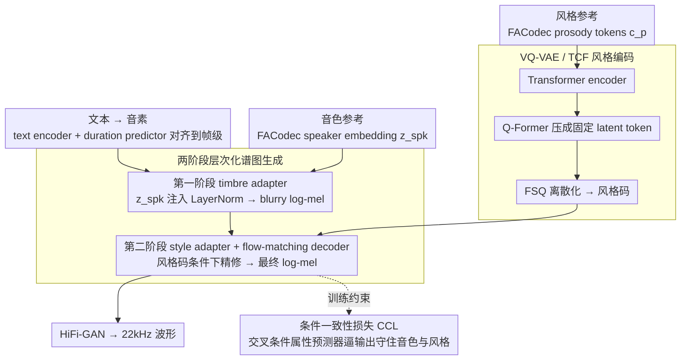

# FC-TTS: Style and Timbre Control in Zero-Shot Text-to-Speech with Disentangled Speech Representations

**会议**: ACL2026  
**arXiv**: [2605.24618](https://arxiv.org/abs/2605.24618)  
**代码**: Audio demo: https://qualcomm-ai-research.github.io/fc-tts  
**领域**: 语音合成 / 可控 TTS  
**关键词**: 零样本 TTS, 音色控制, 风格控制, FACodec, flow matching  

## 一句话总结
FC-TTS 用 FACodec 的解耦语音表示作为条件来源，再通过两阶段谱图生成、VQ-VAE 风格编码和条件一致性损失，把零样本 TTS 中原本纠缠在同一 reference 里的音色和说话风格拆成两个可独立控制的输入。

## 研究背景与动机
**领域现状**：零样本文本转语音已经能从一段参考语音中模仿说话人音色和表达方式，F5-TTS、NaturalSpeech 3、DiTTo-TTS、CLaM-TTS 等系统在自然度、可懂度和 speaker similarity 上不断推进。与此同时，实际应用越来越需要细粒度控制：例如固定某个说话人的音色，同时换成另一段参考语音的情绪、节奏或语调。

**现有痛点**：多数 reference-based TTS 把 style 和 timbre 混在同一个参考音频里。用户想“用 A 的声音讲出 B 的情绪”时，模型往往无法区分哪些信息属于说话人身份，哪些属于韵律风格。即便 FACodec、NANSY++ 这类表示学习方法尝试把语音拆成 prosody、content、detail、speaker embedding，直接复用它们的 decoder 也不保证能处理训练中没见过的风格-音色组合。

**核心矛盾**：强生成质量通常来自联合建模所有属性，但联合建模会让属性泄漏；强解耦通常依赖信息瓶颈，但瓶颈又可能牺牲自然度和细节。本文要解决的是：如何在不让 content/detail 泄漏的前提下，让模型仍然合成自然、清晰、可控的语音。

**本文目标**：FC-TTS 希望支持两个 reference：一个提供 speaker timbre，另一个提供 style/prosody。模型不仅要在 LibriSpeech 上保持竞争性零样本 TTS 性能，还要在 RAVDESS 这类情绪丰富的数据上证明它能独立控制音色和风格。

**切入角度**：作者没有重新训练一个全新的语音表示模型，而是承认 FACodec 解耦不完美，并在 TTS 端增加结构约束和训练约束。核心思路是让音色先确定一个粗略声学空间，再让风格在第二阶段细化谱图，从流程上减少两个条件互相污染。

**核心 idea**：把“音色锚定”和“风格细化”拆到两个生成阶段，再用量化风格编码和条件一致性损失逼迫生成语音同时匹配两个独立 reference。

## 方法详解
FC-TTS 建在 FACodec 和 conditional flow matching 之上。FACodec 提供 prosody tokens $c_p$、content tokens $c_c$、detail tokens $c_d$ 和 speaker embedding $z_{spk}$。FC-TTS 只使用 $z_{spk}$ 与 $c_p$，故意丢弃 content/detail tokens，以减少文本内容和低层声学细节泄漏到控制路径中。

### 整体框架
训练时，目标语音同时提供 timbre 和 style 条件；推理时，这两个条件可以来自不同 utterance。输入文本先被转成 phoneme sequence，经 text encoder 和 duration predictor 对齐到帧级。第一阶段使用 timbre adapter，把 speaker embedding 注入到 layer normalization 中，生成一个由音色条件锚定的 blurry log-mel spectrogram。第二阶段使用 style adapter 和 flow-matching decoder，在 style embedding 条件下把 blurry spectrogram 精修成最终 log-mel spectrogram。最后，HiFi-GAN 把 log-mel 转成 22 kHz waveform。

style embedding 来自 TCF 模块：prosody tokens 先经过 Transformer encoder，再通过 Q-Former 风格的 cross-attention 压缩成固定数量 latent tokens，随后用 finite scalar quantization 离散化。作者在 phoneme level 和 frame level 各放一个 TCF，以捕捉 utterance 内部的风格变化。

### 关键设计

**1. 两阶段层次化谱图生成：让音色先锚定声学空间，再让风格细化谱图，避免两个 reference 在同一 decoder 里互相污染**

直接复用 FACodec decoder 去处理训练里没见过的 style-timbre 组合并不稳，因为所有属性挤在同一个生成步骤里很容易泄漏。FC-TTS 把生成劈成两步：第一阶段只用 speaker embedding $z_{spk}$ 生成一张 over-smoothed 的 blurry log-mel $h$，用 MAE loss $L_{blur}=E[\|h-x_0\|]$ 训练，先把音色和录音条件钉在合理的声学空间；第二阶段才在 prosody 条件 $c_p$ 下用 conditional flow matching 把模糊谱图精修成最终谱图。音色只负责“声音底子”，风格只管“细粒度韵律”，两个 reference 的影响被物理隔到不同阶段，对未见组合自然更稳。

**2. VQ-VAE / TCF 风格编码器：从 prosody token 里抽高层风格，而不是复制参考音频的低层细节**

传统 in-context TTS 默认一段 reference 的风格自始至终一致，但一段长语音内部的语调情绪本就会变化，照搬反而把声学残差也复制了过去。TCF 模块的结构是 Transformer encoder + Q-Former 式 cross-attention query bottleneck + finite scalar quantization：Q-Former query 先把变长 prosody 压成固定数量的 latent token，FSQ 再把它离散成风格码，同时用一个辅助 ResNet 重建 loss 防止 FSQ collapse。量化瓶颈会压掉声学残差，逼表示偏向节奏、语调、情绪这些可迁移的风格而非具体音色。作者还在 phoneme level 和 frame level 各放一个 TCF，专门捕捉 utterance 内部的风格变化。

**3. 条件一致性损失 CCL：用交叉条件的属性预测器逼生成谱图同时守住目标音色和目标风格**

普通一致性损失只盯单一属性，在双条件场景里给出的梯度很模糊。CCL 训练两个属性预测器：一个从生成谱图加 $z_{spk}$ 反推 prosody token，另一个从生成谱图加 $c_p$ 反推 speaker embedding，损失是 prosody 交叉熵与 speaker 负余弦相似度的加权和：

$$L_{CCL}=\lambda_{pro}E[CE(c_p,f(\hat{x},z_{spk}))]-\lambda_{spk}E[cos(z_{spk},g(\hat{x},c_p))]$$

关键在于把“非目标属性”也喂进预测器——预测 prosody 时给它真音色 $z_{spk}$，预测 speaker 时给它真风格 $c_p$——这样 posterior 更尖锐，尤其在早期 denoising 阶段更稳定。消融里去掉整个 CCL 会让 LibriSpeech WER 从 1.88 崩到 5.88，是全模型里最关键的一块。

### 损失函数 / 训练策略
总训练目标包含 CFM loss、blurry spectrogram MAE、prosody CE、speaker cosine consistency、mel reconstruction、aligner forward-sum、binary alignment、duration CFM 等项。cache 给出的系数包括 $\lambda_{CFM}=5.0$、$\lambda_{blur}=1.0$、$\lambda_{ccl-pro}=0.2$、$\lambda_{ccl-spk}=0.5$、$\lambda_{mel-recon}=1.0$、$\lambda_{dur}=1.0$、$\lambda_{forwardsum}=0.1$、$\lambda_{bin}=0.1$。

训练数据是 LibriHeavy，200k iterations，AdamW，batch size 64，learning rate 0.0002，8 张 V100 训练 116 小时。推理阶段 duration prediction 使用 8 NFEs，无 classifier-free guidance；log-mel synthesis 使用 32 NFEs，CFG scale 4.0；训练时随机 drop conditioning，概率 15%。

## 实验关键数据

### 主实验
| 任务 / 数据集 | 指标 | FC-TTS | 对照 | 结论 |
|--------|------|------|----------|------|
| LibriSpeech test-clean 零样本 TTS | UTMOS / WER / SPK / Params | 4.22 / 1.88 / 0.60 / 204M | NaturalSpeech 3: 4.30 / 1.81 / 0.67 / 500M；F5-TTS†: 4.03 / 3.30 / 0.67 / 205M | 自然度和 WER 竞争性，但 SPK 低于部分 SOTA |
| RAVDESS 音色控制 | UTMOS / SPK / WER / Win | 4.03 / 0.48 / 0.18 / 66.1% | FACodec-VC: 3.19 / 0.27 / 8.40 / 10.7% | 在 prosody-rich mismatch 条件下明显更稳 |
| RAVDESS 风格控制 | UTMOS / SPK / WER / MCD / Win | 3.95 / 0.47 / 0.30 / 3.21 / 65.5% | F5-TTS: 3.40 / 0.57 / 4.39 / 3.43 / 8.9% | 风格匹配和可懂度更强，但 speaker similarity 有牺牲 |
| AudioLLM-as-a-Judge 风格评测 | Win Ratio / Style-MOS | 91.7% / 3.92 | F5-TTS: 8.3% / 1.50 | Gemini 2.5 Pro 也强烈偏向 FC-TTS |

### 消融实验
| 配置 | LibriSpeech UTMOS / WER / SPK / MCD | RAVDESS Style UTMOS / WER / SPK / MCD | 说明 |
|------|---------|------|------|
| FC-TTS | 4.22 / 1.88 / 0.60 / 5.60 | 3.91 / 0.30 / 0.37 / 3.33 | 完整模型 |
| w/o two-stage generation | 4.15 / 1.93 / 0.60 / 5.83 | 3.57 / 0.30 / 0.37 / 3.26 | 声学稳定性下降，谱图更易受 prosody 过度影响 |
| w/o VQ-VAE style encoding | 4.25 / 2.00 / 0.57 / 5.62 | 3.99 / 0.25 / 0.34 / 3.47 | 自然度略升，但风格控制和 F0 跟随变弱 |
| w/o conditioning in consistency loss | 4.21 / 1.92 / 0.59 / 5.67 | 3.79 / 0.35 / 0.36 / 3.36 | 去掉 cross-conditioning 后对齐和可懂度小幅下降 |
| w/o entire consistency loss | 3.95 / 5.88 / 0.48 / 6.34 | 3.70 / 9.36 / 0.21 / 3.75 | 退化最严重，说明 CCL 是最关键组件 |

### 关键发现
- FC-TTS 不追求所有零样本 TTS 指标第一，而是在保持可听质量的同时换取独立控制能力。
- 两阶段生成约束会限制自然度上限，但显著提升未见 style-timbre 组合的稳定性。
- 消融中“去掉整个 consistency loss”导致 LibriSpeech WER 从 1.88 恶化到 5.88、RAVDESS WER 从 0.30 恶化到 9.36，是最强的组件证据。
- 风格控制实验里 SPK 低于 F5-TTS，说明风格解耦仍会与音色保持发生 trade-off。

## 亮点与洞察
- **不是只“用 FACodec”**：论文真正的贡献在于承认 FACodec 解耦不完美，然后在 TTS 端用生成流程和 loss 重新约束属性流向。
- **两阶段设计很工程化但有效**：先生成模糊谱图看似绕路，实际是在给第二阶段设定一个音色锚点，这比把所有条件塞进同一个 decoder 更可控。
- **风格编码处理了 utterance 内变化**：很多 TTS 方法默认 reference 的风格统一，而本文指出一段长语音内部也可能有多种说法。TCF 的 phoneme/frame 两级编码更贴近真实表达。
- **AudioLLM-as-a-Judge 是有趣补充**：虽然不能替代人评，但它给风格相似性提供了可扩展自动评估，有助于未来做大规模 controllability benchmark。

## 局限与展望
- 作者明确承认训练和评测目前局限于英语，无法说明 FC-TTS 在多语言、方言和跨口音场景中的泛化能力。
- 模型仍依赖 FACodec 表示。FACodec 的 content/detail/timbre/prosody 解耦并不完美，残留 timbre 或 acoustic detail 可能导致控制泄漏。
- “音色”和“风格”的边界本身不清楚，例如 husky voice 到底属于声线还是风格并没有统一定义。缺少可靠量化指标会限制可控 TTS 的科学比较。
- 零样本 TTS 有深度伪造和身份冒用风险。FC-TTS 能固定音色并改变情绪风格，部署时必须考虑授权 speaker、合成检测、水印或访问控制。
- 自然度与解耦之间仍有 trade-off。未来可以探索 codec-free 解耦、显式 accent/style taxonomy、更强 speaker preservation objective。

## 相关工作与启发
- **vs NaturalSpeech 3 / FACodec-based TTS**: NaturalSpeech 3 利用 FACodec 强重建能力，但没有证明在错配 style-timbre reference 下仍稳；FC-TTS 牺牲一部分上限，换取更明确的独立控制。
- **vs F5-TTS**: F5-TTS 的 in-context learning 很强，但单 reference 难以分离音色和风格；FC-TTS 在 RAVDESS 风格控制上 WER、MCD、ABX preference 和 Style-MOS 都明显更优。
- **vs EmoSphere++ / IndexTTS 2**: 这些方法也追求风格和音色控制，但可能依赖 empirically disentangled representation 或特定 emotion encoder；FC-TTS 更系统地把 factorized codec、结构分阶段和条件一致性结合起来。
- **启发**：多属性生成不一定要靠更大的统一模型，有时把属性注入路径物理拆开，并用每个属性的验证器约束输出，会更可靠。

## 评分
- 新颖性: ⭐⭐⭐⭐☆ 两阶段生成 + TCF + CCL 的组合对可控 TTS 很有针对性，但底座仍依赖既有 FACodec/CFM。
- 实验充分度: ⭐⭐⭐⭐☆ LibriSpeech、RAVDESS、客观指标、人评、AudioLLM 和消融都比较完整；多语言缺失是主要短板。
- 写作质量: ⭐⭐⭐⭐☆ 方法图和组件解释清楚，消融讨论到位；部分公式排版在 cache 中不太友好，但论文逻辑完整。
- 价值: ⭐⭐⭐⭐⭐ 对需要可控语音、游戏/有声书/辅助交流等场景很有实用潜力，也揭示了可控 TTS 的核心 trade-off。

<!-- RELATED:START -->

## 相关论文

- [\[ACL 2026\] ReStyle-TTS: Relative and Continuous Style Control for Zero-Shot Speech Synthesis](restyle-tts_relative_and_continuous_style_control_for_zero-shot_speech_synthesis.md)
- [\[ACL 2026\] UniSonate: A Unified Model for Speech, Music, and Sound Effect Generation with Text Instructions](unisonate_a_unified_model_for_speech_music_and_sound_effect_generation_with_text.md)
- [\[ACL 2026\] ImmersiveTTS: Environment-Aware Text-to-Speech with Multimodal Diffusion Transformer and Domain-Specific Representation Alignment](immersivetts_environment-aware_text-to-speech_with_multimodal_diffusion_transfor.md)
- [\[ACL 2025\] ControlSpeech: Towards Simultaneous and Independent Zero-shot Speaker Cloning and Zero-shot Language Style Control](../../ACL2025/audio_speech/controlspeech_zero_shot.md)
- [\[ACL 2025\] Zero-Shot Text-to-Speech for Vietnamese](../../ACL2025/audio_speech/zero-shot_text-to-speech_for_vietnamese.md)

<!-- RELATED:END -->
