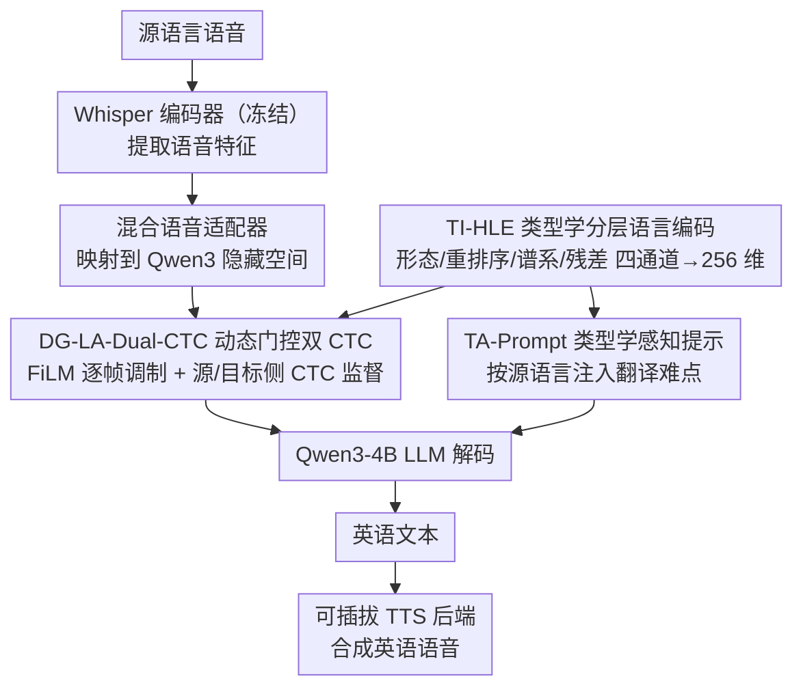

# From Flat Language Labels to Typological Priors: Structured Language Conditioning for Multilingual Speech-to-Speech Translation

**会议**: ACL2026 Findings  
**arXiv**: [2605.16026](https://arxiv.org/abs/2605.16026)  
**代码**: 无公开代码（缓存未提供仓库）  
**领域**: 语音翻译 / 多语言 S2ST / SpeechLLM  
**关键词**: 语音到语音翻译, 类型学先验, 多语言条件, Dual-CTC, 低资源适配  

## 一句话总结
本文提出 S2ST-Omni 2，把多语言语音翻译中的扁平 language label 改成结构化类型学先验，并在表示、声学调制和 LLM 解码三层注入这些先验，从而在 CVSS-C 上提升 BLEU、ASR-BLEU、COMET 和 BLASER 2.0，尤其改善低资源和类型差异较大的语言。

## 研究背景与动机
**领域现状**：多语言 speech-to-speech translation 既可以用 ASR-MT-TTS 级联系统，也可以用端到端或 compositional S2ST。近期 SpeechLLM 让 compositional S2ST 更有吸引力：前端把源语音转成目标文本，后端 TTS 再合成目标语音，模块化且能复用语音和文本资源。

**现有痛点**：已有 S2ST-Omni 这类系统通常把源语言作为一个 flat label 或独立 embedding。这样能告诉模型“这是德语 / 法语 / 西班牙语”，但无法显式表示语言之间共享的形态、语序、谱系等结构规律。低资源 S2ST 中，模型很难仅靠少量监督数据学到这些规律。

**核心矛盾**：多语言模型既需要区分具体语言，又需要共享跨语言结构。flat label 只提供身份信息，缺少可迁移的类型学结构；完全依赖数据学习又在低资源场景不可靠。

**本文目标**：作者希望在不大改 S2ST-Omni 主干的前提下，重构语言条件路径，把源语言从孤立标签表示为可解释的类型学先验，并验证这些先验是否能提升数据效率和翻译质量。

**切入角度**：论文把语言条件分成三层：表示层用 typology-informed hierarchical language encoding，声学层用 dynamically-gated language-aware Dual-CTC，解码层用 typology-aware LLM prompting。

**核心 idea**：用形态、重排序需求、语言谱系和残差语言特征共同表示源语言，并让这些结构化条件影响中间声学特征、辅助 CTC 对齐和 LLM 翻译提示。

## 方法详解
S2ST-Omni 2 保留 S2ST-Omni 的 compositional 框架：Whisper encoder 提取源语音特征，hybrid speech adapter 映射到 Qwen3 LLM 的隐藏空间，Qwen3-4B 解码成英文文本，最后由可插拔 TTS backend 合成英语语音。论文的改动集中在 language conditioning pathway，而不是换掉整个系统。

### 整体框架
输入是源语言语音，输出是英语语音。训练时，源语言标签来自 ground truth；推理时，源语言由 Whisper encoder representation 预测。系统在前端内部增加三类类型学条件：TI-HLE 生成结构化语言向量，DG-LA-Dual-CTC 在 adapter 中间特征上进行语言感知调制并提供源侧 / 目标侧 CTC 辅助监督，TA-Prompt 在 LLM 解码时加入语言级翻译提示。推理时 TI-HLE 和 DG-LA-Dual-CTC 的辅助分支被丢弃，不改变 encoder-adapter-LLM 的声学前向路径；保留的主要推理差异是按预测源语言选择 typology-aware prompt。

### 关键设计
**1. Typology-Informed Hierarchical Language Encoding：把源语言从一个 ID 拆成可共享、可解释的结构化向量**

S2ST-Omni 把源语言当成一个 flat label 或独立 embedding，只能告诉模型“这是德语 / 法语 / 西班牙语”，却无法显式表达语言之间共享的形态、语序和谱系规律，低资源时这些规律又很难只靠少量数据学到。TI-HLE 改成用四个通道描述每种语言：形态 profile、面向英语的 reordering profile、genealogical family，以及一条 language-specific residual。四组 embedding 维度分别为 64、64、64、128，拼接成 320 维后再投影成 256 维语言表示。前三个通道编码可跨语言迁移的结构先验——法语和西班牙语共享 Romance family、偏 SVO，德语属 Germanic、日语属 Japonic 且都需要更强的 clause-final / verb-final 到英语的重排序提示；残差通道则保留无法归入这些类别的语言个性，避免把所有差异粗暴压进 typology bucket。

**2. Dynamically-Gated Language-Aware Dual-CTC：让类型学条件按帧注入声学特征，同时守住源内容和目标对齐**

光有结构化语言向量还不够，它得真正作用到声学中间表示上，而且不能一刀切地糊到整段语音——不同帧对类型学调制的需求并不一样。DG-LA-Dual-CTC 先用一个 FiLM generator 根据语言表示生成调制参数 $\gamma,\beta$，再用一个动态 frame gate 根据每帧声学特征和语言表示算出门控 $g_t$，最终以 $\tilde{h}^{src}_t=(1+g_t\gamma)\odot h^{down}_t+g_t\beta$ 调制源侧 adapter 特征。源侧 CTC 监督这条调制后的特征，目标侧 CTC 则监督未调制特征，一条管语言感知、一条管目标对齐。把门控做成逐帧动态，模型就能在内容相关的位置更强地引入语言先验，而在其余位置让它退场。

**3. Typology-Aware LLM Prompting 与渐进微调：在解码层把语言级翻译难点直接说给 LLM，并稳住 SpeechLLM 适配**

声学侧条件解决的是“听懂和对齐”，但要翻得自然还得靠解码层。TA-Prompt 给每种源语言写一段针对性提示：德语强调复合词拆解和从 clause-final 到英语的重排序，日语强调 SOV→SVO、主语省略和敬语归一化，法语 / 西班牙语强调习语和词汇用法。训练上采用两阶段 progressive fine-tuning——先稳定 speech-text alignment，再往 Qwen3 self-attention 插入 LoRA 强化翻译能力。这样声学条件和 prompt 条件各管一层语言结构，互不挤占。

### 损失函数 / 训练策略
两阶段训练都冻结 Whisper encoder 和 Qwen3 base 参数，并更新 hybrid adapter、TI-HLE 与 DG-LA-Dual-CTC。Stage I 目标为 $\mathcal{L}^{(1)}=\mathcal{L}_{CE}+\lambda^{(1)}_{src}\mathcal{L}^{src}_{CTC}+\lambda^{(1)}_{tgt}\mathcal{L}^{tgt}_{CTC}$，其中源 / 目标 CTC 权重为 0.1 / 0.2。Stage II 插入 Qwen3 query/value projection 的 LoRA，rank 为 8，$\alpha=32$，dropout 0.1，并将 CTC 权重降到 0.01 / 0.05，使 CTC 主要作为辅助对齐正则。

训练使用 Whisper-Large-V3 和 Qwen3-4B，有效 batch size 24，bf16 混合精度，在两张 NVIDIA A6000 上运行。主实验在 CVSS-C 上训练一个 many-to-one 多语言前端，覆盖法语、德语、西班牙语到英语，共约 561 小时监督数据。

## 实验关键数据

### 主实验
| 模型 | Fr→En BLEU / ASR-BLEU | De→En BLEU / ASR-BLEU | Es→En BLEU / ASR-BLEU | Avg BLEU | Avg ASR-BLEU |
|------|------------------------|------------------------|------------------------|----------|--------------|
| RosettaSpeech | 33.11 / 32.16 | 23.22 / 21.54 | 30.92 / 29.35 | 29.08 | 27.68 |
| S2ST-Omni | 35.83 / 33.20 | 33.34 / 31.25 | 37.85 / 35.90 | 35.67 | 33.45 |
| S2ST-Omni 2 | 37.83 / 34.72 | 35.70 / 33.16 | 39.62 / 37.13 | 37.73 | 35.00 |
| Whisper-Qwen S2TT reference | 35.15 / - | 36.07 / - | 38.39 / - | 36.54 | - |

### 消融实验
| 配置 | Avg BLEU | Avg ASR-BLEU | 相对完整模型的含义 |
|------|----------|--------------|--------------------|
| S2ST-Omni 2 | 37.73 | 35.00 | 完整类型学条件 |
| w/o DG | 36.96 | 34.07 | 动态门控改静态门控，BLEU 降 0.77 |
| w/o TA-Prompt | 36.80 | 33.96 | 去掉类型学 prompt，BLEU 降 0.93 |
| w/o TI-HLE | 36.09 | 33.68 | 结构化表示换成 320 维 flat embedding，降幅最大 |
| w/o Morph | 36.23 | 33.75 | 去掉形态通道 |
| w/o Reorder | 36.60 | 33.94 | 去掉重排序通道 |
| w/o Family | 36.44 | 33.87 | 去掉谱系通道 |
| w/o Residual | 36.21 | 33.74 | 去掉语言特异残差通道 |

### 关键发现
- 相比 S2ST-Omni，S2ST-Omni 2 的平均 BLEU 从 35.67 提升到 37.73，相对提升 5.8%；平均 ASR-BLEU 从 33.45 提升到 35.00，相对提升 4.6%。
- COMET 平均值从 S2ST-Omni 的 82.02 提升到 83.31，BLASER 2.0 从 4.14 提升到 4.24。
- 相比 RosettaSpeech，S2ST-Omni 2 平均 BLEU 高 8.65，平均 ASR-BLEU 高 7.32，COMET 高 3.09，BLASER 2.0 高 0.14。
- 低资源数据预算下优势更明显：训练数据从 561 小时降到 30 小时时，绝对 BLEU 增益从 +2.06 增至 +3.93，相对提升从 5.8% 增至约 15.1%。
- 日语到英语约 3 小时监督数据实验中，S2ST-Omni 2 从 19.61 / 18.59 / 78.29 / 3.692 提升到 22.00 / 20.93 / 80.31 / 3.779，四项指标均优于 S2ST-Omni。
- TTS backend 会影响 ASR-BLEU，但完整系统在六个后端上平均 ASR-BLEU 范围为 33.87 到 35.00，说明提升不依赖单一合成器。

## 亮点与洞察
- 论文最有意思的是把 language label 从“类别 ID”变成“结构先验”。这对低资源多语言任务很重要，因为类型学结构能在数据不足时提供可迁移 bias。
- TI-HLE 的残差通道是必要的。它避免过度类型学化：语言不是只有形态、语序和谱系，残差 embedding 保留了难以归类的语言特异性。
- DG-LA-Dual-CTC 把类型学先验放在训练时声学对齐中，而不是只靠 prompt。这说明语言结构不仅影响文本生成，也影响语音特征如何被对齐和压缩。
- 定性例子很贴近机制：德语复合词和 clause-level argument structure、西班牙语被动结构和谚语、法语习语都受益于结构化语言条件。

## 局限与展望
- 缓存中没有单独的 Limitations section；从实验边界看，主实验仍集中在 CVSS-C 的法语、德语、西班牙语到英语，日语只是约 3 小时低资源补充实验。
- 类型学 profile 是粗粒度、面向英语翻译的手工分组，不等于完整语言学分类；扩展到更多语言时需要更系统的 typology schema。
- 任务是 many-to-one English S2ST，尚未说明 many-to-many 或非英语目标语言下 prompt 与 reordering profile 如何设计。
- TTS backend 仍带来最高 1.13 ASR-BLEU 的波动，说明前端提升之外，端到端语音质量还受合成器稳定性影响。
- 未来可以结合自动类型学特征数据库、语言相似度学习和多目标语言 prompt，减少手工 profile 设计。

## 相关工作与启发
- **vs S2ST-Omni**: S2ST-Omni 使用 language-label conditioning，S2ST-Omni 2 保留主干但重做条件路径，证明提升来自语言信息表示方式而不只是 backbone。
- **vs cascaded ASR-MT-TTS**: 级联系统模块清晰但误差传播明显；S2ST-Omni 2 通过统一 SpeechLLM 前端在平均 BLEU 上超过 Whisper-Qwen S2TT reference。
- **vs 端到端 S2ST**: 端到端系统可全局优化，但资源需求和可解释性更差；本文的 compositional 设计保留 TTS 可插拔性，也方便分析语言条件如何影响前端。

## 评分
- 新颖性: ⭐⭐⭐⭐☆ 类型学先验用于 SpeechLLM S2ST 条件建模很有针对性，组件组合扎实。
- 实验充分度: ⭐⭐⭐⭐☆ 主结果、消融、TTS backend、数据预算和日语低资源实验都覆盖到了；语言范围仍偏有限。
- 写作质量: ⭐⭐⭐⭐☆ 动机和模块拆解清楚，公式细节足够；缺少显式 Limitations section 稍可惜。
- 价值: ⭐⭐⭐⭐☆ 对低资源多语言语音翻译很实用，也启发其他多语言模型不要只依赖 flat language ID。

<!-- RELATED:START -->

## 相关论文

- [\[ICLR 2026\] Scalable Multilingual Multimodal Machine Translation with Speech-Text Fusion](../../ICLR2026/audio_speech/scalable_multilingual_multimodal_machine_translation_with_speech-text_fusion.md)
- [\[ACL 2025\] Leveraging Unit Language Guidance to Advance Speech Modeling in Textless Speech-to-Speech Translation](../../ACL2025/audio_speech/leveraging_unit_language_guidance_to_advance_speech_modeling_in_textless_speech-.md)
- [\[ACL 2026\] Closing the Modality Reasoning Gap for Speech Large Language Models](closing_the_modality_reasoning_gap_for_speech_large_language_models.md)
- [\[ACL 2026\] Towards Fine-Grained and Multi-Granular Contrastive Language-Speech Pre-training](towards_fine-grained_and_multi-granular_contrastive_language-speech_pre-training.md)
- [\[ACL 2026\] Do We Need Distinct Representations for Every Speech Token? Unveiling and Exploiting Redundancy in Large Speech Language Models](do_we_need_distinct_representations_for_every_speech_token_unveiling_and_exploit.md)

<!-- RELATED:END -->
