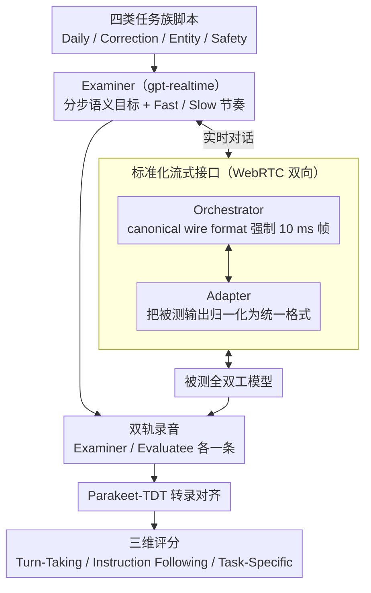

# Full-Duplex-Bench-v2: A Multi-Turn Evaluation Framework for Duplex Dialogue Systems with an Automated Examiner

**会议**: ACL 2026  
**arXiv**: [2510.07838](https://arxiv.org/abs/2510.07838)  
**代码**: <https://github.com/DanielLin94144/Full-Duplex-Bench>  
**领域**: 对话 / 全双工语音 / 评测 Benchmark  
**关键词**: 全双工对话、多轮评测、LLM-as-judge、WebRTC 流式编排、turn-taking

## 一句话总结
作者提出 Full-Duplex-Bench-v2，让一个 GPT-Realtime 扮演的 Examiner 通过 WebRTC 与被测全双工模型实时对话，按 Daily/Correction/Entity/Safety 四类任务、Fast/Slow 两种节奏对其打 turn-taking、instruction-following、task-specific 三类分，发现 GPT-Realtime、Moshi、Freeze-Omni 都会随对话推进性能持续下滑，且开源模型在 correction 和 entity tracking 上尤其拉胯。

## 研究背景与动机
**领域现状**：传统口语对话系统是半双工的——一人说完另一人才说，简单但延迟高、不自然。最近一年涌现出大量全双工方案：级联式（ASR+LLM+TTS 配合 FSM、MiniCPM-Duplex）以及端到端（dGSLM、SyncLLM、Moshi、NTPP、SCoT）。这些模型号称能"边听边说"，理论上接近人类对话节奏。

**现有痛点**：① 人评：自然但贵且不可复现；② 语料级统计（pause、floor-transfer offset）：可扩展但看不见语义；③ 分类器（Talking Turns）：自动但被训练数据限制泛化能力；④ 已有的 Full-Duplex-Bench v1/v1.5：第一个流式 benchmark，但局限在单轮、脚本化场景，覆盖 pause / interrupt / backchannel 这些"瞬时"行为。

**核心矛盾**：真实人类对话是多轮的，成功不只取决于单次 turn-taking，而是要在多次交替中保持上下文一致、任务推进、信息回溯。而现有 benchmark 几乎全部停留在单轮，"全双工模型能否撑住多轮"实际上没人系统量化过。

**本文目标**：① 把评测从"脚本化单轮"推进到"真实多轮、流式"；② 在不依赖人评的前提下保留 naturalism（Examiner 会即兴打断、追问、根据被测回答调整）；③ 提出能区分 turn-taking、instruction-following、task-specific competence 三个不同维度的指标。

**切入角度**：作者发现 GPT-Realtime 本身就是一个稳定、低延迟、能严格 role-play 的语音模型，因此可以拿它当 "Automated Examiner"。这把"人作为对话伙伴"的瓶颈直接绕开，把多轮评测从"贵且慢"压到"可批量复现"。

**核心 idea**：用一个 spoken-LM Examiner + 一个 WebRTC orchestrator + 一组 staged 多轮任务脚本 + LLM-as-judge 评分器，构成第一个 streaming-native 的多轮全双工评测框架。

## 方法详解

### 整体框架
FDB-v2 想回答一个此前没人系统量化的问题：全双工语音模型能不能撑住一整段多轮对话，而不只是单次接话接得漂亮。它把评测组织成一个三方实时回路——一个 gpt-realtime 驱动的 Examiner 按预设子目标推进对话、必要时主动打断，一个 Orchestrator 维护两条 WebRTC peer connection、强制双向以统一的 canonical wire format 传音频，被测模型则通过 adapter 接进来把自己的音频流转成统一格式。每场对话由 Examiner 开口、按子目标逐步推进、以固定结束语收尾，全程双轨录音（Examiner 一条、Evaluatee 一条），事后用 Parakeet-TDT 转录再交给 Gemini-2.5-flash 当 judge 打分。

### 关键设计

**1. 分步语义目标（Stepwise Semantic Goals）+ 两种 Examiner 节奏：把"随便聊"改成有诊断力的结构化推进**

多轮评测最怕变成一段无法判定成败的自由闲聊，所以作者把每个场景拆成若干 step，每个 step 挂一个明确的 semantic goal，只有当前 goal 被满足 Examiner 才推进，否则就换种说法重复或细化追问。更巧的是给 Examiner 配了两档节奏：Fast 模式下它主动打断、补 backchannel、stage 一完成立刻切下一步；Slow 模式下它只在被测说完或停顿过长时才介入。两档节奏不是为了舒适度，而是把两类失败拆开——Fast 专门压测 turn-taking 的协调能力（被测能不能扛住打断），Slow 给足时间反而暴露 memory 与 entity tracking 的耐力（上下文一长就容易漂移）。同一套任务脚本在两种节奏下各跑一遍，"是接不上还是记不住"就被干净地分离出来。

**2. Adapter–Orchestrator–Adapter 的标准化流式接口：把音频协议当成公共接口**

全双工评测最大的工程障碍是每家模型的音频接口都不一样——有的是 chunked WebSocket、有的是 RTSP、有的是 SDK 内部回调，没法直接对接。作者的解法是让 Orchestrator 强制一种 canonical wire format（48 kHz、16-bit、mono PCM、严格 10 ms 帧 = 960 字节）双向稳定推送，被测模型只需写一个 adapter 把自家输出 normalize 成这个格式、slice/pack 成 10 ms 帧、遇到 buffer under-run 就 pad silence。这样"传输协议"和"任务脚本"彻底解耦，新模型接入只是一份 adapter 代码，框架本体能独立稳定演化——这套思路相当于全双工评测里的 OpenAI Gym 统一接口。

**3. 四类任务族 + LLM-as-judge 的三维评分：把"流畅""听话""答对"拆开看**

任务一侧覆盖四种核心多轮挑战——Daily（订餐订位、计划、排障）、Correction（跨轮自我修正，如 "I want a cold coffee" → "Oh, please make it hot"）、Entity Tracking（用 ordinal/attribute/landmark 切换指代，如 "the quieter one" → "the one near the park"）、Safety（11 类政策对齐场景，涵盖身心健康、隐私、违法、未成年人等）。评分一侧让 Gemini judge 在 Examiner 的 system prompt 和 stage-level goals 条件下同时给出三个维度：Turn-Taking Fluency（1-5/event）、Instruction Following（1-5/event）、Task-Specific Metric（1-5/dialogue）。之所以要拆三维，是因为只看 turn-taking 会放过"接得快但答非所问"，只看 task accuracy 又会放过"答对但严重打断节奏"；三维分解才能区分"流畅但浅"和"准但卡"两种 failure mode。task-specific 这一维还按任务族定制——Entity 看 reference 一致性、Correction 看修正是否被正确应用、Safety 看压力下是否守住边界，保证不同任务有可比的总分。

### 损失函数 / 训练策略
FDB-v2 是评测框架，不含训练。判分一侧用 Gemini-2.5-flash-preview-09-2025，遵循 Chang et al. 2025 提出的"用 Gemini 评 turn-taking 与人评高度相关"的做法；ASR 用 Parakeet-TDT-0.6B-v2 做时序对齐转录；Examiner 始终用 gpt-realtime 以保证跨模型测试时 Examiner 端零方差。

## 实验关键数据

### 主实验

| 节奏 | 系统 | Correction | Entity | Safety |
|------|------|-----------|--------|--------|
| Fast | Freeze-Omni | 2.74 | 2.62 | 3.94 |
| Fast | Moshi | 2.88 | 2.76 | 3.67 |
| Fast | GPT-Realtime | **4.02** | **4.51** | **4.44** |
| Slow | Freeze-Omni | 3.50 | 2.86 | 4.27 |
| Slow | Moshi | 3.46 | 3.84 | 3.51 |
| Slow | GPT-Realtime | 3.94 | 4.12 | **4.53** |

GPT-Realtime 在所有 Fast 任务上 ≥4.0，开源模型在 Fast Correction/Entity 上都 <3.0；Slow 给开源模型显著喘息空间（Moshi Entity +1.08，Freeze-Omni Correction +0.76）。

### 消融实验 / 人评对齐

| 指标 | Krippendorff $\alpha$ | Pearson $r$ |
|------|---------------------|-------------|
| Turn-Taking Fluency | 0.6143 | 0.6137 |
| Instruction Following | 0.6833 | 0.6807 |
| Correction Handling | 0.5879 | 0.5877 |
| Entity Tracking | 0.6383 | 0.6330 |
| Safety | 0.6931 | 0.6914 |

120 个 session 上 LLM judge 与人评的相关系数 $r\in[0.59, 0.69]$，最强是 Safety 和 IF，Turn-Taking 最弱（因为"timing 是否自然"本来人评之间也有分歧）。

### 关键发现
- **所有系统都随时间退化**：把 TT/IF 按 15 秒分桶画轨迹，TT 缓慢漂移，IF 经常急速下跌偶有回升但极少回到起点；说明全双工模型的长时鲁棒性是当前共同短板。
- **节奏不是舒适感而是诊断信号**：Slow 给 GPT-Realtime 和 Moshi 提供"回神"机会，Entity IF 提升 0.5-1.0；Fast 暴露 Freeze-Omni 完全没有恢复能力（两种节奏下都持续掉）。说明 Examiner pacing 是高效的失败模式探针。
- **任务族难度排序**：Entity 最易（显式 reference 让模型 grounded），Daily / Correction 最难（依赖记忆与信息累积，小错滚雪球），Safety 普遍偏稳但所有模型在压力下仍会偶发越界。
- **闭源 vs 开源差距巨大**：GPT-Realtime Fast 平均 4.32，Moshi Fast 平均 3.10，Freeze-Omni Fast 平均 3.10；Slow 下差距缩小但仍存在，说明当前开源全双工模型在多轮场景下还远未追上商用 API。

## 亮点与洞察
- **Spoken-LM 作 Examiner 是评测范式的关键跃迁**：以前 benchmark 要么是脚本（不自然）要么是人（不可复现），用一个稳定语音模型既保留了真实对话动态（打断、追问、节奏切换）又保留了可复现性，这套思路可以原样套到全双工视频对话、具身智能对话等场景。
- **canonical wire format + adapter 模式**：把"音频协议"当作一种公共接口，强制 10 ms 帧 / 48 kHz / mono PCM，让框架对模型实现彻底中立；这是 benchmark 工程上最值得复制的设计 —— 类似 OpenAI Gym 对强化学习环境的统一。
- **Fast/Slow 两节奏分离 turn-taking 与 memory 缺陷**：单一节奏的评测会把这两类失败混在一起，本文的双节奏设计直接给出诊断分解（"是接不上还是记不住"），对工业团队定位 bug 极有价值。
- **三维分数（TT/IF/task-specific）**：第一次把"流畅"、"指令遵循"、"任务完成"在多轮对话中拆开，避免单一总分掩盖真实 trade-off。

## 局限与展望
- 任务覆盖仅 4 类、节奏仅 2 档，不含 open-domain、谈判、教学、复杂安全细分；分布偏移到这些场景外可能行为大变。
- 不奖励 audio-expressive 行为（情感韵律、active-listening cues、风格自适应），评测下系统可能在 micro-timing 与 entrainment 上欠表达。
- 仅英文；多语种涉及 code-switching、不同 overlap 模式与文化背景的节奏规范，未覆盖。
- 自动 Examiner + LLM judge 引入 prompt sensitivity、模型偏见、校准漂移；虽然人评相关 $r=0.59-0.69$ 说明"moderate-to-strong"，但 Turn-Taking 这种主观维度仍只到 0.61，不能视作"已解决"。
- 三个被测系统的样本量偏小（GPT-Realtime / Moshi / Freeze-Omni），还没真正测试新出的 NTPP、SCoT 等端到端模型。

## 相关工作与启发
- **vs Full-Duplex-Bench v1/v1.5（Lin et al. 2025a/b）**：前作只测单轮的 pause / interrupt / backchannel；v2 把场景拉到多轮 staged goals 上，从"会不会接话"升级到"能不能撑住一段对话"。
- **vs Talking Turns（Arora et al. 2025b）**：他们用训练好的分类器自动检 turn-change，但被训练数据限制；本文用 spoken-LM 直接当 partner，泛化到任何任务族，并且检的不只是 turn-change，还有 IF 与 task-specific。
- **vs Chang et al. 2025（Game-Time）**：那篇也用 Gemini 当 turn-taking judge 并验证了人评相关性，本文继承该结论并扩展到多维多任务评分。
- **vs MultiWOZ / Taskmaster / SLURP（文本对话 benchmark）**：那些是 written 多轮但无 streaming；FDB-v2 把"流式 + 全双工 + 多轮"三者首次合并到一个统一框架里。

## 评分
- 新颖性: ⭐⭐⭐⭐ 首个流式多轮全双工评测框架，把 spoken-LM 当 Examiner 的范式很扎实
- 实验充分度: ⭐⭐⭐⭐ 3 系统 × 2 节奏 × 4 任务 + 120 session 人评对齐，但被测系统略少
- 写作质量: ⭐⭐⭐⭐ 框架介绍清晰，limitation 极诚实
- 价值: ⭐⭐⭐⭐⭐ 给全双工社群一个可复现的多轮测试床，工程上对 wire format 标准化很有指导意义

<!-- RELATED:START -->

## 相关论文

- [\[ACL 2026\] MTR-DuplexBench: Towards a Comprehensive Evaluation of Multi-Round Conversations for Full-Duplex Speech Language Models](mtr-duplexbench_towards_a_comprehensive_evaluation_of_multi-round_conversations_.md)
- [\[ICML 2026\] The Silent Thought: Modeling Internal Cognition in Full-Duplex Spoken Dialogue Models via Latent Reasoning](../../ICML2026/audio_speech/the_silent_thought_modeling_internal_cognition_in_full-duplex_spoken_dialogue_mo.md)
- [\[ICML 2026\] MoshiRAG: Asynchronous Knowledge Retrieval for Full-Duplex Speech Language Models](../../ICML2026/audio_speech/moshirag_asynchronous_knowledge_retrieval_for_full-duplex_speech_language_models.md)
- [\[ACL 2026\] MSU-Bench: Musical Score Understanding Benchmark](musical_score_understanding_benchmark_evaluating_large_language_models39_compreh.md)
- [\[ACL 2026\] Style Amnesia: Investigating Speaking Style Degradation and Mitigation in Multi-Turn Spoken Language Models](style_amnesia_investigating_speaking_style_degradation_and_mitigation_in_multi-t.md)

<!-- RELATED:END -->
