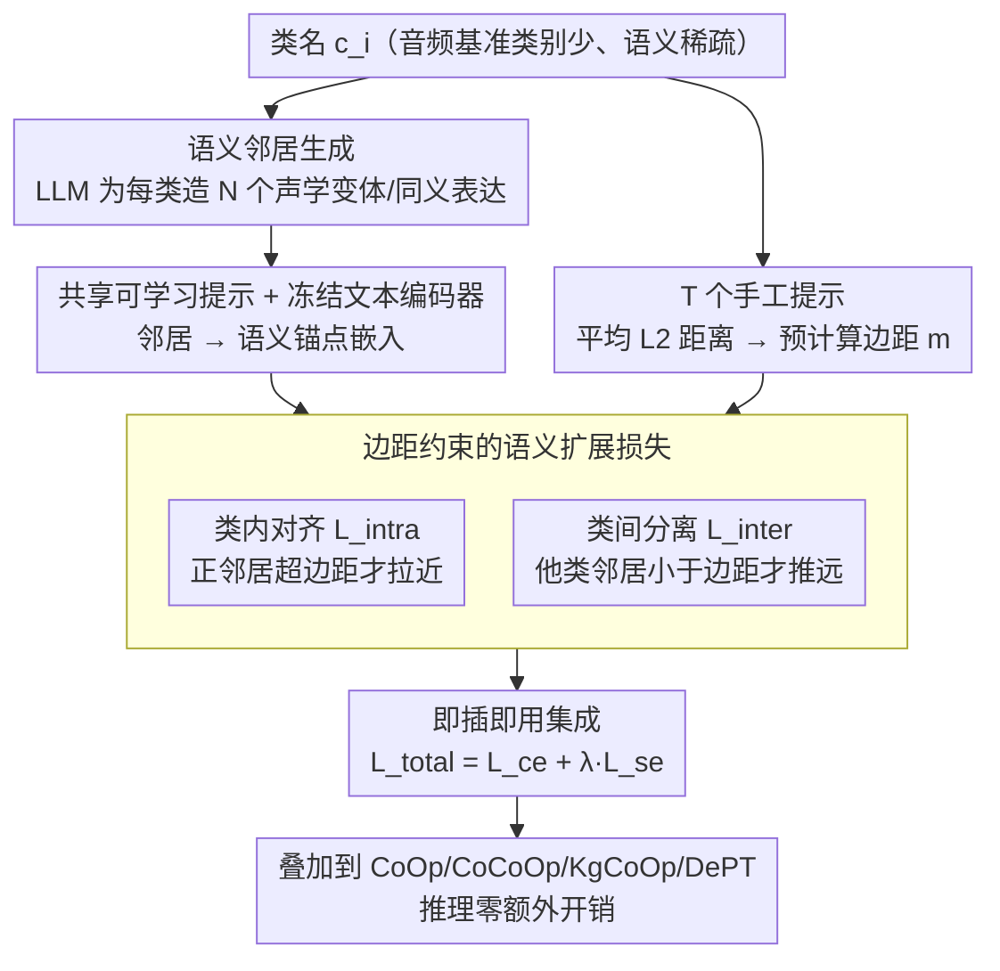

# SEPT: Semantically Expanded Prompt Tuning for Audio-Language Models

**会议**: ACL 2026 Findings  
**arXiv**: [2601.20867](https://arxiv.org/abs/2601.20867)  
**代码**: 无  
**领域**: 音频语音  
**关键词**: 提示调优, 音频语言模型, 语义扩展, Base-New权衡, 泛化性

## 一句话总结

SEPT 通过利用 LLM 生成语义邻居并设计带边距约束的语义扩展损失来正则化提示嵌入空间，显著缓解了音频语言模型（ALM）提示调优中的 Base-New Tradeoff 问题，建立了 ALM 提示泛化的首个系统性评估基准。

## 研究背景与动机

**领域现状**：提示调优在视觉语言模型（VLM）中已取得显著进展，并开始向音频语言模型（ALM，如 CLAP）扩展。CoOp 等方法通过学习连续提示向量替代手工模板，在 seen 类别上显著提升性能。

**现有痛点**：提示调优在 ALM 中严重过拟合于 base（已见）类别，导致对 new（未见）类别的泛化能力大幅下降——即 Base-New Tradeoff（BNT）。这个问题在 ALM 中比 VLM 更严重，因为音频基准通常只有几十个类别（语义稀疏），学习到的提示缺乏足够的语义支撑来维持几何内聚性。

**核心矛盾**：学习到的提示嵌入破坏了预训练文本嵌入空间的语义结构——类别与其语义邻居之间的相似性在提示调优后显著减弱，导致模型无法利用语义关系泛化到未见类别。

**本文目标**：(1) 建立 ALM 提示泛化的首个评估基准；(2) 设计即插即用的框架缓解 BNT。

**切入角度**：用 LLM 为每个类别生成语义邻居（同义词、声学变体），将这些邻居融入提示调优过程，显式正则化嵌入空间使每个类别与其语义邻居形成紧凑簇。

**核心 idea**：通过语义邻居扩展每个类别的语义覆盖范围，用拉近正样本-推远负样本的损失保持嵌入空间的语义结构，从而在提升 base 性能的同时保持对 new 类别的泛化。

## 方法详解

### 整体框架

SEPT 针对的是音频语言模型提示调优的 Base-New Tradeoff：学到的连续提示在 base 类上涨点，却破坏了预训练文本嵌入的语义结构，导致 new 类泛化崩盘。它的破局点是一个即插即用的正则化模块，可以挂到任何提示调优方法上。流程是先用 LLM 为每个类别生成一批语义邻居作为额外锚点，再以手工提示之间的天然距离为参考算出一组边距，训练时在标准交叉熵之外加一项带边距约束的语义扩展损失 $\mathcal{L}_{se}$ 把嵌入空间重新拉回合理的语义几何；推理阶段不引入任何额外开销。

### 关键设计

**1. 语义邻居生成：用 LLM 给稀疏类别空间补锚点**

音频基准通常只有几十个类别，语义空间天然稀疏，学到的提示缺乏足够支撑来维持几何内聚性，这正是 ALM 的 BNT 比 VLM 更严重的根因。SEPT 的做法是让 LLM 为每个类名 $c_i$ 生成 $N$ 个语义相关词汇 $\{p_i^1, \dots, p_i^N\}$，刻意覆盖细粒度的声学变体和自然语言表达，再把这些邻居通过共享的可学习提示和冻结文本编码器映射成嵌入。这些邻居等于在稀疏的类别周围撒下一圈额外的语义锚点，让后续的正则化有足够的支点把每个类别约束成一个紧凑簇。

**2. 边距约束的语义扩展损失：拉近推远但不破坏天然语义层次**

有了邻居还不够，朴素地拉近正样本、推远负样本会过度压缩或过度分离，反而抹平了"铃"和"钟"应该近、"爆炸"和"鸟鸣"应该远这种自然语义层次。SEPT 把损失拆成两个带边距的组件：类内对齐损失 $\mathcal{L}_{\text{intra}}$ 只在类别嵌入 $\mathbf{z}_i$ 与其正邻居 $\mathbf{p}_i^n$ 的距离超过预计算边距 $m_{i,i,n}$ 时才施加拉力；类间分离损失 $\mathcal{L}_{\text{inter}}$ 只在类别嵌入与他类邻居的距离小于预计算边距 $m_{i,j,n}$ 时才施加推力。两个边距都由 $T$ 个手工提示的平均 L2 距离算得，相当于把"预训练空间里本该保持的天然距离"当成护栏——消融显示去掉边距约束后性能明显下降，正说明这层护栏是防止过度压缩的关键。

**3. 即插即用集成：以正交正则项形式叠加到任意基线**

SEPT 不绑定任何特定方法，而是把自己设计成一个通用正则项：总损失写成 $\mathcal{L}_{\text{total}} = \mathcal{L}_{\text{ce}} + \lambda \cdot \mathcal{L}_{\text{se}}$，$\lambda$ 平衡两项权重。因为它只在嵌入空间几何上加约束、不改动主干推理路径，所以能直接叠加到 CoOp、CoCoOp、KgCoOp、DePT 等方法之上而不影响推理效率。实验里它对每个基线都能涨 new 类、几乎不掉 base 类，尤其让本就强调正则化的 KgCoOp 受益最大，说明它和已有正则化是互补而非冲突的。

### 损失函数 / 训练策略

标准交叉熵 + 语义扩展损失（类内对齐 + 类间分离，均为 hinge 损失形式）。文本和音频编码器冻结，仅优化提示向量。

## 实验关键数据

### 主实验

**11 个音频数据集平均（Base-to-New 泛化）**

| 方法 | Base | New | H (调和均值) |
|------|------|-----|-------------|
| CoOp | 65.00 | 34.09 | 42.83 |
| **CoOp + SEPT** | 64.36 | **42.98** | **49.70** |
| CoCoOp | 69.13 | 36.83 | 46.26 |
| **CoCoOp + SEPT** | 68.63 | **42.59** | **50.65** |
| KgCoOp | 37.99 | 37.42 | 36.39 |
| **KgCoOp + SEPT** | **58.92** | **45.28** | **49.79** |

### 消融实验

| 配置 | Base | New | H | 说明 |
|------|------|-----|---|------|
| CoOp + SEPT (完整) | 64.36 | 42.98 | 49.70 | 最优 |
| 仅 $\mathcal{L}_{\text{intra}}$ | — | — | 下降 | 缺少类间分离 |
| 仅 $\mathcal{L}_{\text{inter}}$ | — | — | 下降 | 缺少类内紧凑 |
| 无边距约束 | — | — | 下降 | 过度压缩/分离 |

### 关键发现

- SEPT 在 New 类别上的提升最为显著（CoOp: 34.09→42.98, +8.89%），同时 Base 仅微降（65.00→64.36）
- KgCoOp 受益最大（H: 36.39→49.79, +13.4%），说明 SEPT 与已有正则化方法互补
- SEPT 是首个在 ALM 中系统评估 base-to-new 泛化和跨数据集迁移的工作
- 边距约束对防止正样本过度压缩至关重要——没有边距时性能下降

## 亮点与洞察

- 发现 BNT 在 ALM 中比 VLM 更严重的原因是"语义稀疏性"——这个分析清晰且有说服力，为解决方案提供了直接指导
- 边距约束的设计很精妙——用手工提示的距离作为"应该保持的自然距离"参考，既简单又有效
- 即插即用设计使其可以直接增强多种现有方法，实用性强

## 局限与展望

- 语义邻居的质量依赖 LLM，对于专业领域（如医学音频）可能需要领域知识
- 仅在音频分类任务上验证，音频检索、音频描述等任务未覆盖
- 边距计算需要 $T$ 个手工提示，增加了预处理步骤
- 未探索视觉-语言模型中同样适用性的可能

## 相关工作与启发

- **vs CoOp/CoCoOp**: SEPT 是正交的正则化，可直接叠加使用
- **vs KgCoOp**: KgCoOp 用欧氏距离正则化到手工提示，SEPT 用语义邻居正则化到语义结构，方法不同但互补

## 评分

- 新颖性: ⭐⭐⭐⭐ 语义扩展的思路在 VLM 中有类似工作，但在 ALM 中首次系统性应用和评估
- 实验充分度: ⭐⭐⭐⭐⭐ 11 个数据集、四种基线方法、完整消融、base-to-new + 跨数据集
- 写作质量: ⭐⭐⭐⭐ 动机和方法阐述清晰
- 价值: ⭐⭐⭐⭐ 为 ALM 提示泛化建立了基准并提供了有效解决方案

<!-- RELATED:START -->

## 相关论文

- [\[ACL 2026\] Temporal Contrastive Decoding: A Training-Free Method for Large Audio-Language Models](temporal_contrastive_decoding_a_training-free_method_for_large_audio-language_mo.md)
- [\[AAAI 2026\] Listening Between the Frames: Bridging Temporal Gaps in Large Audio-Language Models](../../AAAI2026/audio_speech/listening_between_the_frames_bridging_temporal_gaps_in_large_audio-language_mode.md)
- [\[ICML 2026\] Sparse Tokens Suffice: Jailbreaking Audio Language Models via Token-Aware Gradient Optimization](../../ICML2026/audio_speech/sparse_tokens_suffice_jailbreaking_audio_language_models_via_token-aware_gradien.md)
- [\[NeurIPS 2025\] Brain-tuning Improves Generalizability and Efficiency of Brain Alignment in Speech Models](../../NeurIPS2025/audio_speech/brain-tuning_improves_generalizability_and_efficiency_of_brain_alignment_in_spee.md)
- [\[ACL 2026\] Mind the Pause: Disfluency-Aware Objective Tuning for Multilingual Speech Correction with LLMs](mind_the_pause_disfluency-aware_objective_tuning_for_multilingual_speech_correct.md)

<!-- RELATED:END -->
