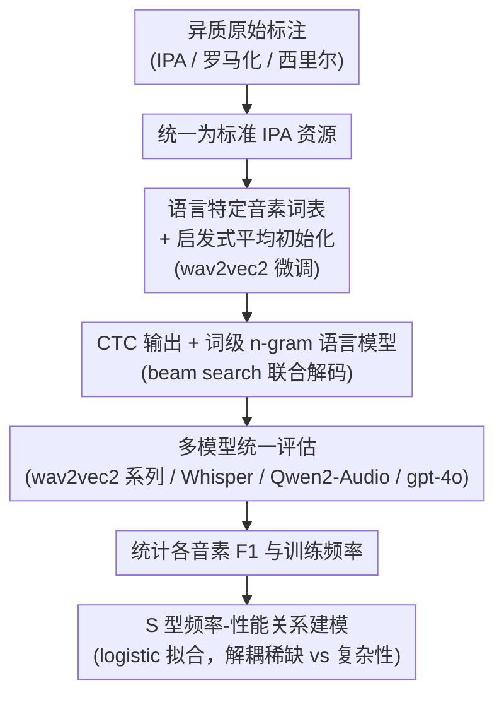

# Hard to Be Heard: Phoneme-Level ASR Analysis of Phonologically Complex, Low-Resource Endangered Languages

**会议**: ACL 2026 Findings  
**arXiv**: [2604.18204](https://arxiv.org/abs/2604.18204)  
**代码**: [GitHub](https://github.com/mahesh-ak/north_caucasian_asr) | [数据](https://huggingface.co/datasets/mahesh27/archi_rutul_asr)  
**领域**: 语音识别 / 低资源濒危语言  
**关键词**: ASR, 低资源, 濒危语言, 音素级分析, 东高加索语, wav2vec2, Whisper, 频率效应

## 一句话总结

本文对两种音系极端复杂的低资源濒危东高加索语言（Archi和Rutul）进行音素级ASR分析，发现音素识别准确率与训练频率呈S型学习曲线关系，许多归因于音系复杂性的错误实际上更多源于数据稀缺。

## 研究背景与动机

**领域现状**: ASR研究主要集中于高资源语言，且在词级和字符级进行评估。对于类型学上极端的语言，缺乏系统的ASR基准和音素级行为分析。Archi拥有16个元音和73-81个辅音音素（非click语言中最大辅音库存之一），Rutul也具有大辅音库存和特殊发音。

**现有痛点**: (1) Archi和Rutul没有已建立的ASR基准或标准化资源；(2) 现有ASR研究很少在音素级别分析行为，尤其对音系复杂语言；(3) 原始标注异质混合IPA、罗马化和西里尔文字，无法直接用于训练；(4) 不清楚ASR错误是源于音系复杂性还是数据稀缺。

**核心矛盾**: 当一种语言同时具有"极端音系复杂性"和"极端数据稀缺"时，ASR的失败应归因于哪个因素？如果是复杂性问题，需要更好的模型架构；如果是数据问题，需要更多数据收集。

**本文目标**: 为Archi和Kina Rutul整理标准化ASR资源，系统评估多种SOTA模型，并通过音素级分析揭示错误的真正来源。

**切入角度**: 以音素为分析粒度，建立音素识别性能与训练频率之间的定量函数关系。

**核心idea**: 音素识别F1与训练频率的对数呈S型函数关系——极低频音素近零，达到阈值后急剧上升，高频饱和——数据稀缺是主要瓶颈而非音系复杂性。

## 方法详解

**整体框架**: 本文的流程是一条"先把数据和模型做扎实、再用音素级分析做归因"的串行管线。先把混杂 IPA / 罗马化 / 西里尔的原始标注统一成标准 IPA 资源；在 wav2vec2 上用**语言特定音素词表 + 启发式平均初始化**微调，并在解码端接**词级 n-gram 语言模型**降低词错误率；随后对 wav2vec2 系列、Whisper、Qwen2-Audio、gpt-4o 等一批模型统一评估，统计每个音素的识别 F1 与其训练频率，最后用 **S 型（logistic）函数**拟合"频率—性能"关系，把"数据稀缺"与"音系复杂性"两个因素解耦。前两者是让低资源 ASR 跑得起来的工程贡献，最后一步才是全文的分析内核。

**关键设计**:

**1. 语言特定音素词表与启发式平均初始化（w2v2l-custom-avg）**：标准 tokenizer 会把复合音素拆成子序列（如唇化 kʷ → 'k'、'w'，咽化辅音同理），丢掉音素的完整性，而 Archi / Rutul 的大辅音库存恰恰大量依赖这类复合音素。本文为目标语言定制输出词表，把每个复合音素映射成单一 token；新 token 的输出层参数不从头随机学，而是对其组成 IPA 符号的预训练参数取平均来初始化：$W_{*i} = \frac{1}{k}\sum_j W_{*i_j}^{old}$、$b_i = \frac{1}{k}\sum_j b_{i_j}^{old}$。这相当于给新音素一个由已知子符号"拼"出来的有意义起点，在几十分钟数据下也能快速收敛，甚至直接用于零样本评估——消融显示平均初始化把 Archi 零样本 CER 从 0.593 降到 0.544，PER 也优于随机和复制（cpy1）初始化。

**2. 词级 n-gram 语言模型增强（w2v2l-custom-avg-lm）**：CTC 声学输出在极低资源下解码空间过于发散，容易拼出不存在的词。本文在 CTC 输出上集成一个词级 3-gram 语言模型（KenLM 实现），用 beam search 联合优化声学得分、长度项与语言模型得分：$\sum_i \log p_{ctc}(x_i) + \beta\, m(X) + \alpha \sum_i \log p_{lm}(w_i\mid w_{i-1},\dots,w_{i-n})$。与以往用字符 / 音素级 n-gram 不同，词级约束在词形高度受限的小语料上能更强地把解码拉回合法词，从而进一步压低 WER。

**3. S 型频率-性能关系建模**：这是全文的分析内核，用来回答"ASR 失败到底怪音系复杂还是怪数据少"。本文把每个音素的识别 F1 对其训练频率的对数作图，发现两者呈 logistic（S 型）关系 $f(x) = \frac{L}{1+\exp(-k(x-x_0))}$：极低频音素几乎识别不出，越过中点 $x_0$ 后 F1 急剧上升，高频处饱和于渐近值 $L$。用 Levenberg–Marquardt 算法拟合参数、$R^2$ 衡量拟合优度、Delta 方法给出 95% 置信区间。逻辑很直接——若频率就能解释绝大部分性能（$R^2$ 高），那音系复杂性就不是主因；个别明显偏离 S 型的点（如 Whisper 在 Archi 上）则提示模型从多语言预训练里学到了超越频率的音韵知识。

## 实验关键数据

**主实验（ASR错误率，越低越好）**:

| 模型 | 参数量 | Archi WER/PER | Rutul WER/PER |
|------|--------|-------------|---------------|
| gpt-4o-transcribe (zero-shot) | - | 0.982/0.436 | 0.994/0.514 |
| wav2vec2-large-ipa | 0.3B | 0.559/0.135 | 0.795/0.220 |
| w2v2l-custom-avg (本文) | 0.3B | 0.479/0.122 | 0.725/**0.195** |
| w2v2l-custom-avg-lm (本文) | 0.3B | **0.465**/0.122 | **0.697**/0.206 |
| w2v2l-custom-cpy1 | 0.3B | 0.462/0.123 | 0.738/0.203 |
| whisper-large-v3 | 1.5B | 0.402/**0.107** | 0.778/0.251 |
| Qwen2-Audio-7B | 8.4B | 0.579/0.180 | 0.778/0.239 |
| Qwen2.5-Omni-7B | 10.8B | 0.705/0.199 | 0.852/0.257 |

**初始化策略对比（PER）**:

| 初始化方式 | Archi | Rutul |
|-----------|-------|-------|
| 随机(custom) | 0.147 | 0.222 |
| 复制(cpy1) | 0.123 | 0.203 |
| 平均(avg, 本文) | **0.122** | **0.195** |

**关键发现**:
- **本文方法可与Whisper媲美**: w2v2l-custom-avg（0.3B参数）在Rutul上PER 0.195优于Whisper（1.5B，PER 0.251），以5倍少的参数获得更好结果
- **gpt-4o零样本完全失败**: WER接近1.0，说明无微调通用模型在极端语言上不可用
- **S型关系稳健**: 大多数模型-语言对中，F1与log训练频率呈强S型关系
- **Whisper的Archi异常**: Whisper在Archi上部分偏离S型，暗示多语言预训练编码了超越频率的音韵知识
- **复杂性相关性弱**: 音素类别F1与复杂度的Pearson相关系数弱（多数在-0.1到-0.5之间），去除频率后相关性进一步减弱
- **平均初始化甚至改善零样本**: CER从0.593降至0.544（Archi），说明初始化本身携带有用的跨语言信息

## 亮点与洞察

- **因果归因的突破**: 通过S型拟合优雅地将"音系复杂性"和"数据稀缺"两种因素解耦——如果性能由频率解释，则复杂性不是主因
- **首个东高加索语言ASR基准**: 为此前无任何ASR资源的两种濒危语言建立了可复现的评估体系
- **平均初始化的简洁有效**: 仅通过对组成符号权重取平均，就为复合音素提供了有效warm-start，无需额外数据
- **实用低资源策略**: 证明0.3B参数的微调模型在45-75分钟数据上可以与1.5B模型竞争

## 局限与展望

- 数据集极小（Archi 45分钟/2名说话人，Rutul 75分钟/~15名说话人），统计功效有限
- Archi数据为朗读语音、Rutul为自发语音，条件差异大
- sigmoid关系是描述性而非理论性的，可能存在其他合理函数形式
- 未探索数据增强或半监督方法
- 未来应扩展到更多东高加索语言和其他音系复杂语言

## 相关工作与启发

- **Taguchi et al. (2023)**: wav2vec2-large-ipa多语言IPA预训练模型，本文的基线
- **Yusuyin et al. (2025)**: 音素初始化策略（复制base音素），本文提出更优的平均初始化
- **Boulianne (2022)**: 分钟级数据+多语言预训练可获得有用音素识别器
- **认知科学频率效应**: logistic函数描述log频率-性能关系在认知模型中也有对应
- **启发**: (1) 低资源ASR的瓶颈在于数据量而非语言复杂性；(2) 语言特定词表+智能初始化是高效微调的关键；(3) 音素级评估比词/字符级更具诊断价值

## 评分

- **新颖性**: ★★★★☆ — 首个针对东高加索语言的系统ASR分析，S型发现有意义
- **实验充分度**: ★★★★☆ — 模型覆盖面广，分析维度丰富，但数据量限制统计可靠性
- **写作质量**: ★★★★☆ — 技术细节扎实，科学严谨
- **价值**: ★★★★☆ — 对濒危语言语音技术和低资源ASR有直接实践指导意义

<!-- RELATED:START -->

## 相关论文

- [\[ACL 2026\] Multimodal In-Context Learning for ASR of Low-Resource Languages](multimodal_in-context_learning_for_asr_of_low-resource_languages.md)
- [\[ACL 2025\] GigaSpeech 2: An Evolving, Large-Scale and Multi-domain ASR Corpus for Low-Resource Languages](../../ACL2025/audio_speech/gigaspeech2_low_resource_asr.md)
- [\[AAAI 2026\] HQ-SVC: Towards High-Quality Zero-Shot Singing Voice Conversion in Low-Resource Scenarios](../../AAAI2026/audio_speech/hq-svc_towards_high-quality_zero-shot_singing_voice_conversion_in_low-resource_s.md)
- [\[ACL 2026\] Semi-Supervised Diseased Detection from Speech Dialogues with Multi-Level Data Modeling](semi-supervised_diseased_detection_from_speech_dialogues_with_multi-level_data_m.md)
- [\[ACL 2026\] Beyond Transcription: Unified Audio Schema for Perception-Aware AudioLLMs](beyond_transcription_unified_audio_schema_for_perception-aware_audiollms.md)

<!-- RELATED:END -->
