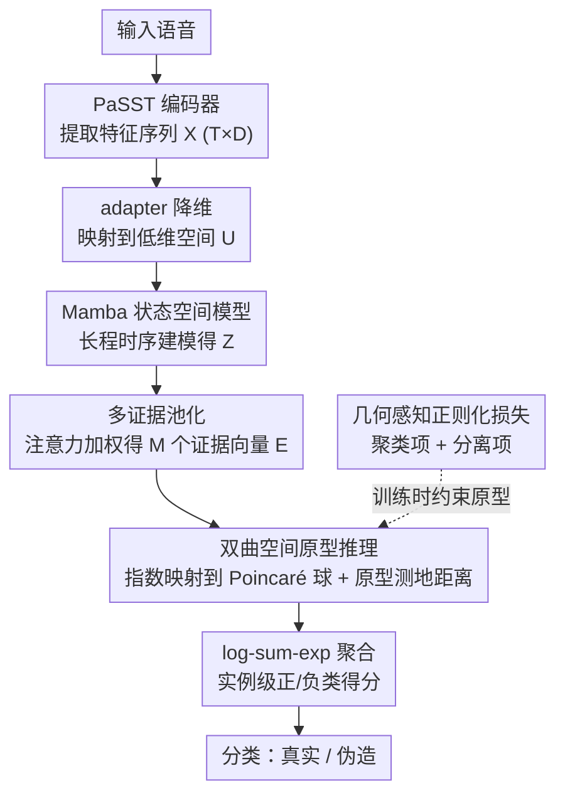

# HCFD: A Benchmark for Audio Deepfake Detection in Healthcare

**会议**: ACL 2026  
**arXiv**: [2604.17642](https://arxiv.org/abs/2604.17642)  
**代码**: [GitHub](https://helixometry.github.io/HCFD/)  
**领域**: 音频语音  
**关键词**: 音频深度伪造检测, 病理语音, 神经音频编解码器, 双曲空间原型, 医疗安全

## 一句话总结

本文提出医疗场景下的编解码器伪造语音检测任务 HCFD，构建了首个包含多种临床病理条件（抑郁、阿尔茨海默、构音障碍）的编解码器伪造语音数据集 HCFK，并提出 PHOENIX-Mamba 框架——通过在双曲空间中建模多模式伪造证据原型，在英文抑郁检测上达到 97.04% 准确率。

## 研究背景与动机

**领域现状**：音频深度伪造检测近年发展迅速，已有 ASVspoof、CodecFake 等基准推动了该领域进步。现有检测器主要在健康人语音上训练和评估，针对神经音频编解码器（NAC）生成的伪造语音已有一定检测能力。

**现有痛点**：(1) 医疗场景中的语音（如远程会诊、电话筛查）面临被编解码器生成的仿造语音替代的真实风险，但现有检测器从未在病理语音上评估过；(2) 病理语音因疾病导致的韵律、发音和发声异常，会系统性地改变语音的声学特征，这些变化可能掩盖或混淆编解码器引入的微妙伪影；(3) 实验证明在健康语音上训练的 AASIST 在病理语音上检测准确率降至接近随机水平（48.62%）。

**核心矛盾**：编解码器伪造检测依赖于捕捉量化和带宽压缩引入的细微伪影，但病理语音的声学变异（语速异常、音质改变、清晰度下降）与这些伪影在频谱特征上高度交叠，使得检测器无法区分"疾病特征"和"伪造痕迹"。

**本文目标**：(1) 构建首个病理感知的编解码器伪造语音数据集 HCFK；(2) 系统评估现有检测器在医疗语音上的失败模式；(3) 设计专门针对病理语音异质性的检测框架。

**切入角度**：作者观察到编解码器伪影在病理语音中可能以多种异质模式出现（不同疾病条件、不同编解码器家族），单一向量表示无法捕捉这种多模态分布。因此需要一种能够保留多个局部证据并建模异质伪造模式的方法。

**核心 idea**：用双曲空间中的多原型聚类来建模编解码器伪造语音的异质模式——保留多个局部证据向量，通过 Poincaré 球上的指数映射和原型距离实现自动模式发现和分类。

## 方法详解

### 整体框架

PHOENIX-Mamba 要解决的核心难题是：病理语音本身的韵律、音质和清晰度异常会在频谱上与编解码器伪影高度交叠，让单向量检测器分不清“疾病特征”和“伪造痕迹”。它的思路是把每段语音拆成多条局部证据、再放到双曲空间里和一组伪造/真实原型比距离，从而容纳异质的伪造模式。整条流程是：输入语音先经预训练编码器（如 PaSST）提取特征序列 $X \in \mathbb{R}^{T \times D}$，由 adapter 映射到低维空间 $U$，Mamba 状态空间模型做长程时序建模得到 $Z$，可学习池化把 $Z$ 压成 $M$ 个证据向量 $E$，再经指数映射嵌入 Poincaré 球，最后用各证据到正/负类原型的测地距离聚合出分类得分。

### 关键设计

**1. 多证据池化（Multi-Evidence Pooling）：把伪造线索拆成多条局部证据**

编解码器伪影在病理语音里分布不均、稀疏出现，若像常规做法那样池化成单一全局向量，就会把关键的局部线索抹平。多证据池化改用可学习的注意力权重对时序特征加权求和，得到 $M$ 个各自关注不同局部区域的证据向量 $e_m = \sum_t a_{m,t} z_t$，权重由可微分的打分机制生成。这样模型能同时保留多个位置上的鉴别性特征，而不必把全部判别压力压在一个表示上。

**2. 双曲空间原型推理（Hyperbolic Prototype Reasoning）：用多原型容纳异质伪造模式**

不同编解码器家族与病理条件会产生异质的伪造模式，欧氏空间里的单一决策边界很难把它们干净分开。为此每个证据向量先经指数映射 $h_m = \text{Exp}_0^c(We_m)$ 投到 Poincaré 球，再与参数化的 $K$ 个正类（伪造）原型和 1 个负类（真实）原型逐一计算测地距离；用带温度的 softmax 得到软分配 $q_{m,k}$，最后经 log-sum-exp 聚合成实例级的正/负类得分。双曲空间体积随半径指数增长，天然适合表达树状层次结构，多原型则让模型自动发现伪造类内部的子模式。

**3. 几何感知正则化损失：让原型既紧凑又分散**

若只用分类损失训练，原型容易坍缩到同一点、退化成单模式解，丢掉多原型的意义。几何感知正则化把总损失写成 $\mathcal{L} = \mathcal{L}_{cls} + \lambda \mathcal{L}_{cluster} + \beta \mathcal{L}_{sep}$：聚类项把证据点拉近其分配到的正类原型、并用熵项控制分配的锐度，分离项则推远不同正类原型之间以及正负原型之间的距离。两者合力既保证每个原型聚拢成紧凑簇，又维持原型间的多样性。

### 一个完整示例

以一段抑郁患者的编解码器伪造语音为例：PaSST 先把波形编成 $T \times D$ 的特征序列，adapter 降维后交给 Mamba 建模整段语音的长程时序依赖；多证据池化的注意力会分别在几处韵律异常、发声不稳的片段上高亮，输出 $M$ 个证据向量。这些向量投到 Poincaré 球后，多数落在某个“伪造”原型附近、少数靠近“真实”原型；log-sum-exp 把这些局部距离聚合起来，只要存在足够强的伪造证据，实例就被判为伪造——即使疾病本身的声学异常也同时存在，多原型距离仍能把伪造痕迹与病理特征区分开。

### 损失函数 / 训练策略

使用 AdamW 优化器训练 20 个 epoch，batch size 32，权重衰减 0.01，梯度裁剪 1.0。上游 PTM 参数冻结，仅训练 adapter、Mamba 骨干和原型参数，可训练参数量为 2M-5M。评估指标包括准确率、宏 F1 和 EER。

## 实验关键数据

### 主实验

| 方法 | 英文-抑郁 Acc | 英文-阿尔茨海默 Acc | 英文-构音障碍 Acc | 中文-抑郁 Acc |
|------|-------------|------------------|-----------------|-------------|
| AASIST (CodecFake训练) | 48.62 | 34.19 | 36.71 | 45.81 |
| AASIST (域内训练) | 60.84 | 52.14 | 56.07 | 58.06 |
| PaSST+CNN | 78.98 | 69.27 | 71.03 | 75.69 |
| **PHOENIX-Mamba (PaSST)** | **97.04** | **96.73** | **96.57** | **94.41** |

### 消融实验

| 配置 | 英文-抑郁 Acc | 英文-阿尔茨海默 Acc | 说明 |
|------|-------------|------------------|------|
| Full PHOENIX-Mamba | 97.04 | 96.73 | 完整模型 |
| CNN Head (无Mamba) | 82.26 | 75.52 | 无时序建模 |
| Single evidence (M=1) | 73.51 | 55.03 | 单证据退化严重 |
| PHOENIX-Euc (欧氏) | 83.62 | 79.48 | 去掉双曲几何 |

### 关键发现

- 从健康语音迁移到病理语音存在巨大的领域偏移，AASIST 在 CodecFake 上训练后在 HCFK 上接近随机猜测
- 多证据池化贡献最大——去掉后（M=1）阿尔茨海默检测从 96.73% 暴跌到 55.03%，说明病理语音中伪造线索的分布极不均匀
- PaSST 作为上游编码器始终优于 WavLM、Wav2vec2 等语音 SSL 模型，可能因为其 patch-based 频谱时间表示更适合捕捉编解码器伪影
- 跨病理条件迁移实验显示，在抑郁+构音障碍上训练后迁移到阿尔茨海默可达 98.53% Acc

## 亮点与洞察

- 将编解码器伪造检测拓展到医疗场景是一个有实际价值的新方向——远程医疗和语音生物认证的普及使得这一威胁越来越真实
- 多证据+双曲原型的组合巧妙地解决了"异质伪造模式"问题——比强行在欧氏空间中用单一分类器好得多
- 跨病理条件的迁移结果令人意外地好（98.53%），暗示编解码器伪影的核心特征可能是病理无关的，这为实际部署提供了希望

## 局限与展望

- 仅涵盖三种临床条件和两种语言，覆盖面有限
- 仅考虑编解码器重合成攻击，未涉及 TTS/VC/扩散模型等其他伪造手段
- 未研究开放集检测和不确定性估计
- HCFK 的构建依赖于现有临床语音数据集的可用性，隐私和伦理约束可能限制扩展

## 相关工作与启发

- **vs CodecFake (Wu et al.)**: CodecFake 在健康语音上构建基准，本文发现其训练的检测器在病理语音上完全失效，证明了领域特定基准的必要性
- **vs AASIST**: AASIST 使用图注意力网络建模频谱-时间关系，但其单向量表示无法处理病理语音的异质性；PHOENIX-Mamba 的多证据+多原型设计针对性解决此问题
- **vs SASTNet**: SASTNet 尝试统一语义和声学表示进行检测，但仍在健康语音评估；本文关注的是病理语音这一更具挑战性的场景

## 评分

- 新颖性: ⭐⭐⭐⭐⭐ 首次系统性研究医疗场景下的编解码器伪造检测，问题定义有前瞻性
- 实验充分度: ⭐⭐⭐⭐ 覆盖三种疾病、两种语言、七种编解码器，消融充分，但模型规模有限
- 写作质量: ⭐⭐⭐⭐ 问题动机清晰，方法描述详细，但论文较长
- 价值: ⭐⭐⭐⭐ 医疗语音安全是重要问题，但实际部署仍需更多验证

<!-- RELATED:START -->

## 相关论文

- [\[ACL 2026\] XLSR-MamBo: Scaling the Hybrid Mamba-Attention Backbone for Audio Deepfake Detection](xlsr-mambo_scaling_the_hybrid_mamba-attention_backbone_for_audio_deepfake_detect.md)
- [\[ACL 2026\] RTCFake: Speech Deepfake Detection in Real-Time Communication](rtcfake_speech_deepfake_detection_in_real-time_communication.md)
- [\[ACL 2026\] Analyzing Reasoning Shifts in Audio Deepfake Detection under Adversarial Attacks: The Reasoning Tax versus Shield Bifurcation](analyzing_reasoning_shifts_in_audio_deepfake_detection_under_adversarial_attacks.md)
- [\[ACL 2026\] MSU-Bench: Musical Score Understanding Benchmark](musical_score_understanding_benchmark_evaluating_large_language_models39_compreh.md)
- [\[NeurIPS 2025\] A Multi-Task Benchmark for Abusive Language Detection in Low-Resource Settings](../../NeurIPS2025/audio_speech/a_multitask_benchmark_for_abusive_language_detection_in_lowr.md)

<!-- RELATED:END -->
