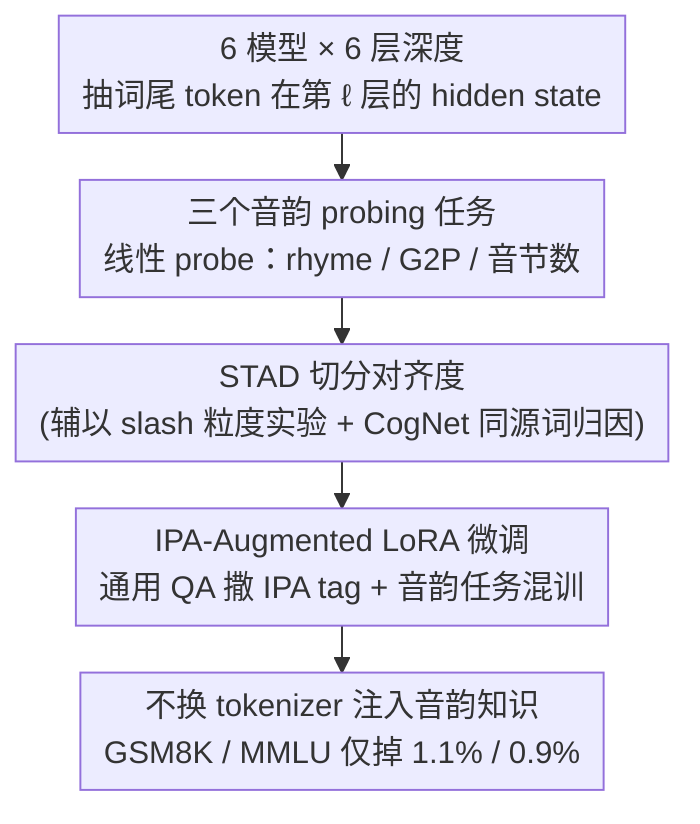

# How Tokenization Limits Phonological Knowledge Representation in Language Models and How to Improve Them

**会议**: ACL 2026  
**arXiv**: [2604.17105](https://arxiv.org/abs/2604.17105)  
**代码**: https://github.com/liaodisen/Tokenization-Phonology (有)  
**领域**: 音频语音 / Tokenization / 表征探测  
**关键词**: subword tokenization, 音韵知识, STAD, IPA 微调, 同源词

## 一句话总结
本文用三个音韵 probing 任务（rhyme / G2P / 音节数）证明 BPE 类 subword tokenization 既"粒度太粗"难以捕捉局部音韵，又"边界错位"难以捕捉韵律结构，并提出 STAD 度量 + IPA-augmented 轻量微调，让 Llama3.1-8B 在三个音韵任务全面提升而 GSM8K / MMLU 只掉 1.1% / 0.9%。

## 研究背景与动机

**领域现状**：纯文本 LLM (如 GPT-4o) 居然有显著的音韵感知能力（写诗、押韵、教语言），但模型从没听过声音，这种能力是怎么从 orthography 中浮现出来的、又被什么因素卡住的，没人系统研究过。

**现有痛点**：Suvarna et al. 2024 用 prompting 测了 PhonologyBench，结论是 LLM 在音韵任务上表现一般，但是 prompting-based 评测会低估模型隐含知识 (Hu & Levy 2023)；同时已有"BPE 不擅长 phoneme"的零散观察，但缺少机制性解释和量化诊断。

**核心矛盾**：subword tokenization 是为提升训练效率设计的 (频率驱动)，与"音节边界 / 音素边界" (语言学驱动) 在原理上就不一致 —— 但具体在 LM 内部哪些任务、哪些层、哪类词受影响最严重，过去只能凭直觉。

**本文目标**：(RQ1) 用 probing 而非 prompting 测 LM hidden state 真实编码了多少音韵知识；(RQ2) tokenization 策略 (粒度 + 边界) 如何影响这种编码；(RQ3) 在不换 tokenizer 的前提下能否注入音韵知识。

**切入角度**：把音韵能力拆成两层 —— **local features**（rhyme / 韵尾匹配）需要细粒度 token，**prosodic structure**（音节 / G2P）需要 token 与 syllable 对齐；用 STAD (syllabification-tokenization alignment distance) 把"对齐程度"量化成单一数字。

**核心 idea**：把"tokenizer 是音韵失败的根因"从直觉变成可测量的诊断指标 (STAD)，再用"IPA 注入 + 通用 QA 混训"的轻量后训练方案绕开 tokenizer 修改的高成本。

## 方法详解

### 整体框架

本文不是提一个新模型，而是回答“subword tokenization 到底卡住了 LM 哪些音韵能力、为什么、怎么补”，因此用三个串联实验把诊断做实。第一步 Probing：把每个词最后一个 token 在第 $\ell$ 层的 hidden state $\boldsymbol{h}_{i\ell}$ 抽出来训练线性 probe，覆盖 6 个模型 × 6 个 depth 比例 × 3 个任务，量出表征里真正编码了多少音韵知识。第二步机制分析：用 slash-delimited input 测粒度效应、用 STAD 分组（A: STAD=0 vs M: STAD>0.25）测边界效应、再用 CogNet 检索同源词数量解释“为什么这些词切得不准”。第三步改进：在 OpenHermes2.5 通用数据与音韵任务的混合集上 LoRA 微调 Llama3.1-8B，回答中插入 IPA 转写，在不换 tokenizer 的前提下补回音韵知识。

### 关键设计

**1. 三个 phonology probing 任务：用线性 probe 替代 prompting 量内部知识**

prompting 评测会低估模型的隐含知识，所以这里改用线性 probe 直接读 hidden state。三个任务分别是：rhyme awareness 用 $\boldsymbol{h}_\ell$ 上的 logistic regression 做二分类，G2P 是把 39 音素 padded 到长度 8 的 regression，syllable count 是对整数标签的 ridge regression。probe 被刻意限制为线性，是为了避免 probe 自己学到音韵知识、混淆对表征质量的判断（Hewitt & Liang 2019）；同时配一组随机 embedding control 实验，确认探到的信号确实来自模型而非任务本身。

**2. STAD（Syllabification-Tokenization Alignment Distance）：把切分对齐度压成一个数**

要验证“边界错位伤害音韵表征”就得先把“对齐度”量化。STAD 把一个 $n+1$ 字符词的所有可能切分位置编成长度 $n$ 的 binary vector $\boldsymbol{v}_{\text{tok}}, \boldsymbol{v}_{\text{syl}}$，二者的 normalized Hamming distance 即 $\text{STAD} = \sum_i |b_i - c_i| / n$。例如 musical 的 syllable vector 是 $[0,1,0,1,0,0]$、Llama 的 tokenization 是 $[0,0,1,0,0,0]$，于是 STAD $= 3/6 = 0.5$。把对齐度变成实数后，就能按 A 组 vs M 组做 paired t-test，直接检验“对齐越差→音韵 probing 越差”的因果链；而且这个度量与具体 tokenizer 无关，可横向比较 BPE / SentencePiece / ByT5。

**3. IPA-Augmented LoRA Fine-tuning：不动 tokenizer 也能注入音韵知识**

基础模型不会为音韵任务重训，换 tokenizer 成本过高，于是改走“后训练打补丁”。具体做法是把 3000 条 OpenHermes2.5 通用 QA 中随机选 0-2 个词用 `<IPA>...</IPA>` tag 包住、并在回答前拼上对应词的 IPA 转写，再混入 200 条 rhyme + 500 条 syllable + 500 条 G2P 任务数据、要求回答里按 IPA 一步步推理；LoRA 只动 $W_Q, W_V$，$r=8, \alpha=16$。把 IPA 当 side information 与原任务交织，既灌入音韵知识又保住 instruction following 分布，加上数据量小、仅用 LoRA，灾难性遗忘几乎可以忽略。

### 损失函数 / 训练策略

Probing 端用 scikit-learn 的 LogisticRegression（C=10, max_iter=1000）与 RidgeCV（alphas ∈ {10,100,500,1000,2000}）。LoRA SFT 用标准 CE loss，2× A40 不到 5 GPU hours。评估上 rhyme/syllable 看准确率，G2P 用 PER（phoneme error rate，Levenshtein 距离除以参考长度）。

## 实验关键数据

### 主实验

| 模型 | Layer 20% Rhyme Acc | Layer 20% G2P $R^2$ | Layer 20% Syllable $R^2$ |
|---|---|---|---|
| BERT (110M) | 67.6 | 0.073 | 0.265 |
| GPT-2 (124M) | 64.7 | 0.188 | 0.624 |
| GPT-neo (2.7B) | 68.6 | 0.147 | 0.662 |
| Mistral-7B-Instruct-v3 | 80.6 | 0.202 | 0.470 |
| Llama3-8B-Instruct | 80.7 | 0.263 | 0.661 |
| Llama3.1-8B-Instruct | **79.8** | **0.330** | **0.713** |
| Random embedding (control) | 48.7 | -0.100 | -0.073 |

| 配置 (Rhyme, Layer 20%) | BERT | GPT-2 | Mistral-7B | Llama3.1-8B |
|---|---|---|---|---|
| 原始 tokenization | 67.6 | 64.7 | 80.6 | 79.8 |
| 加 slash 细粒度 | **74.5*** | **76.9*** | 81.1 | **85.1*** |

### 消融实验

| 配置 | 关键观察 | 说明 |
|---|---|---|
| Slash / Comma / Dot delimiter | 都比 None 提升、彼此差不多 | 提升来自粒度，不来自符号本身 |
| STAD = 0 (A) vs > 0.25 (M) | 大多数模型在 A 组 G2P / syllable R² 显著更高 | 验证 tokenizer-syllable 对齐影响内部表征 |
| BERT 在 STAD 分组上无明显趋势 | 双向注意力可能缓解了切分错位 | autoregressive 架构对 token 边界更敏感 |
| Slash 提升仅在 probing 层显著，rhyme 推理性能不一定提升 | tokenization 改善表征 ≠ 改善 zero-shot 性能 | 说明还需要 fine-tuning 把表征"用起来" |
| Llama3.1-8B-IPA vs Llama3.1-8B-Instruct | GSM8K 69.9 → 68.8 (-1.1)，MMLU 65.3 → 64.4 (-0.9) | 通用能力几乎无损 |

### 关键发现
- **音韵信号主要在 20-60% 层**：prompting 评测会低估这一点，所以应该用 probing 看 latent capability。
- **STAD 是因果性诊断而非纯相关**：在低 STAD 词组（A）上 G2P / syllable $R^2$ 跳到 0.93-0.98，高 STAD 词组（M）跌到 0.5-0.7；这种 30-40 个点的 gap 完全是 tokenizer 切分位置造成的。
- **同源词 / 借词解释了"为什么这些词切得不准"**：CogNet 检索显示 M 组词的跨语言变体数远高于 A 组（例如 musical 在多种语言里有近 30 个变体），原因可能是它们在训练语料里出现的 n-gram 分布与单语词不同，导致 BPE 把它们切到非音节边界。
- **轻量 IPA fine-tuning 在三个任务上都有显著提升**，且仅 0.9-1.1% 通用能力代价 —— 远比"换 tokenizer + 重训"现实。

## 亮点与洞察
- **STAD 这种"一个公式 + 一个 Hamming 距离"的诊断指标真的优雅**：可以直接套到任何新 tokenizer 上做 sanity check，对 tokenizer-syllable 对齐的 design space 有直接指引。
- **CogNet 同源词分析提供了"为什么"**：很多"tokenization 失败"研究停在"BPE 切得怪"，本文给出了一个可证伪的语言学假设 —— 训练语料里有跨语言变体的词，n-gram 分布漂移导致 BPE 切错。
- **IPA-augmented fine-tuning 的 trick**：在通用 QA 数据里"撒胡椒"地插 IPA tag 而不是单独训音韵任务，是避免灾难性遗忘的有效设计，可迁移到任何"我想让 LM 学一个新模态但不想毁掉它"的场景。

## 局限与展望
- **只在英语 / alphabetic language 上做**：日语 / 中文等 logographic 语言情况完全不同，结论是否迁移未知。
- **G2P 用线性 regression 而非 sequence generation**：作者承认这不是最自然的 formulation，但为了让 probe 简单不能用更复杂模型；这可能低估了某些模型的真实 G2P 能力。
- **STAD 假设"自然音节"是唯一的"对的"切分**：但即便人类音节学派也有分歧（onset maximalism vs 其他理论），STAD 的 ground truth 受工具 (syllabify) 偏差影响。
- **Fine-tuning 没在更大模型 (>8B) 上验证**：能否 scale 还要看。

## 相关工作与启发
- **vs Suvarna et al. 2024 (PhonologyBench)**：他们用 prompting 测三个任务给出"模型音韵能力弱"的结论；本文用 probing 反驳——能力在表征里，只是没"用出来"。
- **vs ByT5 / CANINE (Clark et al. 2022, Xue et al. 2022)**：那条线是从架构上替换 tokenizer；本文走"后训练注入"路线，承认大模型已沉没，必须以兼容方式打补丁。
- **vs Singh & Strouse 2024 (numeric tokenization)**：他们发现数字"从右往左"切更好；本文把这种"tokenizer 切错位置 → 任务性能下降"的现象从数学扩展到音韵。

## 评分
- 新颖性: ⭐⭐⭐⭐ STAD 是清晰原创贡献，IPA-augmented fine-tuning 也是新颖的"温和注入"方案
- 实验充分度: ⭐⭐⭐⭐ 6 模型 + 6 layer 深度 + 3 任务 + 多 delimiter 消融 + 8 tokenizer CogNet 分析
- 写作质量: ⭐⭐⭐⭐ "tokenization 影响什么 → 量化它 → 解释它 → 修它"四段论清晰
- 价值: ⭐⭐⭐⭐ STAD 可直接作为 tokenizer design 的 sanity check，IPA-augmented LoRA 也是落地价值高的诀窍

<!-- RELATED:START -->

## 相关论文

- [\[CVPR 2026\] How Far Can We Go With Synthetic Data for Audio-Visual Sound Source Localization?](../../CVPR2026/audio_speech/how_far_can_we_go_with_synthetic_data_for_audio-visual_sound_source_localization.md)
- [\[ACL 2026\] \[b\] = \[d\] − \[t\] + \[p\]: Self-supervised Speech Models Discover Phonological Vector Arithmetic](bd-tp_self-supervised_speech_models_discover_phonological_vector_arithmetic.md)
- [\[ICML 2026\] MoshiRAG: Asynchronous Knowledge Retrieval for Full-Duplex Speech Language Models](../../ICML2026/audio_speech/moshirag_asynchronous_knowledge_retrieval_for_full-duplex_speech_language_models.md)
- [\[ICCV 2025\] How Would It Sound? Material-Controlled Multimodal Acoustic Profile Generation for Objects](../../ICCV2025/audio_speech/how_would_it_sound_material-controlled_multimodal_acoustic_profile_generation_fo.md)
- [\[ACL 2026\] Closing the Modality Reasoning Gap for Speech Large Language Models](closing_the_modality_reasoning_gap_for_speech_large_language_models.md)

<!-- RELATED:END -->
