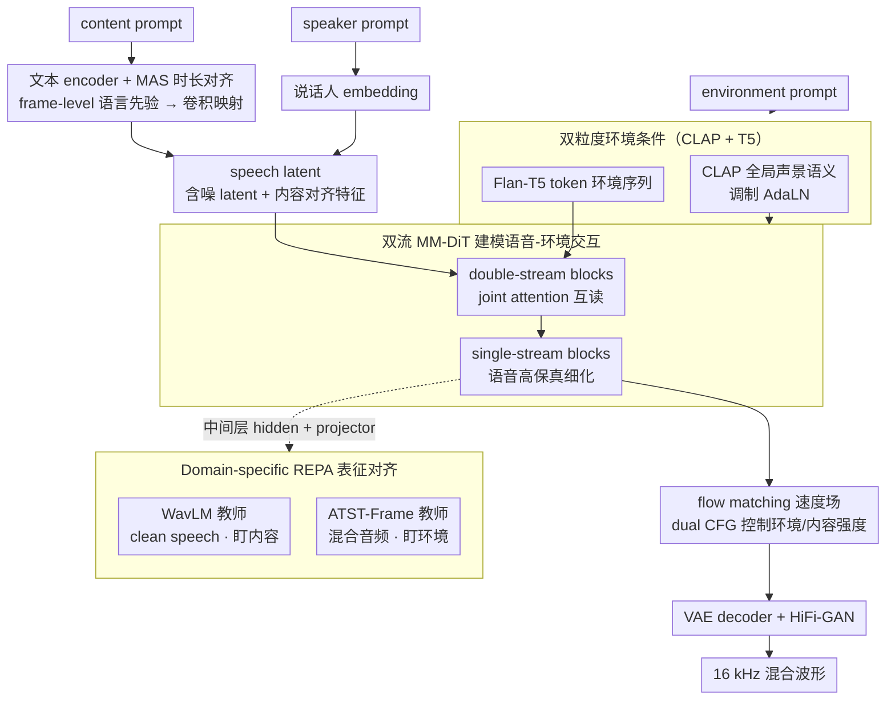

# ImmersiveTTS: Environment-Aware Text-to-Speech with Multimodal Diffusion Transformer and Domain-Specific Representation Alignment

**会议**: ACL2026  
**arXiv**: [2605.30965](https://arxiv.org/abs/2605.30965)  
**代码**: https://jjunak-yun.github.io/ImmersiveTTS  
**领域**: 语音合成 / 环境感知 TTS  
**关键词**: 环境感知语音合成, 多模态扩散 Transformer, flow matching, 表征对齐, 音频生成  

## 一句话总结
ImmersiveTTS 用双流 MM-DiT 同时建模转写内容和环境描述，并用 WavLM 与 ATST-Frame 的双教师表征对齐稳定训练，从而在带背景声的 TTS 中提升语音自然度、可懂度和 speech-environment 融合质量。

## 研究背景与动机
**领域现状**：文本引导音频生成大致分成 TTA 和 TTS 两条线。TTA 擅长生成环境音、音乐和音效，但不擅长精确表达语音内容；TTS 擅长从文本生成清晰语音，但通常把背景声、房间声学或声景当成外部条件，而不是和语音一起生成。

**现有痛点**：环境感知 TTS 需要同时满足两个目标：语音必须可懂、自然、保留说话人特征；背景声又要符合自然语言描述，并且和语音混合得像同一段真实录音。已有 VoiceLDM、VoiceDiT 等方法虽然能用文本描述控制环境，但 speech stream 和 environment stream 的交互仍不充分，容易出现语音内容对了但背景不贴合，或背景贴合但语音被噪声破坏的问题。

**核心矛盾**：语音和环境音的时间结构、频谱模式和语义粒度差异很大。语音侧强调音素、韵律和内容可懂度，环境侧强调全局声景和局部声事件；若用单一条件或单一 SSL teacher 约束，模型往往会偏向其中一端，形成清晰度和环境一致性的 trade-off。

**本文目标**：作者希望构建一个统一模型，直接从 content prompt 和 environment prompt 生成混合音频，同时保持低采样步数、较高语音可懂度、环境语义一致性和自然融合。

**切入角度**：论文把 SD3/Flux 系列中的 multimodal diffusion transformer 思路迁移到语音-环境联合生成：把转写对齐的 speech latent 和文本条件的 environment context 放进两个流，再通过 joint attention 交换信息；同时引入 domain-specific REPA，让不同中间层分别向语音 SSL 和环境音 SSL 表征靠拢。

**核心 idea**：用“双流 MM-DiT + 双教师 REPA”替代简单 prompt conditioning，让语音内容和环境声景在生成过程中显式交互，而不是先分别生成再后处理混合。

## 方法详解
ImmersiveTTS 的输入包含三类信息：content prompt，即要说的话；environment prompt，即背景声或场景描述；以及 speaker prompt，用于抽取说话人 embedding。输出是一段 16 kHz waveform，其中语音和环境音同时存在。模型整体上是 latent flow matching 框架：先把目标音频压缩成 AudioLDM2 VAE latent，在 latent 空间学习从高斯噪声到目标音频的速度场，最后再由 VAE decoder 和 HiFi-GAN vocoder 还原 waveform。

### 整体框架
训练时，LibriTTS clean speech 与 WavCaps 非语音环境声按 2 到 10 dB 的 SNR 混合，构成 environment-aware TTS 训练样本；另有 0.15 概率保留 clean speech，以免模型丢掉纯语音能力。环境描述一方面经 CLAP 得到全局声学语义，用来调制 AdaLN；另一方面经 Flan-T5-Large 得到 token-level 环境文本序列，进入环境流。

语音侧先由文本 encoder 和 MAS duration alignment 得到 frame-level linguistic prior，再通过卷积网络映射到 VAE latent 兼容的表示，并与 noisy latent 拼接。双流 MM-DiT 的 double-stream blocks 让环境 token 与语音 latent 通过 joint attention 互相读取；后续 single-stream blocks 只保留 speech stream 做高保真细化。最终模型用 flow matching 预测速度场，并用 dual classifier-free guidance 在推理时分别调节环境条件和内容条件的强度。

### 关键设计
**1. 双流 MM-DiT 建模语音-环境交互：把语音和环境放进两个并行流，让它们在生成过程中显式耦合**

环境感知 TTS 不是“先生成语音、再叠背景”的问题——背景声本身会影响可懂度、声场感和整体自然度，VoiceLDM、VoiceDiT 这类把环境当外部条件的方法因此常出现语音对了背景不贴、或背景贴了语音被噪声破坏的情况。ImmersiveTTS 把 transcript-aligned 的 speech latent 和 text-conditioned 的 environment context 分别送进两个流：环境流接收 Flan-T5 token embeddings，语音流接收 noisy audio latent 与内容对齐特征。double-stream DiT blocks 里用 joint attention 让环境 token 与语音 latent 互相读取，随后的 single-stream blocks 只保留 speech stream 对环境适配后的语音表示做高保真细化。双流结构既保留了两种模态在时间结构、频谱模式和语义粒度上的差异，又给了它们一个对齐的通道。

**2. CLAP + T5 的双粒度环境条件：同时给模型全局声景语义和局部声学线索**

只用 CLAP 容易得到粗粒度的场景标签，只用文本 token 又缺少稳定的全局声学约束，模型会偏向其中一端。ImmersiveTTS 把环境描述同时走两条路：CLAP embedding 经 MLP 后与 timestep embedding 结合，用于 AdaLN 的 scale/shift 调制，提供全局声学语义；Flan-T5 token embeddings 则作为环境上下文序列进入环境流，让语音流在注意力中挑出具体的声学线索。两种粒度合起来，才更适合生成“语音嵌进某个声景”而非“语音旁边响着背景”的结果。

**3. Domain-specific REPA 表征对齐：用两个互补的 SSL teacher 分别管住语音可懂度和环境一致性**

单一 SSL teacher 很难同时解释语音和环境两个域，约束偏哪边另一边就掉。作者从 speech stream 的中间层取 hidden features，经 MLP projector 映射后，分别去对齐两个 frozen teacher 的表征并计算 cosine alignment loss：WavLM 作用在混合前的 clean speech 上、盯语音内容，ATST-Frame 作用在混合音频上、盯环境事件。整体训练目标可写成 $\mathcal{L}=\mathcal{L}_{Prior}+\mathcal{L}_{Dur}+\mathcal{L}_{Flow}+\mathcal{L}_{REPA}$。两个 teacher 按域拆开 supervision，缓解了清晰度和环境一致性之间的 trade-off。

### 损失函数 / 训练策略
训练目标由四部分组成：MAS prior loss 和 duration loss 训练文本 encoder 与时长预测器，flow matching loss 训练 latent velocity field，REPA loss 对齐中间表示。所有 loss weight 在实验中设为 1。模型训练 400k steps，使用 2 张 NVIDIA RTX A6000，AdamW 学习率 $1\times 10^{-4}$，batch size 为每 GPU 8。模型含 12 个 double-stream blocks、18 个 single-stream blocks、6 个 attention heads、hidden size 1024，约 450M trainable parameters。

推理时从 $Z_0\sim\mathcal{N}(0,I)$ 采样，通过 Euler solver 解 flow ODE。dual CFG 独立控制 environment guidance 与 content guidance；主实验中使用 $\omega_{env}=3, \omega_{cont}=3$，采样步数为 25 NFEs。

## 实验关键数据

### 主实验
| 测试集 | 模型 | NFEs | SN-MOS↑ | EC-MOS↑ | ON-MOS↑ | WER↓ | FAD↓ | CLAP↑ |
|--------|------|------|---------|---------|---------|------|------|-------|
| AudioCaps | VoiceLDM | 200 | 3.41 ± 0.06 | 3.33 ± 0.07 | 2.55 ± 0.05 | 16.45 | 8.75 | 0.229 |
| AudioCaps | VoiceDiT | 200 | 3.47 ± 0.05 | 3.44 ± 0.07 | 2.63 ± 0.05 | 11.68 | 9.07 | 0.263 |
| AudioCaps | ImmersiveTTS | 25 | 4.20 ± 0.07 | 3.48 ± 0.07 | 3.47 ± 0.05 | 8.06 | 5.80 | 0.308 |
| Seed-TTS + AudioCaps | VoiceLDM | 200 | 3.32 ± 0.06 | 3.24 ± 0.07 | 2.91 ± 0.08 | 11.20 | 6.98 | 0.118 |
| Seed-TTS + AudioCaps | VoiceDiT | 200 | 3.45 ± 0.06 | 3.38 ± 0.06 | 3.12 ± 0.08 | 7.08 | 5.37 | 0.134 |
| Seed-TTS + AudioCaps | ImmersiveTTS | 25 | 4.18 ± 0.07 | 3.32 ± 0.06 | 3.23 ± 0.08 | 4.48 | 3.92 | 0.207 |

主结果显示，ImmersiveTTS 在 AudioCaps 上同时取得最低 WER、最低 FAD 和最高 CLAP，并且用 25 个采样步超过 200 步扩散基线。在增强测试集上，VoiceDiT 的 EC-MOS 略高，但 ImmersiveTTS 的 SN-MOS、ON-MOS、WER、FAD 和 CLAP 更好，说明它更偏向整体自然度和可懂度。

### 消融实验
| 对齐策略 | Teacher | 语音域 | 环境域 | WER↓ | FAD↓ | CLAP↑ |
|----------|---------|--------|--------|------|------|-------|
| Base | 无 | - | - | 11.21 | 9.64 | 0.236 |
| Single | WavLM | ✓ | - | 10.97 | 8.02 | 0.231 |
| Single | ATST | - | ✓ | 13.77 | 8.78 | 0.271 |
| Single | USAD | ✓ | ✓ | 9.04 | 7.93 | 0.239 |
| Dual | WavLM + USAD | ✓ | ✓ | 8.95 | 7.33 | 0.248 |
| Dual | USAD + ATST | ✓ | ✓ | 8.94 | 8.20 | 0.266 |
| Dual | WavLM + ATST | ✓ | ✓ | 8.06 | 5.80 | 0.308 |

### 关键发现
- WavLM 单教师主要改善语音内容，ATST 单教师主要改善环境语义，但单独使用会牺牲另一端；WavLM + ATST 的双教师组合在 WER、FAD、CLAP 上同时最优。
- 采样步数分析显示，从极少步增加到中等步数时收益最大；论文指出 9 steps 已能在 WER、FAD、CLAP 上超过使用 200 NFEs 的 VoiceLDM 和 VoiceDiT。
- Speaker similarity 附录中，ImmersiveTTS 的 S-MOS 为 3.15 ± 0.06，匹配 VoiceDiT，并接近 reconstructed samples 的 3.18 ± 0.05。

## 亮点与洞察
- 这篇论文把“环境感知 TTS”明确建模为跨模态联合生成问题，而不是 TTS 与 TTA 的后处理混合。这个定义更贴近真实场景，因为语音清晰度、背景声强度和整体沉浸感本来就是相互制约的。
- 双教师 REPA 是很实用的设计：WavLM 和 ATST-Frame 并不是简单堆 teacher，而是按语音域与环境域拆开 supervision signal。这种“domain-specific teacher”思路可以迁移到视频配音、语音增强、音乐人声混合等多源音频生成任务。
- 实验里最有说服力的是质量和效率同时提升。25 NFEs 达到或超过 200 NFEs baselines，说明 flow matching + MM-DiT 对部署友好，而不只是离线生成指标好看。

## 局限与展望
- 作者承认训练主要依赖合成混合数据，speech-environment 的真实世界相互作用仍可能不足，例如混响、遮蔽、空间位置和动态声源变化。
- 当前对不同 SNR、场景难度、背景声复杂度的鲁棒性探索还不充分；主表能证明平均效果，但还不能说明模型在极端噪声或高混响环境下是否稳定。
- 模型保留说话人身份和语音内容，但缺少对副语言属性的显式控制，例如情绪、说话风格、韵律和表达强度。未来可以把 prosody/style/emotion prompt 纳入第三条控制流，或设计更细粒度的 CFG。
- 风险层面，环境感知 TTS 与普通语音合成一样可能被滥用于未授权声音合成或欺骗性音频，发布时需要水印、检测和使用规范。

## 相关工作与启发
- **vs VoiceLDM**: VoiceLDM 基于 AudioLDM，用内容 prompt 与环境 prompt 条件化 U-Net；本文换成双流 MM-DiT，并加入 domain-specific REPA，在主实验中 WER 从 16.45 降到 8.06，CLAP 从 0.229 升到 0.308。
- **vs VoiceDiT**: VoiceDiT 用 DiT 与 AdaLN 做环境条件控制，但跨模态交互仍较弱；ImmersiveTTS 用 joint attention 让环境 token 与语音 latent 在中间层交互，并用更少 NFEs 获得更高 ON-MOS。
- **vs 单任务 TTS/TTA pipeline**: 附录显示 CosyVoice2 + TangoFlux 这类分开生成再混合的 pipeline 在部分客观指标上很强，但它没有直接建模 speech-background interaction。本文的启发是，统一模型的价值不只在指标，而在可学习真实混合过程中的互相影响。

## 评分
- 新颖性: ⭐⭐⭐⭐☆ 将 MM-DiT、flow matching 和 domain-specific REPA 组合到环境感知 TTS，问题定义和双教师对齐比较有辨识度。
- 实验充分度: ⭐⭐⭐⭐☆ 主实验、单任务、对齐策略、采样步数、CFG scale、speaker similarity 和更广 baseline 都覆盖到了，但真实录音场景与困难子集仍不足。
- 写作质量: ⭐⭐⭐⭐☆ 方法链条清楚，表格也能直接支撑结论；个别公式从 PDF/HTML 转文本后可读性一般。
- 价值: ⭐⭐⭐⭐☆ 对沉浸式语音、游戏/NPC、无障碍内容和多媒体生成都有直接价值，且 25-step 推理具备一定实用性。

<!-- RELATED:START -->

## 相关论文

- [\[CVPR 2026\] SAVE: Speech-Aware Video Representation Learning for Video-Text Retrieval](../../CVPR2026/audio_speech/save_speech-aware_video_representation_learning_for_video-text_retrieval.md)
- [\[ICLR 2026\] Latent Speech-Text Transformer](../../ICLR2026/audio_speech/latent_speech_text_transformer.md)
- [\[CVPR 2026\] Hear What You See: Video-to-Audio Generation with Diffusion Transformer and Semantic-Temporal Alignment-Ranked Direct Preference Optimization](../../CVPR2026/audio_speech/hear_what_you_see_video-to-audio_generation_with_diffusion_transformer_and_seman.md)
- [\[ACL 2026\] FC-TTS: Style and Timbre Control in Zero-Shot Text-to-Speech with Disentangled Speech Representations](fc-tts_style_and_timbre_control_in_zero-shot_text-to-speech_with_disentangled_sp.md)
- [\[ICML 2026\] Towards Streaming Synchronized Spatial Audio Generation via Autoregressive Diffusion Transformer](../../ICML2026/audio_speech/towards_streaming_synchronized_spatial_audio_generation_via_autoregressive_diffu.md)

<!-- RELATED:END -->
