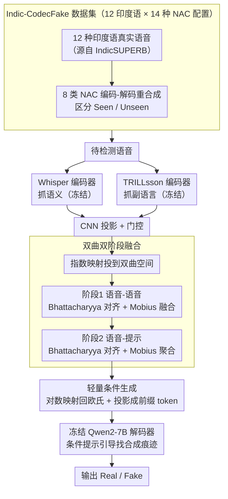

# Indic-CodecFake meets SATYAM: Towards Detecting Neural Audio Codec Synthesized Speech Deepfakes in Indic Languages

**会议**: ACL 2026  
**arXiv**: [2604.19949](https://arxiv.org/abs/2604.19949)  
**代码**: [https://helixometry.github.io/IndicFake/](https://helixometry.github.io/IndicFake/)  
**领域**: AI安全 / 语音安全  
**关键词**: 语音深伪检测, 神经音频编解码器, 印度语言, 双曲ALM, CodecFake

## 一句话总结
本文构建了首个多印度语言的 CodecFake 检测基准 ICF，并提出 SATYAM——一个双曲音频大语言模型，通过在双曲空间中用 Bhattacharyya 距离对齐语义和副语言表示再与提示对齐，仅训练 3.75M 参数即达到 98.32% 的检测准确率。

## 研究背景与动机

**领域现状**：语音深伪技术快速发展，由神经音频编解码器 (NAC) 驱动的音频大语言模型 (ALM) 产生的新型合成语音——CodecFake (CF)——已成为新的威胁。已有研究如 ASVspoof 系列推动了合成语音检测的进展，近年来预训练模型 (WavLM, Whisper 等) 和 ALM 也被用于检测。

**现有痛点**：现有 CF 检测数据集几乎全部聚焦英语（至多包含中文），对印度语言群体的脆弱性探索几乎为空白。实验证明，在英语数据上训练的 SOTA CF 检测器在印度语言上严重失败（AASIST 准确率从 94% 降到 48%）。SOTA ALM 的零样本评估在 ICF 上也表现极差（准确率仅约 13%）。

**核心矛盾**：印度是全球人口最多的国家，拥有极其丰富的语言多样性（印欧语系、达罗毗荼语系、南亚语系等），AI 语音诈骗风险极高，但缺乏针对性的 CF 检测数据集和模型。语音的音素多样性和韵律变化性使得英语中心的检测器难以泛化。

**本文目标**：（1）构建首个大规模多印度语言 CF 数据集；（2）系统评估 SOTA 检测器和 ALM 的泛化能力；（3）提出针对性的检测模型。

**切入角度**：作者观察到语义和副语言特征可能存在层级结构（从粗粒度语义到细粒度韵律），而双曲空间天然适合建模这种层级关系。同时，Bhattacharyya 距离已被证明在语音表示对齐中有效。

**核心 idea**：构建 ICF 数据集填补数据空白；提出 SATYAM，在双曲空间中用 Bhattacharyya 距离进行两阶段融合——先对齐语义 (Whisper) 和副语言 (TRILLsson) 表示，再与输入条件提示对齐——利用 Qwen2-7B 作为解码器生成检测决策。

## 方法详解

### 整体框架
SATYAM 把 CodecFake 检测当成一个条件生成问题来解：与其训练一个分类头，不如让一个冻结的大语言模型直接说出 "Real" 还是 "Fake"。一段待检测语音先被两个冻结编码器并行编码——Whisper 抓语义、TRILLsson 抓副语言（音色、韵律、合成痕迹），两路特征经 CNN 投影和门控后被送进双曲空间做两阶段对齐融合，最后映射回欧氏空间、作为前缀条件 token 注入 Qwen2-7B 解码器输出判别结果。全程只有投影、门控和双曲对齐模块参与训练，可训练参数仅约 3.75M。

### 关键设计

**1. Indic-CodecFake (ICF)：把检测基准从英语扩到 12 种印度语言**

已有 CF 数据集几乎只覆盖英语和中文，完全照顾不到印度语言丰富的音素和韵律——直接后果就是英语上 94% 的 AASIST 一到印度语就掉到 48%。ICF 以 IndicSUPERB 的 12 种印度语真实语音为源，用 8 类共 14 种配置的神经音频编解码器（DAC、Encodec、SoundStream、SpeechTokenizer、FunCodec、AudioDec、SNAC、MIMI）做编码-解码重合成，生成伪造样本。数据集保留原始 train/valid/test 划分，并刻意区分 Seen（训练和测试用同一组 NAC）与 Unseen（测试用训练时未见过的 NAC）两种设置，逼着检测器学的是跨编解码器的通用伪造特征，而不是死记某个 codec 的指纹。

**2. 双曲双阶段融合：在层级几何里对齐语音与提示**

语义线索（说了什么）和副语言线索（怎么说的）天然存在从粗到细的层级关系，语音与文本提示之间也是如此，而双曲空间正适合无失真地嵌入这种层级结构。两路特征先经指数映射 $\exp_0^c(u) = \tanh(\sqrt{c}\|u\|)\,\frac{u}{\sqrt{c}\|u\|}$ 投到曲率为 $-c$ 的双曲空间。第一阶段（语音-语音）最小化双曲 Bhattacharyya 距离 $\mathcal{L}_{S\text{-}S} = D_B(h_w, h_t)$ 把 Whisper 与 TRILLsson 表示拉齐，再用 Mobius 加法 $h_f = h_w \oplus_c h_t$ 融合成统一语音表示。第二阶段（语音-提示）同样用 BD 对齐 $\mathcal{L}_{S\text{-}T} = D_B(h_f, h_A)$ 把语音表示与条件提示表示对齐后再做一次 Mobius 聚合。之所以选 Bhattacharyya 距离而非常见的余弦或欧氏距离，是因为它度量的是两个分布的重叠度，对语音表示对齐已被验证有效；消融里双曲 BD 完整两阶段显著优于任何单阶段或欧氏替代，说明几何选择和双阶段缺一不可。

**3. 轻量条件生成：冻住编码器和 LLM，只调融合模块**

融合后的双曲表示经对数映射回欧氏空间，过一层投影变成前缀条件 token 喂给冻结的 Qwen2-7B。模型用两个提示驱动：一个条件提示（"Analyze the speech for unnatural artifacts"）把解码器的注意力引向合成痕迹，一个决策提示让它最终吐出 "Real" 或 "Fake"。把编码器和 LLM 都冻死、只训 CNN、投影和双曲对齐三个小模块，是因为先前研究指出 ALM 的性能瓶颈在音频编码器一侧而非 LLM 规模——所以作者把算力全押在更好的编码器融合策略上，最终用 3.75M 参数就反超了全参数微调方法。

### 损失函数 / 训练策略
总损失把两阶段对齐和语言建模拼到一起：$\mathcal{L} = \lambda_1 \mathcal{L}_{S\text{-}S} + \lambda_2 \mathcal{L}_{S\text{-}T} + \lambda_3 \mathcal{L}_{LM}$，权重取 $\lambda_1=1,\ \lambda_2=0.5,\ \lambda_3=1$。优化用 AdamW，学习率 $1 \times 10^{-4}$，batch size 32，训练 5 个 epoch。

## 实验关键数据

### 主实验

| 方法 | ICF Acc% | ICF EER% | CodecFake Acc% | CodecFake EER% |
|------|---------|---------|---------------|---------------|
| AASIST | 90.60 | 12.47 | 94.21 | 10.13 |
| MiO | 92.80 | 9.04 | 95.11 | 6.49 |
| Fine-tune Qwen2-audio | 93.19 | 8.34 | 95.55 | 5.60 |
| **SATYAM** | **98.32** | **3.27** | **99.11** | **1.94** |
| SATYAM (Qwen2-1.8B) | 97.14 | 4.53 | 98.32 | 2.11 |

### 消融实验

| 配置 | ICF Acc% | ICF EER% |
|------|---------|---------|
| W + Qwen2-7B (仅Whisper) | 92.98 | 8.61 |
| T + Qwen2-7B (仅TRILLsson) | 93.21 | 8.09 |
| W+T 拼接 (欧氏) | 93.28 | 7.94 |
| W+T Mobius加法 (双曲) | 94.01 | 7.02 |
| W+T 欧氏BD | 94.93 | 5.39 |
| W+T 双曲BD仅语音-提示 | 95.78 | 5.14 |
| W+T 双曲BD仅语音-语音 | 96.11 | 5.02 |
| **SATYAM (完整)** | **98.32** | **3.27** |

### 关键发现
- 在英语 CodecFake 数据上训练的 AASIST 在 ICF 上准确率从 94% 降到 48%，证实了跨语言泛化的严重问题
- SOTA ALM 零样本检测准确率仅约 13%，说明当前 ALM 对 CF 的检测能力极其有限
- TRILLsson 单编码器比 Whisper 略好，反映了深伪检测的主要线索是副语言特征
- 双曲 BD 的完整两阶段融合比任何单阶段或欧氏替代方案都显著优越，证明了双曲几何和双阶段对齐的必要性
- 跨语系迁移（达罗毗荼到印欧、印欧到达罗毗荼）EER 均低于 8.5%，展示了良好的泛化能力
- 使用轻量 Qwen2-1.8B 替代 7B 仅有轻微性能下降，说明音频编码器质量才是性能瓶颈

## 亮点与洞察
- 填补了印度语言 CF 检测的空白，ICF 数据集覆盖 12 种语言和 14 种 NAC 配置，是一个有价值的社区基准
- 双曲空间中的 Bhattacharyya 距离是一个创新的融合方案。将 BD 从欧氏空间推广到双曲空间的做法可以迁移到其他需要对齐层级表示的多模态任务
- 仅 3.75M 可训练参数就大幅超越全参数方法的效果，说明正确的归纳偏置和融合策略比模型规模更重要

## 局限与展望
- 仅考虑了 Qwen2 一个 LLM 解码器家族，尽管作者引用研究表明 LLM 选择影响有限
- 编码-解码重合成的方式可能不完全代表真实攻击场景（如 NAC-TTS 联合生成）
- 双曲操作在数值稳定性上可能存在问题，尤其在大规模训练时
- 未探索 ICF 上的对抗性攻击和防御场景

## 相关工作与启发
- **vs CodecFake (Wu et al.)**: CodecFake 仅覆盖英语 VCTK 语料；ICF 将范围扩展到 12 种印度语言。AASIST 在 CodecFake 上 94% 的准确率在 ICF 上暴跌到 48%
- **vs MiO**: MiO 是多编码器融合的 SOTA 方法，在 ICF 上达到 92.8%。SATYAM 在相同编码器基础上通过双曲对齐提升到 98.3%，说明融合策略（而非编码器本身）是瓶颈
- **vs Gu et al. (ALM检测)**: 之前的研究评估了 ALM 用于传统深伪检测，但未涉及 CF 检测。本文首次系统评估了 ALM 在 CF 检测上的零样本能力，结果显示当前 ALM 完全不胜任

## 评分
- 新颖性: ⭐⭐⭐⭐ ICF 数据集填补重要空白，双曲 BD 融合是新颖的技术贡献
- 实验充分度: ⭐⭐⭐⭐⭐ 零样本评估、域内训练、跨基准迁移、跨语系迁移、未见编解码器、噪声条件，实验设计非常全面
- 写作质量: ⭐⭐⭐ 内容丰富但组织略显冗长，表格符号较多需要反复查阅
- 价值: ⭐⭐⭐⭐ 对多语言深伪检测社区有直接贡献，SATYAM 的方法论也有推广价值

<!-- RELATED:START -->

## 相关论文

- [\[ACL 2026\] SN-WER: Script-Normalized WER for Multi-Script Indic ASR Evaluation](sn-wer_script-normalized_wer_for_multi-script_indic_asr_evaluation.md)
- [\[ICLR 2026\] FlexiCodec: A Dynamic Neural Audio Codec for Low Frame Rates](../../ICLR2026/audio_speech/flexicodec_a_dynamic_neural_audio_codec_for_low_frame_rates.md)
- [\[ACL 2025\] Analyzing and Mitigating Inconsistency in Discrete Audio Tokens for Neural Codec Language Models](../../ACL2025/audio_speech/audio_token_consistency.md)
- [\[ACL 2026\] Multimodal In-Context Learning for ASR of Low-Resource Languages](multimodal_in-context_learning_for_asr_of_low-resource_languages.md)
- [\[ACL 2026\] HCFD: A Benchmark for Audio Deepfake Detection in Healthcare](hcfd_a_benchmark_for_audio_deepfake_detection_in_healthcare.md)

<!-- RELATED:END -->
