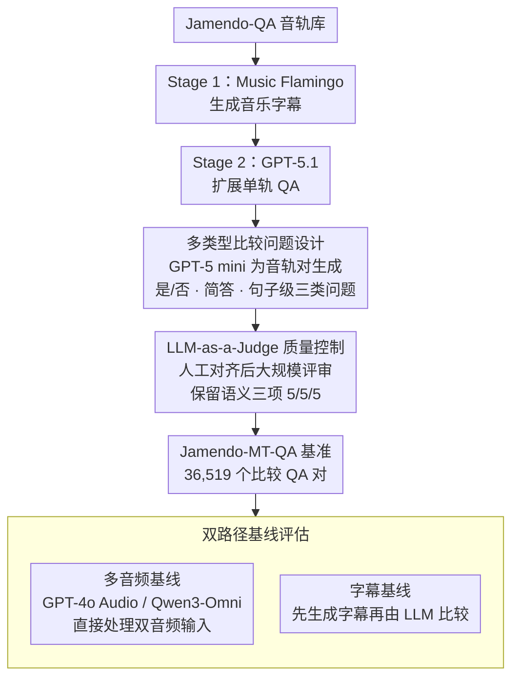

# Jamendo-MT-QA: A Benchmark for Multi-Track Comparative Music Question Answering

**会议**: ACL 2026  
**arXiv**: [2604.09721](https://arxiv.org/abs/2604.09721)  
**代码**: 无  
**领域**: 音频与语音 / 音乐理解  
**关键词**: 音乐问答, 多音轨比较推理, 音频语言模型, 基准数据集, LLM-as-a-Judge

## 一句话总结

构建 Jamendo-MT-QA，一个包含 36,519 个比较问答对（覆盖 12,173 个音轨对）的多音轨比较音乐问答基准，首次系统评估音频-语言模型在跨音轨比较推理上的能力，揭示现有模型在句子级比较生成上的显著不足。

## 研究背景与动机

**领域现状**：音乐问答（Music-QA）研究主要集中在单音轨理解，如标签预测、字幕生成和分类。然而，听众常以比较方式描述音乐（如"这首歌比上一首更暗"），现有基准未系统评估跨音轨的比较推理。

**现有痛点**：(1) 单音轨基准可能被文本线索而非真实音频感知驱动高分；(2) 音频-语言模型（如 CLAP、MU-LLaMA）虽在单音轨任务上表现强劲，但缺乏多音轨比较推理的评估；(3) 缺少专门针对音乐比较推理的数据集。

**核心矛盾**：现有 Music-QA 基准无法区分模型是否真正理解音频内容还是依赖文本捷径，更无法评估跨音轨关系推理能力。

**本文目标**：构建系统化的多音轨比较问答基准，评估并暴露现有模型的短板。

**切入角度**：基于 Jamendo-QA 数据集，利用 LLM 辅助生成三类比较问题（是/否、简答、句子级），并通过人工评估 + LLM 评审进行质量控制。

**核心 idea**：通过 LLM 辅助的四阶段流水线（音乐字幕 → 单轨 QA 扩展 → 多轨比较 QA 生成 → 质量过滤）构建高质量比较问答基准。

## 方法详解

### 整体框架

四阶段构建流程：Stage 1 使用 Music Flamingo 为每首曲目生成高质量字幕；Stage 2 用 GPT-5.1 扩展为单轨 QA 对；Stage 3 用 GPT-5 mini 为每个音轨对生成三类比较问题（是/否、简答、句子级）；Stage 4 通过人工评估和 LLM-as-a-Judge 进行质量过滤。其中 Stage 1-2 复用现成模型搭脚手架，Stage 3-4 是本文的两项核心构建设计；基准建成后再用一套双路径基线做诊断式评估。

### 关键设计

1. **多类型比较问题设计**：每个音轨对生成三类问题——是/否问题（如"Track A 是否比 Track B 节奏更快？"）、简答问题（选择匹配某描述的音轨）、句子级问题（要求生成完整的比较分析）。三种类型覆盖从简单判断到复杂推理的难度梯度，人工评估显示句子级问题难度显著高于前两类。

2. **LLM-as-a-Judge 质量控制**：先在 300 个样本上对齐人工评估与 GPT-5 mini 评分，验证 LLM 评审在语义质量标准（Correctness 4.87 vs 人工 4.79、Comparative Validity 4.61 vs 4.83、Reasoning Quality 4.37 vs 4.78）上与人工判断趋势一致后，将其扩展到全数据集评审，保留三项语义标准均为 5/5/5 的 QA 组。

3. **双路径基线评估**：设计两种基线——多音频基线（如 GPT-4o Audio、Qwen3-Omni 直接处理双音频输入）和字幕基线（如 Music Flamingo 先生成字幕再由 LLM 比较），用以分离多音频感知能力与高层语义推理能力的贡献。

### 损失函数 / 训练策略

本文为基准构建工作，不涉及模型训练。评估指标包括：Yes/No 和 Short-answer 的准确率，句子级的 BLEU、ROUGE-1/2/L、BERTScore 以及 LLM-as-a-Judge 1-5 分评分。

## 实验关键数据

### 主实验（全量 12,173 音轨对）

| 模型 | 类型 | Yes/No Acc | Short Acc | BLEU | BERT-F1 | GPT Judge | Claude Judge |
|---|---|---|---|---|---|---|---|
| Music Flamingo | Cap | 77.4% | 89.7% | 4.00 | 0.879 | 3.24 | 3.87 |
| Qwen2-Audio | Cap | 37.4% | 39.1% | 1.88 | 0.849 | 1.49 | 1.53 |
| MU-LLaMA | Cap | 20.6% | 55.3% | 2.39 | 0.857 | 2.36 | 2.01 |
| Qwen2-Audio | Multi | 50.9% | 80.2% | 2.09 | 0.847 | 1.37 | 1.62 |
| Qwen3-Omni | Multi | 62.9% | 80.3% | 3.58 | 0.863 | 3.11 | 3.48 |

### 消融实验

- Music Flamingo（字幕基线）在 Yes/No 上达 77.4%，优于多数多音频基线，说明高质量字幕 + 文本推理是可行路径
- Qwen2-Audio 的多音频模式（50.9%）比其字幕模式（37.4%）在 Yes/No 上有显著提升
- 所有模型在句子级问题上的 LLM Judge 得分均 ≤ 3.87/5，暴露了比较推理的巨大挑战

### 关键发现

- 字幕基线 Music Flamingo 综合表现最优，说明当前多音频模型尚未充分利用音频输入优势
- 句子级比较生成是最大瓶颈，需要跨音轨多属性整合和连贯自然语言表达
- 数据集中 92.9% 的跨类型音轨对得以保留，表明过滤策略不损害多样性
- 人工难度评分确认句子级 > 简答 > 是/否的难度梯度

## 亮点与洞察

- **填补比较推理空白**：首个专门评估跨音轨比较推理的音乐 QA 基准
- **诊断性设计**：双路径基线（字幕 vs 多音频）有效分离了感知能力与推理能力
- **质量控制创新**：人工-LLM 对齐验证后的大规模 LLM 评审流程，可推广到其他数据集构建

## 局限与展望

- 比较问题基于字幕和元数据生成，而非直接从音频，可能引入文本偏差
- 句子级问题的评估依赖 LLM Judge，其可靠性仍有提升空间
- 未评估生成式音乐模型的比较理解能力
- 未来可扩展到更多音轨（>2）的比较推理

## 相关工作与启发

- 多跳 QA（HotpotQA、DROP）中的关系推理思想在音频领域的迁移
- LLM-as-a-Judge 的评估范式正在 NLP 基准中普及
- 可启发构建其他模态的比较推理基准（如视频比较 QA）

## 评分

- **新颖性**: ⭐⭐⭐⭐ 多音轨比较推理的问题定义新颖，数据集构建方法论完善
- **实验充分度**: ⭐⭐⭐⭐ 多模型基线评估充分，但受限于计算成本部分模型仅用子集
- **写作质量**: ⭐⭐⭐⭐ 流水线描述清晰，质量控制流程详尽
- **价值**: ⭐⭐⭐⭐ 为音乐理解领域提供了重要的比较推理基准和诊断工具

<!-- RELATED:START -->

## 相关论文

- [\[ACL 2026\] Music Audio-Visual Question Answering Requires Specialized Multimodal Designs](music_audio-visual_question_answering_requires_specialized_multimodal_designs.md)
- [\[ACL 2026\] Retrieving to Recover: Towards Incomplete Audio-Visual Question Answering via Semantic-consistent Purification](retrieving_to_recover_towards_incomplete_audio-visual_question_answering_via_sem.md)
- [\[ICLR 2026\] SyncTrack: Rhythmic Stability and Synchronization in Multi-Track Music Generation](../../ICLR2026/audio_speech/synctrack_rhythmic_stability_and_synchronization_in_multi-track_music_generation.md)
- [\[ICLR 2026\] Query-Guided Spatial-Temporal-Frequency Interaction for Music Audio-Visual Question Answering](../../ICLR2026/audio_speech/query-guided_spatial-temporal-frequency_interaction_for_music_audio-visual_quest.md)
- [\[ACL 2025\] Sparsify: Learning Sparsity for Effective and Efficient Music Performance Question Answering](../../ACL2025/audio_speech/sparsify_music_avqa.md)

<!-- RELATED:END -->
