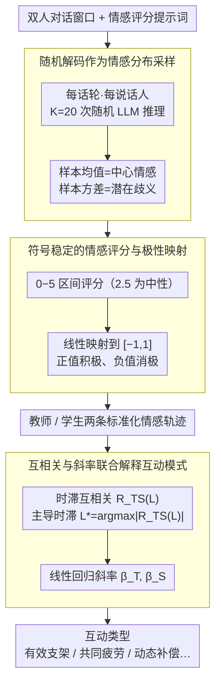

# LLM-MC-Affect: LLM-Based Monte Carlo Modeling of Affective Trajectories and Latent Ambiguity for Interpersonal Dynamic Insight

**会议**: ACL2026  
**arXiv**: [2601.03645](https://arxiv.org/abs/2601.03645)  
**代码**: 未公开链接（缓存未给出代码地址）  
**领域**: 情感计算 / 对话分析 / 教育对话  
**关键词**: 概率情感建模、蒙特卡洛采样、情感轨迹、潜在歧义、人际动态  

## 一句话总结
这篇论文提出 LLM-MC-Affect，把对话中的情感从单点标签改写成由随机 LLM 解码近似的潜在分布，再用均值、方差、互相关和斜率指标分析师生对话里的情感同步与主导关系。

## 研究背景与动机
**领域现状**：情感同步和人际情绪动态通常依赖生理信号、神经同步或人工标注来研究，这些方式能提供细粒度时间序列，但对设备、场景控制和隐私合规的要求很高。另一方面，教育、咨询、协作等场景中自然语言对话本身已经包含连续的情绪变化，因此文本情感轨迹成为更可扩展的替代信号。

**现有痛点**：很多文本情感分析方法仍把每个话轮压缩成一个确定性的情感分数，默认情绪判断只有一个答案。这会抹掉两个信息：一是同一句话可能被不同人理解出不同情绪，二是双方情绪会在时间上相互牵引，而不是彼此独立。

**核心矛盾**：论文要处理的矛盾是，可扩展文本分析通常牺牲了情感歧义和互动结构，而高保真的人际动态分析又常依赖昂贵传感器或人工标注。作者希望在不微调、不额外采集生理信号的情况下，让 LLM 的随机性变成一种可量化的情感不确定性来源。

**本文目标**：第一，估计每个话轮的中心情感倾向；第二，用多次随机推理的方差表示潜在情感歧义；第三，把师生双方的情感序列组织成轨迹；第四，通过时滞互相关和趋势斜率解释谁在影响谁、互动是共同改善还是共同恶化。

**切入角度**：作者观察到，LLM 在非零 temperature 下会对同一句话给出不同但合理的情感评分。这种随机输出不必只看成噪声，也可以看成从一个隐含情感分布中抽样。于是，重复采样就近似替代了多名人类评分者。

**核心 idea**：用 LLM 随机解码的 Monte Carlo 样本来估计情感分布，再把分布均值和方差串成对话轨迹，从而在文本层面分析人际情感同步。

## 方法详解
LLM-MC-Affect 的核心不是训练一个新的情感模型，而是定义一条从对话文本到互动解释的统计管线。它先让 LLM 在统一心理测量 rubric 下多次给出话轮情感分数，再把这些分数转换为标准化情感轨迹，最后用时间序列工具解释师生之间的情绪耦合。

### 整体框架
输入是一段双人对话窗口和一个情感评分提示词。对每个话轮、每个说话人，系统运行 $K$ 次独立的随机 LLM 推理，得到一组情感分数样本。随后计算样本均值作为中心情感状态，计算样本方差作为感知歧义。原始分数先在 $0$ 到 $5$ 的区间上评分，再映射到 $[-1,1]$，其中正值表示积极情感、负值表示消极情感。

得到教师和学生两条标准化轨迹后，方法计算不同对话滞后 $L$ 下的归一化互相关 $R_{TS}(L)$，并选取 $L^*=\arg\max_L |R_{TS}(L)|$ 作为主导时滞。如果 $L^*>0$，表示教师情感领先学生；如果 $L^*<0$，表示学生情感领先教师。同时，方法对每条轨迹做线性回归，用斜率 $\beta_T$ 和 $\beta_S$ 概括长期情感趋势。

### 关键设计
**1. 随机解码作为情感分布采样：把一句话的情感判断从一次确定性输出扩展成一组样本**

传统文本情感分析把每个话轮压成一个确定性分数，默认情绪判断只有唯一答案，于是“同一句话被不同人理解出不同情绪”的歧义被直接平均掉了。作者注意到 LLM 在非零 temperature 下会对同一句话给出不同但都合理的评分，于是干脆把这种随机输出当成从一个隐含情感分布里抽样：对同一对话上下文重复推理 $K=20$ 次得到 $\{\hat{s}_{t,k}\}_{k=1}^K$，用样本均值表示中心情感倾向，用样本方差表示潜在歧义。这样重复采样近似替代了多名人类评分者，能区分“模型很确定地判断为中性”和“多个合理情感解释相互竞争”这两种本质不同的中性。

**2. 符号稳定的情感评分与极性映射：先压住 LLM 在正负号上的混乱，再换算成标准情感坐标**

LLM 直接打正负情感分时容易把符号搞反。方法先要求模型在 $0$ 到 $5$ 上打分，$2.5$ 为中性，越接近 $0$ 越积极、越接近 $5$ 越消极——非负区间更容易被 LLM 稳定执行。拿到分数后再用 $\tilde{s}_t=1-2(s_t/5)$ 映射到 $[-1,1]$，方差相应按 $(2/5)^2$ 缩放。这样既借了非负评分的稳定性，又得到“正值表积极、负值表消极”的标准坐标，方便和情感计算文献对齐。

**3. 互相关与斜率联合解释互动模式：把两条情感轨迹翻译成“有效支架 / 共同疲劳 / 动态补偿”等互动类型**

只看单方情绪高低说明不了互动关系——谁在带动谁、互动是共同变好还是一起恶化，得靠两条轨迹的相位和趋势一起读。方法在不同对话滞后 $L$ 下计算归一化互相关 $R_{TS}(L)$，取 $L^*=\arg\max_L |R_{TS}(L)|$ 作为主导时滞：$L^*>0$ 表示教师情感领先学生，$L^*<0$ 表示学生领先教师；同时对每条轨迹做线性回归，用斜率 $\beta_T$、$\beta_S$ 概括长期趋势。再用 $L^*$、$R_{TS}(L^*)$ 的符号和 $\beta_T,\beta_S$ 的正负组合，定义师生互动属于哪种类型。

### 一个完整示例：Personification 话题
以 GPT-4.1、$\tau=0.7$ 跑一段师生关于“拟人化”的多轮教学对话：对每个话轮、每个说话人各做 $K=20$ 次随机推理，把 $0$–$5$ 分映射到 $[-1,1]$，得到教师和学生两条标准化情感轨迹——两条轨迹都在 Turn 2 附近先下探、再到 Turn 7 转强正向。对两条轨迹算时滞互相关，得到 $L^*=+1$、$R_{TS}=0.999$，说明教师前一轮的情绪几乎能预测学生后一轮；再做线性回归得斜率 $\beta_T=0.1621$、$\beta_S=0.2532$，两者皆正且学生回升更快。$L^*>0$（教师领先）叠加双正斜率（共同改善），这段对话被判为 Effective Scaffolding：教师领先并带动学生情感向上。

### 损失函数 / 训练策略
本文没有训练新模型，也没有提出监督损失。它采用零样本推理和统计估计：统一 rubric、每话轮 $K=20$ 次 Monte Carlo 采样、固定模型温度做敏感性分析，并在互动解释阶段使用归一化互相关和最小二乘斜率估计。实验中主要用 GPT-4.1 在 $\tau=0.7$ 下做最终互动分析，因为该设置在均值稳定性和歧义可见性之间较平衡。

## 实验关键数据

### 主实验
| 实验对象 | 设置 | 关键指标 / 观察 | 结论 |
|--------|------|----------------|------|
| Google Education Dialogue Dataset | 合成师生多轮教学对话 | 使用 GPT-4.1、GPT-3.5-Turbo、Gemma 3 4B、Llama 3.3 70B、Phi 4 14B、GPT-OSS 120B | 作为受控教育互动案例，验证方法能从文本中抽取情感轨迹 |
| Personification 话题 | GPT-4.1，$\tau=0.7$ | 教师斜率 $\beta_T=0.1621$，学生斜率 $\beta_S=0.2532$，$L^*=+1$，$R_{TS}=0.999$ | 被解释为 Effective Scaffolding，即教师领先并带动学生情感改善 |
| 跨模型比较 | 同一 rubric、零样本 | GPT-4.1 和 GPT-3.5-Turbo 都捕捉到早期负向下探再恢复的 V 形轨迹 | GPT 系列在细粒度情感转折上更稳定 |
| 开源模型行为 | Llama 3.3 70B / Phi 4 14B / Gemma 3 4B | Llama 3.3 70B 几乎漏掉 Turn 2 负向下探；Phi-4 恢复阶段均值约封顶在 0.40；Gemma 3 4B 回升约停在 0.15 附近 | 对齐或模型尺度可能带来积极偏置和保守情绪估计 |

### 消融实验
| 分析项 | 设置 | 关键数据 | 说明 |
|------|------|---------|------|
| 温度敏感性 | Utterance 6，GPT-4.1 | $\tau=0.1$ 时均值约 $-0.12$、方差 $0.010$；$\tau=1.0$ 时方差增至 $0.024$ | 温度升高让歧义更可见，但不等价于情感均值失控 |
| 均值稳定性 | Personification 全温度范围 | Utterance 6 的均值在约 $-0.11$ 到 $-0.26$ 间波动 | 方差明显变化时，中心情感倾向仍较稳定 |
| 轨迹收敛性 | 教师情感轨迹 | 不同 $\tau$ 下都呈现 Turn 2 附近下探、随后到 Turn 7 转强正向的趋势 | 方法能过滤一部分随机采样噪声，保留主要情感信号 |
| 统计解释 | NCCF + 斜率 | $L^*=+1$ 且 $R_{TS}=0.999$，$eta_T,eta_S$ 均为正 | 支持“教师前一轮情绪可预测学生后一轮情绪”的解释 |

### 关键发现
- Monte Carlo 方差不是简单噪声，而是论文用来显式表示情感歧义的核心变量。
- 情感均值对 temperature 变化相对稳健，但方差会随着 temperature 上升而扩大，因此均值和方差承担了不同解释功能。
- GPT-4.1 在该案例中最适合做互动分析；部分开源模型会过度积极或低估负向转折，这本身也能作为模型情感感知偏置的诊断信号。
- 互相关只能支持顺序关联解释，不能直接推出因果关系，这一点在论文局限中被明确强调。

## 亮点与洞察
- 把 LLM 的随机性从“需要压掉的噪声”变成“可以估计的情感分布”，这个视角很有启发。它让无需标注的零样本 LLM 推理具备了一点类似多人评分的统计语义。
- 论文没有只停留在情感分类，而是继续把情感序列连接到互动模式解释。对教育对话而言，$L^*$ 和斜率的组合比单个情感分数更接近教师真正关心的课堂动态。
- 方法对模型偏置也有诊断价值：如果某个模型总是给出过于积极的情感轨迹，它可能不适合用于学生挫败感监测。
- 这套 pipeline 可以迁移到心理咨询、客服、协作会议等双人或多人对话场景，只要把 rubric 换成目标领域的互动评价维度。

## 局限与展望
- Monte Carlo 方差混合了语言歧义、模型偏置、提示词敏感性和解码随机性，不能直接等同于真实人类感知歧义。
- 实验主要基于合成教育对话，虽然便于控制变量，但无法充分代表真实课堂中的噪声、非语言线索和学生群体差异。
- 互相关和时滞指标只能说明序列对齐或领先关系，不应被解释为教师情绪导致学生情绪变化的因果证据。
- 重复随机解码带来明显计算成本；如果要部署在实时教育系统中，需要更轻量的情感模型或混合架构。
- 后续可以加入真实课堂数据、人类评分校准、跨文化情感 rubric，以及滑动窗口互相关来处理更长对话。

## 相关工作与启发
- **vs 传统文本情感分类**: 传统方法输出确定性标签或分数，本文输出均值和方差，因此能保留主观歧义。
- **vs 人类多标注者情感建模**: 多标注者方法以真实人类分歧近似隐含分布，本文用随机 LLM 推理做代理，成本更低但也更依赖模型偏置。
- **vs 生理信号情感同步研究**: 生理信号能捕捉高保真同步，但部署门槛高；本文用文本轨迹牺牲一部分传感精度，换取可扩展性和隐私友好性。
- **vs 单纯 LLM-as-a-Judge**: 普通 LLM 评审往往只取一次判断，本文把评审过程统计化，更适合分析不确定性和时间动态。

## 评分
- 新颖性: ⭐⭐⭐⭐☆ 用随机解码做情感分布估计并连接互动动态，想法清晰且有一定新意。
- 实验充分度: ⭐⭐⭐☆☆ 有温度、跨模型和案例分析，但主要依赖合成教育场景，真实数据验证不足。
- 写作质量: ⭐⭐⭐⭐☆ 动机、统计建模和互动解释链条完整，局限也交代得比较诚实。
- 价值: ⭐⭐⭐⭐☆ 对教育对话分析、情感计算和 LLM 评测都有参考价值，尤其适合启发不确定性感知的文本互动分析。

<!-- RELATED:START -->

## 相关论文

- [\[ICLR 2026\] Dynamic Parameter Memory: Temporary LoRA-Enhanced LLM for Long-Sequence Emotion Recognition in Conversation](../../ICLR2026/audio_speech/dynamic_parameter_memory_temporary_lora-enhanced_llm_for_long-sequence_emotion_r.md)
- [\[ICLR 2026\] Incentive-Aligned Multi-Source LLM Summaries](../../ICLR2026/audio_speech/incentive-aligned_multi-source_llm_summaries.md)
- [\[ACL 2026\] Data-efficient Targeted Token-level Preference Optimization for LLM-based Text-to-Speech](data-efficient_targeted_token-level_preference_optimization_for_llm-based_text-t.md)
- [\[ACL 2026\] DuIVRS-2: An LLM-based Interactive Voice Response System for Large-scale POI Attribute Acquisition](duivrs-2_an_llm-based_interactive_voice_response_system_for_large-scale_poi_attr.md)
- [\[ICML 2026\] SafeSearch: Automated Red-Teaming of LLM-Based Search Agents](../../ICML2026/audio_speech/safesearch_automated_red-teaming_of_llm-based_search_agents.md)

<!-- RELATED:END -->
