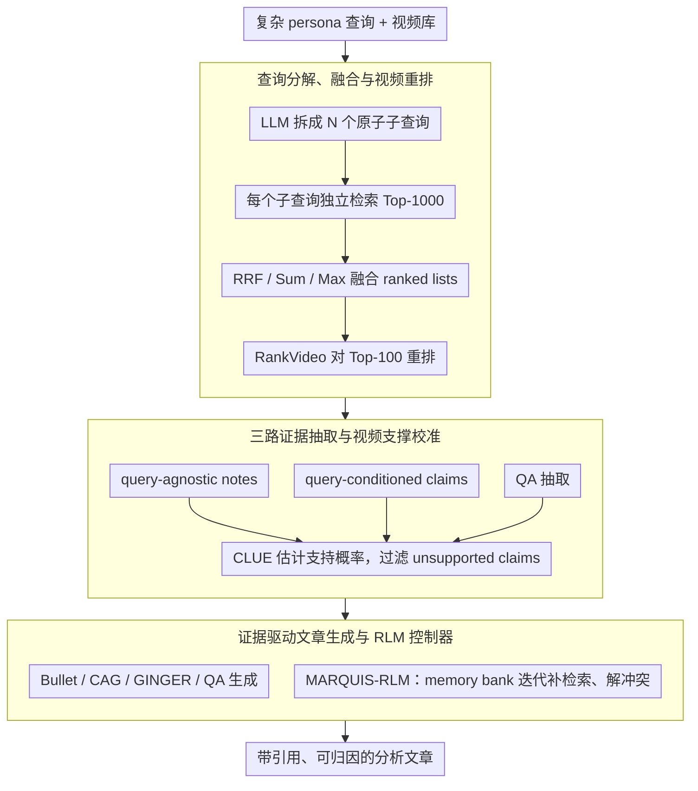

# MARQUIS: A Three-Stage Pipeline for Video Retrieval-Augmented Generation

**会议**: ACL2026  
**arXiv**: [2605.17640](https://arxiv.org/abs/2605.17640)  
**代码**: https://github.com/debashishc/marquis  
**领域**: 视频 RAG / 多模态检索 / 证据归因生成  
**关键词**: 视频检索增强生成, 查询分解, 证据抽取, 不确定性校准, RLM 控制器

## 一句话总结
MARQUIS 将多视频检索增强文章生成拆成“查询分解与重排检索-校准式结构化证据抽取-带引用文章生成”三阶段，并可用 RLM 控制器做迭代证据管理，在 MAGMaR2026 上把检索 nDCG@10 从 0.195 提升到 0.759，生成侧 Iter-QA-Base 人类评分达到 3.83。

## 研究背景与动机
**领域现状**：视频语料正在记录大量真实世界事件，但把多个视频中的视听证据转成一篇有引用、可归因、结构清楚的分析文章，仍很大程度依赖人工。传统 RAG 主要面向文本，视频 RAG 还要处理视觉帧、音频、转录、跨视频证据合成和引用归因。

**现有痛点**：问题出在检索和生成两端。检索端，MAGMaR 这类任务的查询往往很长，包含职业 persona、背景和多个隐含/显式信息需求，单个 dense embedding 容易把多面需求压成一个向量，漏掉相关视频。生成端，模型面对多个长视频时会遇到上下文过长、跨视频推理不足、引用混乱和事实支撑不清等问题。

**核心矛盾**：直接把大量视频内容塞进长上下文并让 VLM 写文章，既昂贵又不可靠；但只做视频检索也不够，因为文章生成需要细粒度、可引用、可校准的证据单元。系统需要在“找视频”和“写文章”之间加入证据管理层。

**本文目标**：作者希望构建一个 modular pipeline：先把复杂查询拆成可检索的 atomic sub-queries，提高召回；再把视频转成结构化证据并估计支持概率；最后只基于筛选后的证据生成有引用文章。额外的 MARQUIS-RLM 用 structured memory 和工具调用控制证据收集与整理。

**切入角度**：论文把 video RAG 视为 evidence-management problem。关键不是让一个模型一次性“看完所有视频并总结”，而是把查询、检索、抽取、校准、引用生成都拆成可检查步骤。

**核心 idea**：用查询分解与 rank fusion 修复检索，用 query-agnostic notes、query-conditioned claims 和 QA 三类证据抽取修复证据粒度，用 CLUE 支持概率过滤 unsupported claims，再用 Bullet/CAG/GINGER/RLM 等策略比较不同证据合成方式。

## 方法详解

### 整体框架
MARQUIS 要解决的是“给定一个复杂查询和一大堆视频，写出一篇有引用、可归因的分析文章”。它没有让一个 VLM 一次性看完所有视频再总结，而是把任务拆成检索、证据管理、生成三段流水线，让每一步都可检查、可替换。

第一阶段 **Video Retrieval** 先把复杂查询拆成多个 atomic sub-queries，每个子查询独立用 OmniEmbed 检索，再用 RRF、相似度聚合等策略融合 ranked lists，最后用 RankVideo 对 Top-100 candidates 做 video-native reranking。第二阶段 **Information Extraction** 对检索到的视频并行抽取 query-agnostic notes、query-conditioned claims 和 question-answer evidence，并用 CLUE 校准每条证据是否被源视频支持。第三阶段 **Article Generation** 把筛选后的 evidence artifacts 交给生成器，比较 Bullet、CAG、GINGER、QA-based generation 和 MARQUIS-RLM 控制器几种合成方式。其中 MARQUIS-RLM 是一个可选的高层控制层：它把上面所有模块包装成工具，由 Root LM 在持久 Python sandbox 里以 Think-Act-Observe 循环调用，并维护一个 structured memory bank。

### 关键设计

**1. 查询分解、融合与视频重排：把长 persona 查询拆回检索器熟悉的短查询**

MAGMaR 这类任务的查询往往很长，包含职业 persona、背景和多个隐含/显式信息需求，而 dense retriever 通常是在短查询-文档对上训练的，一个长查询是分布外输入，单个 embedding 会把多面需求压成一个向量、漏掉相关视频。MARQUIS 让 LLM 先把原始查询分解成 $N$ 个 atomic sub-queries，每个子查询独立检索 Top-1000 视频候选，再把多张 ranked list 融合回一个整体排序——融合策略包括 RRF、Sum/Max/Mean similarity、Weighted RRF 等，其中 RRF 用 $RRF_K(v)=\sum_i 1/(K+\mathrm{rank}(v,q_i))$ 聚合各子查询的排名。融合后的 Top-100 再交给 RankVideo 做一遍 video-native 重排。拆成原子信息需求后，检索器更容易分别命中覆盖不同 facet 的视频，这也是检索 nDCG@10 从 0.195 跳到 0.759 的主因。

**2. 三路证据抽取与视频支撑校准：抽取与可信度判断解耦**

直接让模型“边看视频边写证据”，它常常会在生成 evidence 的同时自信地误判其可信度，形成自编自证的循环。MARQUIS 把证据抽取拆成三种粒度并和支撑估计分开：query-agnostic note extraction 记录视频中直接可观察的视觉事件、屏幕文字和语音内容；query-conditioned claim extraction 只抽取与当前查询相关、且直接受视频支持的 claims；QA extraction 先把信息需求分解成问题，再由 VLM 基于视频内容和转录回答。这三路输出覆盖了宽泛观察、任务相关 claim 和针对性 QA 三种粒度，随后统一交给 CLUE 评分，得到支持概率 $s_\theta(v,x) \in [0,1]$，据此过滤掉 unsupported claims。把“抽什么”和“信不信”交给两个独立环节，证据单元因此带上了可校准的置信度，而不是一段笼统的摘要。

**3. 证据驱动文章生成与 RLM 控制器：把组织与引用从一次性 prompt 变成可观察状态**

多视频生成最容易出错的地方不是语言流畅性，而是证据组织和引用保持。MARQUIS 在筛选后的证据上比较了几种合成方式：Bullet 直接列证据，保守但不成文；CAG 一次性合成 cited article；GINGER 先做 facet clustering、cluster ranking、per-cluster summarization，再润色成文。最高层的 MARQUIS-RLM 则让 Root LM 在持久环境里迭代调用工具，借助 memory bank 搜索、复用、修订 evidence records，显式处理证据冲突和信息缺口。RLM 的价值不在于更长的上下文，而在于把“查缺补漏、解决冲突、整理事实”变成一连串可观察的状态转移，从而在长流程中减少证据遗忘和跨源混淆——代价是会纳入更多不相关事实（实验里它 citation recall 最高但 precision 偏低）。

### 一个完整示例：从一条 persona 查询到一篇带引用文章

设输入是一条带职业 persona、要求覆盖多个信息需求的长查询。第一阶段先把它分解成若干 atomic sub-queries（如“某事件的时间线”“相关人物表态”“现场画面”），每个子查询用 OmniEmbed 各取 Top-1000 候选，再用 RRF 融合成一张总榜，对其中 Top-100 用 RankVideo 重排，得到少量高相关视频。第二阶段对这批视频并行跑三路抽取：notes 记下可见画面与字幕，claims 抽出与查询直接相关且有视频支撑的论断，QA 针对具体问题给出答案；CLUE 给每条证据打 $s_\theta$ 分，丢掉支撑概率低的条目。第三阶段把这些已校准、带 source id 的证据交给生成器——若走 RLM 路线，Root LM 会在 memory bank 里检索已有证据、发现某个 facet 缺料就回到工具补检索，最后输出一篇每句话都能回指到具体视频的文章。

### 损失函数 / 训练策略
MARQUIS 主要是系统 pipeline，不是端到端训练方法。实验使用 OmniEmbed 做视频/查询编码，Qwen3.5-9B 做查询分解和抽取，Qwen3.5-27B 做 QA 与文章生成，Qwen2.5-Omni-7B 与 Whisper medium.en 参与 multimodal embedding 和转录。Claim-based extraction/generation 不使用音频；QA pipeline 和 RLM 可通过转录工具访问音频。评估在 MAGMaR2026 Test Set 上进行，检索用 nDCG 和 Recall，生成用 MiRAGE 自动指标和 3 名人类标注者的 1-5 分评分。

## 实验关键数据

### 主实验
检索阶段在 MAGMaR2026 上提升非常明显：

| 方法 | nDCG@10 | nDCG@20 | R@10 | R@20 | 说明 |
|------|---------|---------|------|------|------|
| OmniEmbed | 0.195 | 0.229 | 0.190 | 0.276 | 单查询 dense retrieval 基线 |
| Max Sim | 0.722 | 0.743 | 0.639 | 0.731 | first-stage 最强 nDCG |
| RRF K=10 | 0.700 | 0.739 | 0.612 | 0.735 | recall 更均衡 |
| Sum Sim + RankVideo | 0.747 | 0.758 | 0.636 | 0.711 | 重排后明显提升 |
| RRF K=10 + RankVideo | 0.759 | 0.771 | 0.652 | 0.735 | 总体最佳 nDCG@10 |

生成阶段在 oracle relevant videos 设置下比较 8 个系统，下面保留核心指标：

| 系统 | Human Score | Best Votes | Best % | Info P/R | Cite P/R | 关键观察 |
|------|-------------|------------|--------|----------|----------|----------|
| CAG baseline | 3.09 | 1 | 1.8% | 76.4 / 41.0 | 61.7 / 22.8 | 单次合成基线 |
| Bullet | 2.67 | 0 | 0.0% | 71.1 / 39.4 | 60.4 / 23.7 | 保守但不像文章 |
| GINGER | 3.12 | 6 | 10.5% | 77.6 / 40.4 | 64.3 / 22.6 | claim-based 中 prose 最强 |
| MARQUIS-RLM | 3.30 | 3 | 5.3% | 70.8 / 38.5 | 59.2 / 27.2 | 非 QA 系统中 citation recall 最强 |
| SS-QA-GINGER | 3.42 | 10 | 17.5% | 54.4 / 32.4 | 32.6 / 23.8 | best votes 最多 |
| Iter-QA-Base | 3.83 | 8 | 14.0% | 34.7 / 31.3 | 26.8 / 25.8 | 人类平均分最高 |
| Iter-QA-GINGER | 3.69 | 5 | 8.8% | 34.5 / 29.0 | 25.7 / 22.6 | QA + GINGER 仍较强 |

### 消融实验
| 对比点 | 结果 | 含义 |
|--------|------|------|
| 原始 OmniEmbed vs query expansion | nDCG@10 从 0.195 到最高 0.722 | 查询分解是检索提升主因 |
| RRF K=10 first-stage vs +RankVideo | nDCG@10 从 0.700 到 0.759 | 视频重排进一步提升排序质量 |
| Max Sim vs Max Sim + RankVideo | nDCG@10 从 0.722 降到 0.399 | RankVideo 对 Max Sim 融合出现明显失败，作者留给未来分析 |
| CAG vs GINGER | Human Score 3.09 到 3.12，Best % 1.8% 到 10.5% | facet clustering/分阶段生成改善可读性 |
| CAG vs MARQUIS-RLM | Human Score 3.09 到 3.30，Citation Recall 22.8 到 27.2 | RLM 证据管理改善归因召回，但 precision 较低 |

### 关键发现
- 检索侧最重要的是把复杂查询拆成 atomic sub-queries；这让 retriever 回到更熟悉的短查询分布。
- RRF 类方法虽然 first-stage nDCG 不一定最高，但更能覆盖多 facet 信息，重排后成为最佳。
- 生成侧没有单一赢家：QA 系统人类评分高，但失败时会保守拒写，导致自动指标被零分拉低；claim-based 系统 precision 好但可能综合能力不足；RLM 引入 structured memory 后 citation recall 更好但会纳入更多不相关事实。

## 亮点与洞察
- **把视频 RAG 拆成 evidence pipeline 很正确**：视频文章生成不是“多看几个视频再写”，而是需要检索、抽取、校准、组织、引用五个环节。MARQUIS 的模块化让每一步都可替换和评估。
- **校准独立于抽取**：先抽 evidence，再单独判断是否被源视频支持，可以减少“模型自己编 evidence 又自己给高置信度”的循环自证。
- **RLM 在这里不是炫技，而是状态管理工具**：长多视频任务中，memory bank 比更长上下文更重要。RLM 的价值在于让 Root LM 能显式搜索和修订证据记录。
- **人类评分和自动指标出现张力**：Iter-QA-Base 人类评分最高，但 automatic info/citation precision 不高。这提醒视频 RAG 评估不能只看自动指标。

## 局限与展望
- Max Sim + RankVideo 出现严重退化，说明不同融合策略和重排器之间存在交互失败，论文没有深入解释。
- QA 系统在相关问题分解或 VLM 回答失败时会拒写文章，这能避免幻觉，但会在本来有信息的主题上造成零分输出。
- MARQUIS-RLM citation recall 高，但 information precision 和 citation precision 较低，表明迭代证据收集会带来更多噪声，需要更强证据筛选或与 GINGER 结合。
- Claim-based extraction/generation 不使用音频，可能漏掉纯语音信息；QA/RLM 虽可访问转录，但系统复杂度更高。
- 论文主要在 MAGMaR2026 上验证，跨领域视频库、实时视频流、非英语语音和更长事件链仍需进一步测试。

## 相关工作与启发
- **vs 文本 RAG**: 文本 RAG 通常检索 passages；MARQUIS 要检索视频，再抽取可引用 evidence，额外面对模态、时间戳和引用支撑问题。
- **vs 单视频 caption/QA**: 传统视频理解多关注 caption 或 entity-centric QA；本文任务要求跨多个视频合成分析文章，证据组织难度更高。
- **vs Long-context VLM**: 直接扩展上下文能容纳更多视频，但不能保证归因和冲突处理；MARQUIS 用结构化 evidence 管理替代“盲目塞上下文”。
- **启发**: 未来多模态 RAG 系统应把“证据单元”作为核心中间表示，保留 source id、timestamp、support probability 和 claim dependency，而不是只保存自然语言摘要。

## 评分
- 新颖性: ⭐⭐⭐⭐☆ 三阶段视频 RAG 框架不算单点突破，但 evidence calibration + RLM control 的组合很有价值。
- 实验充分度: ⭐⭐⭐⭐☆ 检索和生成都有系统实验、人类评分和自动指标；局限是主要集中在 MAGMaR2026。
- 写作质量: ⭐⭐⭐⭐☆ pipeline 清楚，表格信息密集；部分模块细节分散在附录，读者需要来回跳。
- 价值: ⭐⭐⭐⭐⭐ 对视频 RAG、证据归因生成和多模态检索系统设计很有参考价值。

<!-- RELATED:START -->

## 相关论文

- [\[ACL 2026\] PlanRAG-Audio: Planning and Retrieval Augmented Generation for Long-form Audio Understanding](planrag-audio_planning_and_retrieval_augmented_generation_for_long-form_audio_un.md)
- [\[CVPR 2026\] SAVE: Speech-Aware Video Representation Learning for Video-Text Retrieval](../../CVPR2026/audio_speech/save_speech-aware_video_representation_learning_for_video-text_retrieval.md)
- [\[ACL 2025\] WavRAG: Audio-Integrated Retrieval Augmented Generation for Spoken Dialogue Models](../../ACL2025/audio_speech/wavrag_audio-integrated_retrieval_augmented_generation_for_spoken_dialogue_model.md)
- [\[AAAI 2026\] Hearing More with Less: Multi-Modal Retrieval-and-Selection Augmented Conversational LLM-Based ASR](../../AAAI2026/audio_speech/hearing_more_with_less_multi-modal_retrieval-and-selection_augmented_conversatio.md)
- [\[CVPR 2026\] OmniSonic: Towards Universal and Holistic Audio Generation from Video and Text](../../CVPR2026/audio_speech/omnisonic_towards_universal_and_holistic_audio_generation_from_video_and_text.md)

<!-- RELATED:END -->
