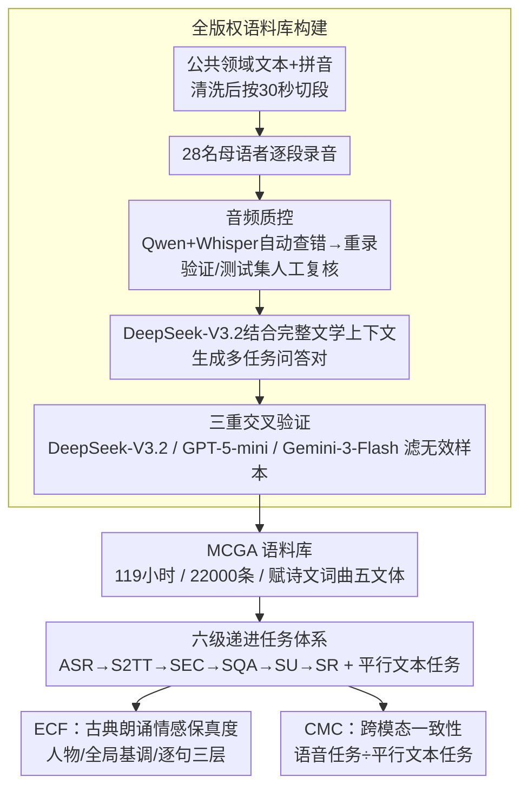

# MCGA: A Multi-task Classical Chinese Literary Genre Audio Corpus

**会议**: ACL 2026  
**arXiv**: [2601.09270](https://arxiv.org/abs/2601.09270)  
**代码**: [https://github.com/yxduir/MCGA](https://github.com/yxduir/MCGA)  
**领域**: 语音与自然语言处理/中国古典文学  
**关键词**: 古典文学语音语料库, 多模态大语言模型, 语音情感分析, 跨模态一致性, 中国古典文学研究

## 一句话总结

本文构建了首个面向中国古典文学的大规模（119小时、22000条样本）全版权音频语料库 MCGA，涵盖赋、诗、文、词、曲五大文体和六项语音任务（ASR/S2TT/SEC/SQA/SU/SR），并通过评测 10 个多模态大模型揭示了当前模型在古典文学语音理解上的显著不足。

## 研究背景与动机

**领域现状**：多模态大语言模型（MLLM）的快速发展为中国古典文学研究（CCS）带来了新的可能性。然而，现有研究主要集中在文本（ACLUE、WenMind 等）和视觉（Oracle-Bench、MCS-Bench 等）模态，古典文学的语音维度几乎完全空白。这一领域缺少高质量的领域专用音频语料库，导致 MLLM 在古典中文语音理解方面的能力无法被系统评估和提升。

**现有痛点**：(1) 现有中国文化数据集大多只涉及文本或图像模态，没有平行的古典文学语音数据；(2) 少数涉及中文语音的资源主要面向现代汉语，无法覆盖古典文学特有的修辞、典故和语音韵律特征；(3) 版权问题一直困扰着开源 CCS 音频数据集的建设——互联网上的朗诵音频往往受版权限制，无法自由分发用于研究。

**核心矛盾**：多模态大模型具备了强大的文本和视觉理解能力，但在古典中文语音理解这一维度上完全缺失评测基础设施。没有语音语料库就无法评测，无法评测就无法推动模型在该领域的进步。

**本文目标**：构建一个覆盖多文体、多任务、全版权的古典中文文学音频语料库，建立系统的评测框架，全面评估当前 MLLM 在古典文学语音理解上的能力。

**切入角度**：从"文体多样性"和"任务多样性"两个维度出发——文体上涵盖中国文学史上最重要的五种文体（赋、诗、文、词、曲），任务上设计从基础（ASR）到高级（语音推理 SR）的六级递进任务体系。

**核心 idea**：招募 28 名母语者人工录制所有音频并获得版权转让，利用 LLM 生成问答对并经三重验证确保质量，构建一个同时支持 6 项语音任务和 4 项文本任务的平行语料库。

## 方法详解

### 整体框架

MCGA 不是模型而是一套语料库加评测体系，核心工作是把"从无到有造一份全版权的古典文学语音数据"做扎实。整条构建流水线分三步：先从网络收集公共领域的古典文学文本及拼音，清洗后按 30 秒上限切段；再由 28 名母语者按统一规范逐段录音，每条音频都过 MLLM 自动检查和人工复核两道质控；最后用 DeepSeek-V3.2 结合每段的完整文学上下文生成多任务问答对，并经 DeepSeek-V3.2、GPT-5-mini、Gemini-3-Flash 三重交叉验证滤掉无效样本。产物是一份同时支撑 6 项语音任务和 4 项平行文本任务、覆盖赋诗文词曲五大文体的 119 小时语料。

### 关键设计

**1. 全版权语料库构建：从元数据到可评测音频的四步流水线**

古典朗诵音频在互联网上几乎都受版权限制、无法自由分发，这是开源 CCS 音频数据集长期建不起来的根因，于是 MCGA 选择从零自建。先从网络收集创作已超 150 年、属公共领域的古典文学文本及拼音，清洗后按 30 秒上限切段；再招募 28 名母语者（含半数中文专业，年龄 18–40）按统一录音规范逐段录制标准普通话，以保证全集情感表达的一致性；录完先用 Qwen 与 Whisper 双模型做语音识别查错、把明显出错的样本退回重录，验证集与测试集再由 6 名质检员逐条人工打分、剔除发音错误或带噪样本；最后用 DeepSeek-V3.2 结合每段完整文学上下文生成 S2TT/SEC/SQA/SU/SR 五类问答对，并经 DeepSeek-V3.2、GPT-5-mini、Gemini-3-Flash 三重交叉验证滤掉无效样本。整条流水线最硬的差异点在于所有 22000 条音频都由原始录制者签署版权转让，彻底绕开了开源音频数据集的知识产权（IPR）困境。

**2. 六级递进任务体系：从听清到听懂再到会推理**

单一任务量不出 MLLM 在古典文学上的真实水平，于是 MCGA 把语音理解拆成由浅入深的六级阶梯。ASR 测最基础的转录，S2TT 要求把古文翻成现代英文、引入跨语言压力，SEC 让模型识别说话人特征并逐句分析情感，SQA 是开放式事实问答，SU 和 SR 则分别考察基于语音内容的理解与需要调动外部知识的推理。这套阶梯的价值在于能把模型的瓶颈精确定位到某个认知层次——是听不清（ASR 差），还是听清了却推不动（SR 差）。同一批文本还配有平行的 MT/QA/LU/LR 四项文本任务，为后面的跨模态对比留好了参照系。

**3. 情感描述保真度指标 ECF：给古典朗诵的复杂情感打分**

现成的语音情感评测大多只做现代语音的离散分类（高兴/悲伤），根本接不住古典朗诵里那种交织的层次——一首送别诗里可能同时缠着不舍、豁达与壮志。ECF 因此被拆成三个子项叠加：ECF-P 管人物识别（0-2 分，年龄和性别每错一项扣 1 分），ECF-G 管全局情感基调（0-3 分，看整体氛围描述的丰富度与准确度），ECF-F 管逐句情感保真（0-5 分，逐句转录加情感分析，每个情感错误扣 1 分，一旦出现幻觉直接判 0）。三项最终归一化到百分制，既照顾了古典文学朗诵的特殊性，又保持了自动评估的可操作性。

**4. 跨模态一致性指标 CMC：戳穿"假装听懂"**

一个真正理解语音的 MLLM，给它听一段诗和给它看同一段诗的文字，答案应该一致；如果语音分远低于文本分，那它多半是靠文本通道在硬撑。CMC 就用这个比值来量化：$CMC = \frac{1}{3}\left(\frac{SQA}{QA} + \frac{SU}{LU} + \frac{SR}{LR}\right) \times 100$，对三组语音任务与其平行文本任务的得分比取平均，越接近 100 说明语音与文本理解越对齐。这个指标的洞察力在于它能把"看似答得不错、其实没在听"的模型直接暴露出来。

### 损失函数 / 训练策略

微调实验以 Qwen2.5-Omni-7B 为基座，用 LoRA（$r=8,\ \alpha=32$）在 MCGA 训练集上训练 3 个 epoch，AdamW 优化器、学习率 $1 \times 10^{-4}$，在 4 块 A100 上完成。

## 实验关键数据

### 主实验

| 模型 | ASR (CER↓) | S2TT (LLM-B↑) | SEC (ECF↑) | SQA (F1↑) | SU (Acc↑) | SR (Acc↑) | 总分↑ |
|------|-----------|---------------|------------|----------|----------|----------|------|
| GPT-4o-mini-Audio | 20.6 | 43.5 | 5.7 | 30.6 | 74.8 | 70.2 | 304.2 |
| Gemini-3-Flash | 6.1 | 74.0 | 54.0 | 48.7 | 86.6 | 83.7 | 440.9 |
| Qwen2.5-Omni-7B | 10.1 | 49.7 | 37.0 | 43.5 | 81.3 | 79.3 | 380.7 |
| Qwen3-Omni-30B | 4.4 | 67.6 | 58.4 | 51.5 | 86.9 | 82.9 | 442.9 |
| Step-Audio-2-mini | 9.9 | 41.9 | 36.8 | 45.2 | 80.5 | 80.4 | 374.9 |
| Phi-4-Multimodal | 59.6 | 27.5 | 12.7 | 24.5 | 50.6 | 54.4 | 210.1 |

Qwen3-Omni 总分最高（442.9），在 ASR、SEC、SQA、SU 上领先；Gemini-3-Flash 在 S2TT 和 SR 上表现最好，体现闭源模型在英文生成和推理上的优势。

| 模型 | 诗 CER | 词 CER | 曲 CER | 赋 CER | 文 CER |
|------|--------|--------|--------|--------|--------|
| Qwen3-Omni-30B | 3.8 | 2.8 | 4.1 | 6.2 | 4.3 |
| Qwen2.5-Omni-7B | 9.9 | 7.5 | 8.9 | 14.8 | 8.8 |
| Qwen-Omni-MCGA (微调) | 2.8 | 3.1 | 7.8 | 5.3 | 4.1 |

### 消融实验

| 配置 | ASR CER↓ | S2TT↑ | SEC↑ | SQA↑ | SU↑ | SR↑ |
|------|---------|-------|------|------|-----|-----|
| Qwen2.5-Omni-7B (原始) | 10.1 | 49.7 | 37.0 | 43.5 | 81.3 | 79.3 |
| Qwen-Omni-MCGA (微调) | — | — | — | — | — | — |

微调后的 Qwen-Omni-MCGA 在诗和文的 ASR 上超越了 30B 参数的 Qwen3-Omni（CER 2.8 vs 3.8），证明了 MCGA 作为训练资源的高价值。

### 关键发现

- **赋是最难的文体**：所有模型在赋（Fu）上的 CER 均最高，源于赋的华丽修辞、频繁用典和大量语气词。
- **SEC 是最难的任务**：即使最强的 Qwen3-Omni 在 SEC 上也仅得 58.4 分，GPT-4o-mini-Audio 因安全协议拒绝回答情感分析请求，仅得 5.7 分。
- **数据一致性高**：训练集/验证集/测试集的 CER 差异仅 0.1（Qwen3-Omni），证明录音质量控制有效。
- **开源模型追平闭源**：Qwen3-Omni 总分（442.9）超过 Gemini-3-Flash（440.9），开源模型在中文古典领域已达到竞争力水平。
- **小模型微调收益巨大**：7B 参数的 Qwen2.5-Omni 经 MCGA 微调后，在部分文体 ASR 上超越 30B 的 Qwen3-Omni。

## 亮点与洞察

- **填补领域空白**：MCGA 是首个专门面向古典中文文学的大规模全版权音频语料库，真正解决了该领域音频数据从无到有的问题。所有 22000 条音频均由原始录制者签署版权转让协议，彻底解决了开源语音数据集的知识产权困境。
- **ECF 指标设计精巧**：将语音情感评估分解为人物识别、全局基调和逐句保真度三个层次，既适配古典文学朗诵的特殊性，又保持了自动评估的可操作性。
- **CMC 指标的洞察力**：通过语音/文本任务得分比值来衡量跨模态一致性，可以清晰暴露模型"依赖文本通道而非真正理解语音"的问题。
- **文体维度的分析**：发现"赋最难、词最易"的规律，为后续针对特定文体优化模型提供了方向。

## 局限与展望

- 语料库仅包含标准普通话录音，未涵盖方言朗诵或吟唱等传统古典文学表演形式。
- SEC 评估依赖 LLM 评委（DeepSeek API），主观情感判断的自动评估本身是开放问题。
- 训练实验仅在 Qwen2.5-Omni-7B 上验证，未覆盖其他基座模型的微调效果。
- 缓存文件截断导致 SQA/SU/SR 的详细分析和 CMC 指标的具体实验数据未能完整获取。
- 未来可扩展到古典文学吟唱、戏曲等更丰富的音频形态。

## 相关工作与启发

- **vs ACLUE/WenMind**: 这些基准仅覆盖文本模态，MCGA 首次将古典文学评测扩展到语音维度。
- **vs MCS-Bench/Oracle-Bench**: 这些多模态基准侧重文本+视觉，MCGA 填补了文本+语音的空白。
- **vs LibriSpeech/Common Voice**: 通用语音数据集面向现代语言，无法处理古典汉语的用典、修辞和音韵特征。
- **vs CII-Bench**: CII-Bench 关注中文文化常识的图文理解，MCGA 聚焦古典文学的深度语音理解和情感分析。

## 评分

- 新颖性: ⭐⭐⭐⭐ 首个古典中文文学全版权音频语料库，填补明确的领域空白
- 实验充分度: ⭐⭐⭐⭐ 10 个模型、6 项任务、5 种文体的全面评测，分析维度丰富
- 写作质量: ⭐⭐⭐⭐ 结构清晰，指标定义严谨，数据呈现充分
- 价值: ⭐⭐⭐⭐ 对推动古典文学数字化研究和 MLLM 语音能力评测有重要意义

<!-- RELATED:START -->

## 相关论文

- [\[ACL 2025\] AI4Reading: Chinese Audiobook Interpretation System Based on Multi-Agent Collaboration](../../ACL2025/audio_speech/ai4reading_chinese_audiobook_interpretation_system_based_on_multi-agent_collabor.md)
- [\[ICLR 2026\] MMSU: A Massive Multi-task Spoken Language Understanding and Reasoning Benchmark](../../ICLR2026/audio_speech/mmsu_a_massive_multi-task_spoken_language_understanding_and_reasoning_benchmark.md)
- [\[ACL 2026\] Pseudo2Real: Task Arithmetic for Pseudo-Label Correction in Automatic Speech Recognition](pseudo2real_task_arithmetic_for_pseudo-label_correction_in_automatic_speech_reco.md)
- [\[ACL 2026\] SpeakerSleuth: Can Large Audio-Language Models Judge Speaker Consistency across Multi-turn Dialogues?](speakersleuth_can_large_audio-language_models_judge_speaker_consistency_across_m.md)
- [\[ACL 2025\] GigaSpeech 2: An Evolving, Large-Scale and Multi-domain ASR Corpus for Low-Resource Languages](../../ACL2025/audio_speech/gigaspeech2_low_resource_asr.md)

<!-- RELATED:END -->
