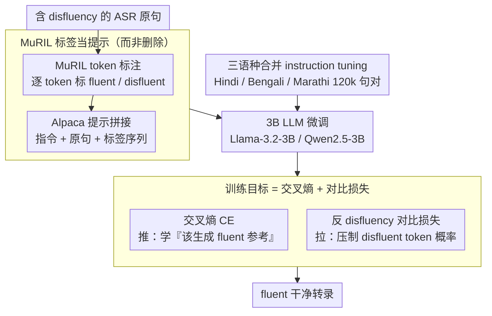

# Mind the Pause: Disfluency-Aware Objective Tuning for Multilingual Speech Correction with LLMs

**会议**: ACL 2026  
**arXiv**: [2605.12242](https://arxiv.org/abs/2605.12242)  
**代码**: https://github.com/deepak-kumar-98/Mind-the-Pause (有)  
**领域**: 语音 / 多语言 NLP / 印度语言 / LLM fine-tuning  
**关键词**: disfluency correction、contrastive loss、MuRIL、instruction tuning、Hindi/Bengali/Marathi

## 一句话总结
作者提出一个多语言 disfluency 修正流水线：先用 MuRIL 在 token 级标注 fluent/disfluent 标签，再把"原始转录 + token 标签"一起喂给 Llama-3.2-3B / Qwen2.5-3B 做 instruction fine-tuning，关键创新是引入一个**对比损失项**，对生成 disfluent token 的概率显式惩罚（penalize $-\log(1-\sum_v w_v P_\theta(v))$），在 Hindi/Bengali/Marathi 三语种实ASR数据上比无对比 baseline +1.97 BLEU、比 mBART +8.54 BLEU，且 3B 模型在多数 setting 上能匹配甚至超越 GPT-4o。

## 研究背景与动机

**领域现状**：自发语音几乎一定含 disfluency（filler "uh/um"、重复、false start、self-repair），ASR 系统并不会自动去除——作者实测 Whisper v3 Large 和 AI4Bharat Indic Conformer 在真实印度语对话中约 30% 的句子至少含一个 disfluency。这些 noise 会让下游 QA 掉 0.5–1.6 分（5 分制）、MT 掉 2–4.7 BLEU、TTS 自然度 MOS 掉 ~2 分。

**现有痛点**：(i) 传统流水线是"detect-then-delete"——MuRIL 等 sequence tagger 标 disfluent token 后直接删除，导致语法断裂、语义不完整；(ii) Indic 语言（Hindi/Bengali/Marathi）的研究几乎全停在 detection 这一步（Bhat 2023, Kundu 2022），缺少 full-sentence correction 方案；(iii) 现有 LLM-based 工作要么把 LLM 当数据生成器训小 tagger（Cheng 2024），要么直接 prompt GPT-4 删 disfluency（Lima & Campelo 2024 在 Portuguese 上），没人把 token-level detection 和 LLM 重写整合成端到端的 correction pipeline。

**核心矛盾**：cross-entropy fine-tuning 给 LLM 一个 positive 信号"该长得像 fluent reference"，但**没有任何机制告诉模型"不要复制 disfluent token"**——作者实测发现即使提供了 MuRIL 标签，cross-entropy-only 训出来的模型偶尔还是会把 filler 照抄进输出。所以问题是 cross-entropy 的 positive-only 监督不够。

**本文目标**：(a) 在 Hindi/Bengali/Marathi 三语种上做端到端 disfluency correction，而非 detection-only；(b) 设计一个能直接抑制 disfluent token 生成概率的训练目标，弥补 cross-entropy 的盲区；(c) 验证 3B 规模的开源 LLM 加上这套训练策略能不能匹敌 GPT-4o / Gemini 2.5 Pro。

**切入角度**：把 token-level detector 的 output 当作"对比学习的负样本指示器"——既然 MuRIL 已经标出哪些 token 是 disfluent，那把这些 token 在生成端的概率直接拉低就是最有针对性的负向监督。

**核心 idea**：CE loss 学"应该生成什么"（push），contrastive loss 学"不应该生成什么"（pull），两个信号 push-pull 协同，把 fluent target 和 disfluent token 在 representation 空间里推开。

## 方法详解

### 整体框架
这套 disfluency 修正流水线想解决的核心矛盾是：交叉熵微调只会告诉模型"该长得像 fluent 参考"，却没有任何机制叫它"别把 filler 照抄进去"。作者的思路是双阶段配双损失。阶段一让 MuRIL（在 17 种印度语上预训练的多语言 BERT）做 token 级二分类（0=fluent、1=disfluent），subword 标签从 word 标签继承，在三语种合并集上微调出一个标注器。阶段二把"指令 + 含 disfluency 的原句 + MuRIL 预测的标签序列"按 Alpaca 格式拼成输入喂给 3B LLM（Llama-3.2-3B-Instruct 或 Qwen2.5-3B-Instruct），目标输出 fluent 转录，训练目标在标准 CE 之外额外叠一个显式压制 disfluent token 的对比损失。推理时同样格式输入，LLM 一步生成干净转录。

### 关键设计

**1. MuRIL 标签当 LLM 的提示而非删除指令：用重写取代硬删**

传统 detect-then-delete 的根本毛病是把"识别"和"重写"切开，删完之后没有语法上下文，结果常常把句子删断。这里改成把 MuRIL 的 token 标签和原句一起塞给 LLM，让模型自己判断某个 disfluent token 是该删还是该改写成语法等价物。关键是"参考但不盲信"：MuRIL 在人工编辑数据上 token 级 F1 高达 0.987，但句子级准确率只有约 85%，到真实数据更是掉到 33–63%——作者反而把这种不完美当成鲁棒性训练源，LLM 拿到的是完整输入 $x_i$=指令+原句+标签，直接生成 fluent 参考 $y_i$，交叉熵为 $L_{CE} = -\sum_i \sum_t \log P_\theta(y^t_i \mid y^{<t}_i, x_i)$，并在标签出错时也学会自行修正。

**2. 反 disfluency 对比损失：给交叉熵补上"不该生成什么"的负向监督**

这是全文的灵魂。CE 是 positive-only 的推力，对比损失则在每个生成步直接把概率从 disfluent token 上拽走。对样本 $i$ 先经 fluent-disfluent 对齐算出 disfluent token 集合 $D_i$，再定义第 $t$ 步落在这些 token 上的概率质量 $s_{i,t} = \sum_{v \in D_i} w_v P_\theta(v \mid y^{<t}_i, x_i)$，其中权重 $w_v \in (0,1]$ 按 subword 位置几何衰减（$1, 0.5, 0.25, \ldots$，因为 BPE 切词后首 subword 最具辨识度，这样既抓主、又避免误伤 fluent 词里偶然撞名的尾 subword）。对比损失取 $L_{\text{contrastive}} = \frac{1}{N}\sum_i \frac{1}{T_i} \sum_{t=r_i}^{T_i} -\log(1 - s_{i,t})$，$r_i$ 是回复起始位（跳过指令段）。与传统 representation 级的 InfoNCE 不同，这是 token 分布级的硬约束，直接管 softmax 输出：当 $s \to 1$ 时 $-\log(1-s)$ 梯度爆炸，等于"模型越想吐 disfluent token，就给它越狠的反向梯度"。

**3. 三语种合并 instruction tuning：一个 checkpoint 吃下 Hindi/Bengali/Marathi**

印度语之间词汇和句法高度相似，合并训练能用一份模型覆盖三语、省下三套部署成本。数据是 120k 平行 disfluent-fluent 句对（每语种 40k），按 80/10/10 切分；指令写成类似 "Remove disfluencies from the following sentence while preserving meaning and grammar"，输入是"原句 + [标签序列]"，输出 fluent 参考，对比变体里额外把 $D_i$ 作为辅助输入传入。用 Alpaca 格式而非裸 seq2seq，是为了复用 LLM 已有的指令跟随能力，让它把任务理解成"重写为流畅"而不是"翻译"。共享表示强到什么程度——单 Hindi 微调零样本迁到 Bengali 仍能拿 87.1 BLEU。

### 损失函数 / 训练策略
总目标 $L_{\text{total}} = L_{CE} + \lambda \cdot L_{\text{contrastive}}$，其中 $\lambda$ 走 warm-up 调度从 0 缓升到目标值——先让 CE 把基础生成能力建好再开对比惩罚，否则训练早期两个梯度方向会打架；几何衰减权重 $w_v$ 对 disfluent word 的 subword 取 $1, 0.5, 0.25, \ldots$。两个 backbone（Llama-3.2-3B-Instruct、Qwen2.5-3B-Instruct）都是 3B 规模，受算力所限。

## 实验关键数据

### 主实验
Llama-3.2-3B-Instruct 在三语种 BLEU / chrF2 / TER（real ASR 数据，越大/越大/越小越好）：

| 语种 | 数据 | mBART | Multilingual Instruction FT | w/o Contrastive | **With Contrastive** |
|------|------|-------|------------------------------|------------------|----------------------|
| Hindi | Real | 71.4 / 85.5 / 15.1 | 64.8 / 81.7 / 23.4 | 87.4 / 93.3 / 9.2 | **90.4 / 95.6 / 5.8** |
| Bengali | Real | 73.5 / 87.9 / 13.0 | 69.6 / 89.0 / 21.6 | 70.7 / 90.5 / 20.8 | **74.4 / 93.8 / 17.9** |
| Marathi | Real | 82.6 / 93.1 / 8.2 | 80.0 / 94.3 / 11.8 | 83.2 / 95.5 / 9.3 | **83.6 / 96.6 / 9.2** |

Qwen2.5-3B-Instruct 收益更大（Hindi real：91.1 BLEU vs 84.2 w/o contrastive，+6.9）：平均 +4.68 BLEU / +2.37 chrF2 / −3.22 TER（vs w/o contrastive）。

### 消融实验
对比 Llama-3.2-3B-Instruct 上对比损失带来的平均增量：

| 配置 | ΔBLEU | ΔchrF2 | ΔTER |
|------|-------|--------|------|
| Multilingual instruction FT (no MuRIL tags) | baseline | baseline | baseline |
| + MuRIL tag conditioning (w/o contrastive) | +6.16 | — | — |
| **+ MuRIL tag + Contrastive loss (本文)** | **+1.97 over above** | +1.53 | −1.65 |
| 总计 vs mBART | +8.54 | — | — |

LLM-as-Judge（用 Qwen2.5-3B 当 judge 避免 self-preference bias，双向 pairwise）：

| 语种 | 数据 | Proposed 胜 | Parallel FT 胜 | Draw |
|------|------|-------------|-----------------|------|
| Hindi | Real | 28.0% | 9.3% | 62.7% |
| Marathi | Real | 30.0% | 8.0% | 62.0% |
| Bengali | Real | 18.0% | 27.0% | 55.0% |

→ Hindi/Marathi 上 Proposed 完胜，Bengali 上略输（可能与 Bengali 数据分布或 BPE 切分差异有关）。

### 关键发现
- **Contrastive 让 Qwen 受益远超 Llama**：Qwen 平均涨 4.68 BLEU vs Llama 涨 1.97 BLEU，作者归因 Qwen 多语言 grounding 更强；说明对比损失对"已经懂这门语言但有时手滑"的模型最有效。
- **3B 开源模型能匹配 GPT-4o**：在 6 个评测条件里 4 个匹敌或超越 GPT-4o，在所有 3 语种上击败 Gemini 2.5 Pro，证明 task-specific contrastive training 是 scaling 和 prompting 不能替代的。
- **Cross-lingual zero-shot transfer 显著**：单语 fine-tune 后跨语种 BLEU 仍能保持 mid-60s 到低-80s，Bengali → Hindi/Marathi 都能到 90+ BLEU（manual edited），说明印度语家族的 representation transfer 非常强。
- **Disfluency 对下游真有伤害**：QA 上 LLaMA Hindi 从 1.70 掉到 1.18（disfluent），MT 上 Hindi→Bengali BLEU 掉 3.9 / TER +8.1，TTS MOS 掉到 ~2.1——这些都是单独 appendix 实验，给"为什么要做 disfluency correction"提供了硬证据。

## 亮点与洞察
- **"用 detection 标签当负样本指示器"是个 portable 思路**：这种 hard-constraint contrastive loss 可以迁移到任何"有外部 tagger 标负样本"的生成任务——hallucination 抑制（标错的 entity）、toxicity 去除（toxic span）、code 生成中的 deprecated API 等都可以套这套框架。
- **几何衰减权重处理 BPE 是个小聪明**：BPE 分词后一个 disfluent word 会被切成多个 subword，作者用 $w_v \in \{1, 0.5, 0.25, \ldots\}$ 让"标志性首 subword"承担主要惩罚，避免对碰巧出现的尾 subword 误判。
- **3B 打过 GPT-4o**：在 specialized task 上用对比损失 + 显式监督，3B 开源模型能直接超过 frontier 闭源模型，这种 "small but smart" 的论据对工业部署很有说服力。
- **诚实的 LLM-as-Judge 防 bias**：用 Qwen 当 judge 评估 Qwen+Llama 输出（避免 self-preference）+ 双向 pairwise（避免 position bias），方法学上比"用 GPT-4 当 judge 评一切"严谨。

## 局限与展望
- 模型只到 3B（compute 限制），更大规模（7B/13B/70B）下对比损失会不会饱和或反噬未验证；作者明确说方法 model-agnostic 但没跑实验。
- 数据集只有一个公开的 parallel 平行 dataset（Kundu 2022），synthetic 部分是用规则生成的，可能未覆盖 code-mixing、accent 引起的 disfluency 等真实复杂情况。
- 没有跟更新的 LLM-based detection-then-rewrite pipeline 直接比较，只跟 mBART / zero-shot LLM 比；难以判断 contrastive loss 的增益是来自损失设计还是 instruction tuning 本身。
- contrastive loss 中 $\lambda$ 和 warm-up schedule 是经验调参，没有理论指导；写作上没给出 ablation 显示 $\lambda$ 敏感性。
- Bengali 上 LLM-as-Judge 输给 baseline 的 27% vs 18%，但作者一笔带过没深挖原因（可能 Bengali 的 MuRIL token 边界识别差导致 $D_i$ 不准），这是没解释的失败模式。

## 相关工作与启发
- **vs Bhat et al. 2023a（Adversarial MuRIL for Indic）**: Bhat 是 detection-only + 硬删，本文是 detection + LLM 重写 + 对比抑制，效果上从 BLEU 60s 提升到 BLEU 90s。
- **vs Smooth-LLaMa (Altinok 2025)**: Smooth-LLaMa 走 audio-encoder + LLM-decoder 端到端路线，本文 ASR-agnostic 模块化，更易部署但失去音频信息。
- **vs Lima & Campelo 2024 (Portuguese GPT-4 zero-shot)**: 在 Portuguese 用 GPT-4 zero-shot 即可，但本文证明印度语下 zero-shot Qwen/Llama 都掉点严重（real Hindi BLEU 56 vs fine-tuned 90+），需要 task-specific 训练。
- **vs Saini et al. 2021（unsupervised English correction）**: Saini 把 disfluency correction 当 style transfer，本文用"detection 标签 + 对比抑制"做硬约束监督，在低资源 Indic 上更稳。

## 评分
- 新颖性: ⭐⭐⭐⭐ Anti-disfluency contrastive loss 这个目标设计是新颖的，把"hard negative as tagged-token suppression"做扎实了；但底层 instruction tuning + MuRIL tag conditioning 是组合既有技术。
- 实验充分度: ⭐⭐⭐⭐ 2 backbone × 3 语种 × manual/real 数据 + LLM-as-judge + 人评 + GPT-4o/Gemini 对比 + 跨语种 zero-shot + QA/MT/TTS 下游评测，appendix 非常厚实。
- 写作质量: ⭐⭐⭐⭐ 损失公式写得清楚，pipeline 图（Figure 2）的 push-pull 语义讲得好；少数地方（如 Bengali 失败原因）写得粗糙。
- 价值: ⭐⭐⭐⭐ 对印度语 ASR 应用直接有用，3B 模型打过 GPT-4o 的结果可复现且工程友好；对比损失思路有广泛迁移潜力。

<!-- RELATED:START -->

## 相关论文

- [\[ACL 2026\] Pseudo2Real: Task Arithmetic for Pseudo-Label Correction in Automatic Speech Recognition](pseudo2real_task_arithmetic_for_pseudo-label_correction_in_automatic_speech_reco.md)
- [\[ACL 2026\] SEPT: Semantically Expanded Prompt Tuning for Audio-Language Models](generalizable_prompt_tuning_for_audio-language_models_via_semantic_expansion.md)
- [\[AAAI 2026\] A Mind Cannot Be Smeared Across Time](../../AAAI2026/audio_speech/a_mind_cannot_be_smeared_across_time.md)
- [\[ACL 2026\] From Flat Language Labels to Typological Priors: Structured Language Conditioning for Multilingual Speech-to-Speech Translation](from_flat_language_labels_to_typological_priors_structured_language_conditioning.md)
- [\[NeurIPS 2025\] EuroSpeech: A Multilingual Speech Corpus](../../NeurIPS2025/audio_speech/eurospeech_a_multilingual_speech_corpus.md)

<!-- RELATED:END -->
