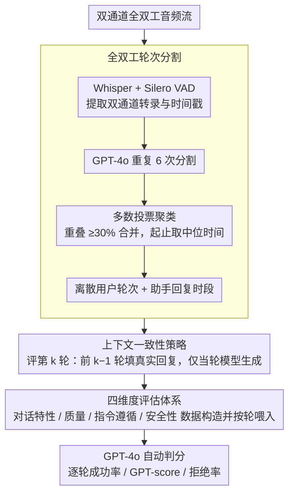

# MTR-DuplexBench: Towards a Comprehensive Evaluation of Multi-Round Conversations for Full-Duplex Speech Language Models

**会议**: ACL 2026 Findings  
**arXiv**: [2511.10262](https://arxiv.org/abs/2511.10262)  
**代码**: [https://github.com/ZhangHe0918/MTR-DuplexBench](https://github.com/ZhangHe0918/MTR-DuplexBench)  
**领域**: 语音语言模型 / 评测基准  
**关键词**: 全双工语音模型, 多轮对话评估, 轮次分割, 对话质量, 安全评估

## 一句话总结

提出 MTR-DuplexBench，一个针对全双工语音语言模型（FD-SLM）的多轮综合评估基准，通过创新的轮次分割方法解决了全双工对话中轮次边界模糊和上下文不一致的挑战，涵盖对话特性、对话质量、指令遵循和安全性四个维度，实验揭示了现有 FD-SLM 在多轮交互中性能持续衰退的问题。

## 研究背景与动机

**领域现状**：全双工语音语言模型（FD-SLM）能够实现实时的"同时听和说"交互，支持打断、回应等复杂对话特性，代表了语音交互的未来方向。Moshi 和 Freeze-Omni 是目前仅有的两个开源 FD-SLM。

**现有痛点**：现有评测基准（如 Full-Duplex-Bench、Full-Duplex-Bench v1.5）主要聚焦单轮交互评估，而真实对话通常是多轮展开的。此外，现有基准大多只评估对话特性（如打断、回应），忽略了指令遵循和安全性等关键能力。FD-Bench 虽然支持多轮但仅关注打断场景，Talking Turns 需要昂贵的人工数据收集。

**核心矛盾**：全双工对话评估面临两个技术挑战——(1) 轮次边界模糊：与半双工不同，全双工通信是自发进行的，没有明确的轮次起止标记；(2) 上下文不一致：多轮评估中模型前几轮的回复可能与真实回复差异很大，导致后续轮次的用户输入与实际场景脱节，降低评估可靠性。

**本文目标**：构建一个支持多轮逐轮评估、覆盖对话特性/质量/指令遵循/安全性四个维度的全双工 SLM 综合评测基准。

**切入角度**：通过设计全双工轮次分割算法，将连续的全双工对话切分为离散轮次，在每轮评估时用真实回复填充历史轮次的助手通道，从而同时解决轮次边界和上下文不一致两个问题。

**核心 idea**：用 GPT-4o 多次分割 + 多数投票 + 聚类过滤确定轮次边界，用"前轮真实回复+当轮模型推理"的策略消除上下文偏移，构建四维度综合评测框架。

## 方法详解

### 整体框架

MTR-DuplexBench 要解决的核心难题是：连续、无明确轮次边界的全双工双通道音频流，如何被切成可逐轮打分的离散对话，并在多轮评估中保持上下文不漂移。整体管线先把双通道音频经轮次分割算法切成离散的用户轮次、为每轮划定助手回复时段，再在四个维度（对话特性、对话质量、指令遵循、安全性）上分别构造数据、按轮喂入模型、由 GPT-4o 自动判分。评估第 $k$ 轮时，历史 $k-1$ 轮的助手通道一律填入真实回复、只让模型生成当前轮，最终输出每轮的成功率 / GPT-score / 拒绝率等指标。

### 关键设计

**1. 全双工轮次分割：用多次采样投票把模糊边界变确定**

全双工通信是自发进行的，没有半双工那种清晰的轮次起止标记，单次让 GPT 切分结果抖动很大。本文先用 Whisper + Silero VAD 提取双通道的转录与时间戳，把用户、助手的 VAD 段按时间排序后交给 GPT-4o 做轮次分割；关键在于重复 6 次分割再做多数投票聚合——一个新候选轮次若与已有候选轮次的时间重叠 $\geq 30\%$ 就合并到一起，起止时间取所有投票的中位数，最后再做一次重叠解析得到确定轮次。助手回复时段则设为"当前用户轮次开始到下一用户轮次结束"，保证模型有完整时间窗完成回复。多次采样加聚类把不稳定的单次切分变成鲁棒的离散事件，这套方法论可迁移到任何需要从连续交互流中抽取结构化事件的场景。

**2. 上下文一致性策略：用真实回复填史，斩断误差累积**

多轮评估的隐患在于，模型前几轮的回复一旦偏离真实回复，后续轮次的用户输入就建立在一个"现实中根本不会出现"的对话历史上，评估随之失真。本文的做法是在评估第 $k$ 轮时，助手通道的前 $k-1$ 轮全部填入真实语音（ground truth），只有当前轮由模型生成。这样模型每一轮面对的都是"正确"的上下文，衡量的是理想历史条件下的单轮能力，避免了偏差逐轮放大。代价是它评不出真实多轮误差累积下的表现，但在当前 FD-SLM 水平下这是合理的折中。

**3. 四维度评估体系：首次把指令遵循与安全性纳入全双工评测**

FD-SLM 真要落地，光会接话打断不够，还得听得懂指令、守得住安全底线，尤其在多轮打断场景下。本文据此搭了四个维度：对话特性用 GPT-4o 合成 200 条 10 轮对话，量化平滑接话、打断、停顿处理、背景语音、回应五种特性的成功率与延迟；对话质量取 Candor 真实对话数据集的 200 段 120 秒音频，分割后逐轮打 GPT-score（0–5）；指令遵循用 Llama Question 的 300 条语音查询算成功率；安全性用 AdvBench 的 520 条有害查询测多轮拒绝率。所有判定均由 GPT-4o 自动完成，其中"多轮打断下还守不守得住安全"这个问题颇具前瞻性。

## 实验关键数据

### 主实验

对话特性的成功率随轮次增加而下降（1 轮 vs 1-10 轮平均）：

| 模型 | 平滑接话 | 打断 | 停顿处理 | 背景语音 |
|------|---------|------|---------|---------|
| Moshi | 73.0→57.4% | 72.5→54.2% | 93.5→84.8% | 53.0→25.7% |
| Freeze-Omni | 69.0→36.4% | 76.0→56.6% | 89.0→68.5% | 0.5→1.1% |
| VocalNet (HD) | 100→100% | 100→100% | 100→100% | 0→0% |
| Cascaded | 98.5→99.0% | 99.5→96.3% | 100→100% | 0→0% |

### 消融实验

多特性组合 vs 单特性的性能对比（以 Moshi 为例，1-10 轮平均成功率）：

| 配置 | 成功率 | 说明 |
|------|--------|------|
| 仅平滑接话 (S) | 57.4% | 单特性基线 |
| S + 打断 (I) | 54.5% | 两特性交替 |
| S + I + 停顿 (P) | 54.3% | 三特性交替 |
| S + I + P + 背景 (B) | 37.6% | 四特性交替，性能大幅下降 |

### 关键发现
- FD-SLM 在多轮中持续退化：Freeze-Omni 的平滑接话从 69% 降至 36%，衰退最严重
- HD 模型在对话特性上反而完美（接话/打断/停顿 100%），但完全无法处理背景语音
- Moshi 是唯一能处理背景语音的模型，虽然成功率从 53% 降至 25.7%
- 延迟方面 Moshi 最低（约 0.6-0.9s），Cascaded 最高（约 9-12s）
- 多特性组合时性能进一步下降，说明同时应对多种对话特性对 FD-SLM 是更大挑战
- 多轮打断可能导致 FD-SLM 安全拒绝能力下降，存在安全风险

## 亮点与洞察
- **轮次分割的工程设计**：GPT 多次分割+多数投票+聚类的方案非常实用，将不确定的全双工音频流转化为确定性的离散轮次，这个方法论可迁移到任何需要从连续交互中提取结构化事件的场景
- **上下文一致性策略的巧妙性**：用真实语音填充历史轮次来消除误差累积，虽然评估的是"理想条件下的单轮能力"而非真正的多轮积累能力，但在当前模型水平下是合理的折中
- **四维度的全面性**：首次将指令遵循和安全性引入全双工评测，"多轮打断下的安全性"这个研究问题非常有前瞻性

## 局限与展望
- 仅评估了两个开源 FD-SLM（Moshi 和 Freeze-Omni），样本太少，难以得出通用结论
- 上下文一致性策略虽然保证了评估可靠性，但无法评估模型在真实多轮误差累积下的表现
- 对话特性的合成数据由 GPT-4o 生成，可能不完全反映真实对话模式
- 安全性评估仅使用 AdvBench 的已知有害查询，对更复杂的越狱攻击覆盖不足
- 未来可以引入更多 FD-SLM 并探索如何在训练阶段利用 benchmark 信号提升多轮一致性

## 相关工作与启发
- **vs Full-Duplex-Bench**: 只支持单轮评估，不支持逐轮分析，MTR-DuplexBench 在多轮支持和评估维度上全面超越
- **vs FD-Bench**: 虽支持多轮（最多 5 轮）但仅关注打断场景，不支持逐轮评估
- **vs Talking Turns**: 需要人类与模型实际交互收集数据，难以扩展；MTR-DuplexBench 使用自动化流程，可复现性更好

## 评分
- 新颖性: ⭐⭐⭐⭐ 首个支持多轮逐轮评估和四维度综合评估的全双工基准，轮次分割方法有新意
- 实验充分度: ⭐⭐⭐ 仅有两个真正的FD-SLM可评估，实验规模受限于模型可用性
- 写作质量: ⭐⭐⭐⭐ 问题定义清晰，方法描述详尽
- 价值: ⭐⭐⭐⭐ 填补了FD-SLM多轮评估的空白，对推动全双工语音交互研究有重要价值

<!-- RELATED:START -->

## 相关论文

- [\[ACL 2026\] Full-Duplex-Bench-v2: A Multi-Turn Evaluation Framework for Duplex Dialogue Systems with an Automated Examiner](full-duplex-bench-v2_a_multi-turn_evaluation_framework_for_duplex_dialogue_syste.md)
- [\[ICML 2026\] MoshiRAG: Asynchronous Knowledge Retrieval for Full-Duplex Speech Language Models](../../ICML2026/audio_speech/moshirag_asynchronous_knowledge_retrieval_for_full-duplex_speech_language_models.md)
- [\[ACL 2026\] Style Amnesia: Investigating Speaking Style Degradation and Mitigation in Multi-Turn Spoken Language Models](style_amnesia_investigating_speaking_style_degradation_and_mitigation_in_multi-t.md)
- [\[ICML 2026\] The Silent Thought: Modeling Internal Cognition in Full-Duplex Spoken Dialogue Models via Latent Reasoning](../../ICML2026/audio_speech/the_silent_thought_modeling_internal_cognition_in_full-duplex_spoken_dialogue_mo.md)
- [\[ACL 2026\] Do We Need Distinct Representations for Every Speech Token? Unveiling and Exploiting Redundancy in Large Speech Language Models](do_we_need_distinct_representations_for_every_speech_token_unveiling_and_exploit.md)

<!-- RELATED:END -->
